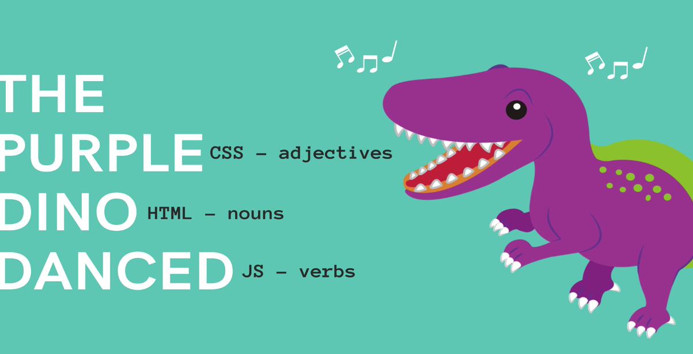

# Intro to the Web

### Crucial
- Install VsCode and Chrome
- Understanding the Roles of HTML, CSS, and JS

### Important
- How The Internet works (in 5 min)
- HTTP Request/Response Cycle
- Intro to the Web

### Nice to Have
- VS Code Theme

## THE INTERNET
- a global network of networks (It's just a bunch of connected computers)
- [Wiki](https://en.wikipedia.org/wiki/Internet)

## Intro to the Web
* INTERNET: Global network of interconnected computers that communicate via **TCP/IP**. Network of Networks
* WEB: The World Wide Web is an information system where documents and other resources are available over the Internet. Doucments/Resources are transferred via **HTTP**

#### HTTP Requests
- _Hyper Text Transfer Protocol_
- Foundation of communication on the World Wide Web
- Request --> I would like information please
- Resposne --> Ok here you go

#### Web Server
- A computer^ that can satisfy requests on the web.
- ^ "server" is also used toe refer ot the software running on a computer

#### Client
- The computer that accesses the server

#### BACK END vs FRONT END

- Creating Full Stack Application Using Front End User and Back End (Databases, servers, etc.)

#### HTML | CSS | JS



HTML - Skeleton/Content/What/nouns
CSS - Design/Adjectives
JS - build logic/verbs


# NOTES FROM OLD COURSE ABOUT INTERENT BASICS AND FRONT VS BACKEND
## INTERNET BASICS

- When we go to an URL like:
  - ```http://www.udemy.com/courses```
- There are a few things that happen behind the scenes
  1. Finding the Right Address/FIND IP ADDRESS
    - ```www.udemy.com --> 23.235.47.175```
    - your query is submitted to your ISP
    - Within your ISP, the DNS takes the Domain name and turns it into an IP address

  2. Going to the Address | SEND HTTP REQUEST
    - ```www.udemy.com --> 23.235.47.175```
    - a request is sent to the desired IP address via HTTP
    - Your request find teh fastest path possible to the serer with the specified IP
    - This is not a direct journey. It requres hoping from server to server until we arrive

  3. Udemy Server | RESPONDS
    - ```www.udemy.com --> 23.235.47.175```
    - The requested server figures otu exaclty what we're aking for (/courses)
    - The server builds us the right content, often pulling information from database
    - The server responds with any combination of HTML, CSS and JavaScript
    - And then...

  4. BROWSER RENDERS THE PAGE 

## Static vs Dynamic

1. Static
  - thus far everthing we have built is static
  - same css, html, and javascript everything
  - same fundamental pieces we are opening in the browser

2. Dynamic
  - sites that are complied on the server side where the server is pulling together or constructing a web page before it is sent bac as response
  - different content being sent back
  - database compling things
  - code to check you are logged in, etc.
  - not same html, css and javascript every time

## A Generic Stack

Backend Language/App-------Server------Database
----||||---------------------------------------    
----vvvv---------------------------------------
HTML/JS/CSS --------> www.google.com

## Our Stack

NodeJs--------------Express---------MongoDB----
----||||---------------------------------------    
----vvvv---------------------------------------
HTML/JS/CSS --------> www.ourproject.com

## Full Stack
- Writing code on all parts of the stack: Frontend and Backend

## Potential Backend Features
* Check if the user is logged in
* Sign Up a User
* Figure out what HTML, CSS and JS to send to user
* ADD new post to DB
* REMOVE new post from DB
* Sort/Rank posts
* Create subreddit
* Create new comment
* Add subscriber to newsletter

## FRONTEND <---> BACKEND

Frontend---------------------Backend
1. Ask for reddit
hompage
-----------------------------> 2. Get top Posts from DB
------------------------------send back home page content
3. Browser renders<--------------------------------
hompage
4. User enters "dogs"
in search box and
submits form
-----------------------------> 5. Finds all post in DB about "dogs"
------------------------------ 6. Sends back HTML 
---------------------------------for the search results page 
7. Browser renders search page <-------------------------------


