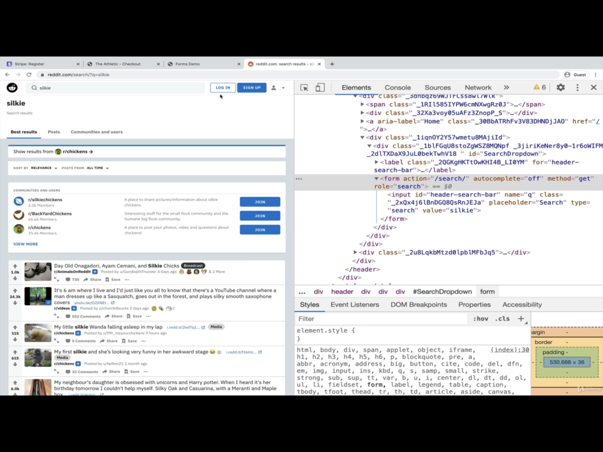
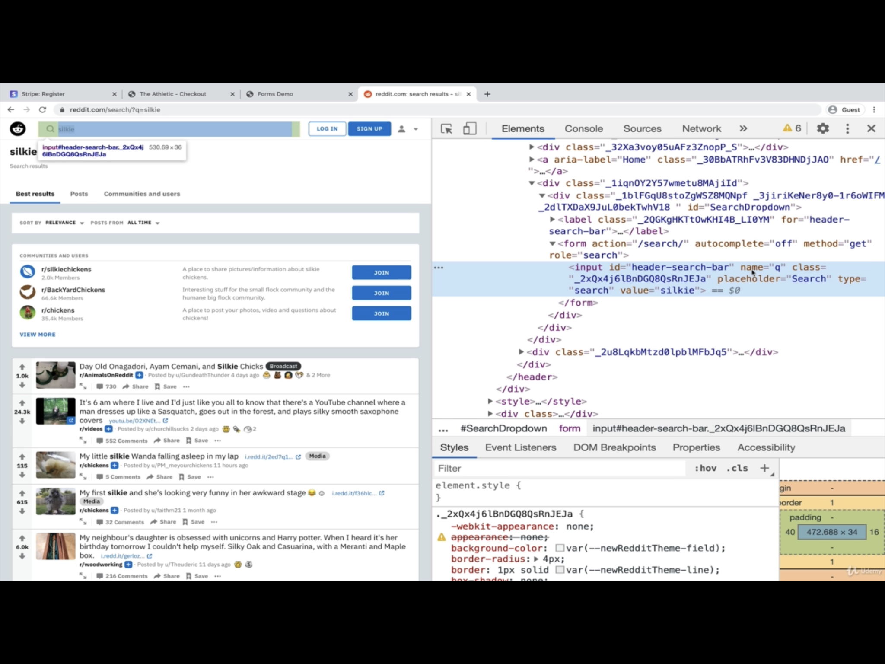

# SECTION

## Crucial 

### * Table Basics: `<table>`, `<tr>`, `<td>`, and `<th>`
### * Form Element Basics
### * Button Elements
### * Labels
### * Common Input Types

 

## Important

### * Table Sections: `<thead>`, `<tfoot>`, `<tbody>`
### * Range and Text Areas
### * Form Validations

 

## Nice to Have

### * Table Colspan and Rowspan

 

## Notes

### Unit Goals
- Create well-formatted HTML Tables
- Understand when and when not to use tables
- Explain the role of the form element
- Utilize a variety of form controls
- Define complex HTML forms
- Add HTML5 Form Validations
- Ensure accessiblity of our forms

### HTML TABLES
- Structured sets of DATA, made up of rows and columns. They can be a great way of displaying data clearly.
- In the early days of the web, tables were commonly used to create page layouts. Today, you should only use the table element when you are creating an actual data table.
- To create a table, you'll use 5-10 different elements! It can be tricky to remeber them all, but don't panic!
- [MDN Docs](https://developer.mozilla.org/en-US/docs/Web/HTML/Element/table)
- [SPACE JAM EXAMPLE](https://spacejam.com/)

#### ELEMENTS
- `<table>` 
- `<td>` : The Table Data Cell element : represents a single cell in a table that contains data
- `<tr>` : The Table Row element : represents a row of cells in our table : groups element into a row
- `<th>` : defines a header : inside of a row
- `<thead>` : The Table Head element - break into logical sections
- `<tbody>` : The Table Body element - break into logical sections  
- `<tfoot>` : The Table Foot element - not often in a table - sometime cumulative of data in row, etc.
- `<colgroup>`, `<rowspan>` : span th across more than one column,
- `<caption>` : 

### FORMS
  - Creating Forms
    - The `<form>` element itself is a shell or container that doesn't have any visual impact.
    - We then fill the form with a collection of inputs, checkboxes, buttons, etc.
  - The form element "represents a document section containing interactive controls for submitting information"
  - The **_action_** attribute specifies WHERE the form data should be sent
  - The **_method_** attribute specifies which HTTP method should be used
  - [MDN DOCS](https://developer.mozilla.org/en-US/docs/Web/HTML/Element/form)

  #### ACTION and METHOD
  - can define HTTP request related to relative page
  - `<form action="/serach/" method="get">`
  

  #### The INPUT Form element
  - The `<input>` element is used to create a variety of different form controls
  - We have 20+ possible type inputs, ranging from date pickers to checkboxes
  - The **_type_** attribute is where the magic happens. Changing _type_ dramatically alters the input's behavior and appearance. 
  - [MDN Docs](https://developer.mozilla.org/en-US/docs/Web/HTML/Element/input)
  - The **_placeholder_** attribute : shows up while empty : does not work on all input types

  #### The Label Form Element
  - The `<label>` element represents a caption for an item in a user interface
  - important in terms of accessibility and making your forms easier to use (screen readers)
  - direct connection between some form input/control and some piece of text
  - makes the label itself clickable when we associate two elements 
  - use two attributes : `id="example"` in `<input>` element and `for="example"` in `<label>` element
  - always use labels! 

  #### The Button element
  - The `<button>` element represents a clickable button ,used to submit forms or anywhere in a document for accessible, standard button functionality. 

  ##### Where does your submitted data go?
  - The **_name_** attribute   
  
  - `name="q"` : refer to value in input when data is sent to server
  - different methods to send data with HTTP requests 

  #### More Input Types
  ##### Checkbox
  - A checkbox allowing single values to be selected/deselected
  - `type="checkbox` : can specify if checked to begin with or not `checked`
  - can check more than one in a group
  ##### Radio
  - A radio button, allowing a single value to be selected out of multiple choices with the same name value
  - `type="radio"` 
  - use **_name_** attribute to group radio buttons together
  - need to add **_value_** attribute so you know what is being sent to server
  ##### Select 
  - dropdown menu
  - two elements together `<select>` and `<option>`
  ##### Range
  - let the user specify a numeric value which must be no less than a given value, and no more than another given value 
  - typically represented using a slider or dial control rather than a text entry box liek the number input type
  - this kind of widget is imprecise, it shouldn't typically be used unless the control's exact value isn't important 
  ##### Number
  - can make **_min_** and **_max_** as well
  - can increase by **_step_**
  ##### textarea
  - the `<textarea>` element represents a multi-line plain-text editing control, useful when you want to allow users to enter a sizeable amount of free-form text, for example a comment on a review or feedback form
  - can control the initial number of **_rows_** : initial height
  - can control width with **_cols_**
  - set **_placeholder_**
  - IT IS NOT AN INPUT

  #### Form Validation
  - adding different constraints to form submissions
  - built in browser validations : password, email, etc
  - client side validation with JAVASCRIPT
  - server side validation - submit form and then comes back with issues

  #### HTML attribute: require 
  - require value to be filled for form to submit, etc.
  ####HTML attribute: minlength && maxlength
  - set the min and max length of text
  ##### HTML attribute: min && max
  - for numeric values
  - date, time, range, number etc
  #### HTML attribute: pattern
  - specifies a **_regular expression_** the form control's value should match. If a non-`null` value doesn't conform to the constraints set by the `pattern` value, the `ValidityState` object's read-only `patternMismatch` property will be true
  - an attribute of the **text**, **tel**, **email**, **url**, **password**, and **search** input types
  - when specified, is a regular expression which the input's `value` must match in order for the value to pass constraint validation
  

  

