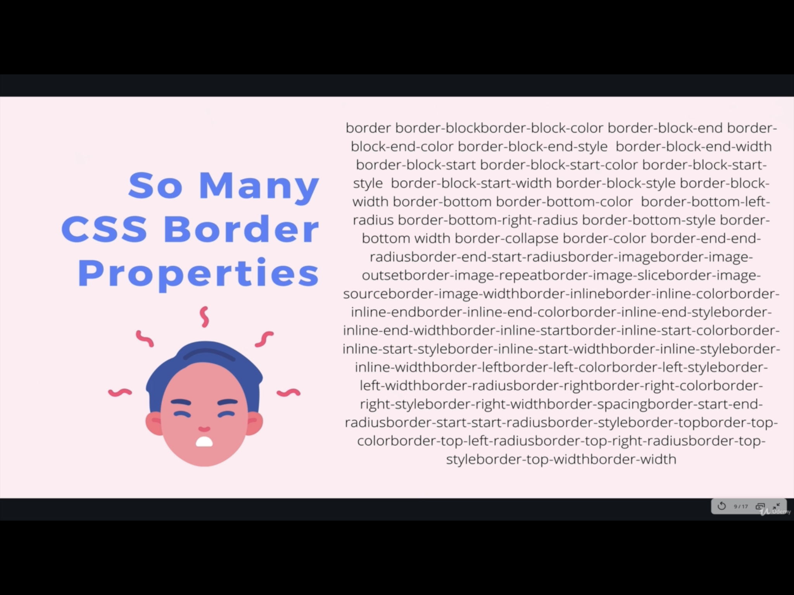

# SECTION

## Crucial 

### * Conceptual Overview of CSS
### * Basic CSS Syntax
### * Including Styles Correctly
### * Color Systems: RGB, Hex, etc
### * font-family property

<br>

## Important 

### * Common Text Properties

<br>

## Notes

<hr>

### What is CSS?
- **_Cascading Style Sheets_**
  - language for describing how documents are presented visually - how they are arranged and styled. 
  - CSS is very easy to get the hang of, but it can be intimidating because of how many properties we can manipulate
  - not necessarily a programming language 

- CSS RULES
  ```css
    selector {
      property: value;
    }

    /* <!-- For Example --> */
    /* Make all <h1> element purple*/
    h1 {
      color: purple;
    }

    /* Make all image elements 100 pixels wide & 200 pixels tall */
    img {
      width: 100px;
      height: 200px;
    }

    /* Select every other text input & give it a red border */
    input[type="text"]:nth-of-type(2n){
      border: 2px solid red;
    }
  ```
- CODE PEN EXAMPLE OF [BOOK STORE UI](https://codepen.io/TurkAysenur/pen/JjGKKrP)

### SO MUCH TO CSS

- For Example Border Properties:


- [MDN CSS REFERENCE](https://developer.mozilla.org/en-US/docs/Web/CSS/Reference)
  - For Example: [conic-gradient()](https://developer.mozilla.org/en-US/docs/Web/CSS/conic-gradient)

- If you don't know if something exists: GOOGLE!!! (Colt generally ignores W3Schools)
  - google text shadow and find a [TEXT SHADOW CSS GENERATOR](https://html-css-js.com/css/generator/text-shadow/)

- Focus on syntax and patterns

### Including CSS
- **INLINE STYLES**: write styles directly inline on each element, but this is NOT A GOOD IDEA most of the time
- **THE `<STYLE>` ELEMENT**: write styles inside of a `<style>` element. This is easy but makes it impossible to share styles between documents. NOT RECOMMENDED EITHER
- **EXTERNAL STYLESHEET**: write styles in a .css file, and then include them using a `<link>` in the head of your html document. RECOMMENDED
  ```html
  <head>
    <title>FORMS DEMO</title>
    <!-- specify location of style sheet, always in head, meta data -->
    <link rel="stylesheet" href="my_styles.css">
  </head>  
  ```

### CSS Properties
- [**color**](https://developer.mozilla.org/en-US/docs/Web/CSS/color)
  - different ways to define color
  - text color
- [**background-color**](https://developer.mozilla.org/en-US/docs/Web/CSS/background-color)
  - specific to changing the color
- [**background**](https://developer.mozilla.org/en-US/docs/Web/CSS/background)
  - much more powerful, images, gradient, etc. 

### CSS TEXT PROPERTIES

- **`text-align`** : sets the horizontal alignment of a block element or table-cell box. This means is works like `vertical-align` but the horizontal direction
  - within an element how is the text aligned, not on the page itself

- **`font-weight`** : control the boldness or lightness of a given piece of text
  - keywords: normal, bold, lighter, etc
  - numbers 400//normal  700//bold
  - browser will pick something if it does not exist

- **`text-decoration`** : controls the appearance of decorative lines on text
  - can do a lot, set lines, weight of line, color, position, etc.

- **`line-height`** : controls the height of a line of text, but not the font of the text itself

- **`letter-spacing`** : control the space between letters in our text

### FONT-SIZE
- **Relative** : EM, REM, VH, VW, %, AND MORE!
- **Absolute** : PX, PT, CM, IN, MM

#### PIXELS | PX
- By Far the Most Commonly Used ABSOLUTE UNIT
  - end result size does not depend on anything else or parent element
- 1px does not necessarily equal the width of exactly one pixel on your machine, varies depending on the size of your display!
- NOT RECOMMENDED for RESPONSIVE WEBSITES

### FONT-FAMILY
- Change the font of an element
- depends on fonts built into browser
  - ways to include/attach local/custom fonts to project (learn later on)
- build font stack of choices for browser to keep design
- [CSS FONT STACK](https://www.cssfontstack.com/)
```css
  /* A font family name and a generic family name */
font-family: Gill Sans Extrabold, sans-serif;
font-family: "Goudy Bookletter 1911", sans-serif;

/* A generic family name only */
font-family: serif;
font-family: sans-serif;
font-family: monospace;
font-family: cursive;
font-family: fantasy;
font-family: system-ui;
font-family: ui-serif; 
font-family: ui-sans-serif; 
font-family: ui-monospace; 
font-family: ui-rounded; 
font-family: emoji;
font-family: math;
font-family: fangsong;

/* Global values */
font-family: inherit;
font-family: initial;
font-family: unset;
```

