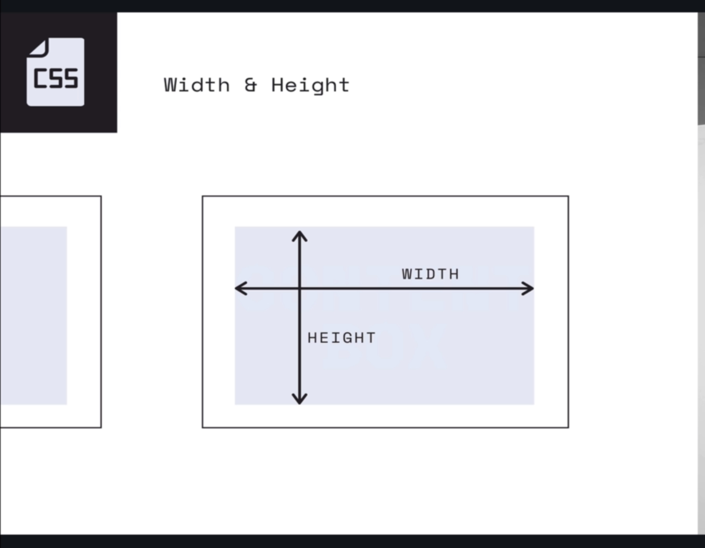

# SECTION

## Crucial 

### * BORDER
### * WIDTH & HEIGHT
### * PADDING
### * MARGIN
### * DISPLAY PROPERTY
### * UNITS - PERCENTAGES, EMS, REMS

<br>

## Nice to Have

### * Border RADIUS

<br>

## Notes

<hr>

### THE CSS BOX MODEL


- WIDTH AND HEIGHT
  - control inner content area



### BORDERS
  - there is a border property
  - but a dozen border related properties


- **BORDER-WIDTH**
  - controls the thickness of the border
  - pixels are a good unit to use, pretty much stays the same 
```css
      /* Keyword values */
      border-width: thin;
      border-width: medium;
      border-width: thick;

      /* <length> values */
      border-width: 4px;
      border-width: 1.2rem;

      /* vertical | horizontal */
      border-width: 2px 1.5em;

      /* top | horizontal | bottom */
      border-width: 1px 2em 1.5cm;

      /* top | right | bottom | left */
      border-width: 1px 2em 0 4rem;

      /* Global keywords */
      border-width: inherit;
      border-width: initial;
      border-width: unset;
```

- **BORDER-COLOR*
  - controls the ... color of the border

- **BORDER-STYLE**
  - controls the line style - dashed, solid, etc.
  ```css
  /* Keyword values */
  border-style: none;
  border-style: hidden;
  border-style: dotted;
  border-style: dashed;
  border-style: solid;
  border-style: double;
  border-style: groove;
  border-style: ridge;
  border-style: inset;
  border-style: outset;

  /* vertical | horizontal */
  border-style: dotted solid;

  /* top | horizontal | bottom */
  border-style: hidden double dashed;

  /* top | right | bottom | left */
  border-style: none solid dotted dashed; 

  /* Global values */
  border-style: inherit;
  border-style: initial;
  border-style: unset;
  ```

- **BORDER**
  - set multiple properties as once
  - shorthand property
  ```css
  /* style */
  border: solid;

  /* width | style */
  border: 2px dotted;

  /* style | color */
  border: outset #f33;

  /* width | style | color */
  border: medium dashed green;

  /* Global values */
  border: inherit;
  border: initial;
  border: unset;
  ```
- **BORDER-RADIUS**
  - rounds the corners of an element's outer border edge. You can set a single radius to make circular corners, or two radii to make elliptical corners
  ```css

  /* The syntax of the first radius allows one to four values */
  /* Radius is set for all 4 sides */
  border-radius: 10px;

  /* top-left-and-bottom-right | top-right-and-bottom-left */
  border-radius: 10px 5%;

  /* top-left | top-right-and-bottom-left | bottom-right */
  border-radius: 2px 4px 2px;

  /* top-left | top-right | bottom-right | bottom-left */
  border-radius: 1px 0 3px 4px;

  /* The syntax of the second radius allows one to four values */
  /* (first radius values) / radius */
  border-radius: 10px / 20px;

  /* (first radius values) / top-left-and-bottom-right | top-right-and-bottom-left */
  border-radius: 10px 5% / 20px 30px;

  /* (first radius values) / top-left | top-right-and-bottom-left | bottom-right */
  border-radius: 10px 5px 2em / 20px 25px 30%;

  /* (first radius values) / top-left | top-right | bottom-right | bottom-left */
  border-radius: 10px 5% / 20px 25em 30px 35em;

  /* Global values */
  border-radius: inherit;
  border-radius: initial;
  border-radius: unset;

  ```

- The `border-radius property` is specified as:

- one, two, three, or four `<length>` or `<percentage>` values. This is used to set a single radius for the corners.
followed optionally by "/" and one, two, three, or four `<length>` or `<percentage>` values. This is used to set an additional radius, so you can have elliptical corners.

`<length>`
Denotes the size of the circle radius, or the semi-major and semi-minor axes of the ellipse, using length values. Negative values are invalid.
`<percentage>`
Denotes the size of the circle radius, or the semi-major and semi-minor axes of the ellipse, using percentage values. Percentages for the horizontal axis refer to the width of the box; percentages for the vertical axis refer to the height of the box. Negative values are invalid.

### PADDING
- space between the content/content box and its own border


- INDIVIDUAL PROPERTIES
  - padding-left
  - padding-right
  - padding-bottom
  - padding-top
- SHORTHAND PROPERTY
  - Set all four sides at once
  - padding: top right bottom left
  ```css
    /*Apply to all four sides*/
    padding: 10px;

    /*vertical | horizontal*/
    padding: 5px 10px;

    /*top | horizontal | bottom*/
    padding: 1px 2px 2px;

    /*top | right | bottom | left*/
    padding: 5px 1px 0 2px

  ``` 

### MARGIN
- space outside of an elements border and between that element and somethign else(other elements)


- INDIVIDUAL PROPERTIES
  - margin-left
  - margin-right
  - margin-bottom
  - margin-top
- SHORTHAND PROPERTY
  - Set all four sides at once
  - margin: top right bottom left
```css
  /* Apply to all four sides */
  margin: 1em;
  margin: -3px;

  /* vertical | horizontal */
  margin: 5% auto;

  /* top | horizontal | bottom */
  margin: 1em auto 2em; 

  /* top | right | bottom | left */
  margin: 2px 1em 0 auto;

  /* Global values */
  margin: inherit;
  margin: initial;
  margin: unset;
```
### THE DISPLAY PROPERTY
- INLINE vs BLOCK ELEMENTS


- [MDN REF](https://developer.mozilla.org/en-US/docs/Web/CSS/display)

- **INLINE** | Width & Height are ignored. Margin & padding push elements away horizontally but not vertically. 
- **BLOCK** | Block elements break the flow of a document. Width, Height, Margin, & Padding are respected
- **INLINE-BLOCK** | Behaved like an inline element except Width, Height, Margin, & Padding are respected

### CSS UNITS
- **Relative** : EM, REM, VH, VW, %, AND MORE! | ALL COMMONLY USED
- **Absolute** : PX, PT, CM, IN, MM | PX MOST COMMON

- **percentages | %** 
  - are ALWAYS RELATIVE to some other VALUE
  - sometimes, it's a value from the parent and other times it's a value from the element itself
    - `width: 50%` | half the width of the parent
    - `line-height: 50%` | half the font-size of the element itself
  - common with width and height


- **EM**
  - RELATIVE UNITS
  - With font size | 1em = the font-size of the parent | 2ems = twice the font-size of the parent, etc.
  - With other properties(i.e. padding/margin), 1em = to the computed font-size of the element itself.
  - makes it easier to have elements scale when parent properties are changed

  - COMMON ISSUES: 

- **REM**
  - ROOT EMS
  - Relative to the **root html element**'s font-size. Often easier to work with.
  - If the root font-size is 20px | 1rem = always 20px | 2rem = always 40px, etc.

