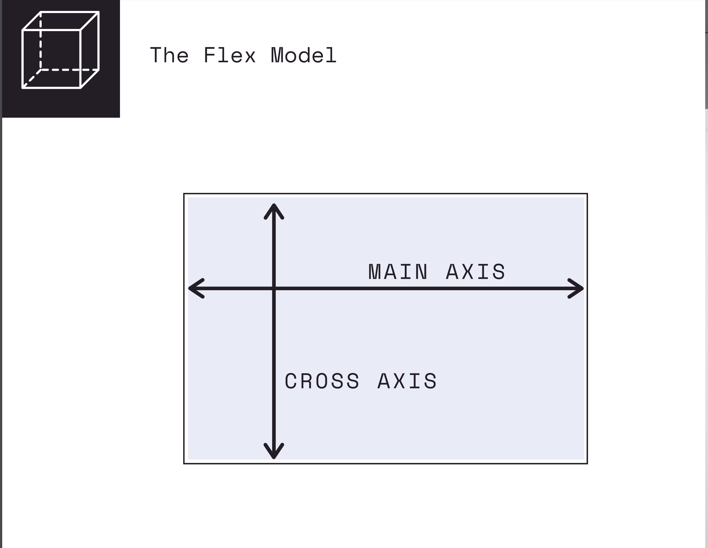

# SECTION

## Crucial 

### * Media-queries
### * FOCUS ON CONCEPTS, NOT MEMORIZING THE PROPERTIES
### * Flex Shorthand
### * Flex-basis, grow, and shrink
### * Align-items
### * Flex-wrap
### * Align-content and align-self
### * Justify-content
### * Flex-Direction

<br>

## Notes

<hr>

### Introduction to CSS Flexbox
- one-dimensional layout method for laying out items in rows or columns
- recent addition to CSS, included to address common layout frustration
- allows us to distribute space dynamically across elements of an unknown size, hence the term "flex"

**THE FLEX MODEL**

- DISPLAY : FLEX

**TWO-DIRECTIONS/AXIS**

- by default MAIN AXIS of content is from LEFT to RIGHT
  - start of our flexbox is on left side the end is on the right
- CROSS AXIS | CROSS DIRECTION | from TOP to BOTTOM
  - start of cross-axis is at top and the end of the bottom

1. JUSTIFY CONTENT | MAIN AXIS | DEFAULT LEFT-->RIGHT
- `justify-content-start` or `flex-start` (DEFAULT) - everything starts at the left in the container

- `justify-content-end` or `flex-end` - move everything to left
- `justify-content-center` or `center` - move everything in container to the center
- `justify-content-between` or `space-between` - space between items
- `justify-content-around` or `space-around` - space between end of container and items
- `space-evenly` - space evenly around all elements

- can specify for sm, md, lg, xl

2. ALIGN ITEMS | CROSS AXIS | DEFAULT TOP-->BOTTOM

- `align-items-stretch` (DEFAULT) - takes up all the space
- `align-items-start` or `flex-start` - refer to CROSS AXIS (TOP OF CONTAINER), move to top
- `align-items-center` - move to center along cross axis
- `align-items-end` or `flex-end` - bottom of container
- `baseline` - text sets baseline to move content around on


3. FLEX-DIRECTION
  - default direction
    - left to right | MAIN AXIS
    - top to bottom | CROSS AXIS

  - `flex-row-reverse` - right to left - content main axis content-start at the right
  - `flex-column` - items stack vertically, working from top to bottom as MAIN AXIS and CROSS AXIS is now left to right
  - `flex-row` is DEFAULT
  - `flex-column-reverse` - MAIN AXIS = BOTTOM to TOP

  - align-self : align one item

4. RESPONSIVE utilities
  - `d-flex` : default row going across
  - change to column at small size | there is no xs | flex-column flex-md-row
    - must declare xs as main css class and override

5. FLEX-WRAP
- `flex-wrap: wrap`
- `flex-wrap: wrap-reverse`
- `flex-wrap: nowrap`

- CAN CHANGE DIRECTION OF CROSS AXIS AND MAIN AXIS USING FLEX-WRAP

6. ALIGN-CONTENT | CROSS AXIS
- Use when have multiple columns and rows 
- must be using flex wrap, or wrap reverse

7. ALIGN-SELF | CROSS AXIS
- assign to elements/items

#### Flex Sizing Properties
- **FLEX-BASIS** | Defines the initial size of an element before additional space is distributed
- **FLEX-GROW** | Controls the amount of available space an element should take up. Accepts a unit-less number value.
- **FLEX-SHRINK** | If items are larger than the container, they shrink according to flex-shrink
  - SHORTHAND
  ```css
    /* One value, unit-less number: flex-grow */
    flex: 2;

    /* One value, width/height: flex-basis */
    flex: 10em;
    flex: 30%;
    flex: min-content;

    /* Two values: flex-grow | flex-basis */
    flex: 1 30px;

    /* Two values: flex-grow | flex-shrink */
    flex: 2 2;

    /* Three values: flex-grow | flex-shrink | flex-basis */
    flex: 2 2 10%;
  ```
#### Breakpoints | Responsive

- Layout - Responsive Breakpoints
- Create ONE Website and Stylesheet that is able to respond to different device sizes and features

##### **Media Queries**
- media queries allow us to modify our styles depending on particular parameters like screen width or device type
- [USING MEDIA QUERIES](https://developer.mozilla.org/en-US/docs/Web/CSS/Media_Queries/Using_media_queries)

```css
  //EXAMPLE OF MEDIA QUERY
  @media (max-width: 800px) {
    .sidebar {
      display: none;
    }
    .main {
      width: 80%;
    }
  }

  @media (min-width: 30em) and (orientation: landscape) {
    #container {
      flex-direction: column;
      justify-content: center;
    }
  }

```

```css
  //MEDIA QUERIES AND BOOTSTRAP 4
  // Extra small devices (portrait phones, less than 576px)
  // No media query for `xs` since this is the default in Bootstrap

  // Small devices (landscape phones, 576px and up)
  @media (min-width: 576px) { ... }

  // Medium devices (tablets, 768px and up)
  @media (min-width: 768px) { ... }

  // Large devices (desktops, 992px and up)
  @media (min-width: 992px) { ... }

  // Extra large devices (large desktops, 1200px and up)
  @media (min-width: 1200px) { ... }
  //===========================================//
```

### CSS TOOLS: CSS RESET

- [RESET CODE TO START WITHOUT DEFAULT](https://meyerweb.com/eric/tools/css/reset/)


