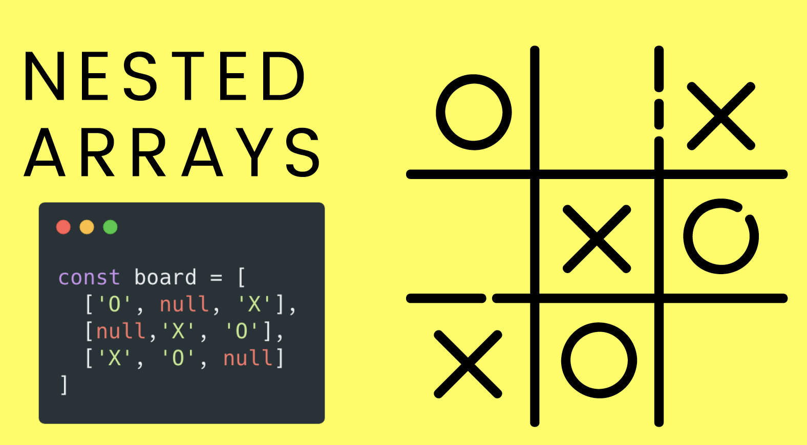

# JavaScript Arrays

## Crucial 

### * Array Basics | Creating and Updating 
### * Push & Pop
### * Shift & Unshift
### * 

<br>

## Important 

### * Concat, IndexOF
### * Slice and Splice
### * Multi Dimensional Arrays

<br>

## Notes

<hr>

### Introduction to Arrays
- OUR FIRST DATA STRUCTURE
- COLLECTION OF DATA

**ARRAYS**
- Ordered collections of values
  - List of comments on IG post
  - Collection of levels in a game
  - Songs in a playlist
  - ARE OBJECTS

**CREATING ARRAYS**
```js
  //To make an empty array
  let students = [];

  //An array of strings
  let colors = ['red', 'orange', 'yellow'];

  //An array of numbers
  let lottoNums = [19, 22, 56, 12, 51];

  //A mixed array
  let stuff = [true, 68, 'cat', null];
```

- in other programming languages you might have to declare type of values in the array before you create it vs. JS there can be different types in an array

**Arrays are INDEXED**
Doc | Dopey | Bashful | Grumpy | Sneezy | Sleepy | Happy 
-0-----1--------2---------3--------4---------5-------6
- Each element has a corresponding index (counting starts at 0)

```js
let colors = ['red', 'orange', 'yellow', 'green'];

colors.length //4 //always one less than maximum index

colors[0] //'red'
colors[1] // 'orange'
colors[2] // 'yellow'
colors[3] // 'green' //maximum index
colors[4] // 'undefined'

//BECOME OBJECTS IN ARRAY
0:'red'
1:'orange'
2:'yellow'
3:'green'

//CAN GET INDEX OF VALUE IN ARRAY AND THEN INDEX OF CHARACTER IN THAT VALUE
colors[0][1] //'r'
```

**Modifying Arrays**
- does not work with strings
```js
let colors = ['rad', 'orange', 'yalloww', 'green']

colors[0] //'red'

colors[2] // 'yellow'
colors[3] // 'green'

colors[4] // 'undefined'
colors[4] = 'blue';
//['red', 'orange', 'yellow', 'green', 'blue']

colors[10] = 'indigo';
colors.length //11
//['red', 'orange', 'yellow', 'green', 'blue', empty x 7, 'indigo']
```

**ARRAY METHODS**
* **PUSH** | add to end
* **POP** | remove from end | does not require arguments | returns value back to you and can capture it in a variable
* **SHIFT** | remove from start
* **UNSHIFT** | add to start

- unlike strings, arrays are updated when you run the method 
- stacks & queues | traditional computer science structures 

- STACK OF BARBELLS

- QUEUE OF PEOPLE IN LINE

**MORE METHODS**
- `concat()` | merge arrays
- `includes()` | look for a value | returns `true` or `false` | boolean method
- `indexOf()` | just like string.indexOf | return `-1` if not in index | only finds first instance
- `join()` | creates a string from an array
- `reverse()` | reverses an array | destructive method, replaces original array
- `slice(start,end)` | copies a portion on an array  | can make COPY OF WHOLE ARRAY if no arguments passed in | only provide start will go to end of array | end does not include the index referenced in argument --> stops up to that number | can use negative numbers to start at end of array 
- `splice()` | removes/replaces elements
  - `let arrDeletedItems = array.splice(start, deleteCount, item1, item2, ...)` | destructive to original array | make 0 deleteCount if you just want to insert after referenced index object | don't have to insert items | better to update end of array
- `sort()` | sorts an array | by unicode | kind of janky compared to other programming languages | not reliable numeric sort unless to specify how you want to sort and will learn later using functions
- THESE ARE SIMPLE METHODS, WE WILL LEARN MORE `filter()`, `reduce()`, `map()`, etc. 

**EQUALITY AND ARRAYS**
- not comparing contents of array, comparing REFERENCE/ADDRESS stored in memory and if they are the same can store same array in two variables and they will be linked by SAME REFERENCE in the background
```js
'hi' === 'hi' //true
['hi', 'bye'] === ['hi', 'bye'] //false
[1] === [1] //false
[1] == [1] //false
[] == [] //false
```


**CONST AND ARRAYS**
- Why do people use const with arrays??
- THE VALUES CAN CHANGE.. as long as the REFERENCE REMAINS THE SAME
```js
const myEggs = ['brown', 'brown']
```
```js
const myEggs = ['brown', 'brown']
myEggs.push('purple'); //YES!
myEggs[0] = 'green'; //YES!
//['green', 'brown', 'purple']

myEggs = ['blue', 'pink']; //NO!!!
// will thrown Uncaught TypeError: Assignment to constant variable
```

**NESTED ARRAYS**
- We can store arrays inside other arrays
```js
const colors = [
  ['red', 'crimson'],
  ['orange', 'dark orange'],
  ['yellow', 'golden rod'],
]
```
**TIC TAC TOE EXAMPLE**


```js
  const board = [
    ['O', null, 'X'],
    [null, 'X', 'O'],
    ['X', 'O', null]
  ]
  //ACCESS VALUE IN MIDDLE
  gameBoard[1][1]; //'X'
```


