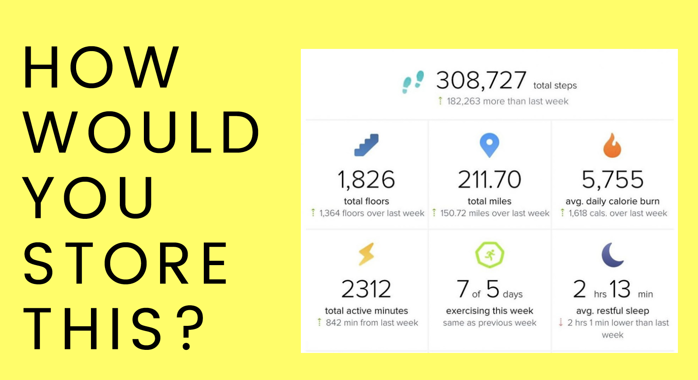

# SECTION

## Crucial 

### * Creating and Working with Object Literals
### * Nesting Arrays and Objects

<br>

## Notes

<hr>

### JS Objects
* Objects are collections of `properties`
* Properties are a `key-value pair`
* Rather than accessing data using an index, we use custom keys

**EXAMPLE**

```js
  const fitBitData = {
    totalSteps: 309727,
    totalMiles: 211.7,
    avgCalorieBurn: 5755, 
    workoutsThisWeek: '5 of 7',
    avgGoodSleep: '2:13',
  };
```

### KEY-VALUE PAIRS
- Property = Key + Value
- No specific order, referenced by keys
```js
username: 'crazyCatLady'
upvotes: 7
text: 'great post!'

//ALL TYPES WELCOME
let comment = {
  username: `sillyGoose420`,
  downVotes: 19,
  upVotes: 214,
  netScore: 195,
  commentText: 'Tastes like chicken lol',
  tags: ['#hilarious', '#funny', '#silly'],
  isGilded: false,
}
```

**VALID KEYS** 
- all keys are converted to strings (except for `Symbols`, which we haven't covered yet)

**ACCESSING DATA**
```js
const palette = {
  red: '#eb4d4b',
  yellow: '#f9ca24',
  blue: '#30336b'
}

palette.red //'#eb4d4b',

palette['blue'] //keys are strings

let color = 'yellow' //use something dynamic like a variable as a key in an object
palette[color] //'#f9ca24',
```

**Updating & Adding Properties**
```js
    const fitBitData = {
    totalSteps: 309727,
    totalMiles: 211.7,
    avgCalorieBurn: 5755, 
    workoutsThisWeek: '5 of 7',
    avgGoodSleep: '2:13',
  };

  //Updating properties
  fitBitData.workoutsThisWeek = '6 of 7'
  fitBitData.totalMiles += 7.5;

  //Adding a new property
  fitBitData.hearStillBeating = true;
```

**ARRAYS + OBJECTS**
```js
  const shoppingCart = [
    {
      product: 'Jenga Classic',
      price: 6.88,
      quantity: 1,
    }
    {
      product: 'Echo Dot',
      price: 29.99,
      quantity: 3,
    }
    {
      product: 'Fire Stick',
      price: 39.99,
      quantity: 2,
    }
  ]

    const student = {
      firstName: 'David',
      lastName: 'Jones',
      strengths: ['Music', 'Art']
      exams: {
        midterm: 92,
        final: 88
      }
    }
    ```


