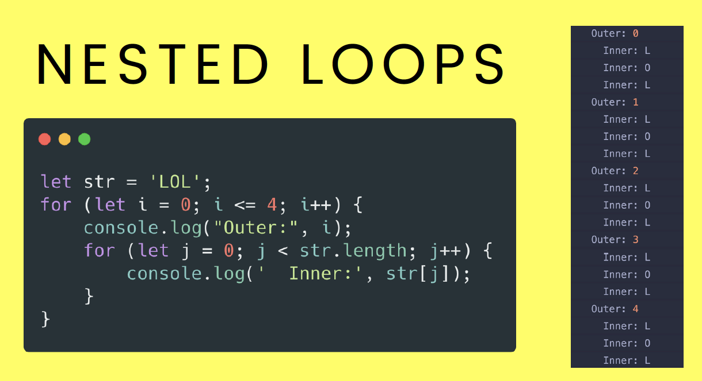

# LOOPS | REPEAT CODE

## Crucial

### * For Loops
### * While Loops
### * The Break Keyword
### * For...Of Loop
### * Iterating Arrays

<br>

## Important 

### * Nested Loops

<br>

## Nice to Have

### * Iterating Objects

<br>

## Notes

<hr>

### INTRO TO FOR LOOPS

**LOOPS**
- Loops allow us to repeat code 
  - Print 'hello' 10 times
- There are multiple types:
  * for loop
  * while loop
  * for...of loop
  * for...in loop

  **FOR LOOP SYNTAX**
  ```js
    for(
      [initialExpression]; 
      [condition]; 
      [incrementExpresions]
      );

      //OUR FIRST FOR LOOP
      // start @ 1; stop @ 10; add 1 each time
      for(let i = 1; i <= 10; i++) {
        console.log(i);
      }

      //start i at 50
      //subtract 10 each iteration
      //keep going as long as i >= 0 /boolean expression, keep looping as long as this is true
      for(let i = 50; i >= 0; i -= 10) {
        console.log(i);
      }
  ```

  **INFINITE LOOPS**
  - HOW IS THE LOOP GOING TO STOP?????
  ```js
      //DO NOT RUN THIS CODE:
      for(let i = 20; i >= 0; i++) {
        console.log(i);
      }
      //BADDDD!!!!
  ```

  **Looping Over Arrays**
  - To loop over an array, start at index 0 and continue looping until last index (length-1)
  ```js
    const animals = ['lions', 'tigers', 'bears'];

    for(let i = 0; i < animals.length; i++){
      console.log(i, animals[i]);
    }
    //0: 'lions'
    //1: 'tigers'
    //2: 'bears'
  ```

  **NESTED LOOPS**
  
  ```js
    for (let i = 1; i <= 10; i++) {
      console.log(`i is: ${i}`)
        for (let j = 1; j < 4; j++) {
          console.log(`     j is: ${j}`)
        }
      }
    /*
      i is: 1
            j is: 1
            j is: 2
            j is: 3
      i is: 2
            j is: 1
            j is: 2
            j is: 3
       i is: 3
            j is: 1
            j is: 2
            j is: 3
            et.
              */

   //======================
   const seatingChart = [
    ['Kristen', 'Erik', 'Namita'],
    ['Geoffrey', 'Juanita', 'Antonio', 'Kevin'],
    ['Yuma', 'Sakura', 'Jack', 'Erika']
    ]

    for (let i = 0; i < seatingChart.length; i++) {
        const row = seatingChart[i];
        console.log(`ROW #${i + 1}`)
        for (let j = 0; j < row.length; j++) {
            console.log(row[j])
        }
    }          
  ```

### Intro to WHILE LOOPS
- While loops continue running as long as the test condition is true
```js
let num = 0;
while(num < 10){
  console.log(num);
  num++;
}

//A COMMON PATTERN

let targetNum = Math.floor(Math.random() * 10);
let guess = Math.floor(Math.random() * 10);

while (guess !== targetNum) {
  console.log(`Guessed ${guess}...Incorrect!`);
  guess = Math.floor(Math.random() * 10);
}
console.log(`CORRECT! Guessed: ${guess} & target was: ${targetNum}`);
```
## The Break Keyword
- most commonly used with while loops
- will stop execution of loop immediately afterword

```js
let targetNum = Math.floor(Math.random() * 10);
let guess = Math.floor(Math.random() * 10);

while (true) {
  guess = Math.floor(Math.random() * 10);
  if (guess === targetNum) {
    console.log(`CORRECT! Guessed: ${guess} & target was: ${targetNum}`);
    break;
  } else {
      console.log(`Guessed ${guess}...Incorrect!`);
  }
}
```

### FOR...OF
- A nice and easy way of iterating over arrays (or other iterable objects)
- NO Internet Explorer Support

**EXAMPLE**
```js
//we come up with variable name to represent individual elements in array
//good for when you don't need to know the index
  for (variable of iterable) {
    statement
  }

  let subreddits = ['soccer', 'popheads', 'cringe', 'books'];
  for(let sub of subreddits){
    //DO THIS FOR EVERY ITEM IN SUBREDDITS ARRAY:
    console.log(`${sub} - www.reddit.com/r/${sub}`)
  }
```
**NESTED FOR...OF**
```js
   const magicSquare = [
     [2, 7, 6],
     [9, 5, 1],
     [4, 3, 8],
   ];

   for (let row of magicSquare) {
     let sum = 0;
     for(let num of row) {
       sum += num;
     }
     console.log(`Row of ${row} sums to ${sum}`);
   }
```
