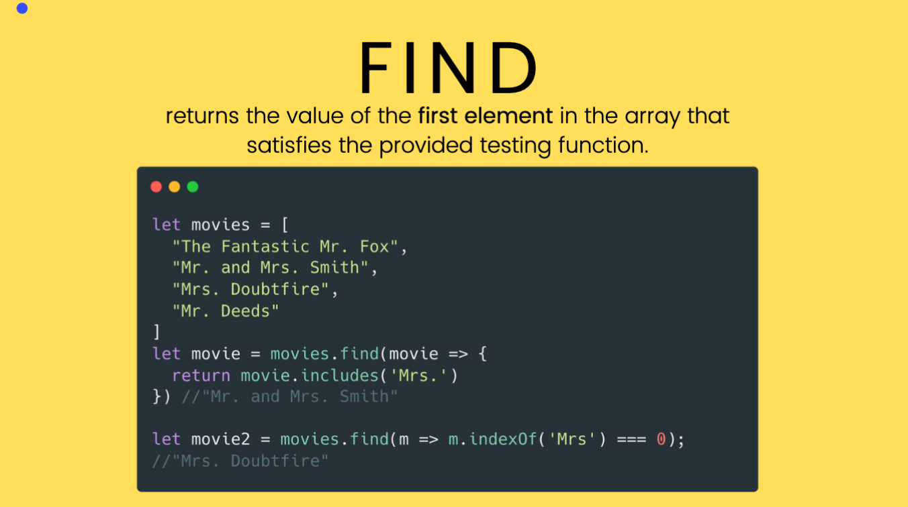

# ARRAY CALLBACK METHODS

## Crucial 

### * ForEach
### * Map
### * Arrow Functions

<br>

## Important 

### * Filter

<br>

## Nice to Have

### * Some and Every 
### * Reduce

<br>

## Notes

<hr>

### GOALS
* Use the new arrow function syntax
* Understand and use these methods: 
  - `forEach`
  - `map`
  - `filter`
  - `find`
  - `reduce`
  - `some`
  - `every`

**FOREACH**
- Accepts a callback function
- Calls the function once per element in the array
- not used as often now that we have `for...of`
```js
  const nums = [9, 8, 7, 6, 5, 4, 3, 2, 1];

  nums.forEach(function (n) {
    console.log(n * n)
    //prints: 81, 64, 49, 36, 25, 16, 9, 4, 1
  });

  nums.forEach(function (el){
    if(el % 2 === 0){
      console.log(el)
      //prints: 8, 6, 4, 2
    }
  })
```

**MAP**
- Creates a new array with the results of calling a callback on every element in the array
```js
  const texts = ['rofl', 'lol', 'omg', 'ttyl'];
  const caps = texts.map(function (t){
    return t.toUpperCase
  })

  texts; //['rofl', 'lol', 'omg', 'ttyl']
  caps; //['ROFL', 'LOL', 'OMG', 'TTYL']
```

**ARROW FUNCTIONS!!!!**
- "syntactically compact alternative" to a regular FUNCTION EXPRESSION
- not supported by internet explorer
- save in a variable, can not stand on it's own
```js
const square = (x) => {
  return x * x;
}

const sum = (x, y) => {
  return x + y;
}

//parens are optional if there's only one parameter:
const square = x => {
  return x * x;
}

//use empty parens for functions w/ no parameters:
const singASong = () => {
  return 'LA LA LA LA LA LA';
} 

```

**IMPLICIT RETURN**
- only works with arrow functions

- All these functions do the same thing
```js
  const isEven = function(num){ //regular function expression
  return num % 2 === 0;
  }

  const isEven = (num) => { //arrow function with parens around param
  return num % 2 === 0;
  }

  const isEven = num => { //no parens around param
  return num % 2 === 0;
  }

  const isEven = num => ( //implicit return //USE PARENS NOT BRACKETS AFTER ARROW
    num % 2 === 0;
  )

  //one-liner implicit return
  const isEven = num => num % 2 === 0;
```

### SETTIMEOUT AND SETINTERVAL
- two functions that expect callback function, NOT ARRAY METHODS, about delaying, postponing, scheduling for later 

**setTimeout**
- Accepts two arguments, FIRST:CALLBACK, SECOND: NUMBER OF MILLISECONDS 
- Only run one time
```js
  setTimeout(() => {
    console.log("HELLO")
  }, 3000)
```

**setInterval**
- will perform a callback every x number of milliseconds, repeat at an interval
```js
  setInterval(() => {
    console.log(Math.random())
  }, 2000) //Every two seconds print random number between 0-1
```

### FIND



### FILTER
- Creates NEW ARRAY with all the elements that pass the test implemented by the provided function
```js
  const nums = [9, 8, 7, 6, 5, 4, 3, 2, 1];

  const odds = nums.filter(n => {
    return n % 2 === 1; //our callback returns true or false
    //if it returns true, n is added to the filtered array
  })
  //[9, 7, 5, 3, 1]

  const smallNums = nums.filter(n => n < 5);
  //[4, 2, 3, 1]
```
### SOME AND EVERY
- Boolean Methods: Always return true or false

**EVERY**
- tests whether **_ALL_** elements in the array pass the provided function. It returns a Boolean value
```js
  const words = ['dog', 'dig', 'log', 'bag', 'wag'];

  words.every(word => {
    return word.length === 2;
  }) //true

  words.every(word => word[0] === 'd'); //false

  words.every(w => {
    let last_letter = w[w.length - 1];
    return last_letter === 'g'
  }) //true
```
**SOME**
- Similar to every, but returns true if **_ANY_** of the array elements pass the test function
```js
  const words = ['dog', 'jello', 'log', 'cupcake', 'bag', 'wag'];

  //Are there any words longer than 4 characters
  words.some(word => {
    return word.length > 4;
  }) //true

  //Do any words start with 'Z'?
  words.some(word => word[0] === 'Z'); //false

  //Do any works contain 'cake'?
  words.some(w => w.includes('cake')); //true
```

### REDUCE
- Executes a reducer function on each element of the array, resulting in a single value
- How it does this is up to use

**SUMMING AN ARRAY**
```js
  [3, 5, 7, 9, 11].reduce((accumulator, currentValue) => {
    return accumulator + currentValue
  })
```
  <table>
    <thead>
      <tr>
       <th>Callback</th><th>Accumulator</th><th>currentValue</th><th>return value</th>
      </tr>
    </thead>
    <tbody>
      <tr>
        <td>first call</td><td>3</td><td>5</td><td>8</td>
      </tr>
      <tr>
        <td>second call</td><td>8</td><td>7</td><td>15</td>
      </tr>
      <tr>
        <td>third call</td><td>15</td><td>9</td><td>24</td>
      </tr>
      <tr>
        <td>fourth call</td><td>24</td><td>11</td><td>35</td>
      </tr>
    </tbody>
  </table>

### ARROW FUNCTIONS AND `this`
- keyword `this` behaves very differently than regular functions
```js
  const person = {
  firstName: 'Viggo',
  lastName: 'Mortensen',
  fullName: function() {
    return `${this.firstName} ${this.lastName}`
  }
}
console.log(person.fullName()) //'Viggo Mortensen'
```
```js
  const person = {
  firstName: 'Viggo',
  lastName: 'Mortensen',
  fullName: () => {
    return `${this.firstName} ${this.lastName}`
  }
}
console.log(person.fullName()) //'undefined, undefined '
```