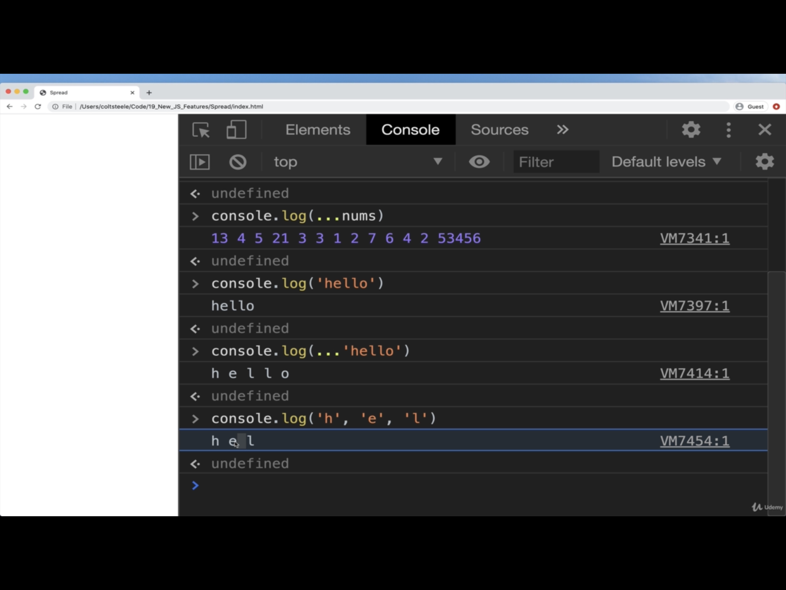
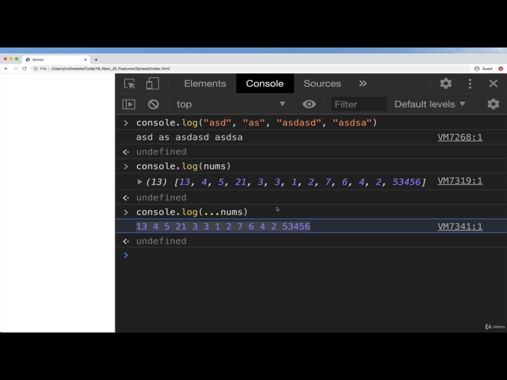

# NEW JS FEATURES

## Crucial 

### * Spread in Arrays
### * Spread in Objects
### * 
### * 

<br>

## Important 

### * Default Params
### * Spread in Function Calls
### * Rest Params

<br>

## Notes

<hr>

### DEFAULT PARAMS
**THE OLD WAY**
```js
  function multiply(a, b){
    b = typeof b !== 'undefined' ? b : 1;
    return a + b;
  }

  multiply(7); //7
  multiply(7, 3); //21
```

**THE NEW WAY**
- add equal sign and default parameter 
```js
  function multiply(a, b = 1) {
    return a * b;
  }

  multiply(4); //4
  multiply(4, 5); //20
```

### SPREAD
- Spread sytax allows an **iterable** such as an `array` to be **_expanded_** in palces where zero or more `arguments` (for function calls) or `elements` (for array literals) are expected, or an object expression to be expanded in places where zero or more key-value pairs (for object literals) are expected. 

- WE ARE TAKING SOMETHING AND SPREADING IT OUT

**Spread for Function Calls**
- Expands an iterable (array, string, etc.) into a list of arguments
- SPREAD ARRAY INTO SEPARATE ARGUMENTS
```js
  const nums = [ 9, 3, 2, 8];
  Math.max(nums); //NaN
  //Use spread!
  Math.max(...nums); //67
  //Same as calling
  //Match.max(9,3,2,8)
```




**Spread for ARRAY LITERALS**
- Create a new array using an existing array. Spreads the elements from one array into a new array
```js
  const nums1 = [1, 2, 3];
  const nums2 = [2, 5, 6];

  [ ...nums1, ...nums2];
  //[1, 2, 3, 4, 5, 6]

  ['a', 'b', ..nums2];
  //['a', 'b', 4, 5, 6]

  [...nums1, ...nums2, 7, 8, 9]
  //[1, 2, 3, 4, 5, 6, 7, 8, 9]
```

**Spread for OBJECT LITERALS**
- Copies properties for one object into another object literal. 
- if property in common: order matters, anything that comes after with same property with overwrite previous value for that property
- COPY OBJECTS - BIG IN `REACT`
```js
  const feline = {legs: 4, family: 'Felidae'};
  const canine = {family: 'Caninae', furry: true};

  const dog = {...canine, isPet: true};
  //{family: 'Caninae', furry: true, isPet: true}

  const lion = { ...feline, genus: 'Panthera'};
  //{legs: 4, family: 'Felidae', genus: 'Panthera'}

  const catDog = {...feline, ..canine};
  //{legs: 4, family: 'Caninnae', furry: true }
```

**CREATING USER FOR WEBSITE**
```js
const dataFromForm = {
    email: 'blueman@gmail.com',
    password: 'tobias123!',
    username: 'tfunke'
}
const newUser = { ...dataFromForm, id: 2345, isAdmin: false }
```

**THE ARGUMENTS OBJECT**
* Available inside every function.
* It's an **array-like** object
  - HAS a `length` property
  - DOES NOT HAVE array methods like `push`/`pop`
* Contains all the arguments passed ot the function
* Not available inside of arrow function!

```js
  function sumAll(){
    let total = 0;
    for (let i = 0; i < arguments.length; i++) {
      total += arguments[i];
    }
    return total;
  }
  sumAll(8, 4, 3, 2); //17
  sumAll(2, 3); //5
```

**REST PARAMS**

- Collects all remaining arguments into an actual array
```js
  function sumAll(...nums){
    let total = 0;
    for (let n of nums) total +=num;
    return total
  }
  sumAll(1, 2); //3
  sumAll(1, 2, 3, 4, 5); //15
```

**DESTRUCTURING**

- A short, clean syntax to `unpack`:
  * Values from arrays
  * Properties from objects into distinct variables. 

**Array Destructuring**
```js
  const raceResults = [ 'Eliud Kipchage', 'Feyisa Lelisa', 'Galen Rupp'];

  const [ gold, silver, bronze ] = raceResults
  gold; //Eluid Kipchage
  silver; //Fyisa Lelis
  bronze; //'Glaen Rupp;

  const [ fastest, ...everyoneElse ] = raceResults;
  fastest; //"Eulid Kipchage"
  everyoneElse: //['Feyisa Lelisa', 'Galen Rupp']
```

**OBJECT Destructuring** 
```js
const runner = {
  first: 'Eliud',
  last: 'Kipchage;',
  country: 'Kenya',
  title: 'Elder of the Order of teh Golden Heart of Kenya';
}

const {first, last, country} = runner;

first; //'Eliud'
last; //'Kipchage'
country; //'Kenya'
```

**PARAM Destructuring**
```js
  const fullName = ({first, last}) => {
    return `${first} ${last}`
  }
  const runner = {
  first: 'Eliud',
  last: 'Kipchage;',
  country: 'Kenya',
}

fullName(runner); //"Eliud Kipchage"
```

