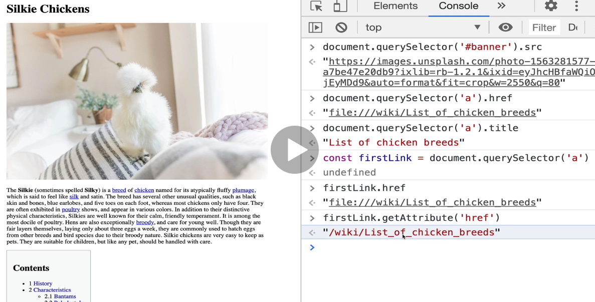

# Introduction the DOM

## Crucial 

### * Intro to the DOM
### * getElementBYId
### * querySelector
### * innerHTML and Text
### * Changing Styles
### * classList
### * Creating/Removing Elements

<br>

## Important 

### * Manipulating Attributes
### * Traversing the DOM

<br>

## Notes

<hr>

### The **D**ocument **O**bject **M**odel
- The DOM is a JavaScript representation of a webpage.
- It's your JS "window" into the contents of a webpage
- It's just a bunch of objects that you can interact with via JS, Change via JS and update the HTML/CSS, JS Manages (Turn this on, make this darker, etc.)

- HTML + CSS Go In... -------> JS Objects Come Out

- Tree Structure = Data Structure


### **D**ocument
- The document object is our entry point into the world of the DOM. It contains representation of all the content on a page, plus tons of useful methods and properties
- The Document is at the top of the Tree Structure
- type `console.dir(document)` | see object properties
  - just document in dev console will give you what looks like html

### SELECTING | 1. Select 2. Manipulate

* `getElementById` : method that exists on the document and when we call it we pass in a string that corresponds to some id on an element | returns `null` 

* `getElementsByTagName` : selects ALL ELEMENTS with Tag Name | returns HTML collection
* `getElementsByClassName` : selects ALL ELEMENTS with class name | returns HTML collection 

- HTML Collection is NOT an array, can use array syntax like indices, and for all but not map, etc.
- Each element in the collection is an `Element`

* `querySelector`
  - A newer, all-in-one method ot select a single element

```js
  //Finds the first h1 element
  document.querySelector('h1');

  //Finds first element with the ID of red:
  document.querySelector('#red');

  //Finds first element with class of big:
  document.querySelector('.big');

  //get nth-of-type | second of type
  document.querySelector('img:nthoftype(2)');

  //Anchor tag with title attribute of Java
  const java = document.querySelector('a[title="Java"]');
  console.dir(java);
```

* `querySelectorAll`
  - Same idea, but returns **a collection** of matching elements

### Manipulating | 1. Select 2. Manipulate
- know how to find information (MDN)
- You don't need to feel like you need to memorize/master it all
- focus on overall concepts and how to access information when needed

- The style object does not contain the styles from your own style sheet. It would contain inline styles
- all massive strings unless set inline
- but can use these properties of the style object to change things - good for one off, not ideal to make inline styles
- USE CLASS TO CHANGE STYLES INSTEAD OF DOING IT INLINE
- can get computed styles by using `window.getComputedStyle(h1)`
- CSS Style declaration

#### Properties and Methods (the important ones)

* `classList`
* `getAttribute()`
* `setAttribute()`
* `appendChild()`
* `append()`
* `prepend()`
* `removeChild()`
* `remove()`
* `createElement`
* `innerText`
* `textContext`
* `innerHTML`
* `value`
* `parentElement`
* `children`
* `nextSibling`
* `previousSibling`
* `style`

**Difference from Accessing href via query selector and getAttribute**


##### LETTERS/RAINBOW EXERCISE 56
```js
  const colors = ['red', 'orange', 'yellow', 'green', 'blue', 'indigo', 'violet']; //PLEASE DON'T CHANGE THIS LINE!

  //YOU CODE GOES HERE:

  const letters = document.querySelectorAll('span');

      for(let i = 0; i < colors.length; i++){
          letters[i].style.color = colors[i];
      }
```  

#### innerHTML, textContent, & innerText

- ALL deal with the stuff inside of an element

- `innerHTML` : give us tags, etc | more useful when updating contents rather than retrieving them
- `innerText` : won't display hidden elements
- `textContent` : will give us everything in code and format of markup in code editor

#### ATTRIBUTES
```js
  const firstLink = document.querySelector('a') 
  console.log('******firstLink.href | access property from element straigt from JAVASCRIPT Object**********'
  );
  console.log(firstLink.href);

  console.log('*****firstLink.getAttribute("href") / directly from HTML*****'
  );
  console.log(firstLink.getAttribute('href'));

  //SET ATTRIBUTE
  console.log('*****changed firstLink.href to google useing setAttribute*****'
  );
  firstLink.setAttribute('href', 'http://www.google.com');
  console.log(firstLink.href);

  firstLink.innerText = "I am Google";
```

#### classList and TOGGLE!!!!

```js
  h2.classList.toggle('purple')
  //false
  h2.classList.toggle('purple')
  //true

  //COLT EXERCISE
  const lis = document.querySelectorAll('li');

  for(let li of lis){
      li.classList.toggle('highlight');
  }
```

#### Traversing Parent/Child/Sibling

- Navigate/Traverse from one element to it's parent or it's parent's parent, etc.
- `parentElement` - enact changes on other elements
- Can only have one direct parent but you can have multiple child elements
- `children` - gives back collection of all children with indices and are iterable, order they are found in the dom
- NODE vs ELEMENT : Nodes can represent text, automatically make white space into a text node in some browsers.
- NODE: `nextSibling` and `previousSibling` will give us text nodes
- Generally use `nextElementSibling` and `previousElementSibling`

#### append and appendChild

- creating new elements from scratch
- using make changes and the appendChild
- append does not work in internet explorer but it is more flexible - can append multiple things or pass text directly to an element 

```js
//make h3 and append at end
//********************')
const newH3 = document.createElement('h3');
newH3.innerText = 'I AM NEW'
document.body.appendChild(newH3)

//********************')
//plain old append - newer')
//select paragraph and append new text')
//********************')
const p = document.querySelector('p')
p.append('I am new Text!!! YAY!!!!!!')

```

- `prepend` - insert into beginning instead/make it the first child

```js
  const newB = document.createElement('b')
  newB.append('HI') //instead of innerText
  p.prepend(newB)
```
- `insertAdjacentElement()` - inserts a given element node at a given position relative to the element it is invoked upon `targetElement.insertAdjacentElement(position, element);

- `after` : insert element after some other element
- `before` : insert element before some other element

```js
  // EXERCISE 58 = 100 BUTTON INSANITY
  const div = document.querySelector('#container')

  for(let i = 0; i < 100; i++){ //not '<=' That gave 101 buttons
      const button = document.createElement('button');
      button.innerText = 'Hey!'
      div.appendChild(button)
  }
```

#### removeChild & remove

- `removeChild()` : older way, all browser support, it removes a child node from the DOM and returns the removed node
  - select parent and then remove child element, use method on parent element

- `remove()` : can call direct element you want to remove (does not work in internet explorer), do not have to pass anything in


