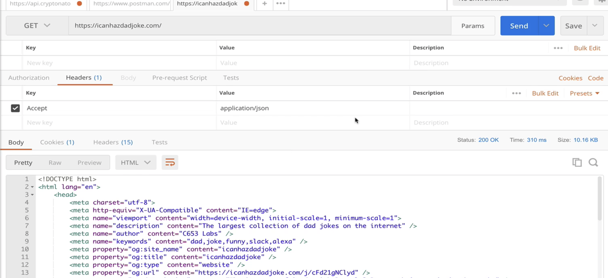

# AJAX and API's

# ASYNC JAVASCRIPT

## Crucial 

### * Working with API's
### * Intro to JSON
### * Working with Axios - HTTP Requests

<br>

## Important 

### * Postman
### * The Fetch API - HTTP Requests

<br>

## Nice to Have

### * Making XHRs - OLD HTTP Requests


<br>

## Notes

<hr>

### INTRO TO AJAX
- - `A`synchronous `J`avascript `A`nd `X`ML
- Make Requests with Code
- Make requests to load information or save information on a website in the background/behind the scenes
- Infinite Scroll - Reddit - `NETWORK` tab in `DEV TOOLS` - see information
- as you type, requests being made for autocomplete suggestions
- When making requests what we want back is just DATA - Comes back in JSON format
- save progress, save login, save data to a database


### INTRO TO APIs
- `A`pplication `P`rogramming `I`nterface 
- Broad Term that refers to any interface interacting with another - Not JUST Web - Software Interaction
- Web API = for web browser/server - interface that occurs over HTTP
- [EXAMPLE CYRPTONATOR](https://www.cryptonator.com/api)
- `https://api.cryptonator.com/api/ticker/btc-usd`
- BITCOIN TICKER `ENDPOINT`:
```json
// RETURNS DATA IN JSON
// Buried in Code of Website using data - don't want all the CSS and HTML - Just DATA - JSON
  {"ticker":{"base":"BTC","target":"USD","price":"443.7807865468","volume":"31720.1493969300","change":"0.3766203596"},"timestamp":1399490941,"success":true,"error":""}
```

- NOT ALWAYS FREE - Some APIs cost Money
- Twitter - set up bots to tweet - send messages with your code
- Instagram - set up API to respond to direct message - Share Photos to Feed - mentions - reply automatically
- APIs to look at trends on Twitter
- Facebook APIs 

- NOT ALWAYS ABOUT FETCHING AND LOADING DATA - 

- [Twilio API](https://www.twilio.com/pricing) | Test Messages - Reminder Texts automatically sent out 


### WTF is JSON
- `XML`: **Extensible Markup Language** - Another Common Format to get your data - not as many these days that require you to use XML
EXAMPLE CODE OF PRODUCTS:
 

- `JSON`: `AJAJ`(AJAX USING JSON) - **JavaScript Object Notation** - Format for sending data - Consistent and Predictable - Based on JavaScript Objects - Every Key has to be a `""` string
- [JSON HOME](https://www.json.org/json-en.html)
- [JSON Formatter/Validator](https://jsonformatter.curiousconcept.com/)
- Not Identical to JS - `"true" "false" "null"`
- Parse JSON into JS - `JSON.parse(text, [, reviver]`
- Turn JS into JSON - `JSON.stringify(value, [, replacer[, space]])`
[JSON CODE ALONG EXAMPLES](01_JSON/app.js)

### Using Postman
- See Headers and Status Code in API RESPONSES
- GET | POST | And other types of requests you can make

- CORE PIECES OF HTTP RESPONSE
* `BODY`: Content, Data of Response
* `STATUS CODE`: HTTP Status CODE - Numeric codes - quick way of indicating from server to client that things are ok or not
`200` - Anything with a 2 is good
`300` - Redirects, etc with NODE
`405` - Request method not supported - Can't `POST` to BTC API - anything 4 is generally bad
`500` - server side error responses
* `HEADERS`: Key Value Pairs, MetaData for response or request, content-type (i.e. application/JSON)


### Query Strings & Headers
- `?q=:query`
- We provide the value for `:query`
- A lot of API's requre us to use query strings
- MULTIPLE PARAMETERS use `&`: `?q=:query&imbd=tt4767897&color=black`
- **FORMS**
- [DAD JOKE API](https://icanhazdadjoke.com/api): Requires you pass in `Headers` on request 
EXAMPLE USING POSTMAN:



### Making XHR's
- `XMLHttpRequest` | The "original" way of sending requests via JS || Does not support PROMISES, so... lots of callbacks! || WTF is going on with the weird capitalization | Clunky syntax that I find difficult to remember!

```js
  const myReq = new XMLHttpRequest();

  myReq.onload = function() {
    const data = JSON.parse(this.responseText);
    console.log(data);
  };
  myReq.onerror = function(err) {
    console.log('ERROR!', err);
  };
  myReq.open('get', 'https://icanhazdadjoke.com/', true);
  myReq.setRequestHeader('Accept', 'application/json');
  myReq.send();
```
- To make more requests you have to keep nesting your code. It GETS UGLY!!!

### The Fetch API
- newer way of making HTTP Request using JavaScript
- Supports Promises
- Does not support Internet Explorer
- [Fetch API MDN Docs](https://developer.mozilla.org/en-US/docs/Web/API/Fetch_API)
- Resolves the Data first. Does not send DATA right away.
- .JSON = different from Json.parse `res.json()`
```js
  fetch('https://api.cryptonator.com/api/ticker/btc-usd')
  .then(res => {
    console.log("RESPONSE, WAITING TO PARSE", res)
    return res.json();
  })
  .then(data => {
    console.log('DATA PARSED', data)
    console.log('BTC PRICE:', data.ticker.price)
  })
  .catch(e => {
    console.log('ERROR', e)
  });
```

- THIS IS THE NATIVE VERSION OF AXIOS, AXIOS IS BUILT ON TOP OF THIS, MAKES FOR BETTER CODE
- GOOD TO UNDERSTAND WHAT IS HAPPENING HERE INSTEAD OF JUMPING STRAIGHT TO AXIOS LIBRARY

```JS
// ASYNC
  const fetchBitcoinPrice = async () => {
    try {
    const res = await fetch('https://api.cryptonator.com/api/ticker/btc-usd');
    console.log('FULL DATA RESPONSE:', res);
    const data = await res.json();
    console.log('BTC PRICE:', data.ticker.price);
    } catch(e) {
      console.log('Something Went Wrong!!!')
    }
  }

  fetchBitcoinPrice();
```

### Intro to Axios
- A Library for making HTTP Requests
- Built on top of Fetch
[AXIOS GITHUB](https://github.com/axios/axios)
- Going to include CDN link in HTML `<head>` for now
- Can use on client side and Node.js
```js
  axios.get('https://api.cryptonator.com/api/ticker/btc-usd')
  .then(res => {
    console.log('BTC Price:', res.data.ticker.price)
  })
  .catch(err => {
    console.log('ERROR!', err)
  })
```
- ASYNC VERSION
```js
  const fetchBitcoinPrice = async () => {
  try {
    const res = await axios.get('https://api.cryptonator.com/api/ticker/btc-usd')
    console.log('BTC Price:', res.data.ticker.price)
  } catch(e) {
    console.log('ERROR!')
  }
}
fetchBitcoinPrice();
```
#### NODE Environment 
- `const axios = require('axios');`

### Setting Headers With Axios
- [EXERCISE WITH DAD JOKES AND HEADERS](04_axios/app.js)
- WILL CHANGE FROM API TO API: READ THE DOCS

```js
  const getDadJoke = async () => {
  try {
    // create variable for headers first
    const config = { headers:{ACCEPT: 'application/json'}}
    const res = await axios.get('https://icanhazdadjoke.com/', config)
    console.log(res)
  } catch(e) {
    console.log('ERROR!')
  }
}

getDadJoke();
```

### TV Show Search App


