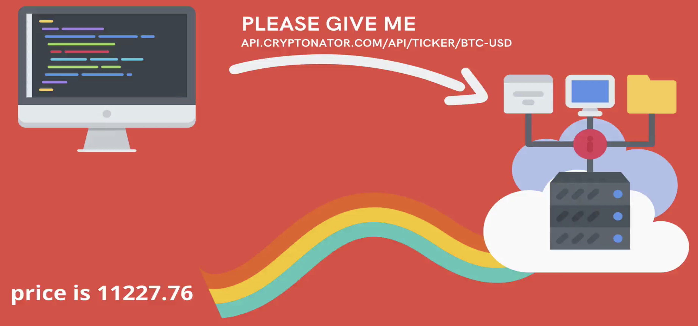
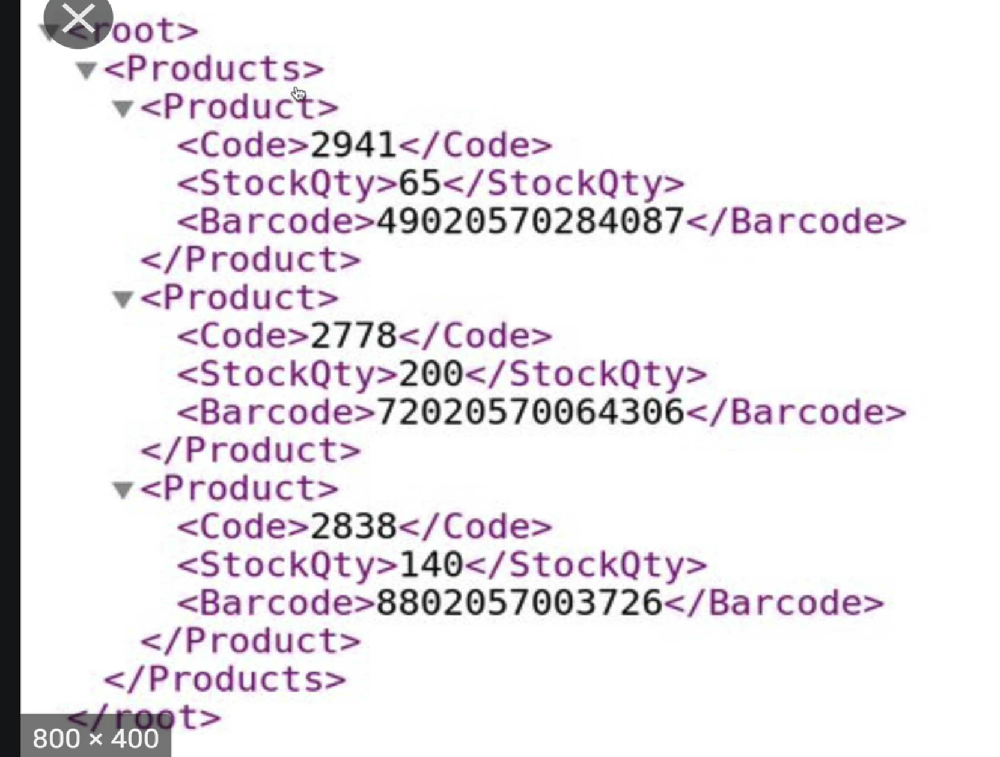
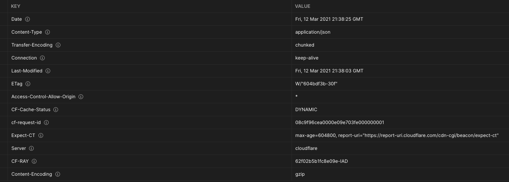

# AJAX and API's

# ASYNC JAVASCRIPT

## Crucial 

### * Working with API's
### * Intro to JSON
### * Working with Axios - HTTP Requests

<br>

## Important 

### * Postman
### * The Fetch API - HTTP Requests

<br>

## Nice to Have

### * Making XHRs - OLD HTTP Requests


<br>

## Notes

<hr>

### INTRO TO AJAX
- - `A`synchronous `J`avascript `A`nd `X`ML
- Make Requests with Code
- Make requests to load information or save information on a website in the background/behind the scenes
- Infinite Scroll - Reddit - `NETWORK` tab in `DEV TOOLS` - see information
- as you type, requests being made for autocomplete suggestions
- When making requests what we want back is just DATA - Comes back in JSON format
- save progress, save login, save data to a database


### INTRO TO APIs
- `A`pplication `P`rogramming `I`nterface 
- Broad Term that refers to any interface interacting with another - Not JUST Web - Software Interaction
- Web API = for web browser/server - interface that occurs over HTTP
- [EXAMPLE CYRPTONATOR](https://www.cryptonator.com/api)
- `https://api.cryptonator.com/api/ticker/btc-usd`
```json
// RETURNS DATA IN JSON
// Buried in Code of Website using data - don't want all the CSS and HTML - Just DATA - JSON
  {"ticker":{"base":"BTC","target":"USD","price":"443.7807865468","volume":"31720.1493969300","change":"0.3766203596"},"timestamp":1399490941,"success":true,"error":""}
```

- NOT ALWAYS FREE - Some APIs cost Money
- Twitter - set up bots to tweet - send messages with your code
- Instagram - set up API to respond to direct message - Share Photos to Feed - mentions - reply automatically
- APIs to look at trends on Twitter
- Facebook APIs 

- NOT ALWAYS ABOUT FETCHING AND LOADING DATA - 

- [Twilio API](https://www.twilio.com/pricing) | Test Messages - Reminder Texts automatically sent out 


### WTF is JSON
- `XML`: **Extensible Markup Language** - Another Common Format to get your data - not as many these days that require you to use XML
EXAMPLE CODE OF PRODUCTS:
 

- `JSON`: `AJAJ`(AJAX USING JSON) - **JavaScript Object Notation** - Format for sending data - Consistent and Predictable - Based on JavaScript Objects - Every Key has to be a `""` string
- [JSON HOME](https://www.json.org/json-en.html)
- [JSON Formatter/Validator](https://jsonformatter.curiousconcept.com/)
- Not Identical to JS - `"true" "false" "null"`
- Parse JSON into JS - `JSON.parse(text, [, reviver]`
- Turn JS into JSON - `JSON.stringify(value, [, replacer[, space]])`
[JSON CODE ALONG EXAMPLES](02_JSON/app.js)

### Using Postman
- See Headers and Status Code in API RESPONSES
- GET | POST | And other types of requests you can make

- CORE PIECES OF HTTP RESPONSE
* `BODY`: Content, Data of Response
* `STATUS CODE`: HTTP Status CODE - Numeric codes - quick way of indicating from server to client that things are ok or not
`200` - Anything with a 2 is good
`300` - Redirects, etc with NODE
`405` - Request method not supported - Can't `POST` to BTC API - anything 4 is generally bad
`500` - server side error responses
* `HEADERS`: Key Value Pairs, MetaData for response or request, content-type (i.e. application/JSON)


### Query Strings & Headers
  - 

### Making XHR's

### The Fetch API

### Intro to Axios

### Setting Headers With Axios

### TV Show Search App

