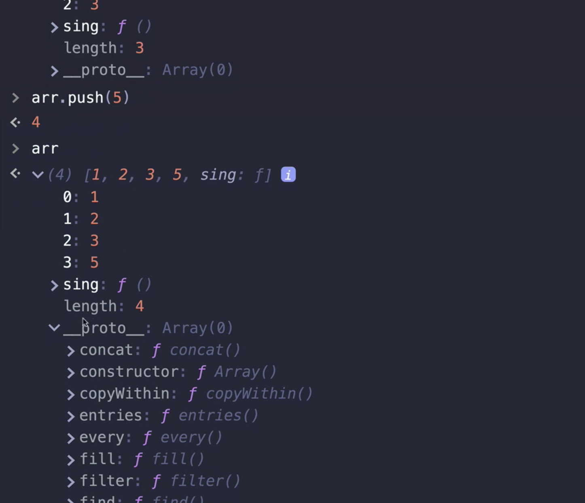
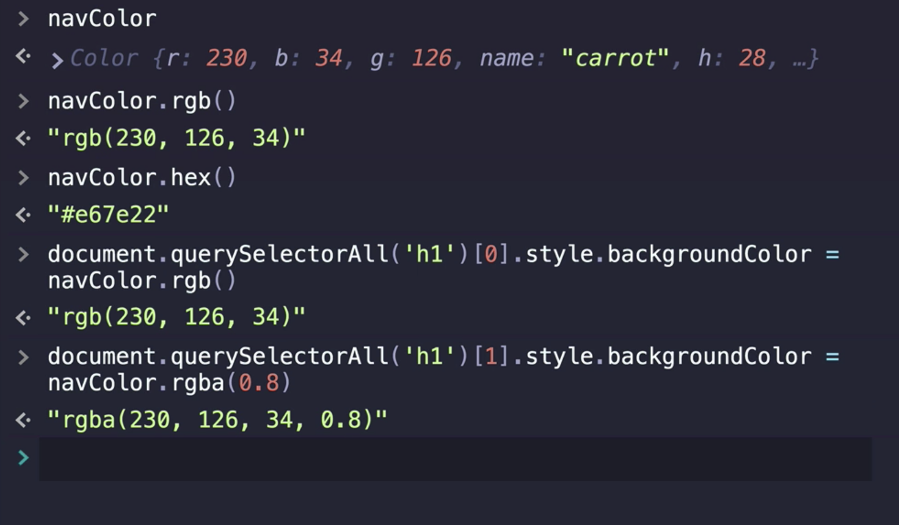

# PROTOTYPES, CLASSES, & OOP

## Crucial 

### * Object Prototypes (the concept)
### * Defining Classes
### * Extends & Super

<br>

## Important 

### * The "new" keyword (the 4 things it does)

<br>

## Nice to Have

### * Defining Constructor Functions (the "old" way)
### * Converting Colors & Associated Crazy Math - StackOverFlow

<br>

## Notes

<hr>

### What On Earth Are Prototypes
- `OBJECT PROTOTYPES`: the mechanism by with JS objects inherit features from on another 
```js
//ARRAY
  length: 0
  >__proto__: Array(0)
```
- Objects can have a prototype object which acts as a `template object`: Typically contain a bunch of methods 
- [MDN object prototypes doc](https://developer.mozilla.org/en-US/docs/Learn/JavaScript/Objects/Object_prototypes)
- Certain methods attached to Array. If define new method not inherited it will show up in the array

- `String.prototype`
- `Array.prototype`
```js
  //Add prototype method to string
  String.prototype.grumpus = () => alert("GO AWAY"!)
```
[PROTOTYPE CODE ALONG](01_prototypes/app.js)

- `__proto__` = Reference to the object `String.prototype` or `Array.prototype`

### Intro to Object Oriented Programming
- [MDN OOP for Beginners](https://developer.mozilla.org/en-US/docs/Learn/JavaScript/Objects/Object-oriented_JS)
- Organizing our code, Designing and Structuring our applications by breaking things up into distinct patterns of objects
- Create application to convert colors

- FOR EXAMPLE: `XHR`: Making `new` `XMLHttpRequest` (you are creating a new object that inherits the properties and methods in `XMLHttpRequest`) - h1 - object template

### Factory Functions
- [FACTORY FUNCTION CODE ALONG](02_factory_functions/app.js)
- Makes us an object and returns it at the end so we can use it
- THIS PATTERN NOT AS COMMONLY USED
- methods are defined to each new color object created
` black.hex === firstColor.hex`: `false`
- vs. strings and protype methods
`"hello".slice === "bye".slice`: `true`

### Constructor Functions
- [CONSTRUCTOR FUNCTION CODE ALONG](03_constructor_functions/app.js)
- `new` Keyword | OPERATOR | Create new object | `new XMLHttpRequest` | `new Array()`
- [new operator: MDN](https://developer.mozilla.org/en-US/docs/Web/JavaScript/Reference/Operators/new)
```js
  function Car(make, model, year) {
    this.make = make;
    this.model = model;
    this.year = year;
  }

  const car1 = new Car('Eagle', 'Talon TSi', 1993);

  console.log(car1.make);
  // expected output: "Eagle"
```
- `this` refers to the global scope, the nearest object = `WINDOW` if you don't use the `new` operator
- `new` operator:
1. Creates a blank, plain JavaScript Object;
2. Links (sets the constructor of) `this` object to another object;
3. Passes the newly created object from Step 1 as the `this` context
4. Returns `this` if the function doesn't return its own object

- ARROW FUNCTIONS run into trouble with the `this`: DO NOT USE THEM WITH THIS CODE
- STILL CLUNKY CODE - ON TO CLASSES = PRETTIER SYNTAX

### JavaScript Classes
- **Syntactic Sugar** | Everything we just did is going on int he background. You still have to understand `prototype` and the keyword `this`, etc
- Don't have to add methods manually, or break up constructor function etc.
`constructor` is a function that will execute immediately whenever a new Color is created
```js
  //KEYWORD CLASS - USUALLY UPPERCASE FOR NAME - PATTERN 
class Color {
  //ADD IN CONSTRUCTOR
  constructor(r, g, b, name){
    console.log("=======INSIDE CONSTRUCTOR=====")
    console.log(r, g, b)
    //will access this.r, etc.
    this.r = r;
    this.g = g;
    this.b = b;
    this.name = name;
  }
  //REFACTOR RGB and RGBA
  innerRGB() {
    const { r, g, b } = this;
    return `${r}, ${g}, ${b}`
  }
  //define a method
  rgb(){
    return `rgb(${this.innerRGB})`;
  }
  rgba(a=1.0){
    return `rgba(${this.innerRGB}, ${a})`
  }
  hex(){
    const { r, g, b } = this;
    return '#' + ((1 << 24) + (r << 16) + (g << 8) + b).toString(16).slice(1); 
  }
}
```

### Extends and Super Keywords
- Subclasses and INHERITANCE
- [BACK TO BASICS EXAMPLE](06_extends_and_super/app.js)
- Create Standalone classes for duplicated code that new classes can extend from | kind of like parent child relationship
- `extends` keyword
```js
    class Pet {
      constructor(name, age){
        this.name = name;
        this.age = age;
      }
      eat(){
        return `${this.name} is eating`
      }
    }

    class Dog extends Pet {
      bark(){
        return 'WOOOOOF!!'
      }
    }

    class Cat extends Pet {
      meow(){
        return 'MEOWWW!!';
      }
    }
```
- `super` keyword: additional information for extended classes
```js
    class Pet {
      constructor(name, age){
        this.name = name;
        this.age = age;
      }
      eat(){
        return `${this.name} is eating`
      }
    }
    ///INSTEAD OF DOING THIS TO ADD TO CAT
    class Cat extends Pet {
      constructor(name, age, livesLeft = 9){
        this.name = name;
        this.age = age;
        this.livesLeft = livesLeft;
      }
      meow(){
        return 'MEOWWW!!';
      }
    }

    //// YOU CAN DO THIS
    class Cat extends Pet {
      constructor(name, age, livesLeft = 9){
        super(name, age) //ref to what we are extending from
        this.livesLeft = livesLeft;
      }
      meow(){
        return 'MEOWWW!!';
      }
    }
```


