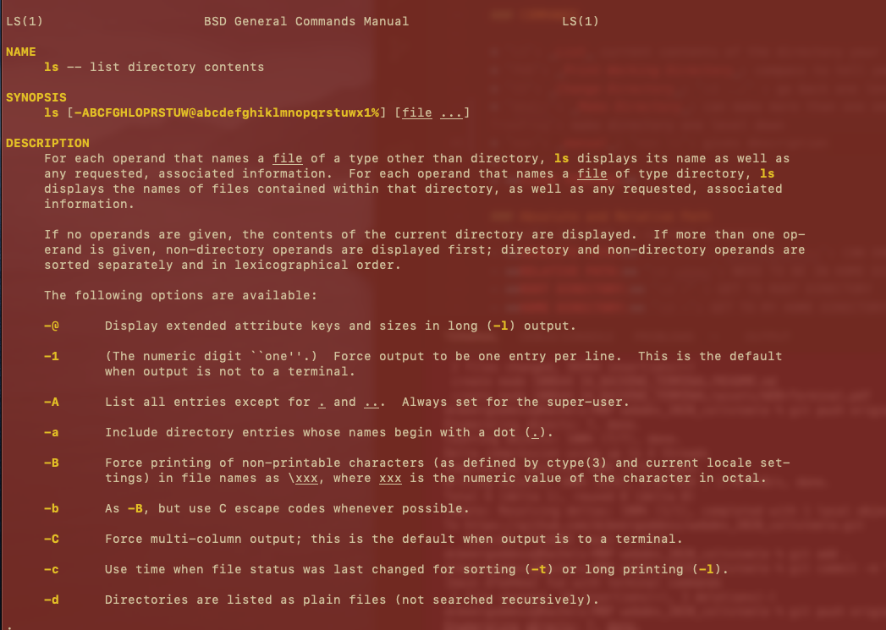

# MASTERING THE TERMINAL

## Crucial 

### * Installation
### * LS
### * CD
### * MKDIR
### * RM
### * Touch
### * PWD
### * Relative vs. Absolute Paths

 

## Important 

### * Remembering All the Commands

 

## Notes
- COME BACK TO THIS SECTION FOR PC SETUP AND HELP TO PLAY AROUND WITH

### BACKEND DEVELOPMENT - THE TERMINAL
- creating servers, connecting to databases, completing the picture
- **TERMINAL:** TEXT BASED PROMPT TO INTERACT WITH MACHINE | TEXT BASED INTERFACE 
 1. **SPEED:** Develop Faster - CAN BE MUCH FASTER THAN USING `GUI`
 2. **ACCESS:** Provides 'mainline' to the heart of our computer 
 3. **TOOLS:** many tools installed and used via command line

- _Terminal_: A text-based interface to your computer. Originally a Physical Object, but now we use `software terminals` | (iTerm - MAC)
- _Shell_: The Program Running on the Terminal 
  1. _bash_: OLD Standard
  2. _zsh_: default for MAC - Newer Features
- _GUI_: Graphical User Interface (i.e. Finder Window on Mac)

### COMMANDS

* `ls`: _List_ current contents of the directory your in
* `pwd`: _Print Working Directory_: compass to tell you where you are
* `cd`: _Change Directory_: `cd ../` : go back one level
* `mkdir`: _Make Directory_: can make more than one on same line | `mkdir ../Frog`: Makes new Folder one level up | `mkdir Frog/TreeFrog`: make directory one level down
* `man`: _manual_: `man ls`: gives us information | type `q` to get out of it
* `-`: _flags_: `-@`, etc: almost like arguments in a function, different parameters for how we want to work
EXAMPLE OF `man ls` in HOME DIRECTORY:

* `touch`: _MAKE NEW FILE_ | Change Access Permissions | `touch` file that exists with change access time: `man touch`
* `rm`: _REMOVE_ | remove file/multiple files | does not put in trash can - IT IS GONE!!
* `rmdir`: _REMOVE EMPTY DIRECTORY_
* `rm -rf`: _FLAG TO REMOVE DIRECTORY w/ CONTENT_ | `rf`: recursive force |
* **CLEAR TERMINAL** : `CMD + K`

### Absolute and Relative Path
- `pwd`: see path to current directory
- **ABSOLUTE PATH:** `cd /Users/dcbeergoddess`: CAN DO THIS FROM ANYWHERE | STARTS WITH SLASH `/`
- **RELATIVE PATH:** `cd udemy`: NEED TO BE IN HOME DIRECTORY
- **ROOT DIRECTORY:** `cd /` : GET TO ROOT DIRECTORY
- **HOME DIRECTORY:** `cd ~`: GET TO MY HOME DIRECTORY (dcbeergoddess@Rachels-MBP) 

