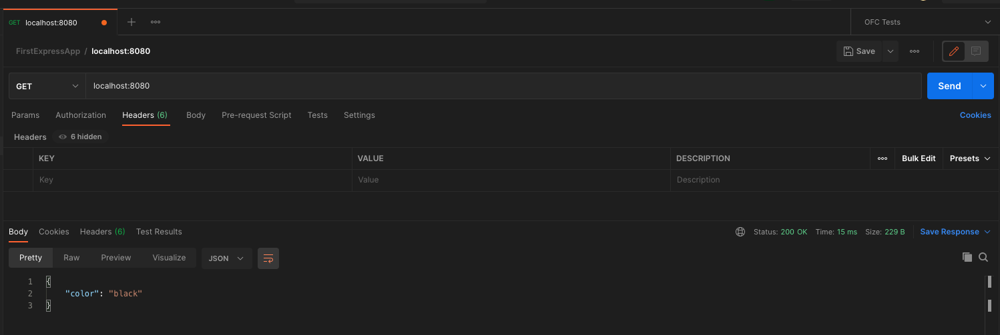

# Creating Servers With Express

## Crucial 

### * What are frameworks?
### * Our First Express App
### * Routing Basics
### * Path Parameters
### * Working With Query Strings

<br>

## Important 

### * Nodemon

<br>

## Notes

<hr>

### Introducing Express
- A Framework
- "fast, un-opinionated, minimalist web framework for Node.JS"
- NPM Package which comes w/ a bunch of methods and optional plugins that we can use to build web applications and API's
- [EXPRESS GITHUB](https://github.com/expressjs/express)
**Express Helps Us:**
* Start up a Server to listen for Requests
* Parse incoming requests
* Match those requests to particular routes
* Craft our http response and associated content

#### Library vs Framework
- **LIBRARY**: You control the flow of the application code and decide when to use the library
- **FRAMEWORK**: control inverted | tells you where to plug in code | `inversion of control`
- `Ruby on Rails` = Framework

### Our Very First Express App
- [OUR FIRST APP CODE](01_first_app/index.js)
- `npm init -y`: skip questions
- `npm i express`: `--save` not necessary in newer versions!!!!
```js
  const express = require('express');
  const app = express(); //Execute Express
  console.dir(app) // TO SEE WHAT WE HAVE AVAILABLE
  PORT = 3000

  app.use(() => {
    console.log("WE GOT A NEW REQUEST")
  }) //EVERY TIME A REQUEST HIT OUR SERVER WE PRINT THIS OUT

  app.listen(PORT, () => {
    console.log(`LISTENING ON http://localhost:${PORT}` )
  }) //listen on port

```
- `localhost:` : specific to your local machine
- `PORT`: Different addresses we can use to identify and refer to them

### The Request and Response Objects
```js
  app.use((req, res) => {
    console.log("WE GOT A NEW REQUEST");
    res.send({color: black}); //RETURNS JSON OBJECT
  }) 
```
- TWO DIFFERENT PARAMETERS IN FUNCTION AUTOMATICALLY PASSED IN
1. OBJECT that represents the REQUEST
2. OBJECT that represents the RESPONSE
- req, res | objects made by express and passed into the callback, text information from JS, express parses and turns it into an object
- `res`: `res.send`
- USE POSTMAN TO TEST

- HEADER SET TO `application/json`: automatically
- anytime you use res.send you are done with that request
```js
  app.use((req, res) => {
  console.log("WE GOT A NEW REQUEST") //EVERY TIME A REQUEST HIT OUR SERVER WE PRINT THIS OUT(refresh page)
  res.send('WE GOT A RESOONSE ON THE WEBSITE'); //get a response on the server/localhost:8080 
})

app.use((req, res) => {
  console.log("WE GOT A NEW REQUEST") //EVERY TIME A REQUEST HIT OUR SERVER WE PRINT THIS OUT(refresh page)
  res.send(`<h1>THIS IS MY WEBPAGE</h1>`); //renders H1 on server/localhost:8080 - HTML in POSTMAN
}) 

```

### Express Routing Basics
- RESPOND WITH DIFFERENT CONTENT FOR DIFFERENT INCOMING REQUESTS | INSTEAD OF HANDLING EVERY SINGLE REQUEST THE EXACT SAME WAY
**ROUTING** | ANY SERVER, NOT JUST EXPRESS
- Take incoming request and path and match it to a response
#### GET
```js
//PATH YOU ARE MATCHING AND CALLBACK FUNCTION
  app.get('/cats', (req, res) => {
    console.log("CAT REQUEST!!!")
    res.send('MEOW!!!')
  })
```
- **ROOT ROUTE** | `/` | Request the Root Resource without any path named after it

#### POST
```js
  app.post('/cats',(req, res) => {
    res.send('POST REQUEST TO /cats!!! THIS IS DIFFERENT FROM A GET REQUEST')
  })
```

- APIs
- HTTP VERBS (GET, POST, DELETE, etc.)

**GENERIC RESPONSE**
```js
//PUT THIS AT END //MATCHED IN ORDER
  app.get('*', (req, res) {
    res.send(`I do not know that path!`)
  })
```

### Express Path Parameters 
- BEFORE IT WAS DIRECT MATCH ROUTES
- Often want to define PATTERNS for our routes
```js
  app.get('/r/:subreddit', (req, res) => {
    console.log(req.params) //---> /r/cats | {subreddit: 'cats'}
    res.send('THIS IS A SUBREDDIT');
  })
  //ACCESS `:subreddit` in the req object!!!
```
- colon `:` indicates variable without having to hard code

### Working With Query Strings
- **Query String:** portion of the URL that comes after a `?` and can include information in `key value pairs`
- parse query string in express and use it!!!
- `req` object has property called `query`
```js
  app.get('/search', (req, res) => {
    console.log(req.query)
    const { q } = req.query;
    if(!q) {
      res.send('NOTHING FOUND IN NOTHING SEARCHED')
    }
    res.send(`SEARCH RESULTS FOR ${q}`);
  })
  // TYPE `localhost:8080/search?q=dogs&color=red` in postman
  // RETURNS
  { q: 'dogs', color: 'red'} //for req.params
```

### Auto-Restart with Nodemon
- RESTART SERVER AFTER CHANGES
- [NODEMON](https://www.npmjs.com/package/nodemon)
- `npm i -g nodemon`
- `nodemon index.js`

