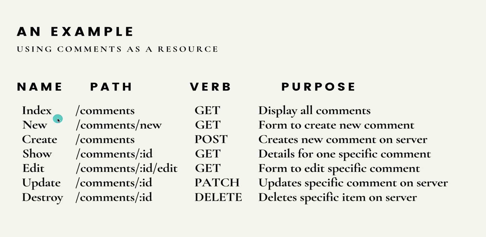

# Defining RESTful Routes

## Crucial 

### * GET vs POST Requests
### * Handling Post Request in Express
### * Parsing Request Body
### * Forms + Express

<br>

## Important 

### * Method Override
### * RESTful Routing

<br>

## Notes

<hr>

### GET vs POST Requests
**GET**
* Used to retrieve information
* Data is sent via `query string`
* Information is plainly visible in the URL
* Limited amount of data can be sent

**POST**
* Used to post data to the `server`
* Used to write/create/update
* Data is sent via request body, not a query string!
* [EXAMPLE](getpost.html)

### Defining Express Post Routes
- RECEIVING AND HANDLING POST REQUESTS IN EXPRESS

### Parsing the Request Body
- EXTRACT DATA FROM POST
- DIFFERENT FORMATS - Parse Data
- STATE HOW TO PARSE
- [`req.body` docs](http://expressjs.com/en/4x/api.html#req.body) 
```js
//TELL EXPRESS TO PARSE FORM ENCODED INFORMATION FOR REQUEST BODY
//USE THIS MIDDLEWARE
app.use(express.urlencoded({ extended: true }))
//ANTICIPATE JSON DATA// BUILT IN PARSING MIDDLEWARE
app.use(express.json()) //application.json
```

### INTRO TO REST
- `RE`presentational `S`tate `T`ransfer
- **REST**: an "architectural style for distributed hypermedia systems???????
- BASICALLY: a set of guidelines for how a client + server should communicate and perform `CRUD` operations on a given resource
- MAIN IDEA: treating data on the server-side as resources that can be CRUDed
- The most common way of approaching REST is in formatting the URLs and HTTP verbs in your applications
- `C`reate `R`ead `U`pdate `D`estroy
- CLIENT-SERVER Architecture
- [DISSERTATION ON REST](https://www.ics.uci.edu/~fielding/pubs/dissertation/rest_arch_style.htm)
- [GITHUB GISTS](https://docs.github.com/en/rest/reference/gists)
- PUT PATCH DELETE
- PATCH = UPDATE

### RESTful Comments Overview
- Use An ARRAY as Data for now
- Comments: Username | Text
- CRUD Functionality for a Comment
- GET /allcomments
- POST /newcomment
- FOLLOW PATTERN - REST Compliant - Not the only way to implement a RESTful API

**PATTERN**
- GET /comments - list all comments
- POST /comments - crate a new comment
- GET /comments/:id - Get one comment (using ID)
- PATCH or PUT /comments/:id - Update one comment
- DELETE /comments/:id - Destroy one comment
- Match different HTTP Verbs with some resource, base URL, often pluralized 

### RESTful Comments New

- create form to input data
- 2 ROUTES | 1. SERVE THE FORM ITSELF - `NEW` ROUTE | 2. DATA SENT as POST Request to different path and added to comments array - `CREATE` ROUTE 
```js
  //NEW COMMENTS POST
  app.post('/comments', (req, res) => {
    // console.log(req.body);
    //EXTRACT/DESTRUCTURE req.body
    const { username, comment } = req.body;
    //push comment to `comments` array
    comments.push({ username, comment })
    res.send("IT WORKED!!!")
  })
```
```html
<!-- FORM NEEDS PATH AND ACTION REF -->
  <form action="/comments" method="post">
```

### Express Redirects

### RESTful Comments Show

### The UUID Package

### RESTful Comments Update

### Express Method Override

### RESTful Comments Delete