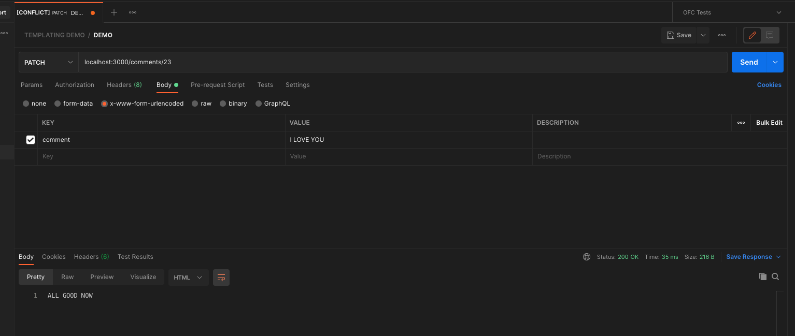
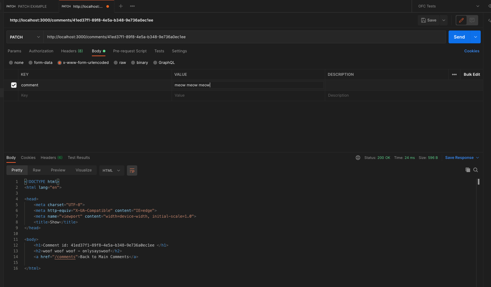
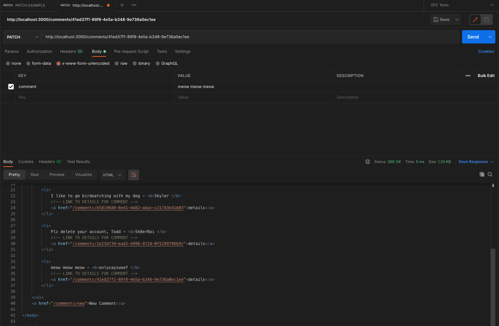

# Defining RESTful Routes

## Crucial 

### * GET vs POST Requests
### * Handling Post Request in Express
### * Parsing Request Body
### * Forms + Express

<br>

## Important 

### * Method Override
### * RESTful Routing

<br>

## Notes

<hr>

### GET vs POST Requests
**GET**
* Used to retrieve information
* Data is sent via `query string`
* Information is plainly visible in the URL
* Limited amount of data can be sent

**POST**
* Used to post data to the `server`
* Used to write/create/update
* Data is sent via request body, not a query string!
* [EXAMPLE](getpost.html)

### Defining Express Post Routes
- RECEIVING AND HANDLING POST REQUESTS IN EXPRESS

### Parsing the Request Body
- EXTRACT DATA FROM POST
- DIFFERENT FORMATS - Parse Data
- STATE HOW TO PARSE
- [`req.body` docs](http://expressjs.com/en/4x/api.html#req.body) 
```js
//TELL EXPRESS TO PARSE FORM ENCODED INFORMATION FOR REQUEST BODY
//USE THIS MIDDLEWARE
app.use(express.urlencoded({ extended: true }))
//ANTICIPATE JSON DATA// BUILT IN PARSING MIDDLEWARE
app.use(express.json()) //application.json
```

### INTRO TO REST
- `RE`presentational `S`tate `T`ransfer
- **REST**: an "architectural style for distributed hypermedia systems???????
- BASICALLY: a set of guidelines for how a client + server should communicate and perform `CRUD` operations on a given resource
- MAIN IDEA: treating data on the server-side as resources that can be CRUDed
- The most common way of approaching REST is in formatting the URLs and HTTP verbs in your applications
- `C`reate `R`ead `U`pdate `D`estroy
- CLIENT-SERVER Architecture
- [DISSERTATION ON REST](https://www.ics.uci.edu/~fielding/pubs/dissertation/rest_arch_style.htm)
- [GITHUB GISTS](https://docs.github.com/en/rest/reference/gists)
- PUT PATCH DELETE
- PATCH = UPDATE

### RESTful Comments Overview
- Use An ARRAY as Data for now
- Comments: Username | Text
- CRUD Functionality for a Comment
- GET /allcomments
- POST /newcomment
- FOLLOW PATTERN - REST Compliant - Not the only way to implement a RESTful API

**PATTERN**
- GET /comments - list all comments
- POST /comments - crate a new comment
- GET /comments/:id - Get one comment (using ID)
- PATCH or PUT /comments/:id - Update one comment
- DELETE /comments/:id - Destroy one comment
- Match different HTTP Verbs with some resource, base URL, often pluralized 

### RESTful Comments New

- create form to input data
- 2 ROUTES | 1. SERVE THE FORM ITSELF - `NEW` ROUTE | 2. DATA SENT as POST Request to different path and added to comments array - `CREATE` ROUTE 
```js
  //NEW COMMENTS POST
  app.post('/comments', (req, res) => {
    // console.log(req.body);
    //EXTRACT/DESTRUCTURE req.body
    const { username, comment } = req.body;
    //push comment to `comments` array
    comments.push({ username, comment })
    res.send("IT WORKED!!!")
  })
```
```html
<!-- FORM NEEDS PATH AND ACTION REF -->
  <form action="/comments" method="post">
```

### Express Redirects
- redirect user after submitting form - no duplicate form
- `res.redirect` - STATUS CODE 300 - REDIRECTS - 302
```js
  app.post('/comments', (req, res) => {
  const { username, comment } = req.body;
  comments.push({ username, comment })
  res.redirect('/comments'); 
})
```

### RESTful Comments Show
- NEED A UNIQUE IDENTIFIER - Does not have to be random number, could be username, but needs unique identifier
- GET /comments/:id - Get one comment (using ID)
- `slug`: easier to understand, after id, for user
- nested routes, maybe more than one id in a path -  post - comment -
```js
app.get('/comments/:id', (req, res) => {
  //extract id from req.params
  const { id } = req.params;
  //array method find: where c.id = this id(string not number so parse)
  const comment = comments.find(c => c.id === parseInt(id));
  //render page
  res.render('comments/show', { comment, id });
})
```
- details/expanded - show page
- link to show page instead of typing id
- make link to comment
```html
  <ul>
    <% for(let c of comments) { %>
      <li>
        <%= c.comment %> - <b><%= c.username %> </b>
        <!-- LINK TO DETAILS FOR COMMENT -->
        <a href="/comments/<%= c.id %>">details</a>
      </li>
    <% } %>
  </ul>

```
### The UUID Package
- create ids for new comments - instead of faking ids
- Mimic what we get from a database
- [uuid npm](https://www.npmjs.com/package/uuid)
=======WHAT WE WILL BE USING==========
To create a random UUID...
1. Install
`npm i uuid`
2. Create a UUID (ES6 module syntax)
```js
import { v4 as uuidv4 } from 'uuid';
uuidv4(); // ⇨ '9b1deb4d-3b7d-4bad-9bdd-2b0d7b3dcb6d'
```
... or using CommonJS syntax:
```js
//CAN CHANGE uuidv4 to anything you want
const { v4: uuidv4 } = require('uuid');
uuidv4(); // ⇨ '1b9d6bcd-bbfd-4b2d-9b5d-ab8dfbbd4bed'
```
3. SET ID ON COMMENTS ARRAY
```js
    {
      id: uuid(),
      username: 'onlysayswoof',
      comment: 'woof woof woof'
    }
```
4. SET IT ON MAKE NEW COMMENT
```js
app.post('/comments', (req, res) => {
  const { username, comment } = req.body;
  comments.push({ username, comment, id: uuid() });
  res.redirect('/comments'); 
});
//NO NEED TO PARSE AS WITH FAKE DATA
app.get('/comments/:id', (req, res) => {
  const { id } = req.params;
  const comment = comments.find(c => c.id === id);
  res.render('comments/show', { comment, id });
});
```

### RESTful Comments Update
- Provide Form to edit a particular comment
- **PATCH** Request - Apply Partial modifications to a resource
- **PUT** Request - replaces all current representations of the target resource with the request payload
**EXAMPLE OF TESTING IN POSTMAN**
```js
// THIS IS THE ROUTE
app.patch('/comments/:id', (req, res) => {
  const { id } = req.params;
  //use next two lines to test in postman
  console.log(req.body.comment); 
  res.send("ALL GOOD NOW")
  // const comment = comments.find(c => c.id === id);
  
})
```
**POSTMAN TEST**


- NEXT Take `id` from `req.params` and find a comment with that `id`, take whatever is in `req.body.comments` (this is the payload - includes everything) and save to a variable, and then update the found comment with the new comment text (need error handling if the `id` can not be found)
- don't put `patch` in here, respond with a redirect (like creating a comment)
```js
app.patch('/comments/:id', (req, res) => {
  const { id } = req.params;
  const newCommentText = req.body.comment;
  const foundComment = comments.find(c => c.id === id);
  foundComment.comment = newCommentText;
  res.redirect('/comments')
})
```
**Postman Update Test**


- ENDPOINT IS NOW SET UP CORRECTLY
- IMMUNIBILITY - DON'T MUTATE OBJECTS like this: `foundComment.comment = newCommentText;` | BETTER COMPLICATED WAYS...

**UPDATING**
- CREATE FORM TO UPDATE COMMENT
- FORMS CAN ONLY GET OR POST, FAKE PATCH/PUT - METHOD OVERRIDE
- Make ROUTE TO SERVE FORM - GET REQUEST 

### Express Method Override
- NPM PACKAGE
- `npm i method-override` | then use query string value
- `const methodOverride = require('method-override');`
- THIS IS MIDDLEWARE: `app.use(methodOverride('_method'))`
- `_method` (can be whatever but this is standard)
```html
  <form method="POST" action="/comments/<%=comment.id%>?_method=PATCH">
    <textarea name="comment" id="" cols="30" rows="10">
    <%=  comment.comment %> 
    </textarea>
    <button>SAVE</button>
  </form>
```

### RESTful Comments Delete
- SET UP ENDPOINT TO DESTROY COMMENT
- Can use method-override or JAVASCRIPT with a click listener (click on button to send delete request using axios or fetch api)
- WE ARE: Creating form with no input with a button to submit it
- USE ARRAY FILTER METHOD - filter everything into new array - good practice not to mutate - REACT!!! - INSTEAD MAKE COPY and make a change to that copy
- When dealing with database this won't matter because we will have a remove ability by id
```js
  app.delete('/comments/:id', (req, res) => {
  const { id } = req.params;
  // const foundComment = comments.find(c => c.id === id);
  //USE ARRAY FILTER METHOD - filter everything into new array that does not have id in payload
  //set comments to new array (why `let` comments = [])
  comments = comments.filter(c => c.id !== id); //return new array
  res.redirect('/comments');
})
```
```html
`  <h1>Comment id: <%= comment.id %> </h1>
  <h2><%= comment.comment %> - <%= comment.username %></h2>
  <a href="/comments">Back to Main Comments</a>
  <a href="/comments/<%=comment.id%>/edit ">Edit Comment</a>
  <!-- CREATE FORM FOR DELETE -->
  <form method="POST" action="/comments/<%=comment.id%>?_method=DELETE ">
    <button>DELETE COMMENT</button>
  </form>
```

