# OUR FIRST DATABASE: MongoDB

## Crucial 

### * Installation
### * The Mongo Shell
### * Mongo Inserts
### * Mongo Finding/Querying
### * Mongo Updates
### * Mongo Deletions

<br>

## Important 

### * Databases Basics
### * SQL vs. NoSQL

<br>

## Notes

<hr>

### Introduction to Databases
[Mongo](https://www.mongodb.com/)
* "the most popular database for modern application" - Commonly used in combination with NODE 
* A **DOCUMENT DATABASE** which we can use to store and retrieve complex data from
- Databases can handle large amounts of data efficiently and store it compactly
- They provide tools for easy insertion, querying and updating of data
- They generally offer security features and control over access to data
- They (generally) scale well

### SQL vs NoSQL Databases
**SQL**
* Structure Query Language databases are relational databases 
* Pre-define a schema of tables before inserting anything
* MySQL, Postgres, Oracle, etc.
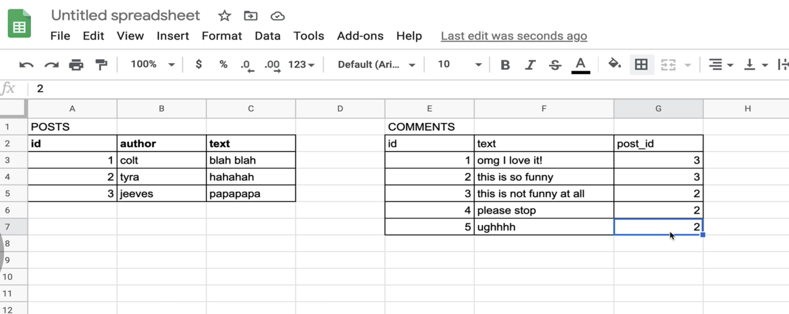

**NoSQL**
* Do Not Use SQL
* There are many types, including document, key-value, and graph stores
* MongoDB, Couch DB, Neo4j, Cassandra, Redis
- **Document Oriented Database** | Document Store | computer program designed for storing, retrieving, and managing document-oriented information (semi-structured data) | XML, YAML, JSON, BSON 
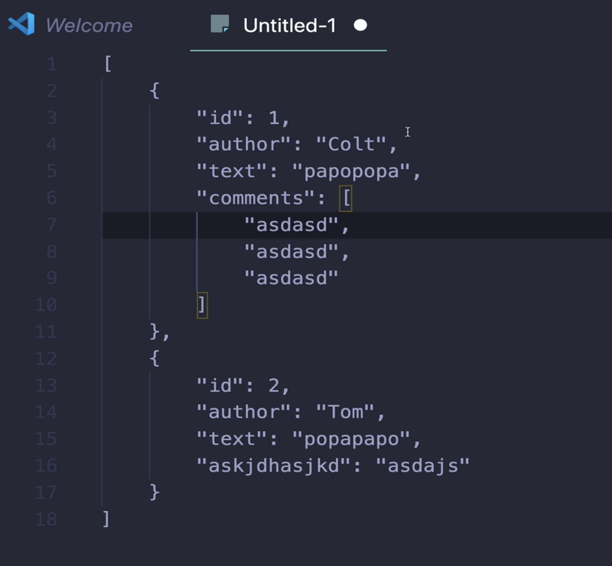

### Why We're Learning Mongo
- Mongo is very commonly used with Node and Express (MEAN & MERN stacks)
- I's easy to get started with (though it can be tricky to truly master)
- It plays particularly well with JavaScript
- Its popularity also means there is a strong community of developers using Mongo

### Installing Mongo: MacOS
- Still Using Robo3T --- Had some issues but with the power of google fu I believe it's all good now. 
```
  <!-- OLD WAY -->
sudo killall Mongod
mongod --dbpath ~/mongodata/

```
```
<!-- NEW WAY -->
mongod --config /usr/local/etc/mongod.conf --fork
mongo
```

### The Mongo Shell
- mongo comes with it's own REPL 
- use to create, edit, update DBs
- change permissions
- JS Code
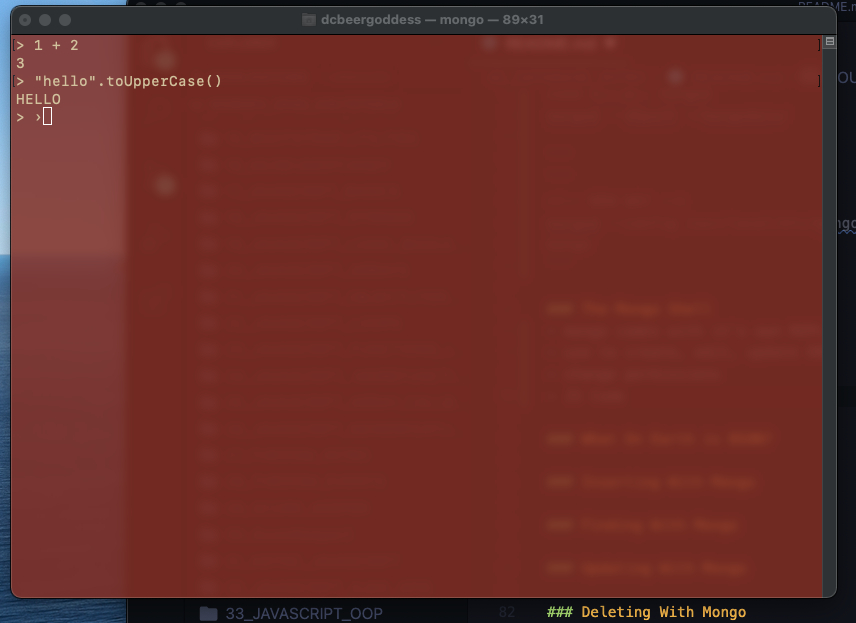
- `show dbs`: show all databases, a database with no data will not show up
- `use animalShelter`: looks for database, creates if not there and now you are in the DB
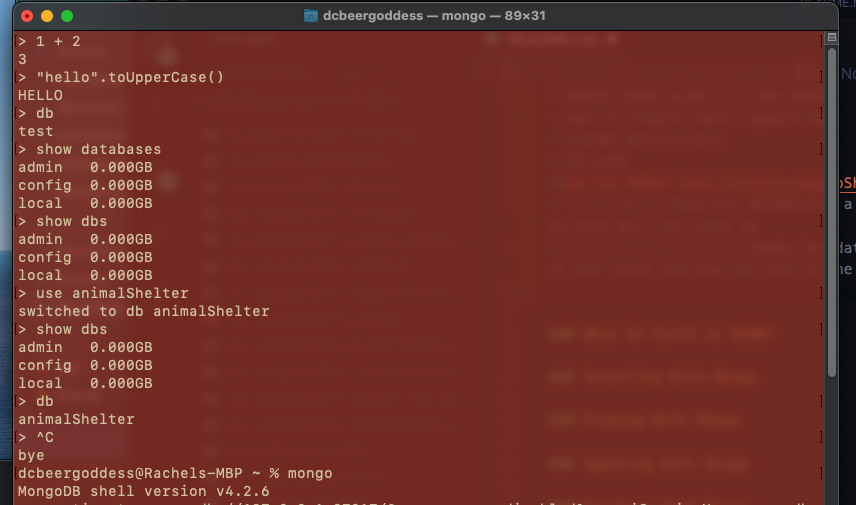

### What On Earth is BSON?
- `JSON` and `BSON` format to store data for Mongo 
- `JSON` is a text-based format and it can be very slow, not space efficient, does not support all data types
- `BSON` - `Binary JSON` : BSON's binary structure encodes type and length information - allows it to be parsed more quickly


### Inserting With Mongo
- Website has lots of DOCs focus on these:
[SERVER DOCS on MongoDB Website](https://docs.mongodb.com/manual/)
[CRUD OPERATIONS](https://docs.mongodb.com/manual/crud/)
- Insert into `Collection`: Grouping of Data in a DB
* `db.collection.insertOne()` --> pass in object (treat like JS Object) -->  `db.dogs.insertOne({name: "Charlie", age: 3, breed: "corgi", catFriendly: true})`
- `"_id":` is automatically created for us, `primary key`, will be unique
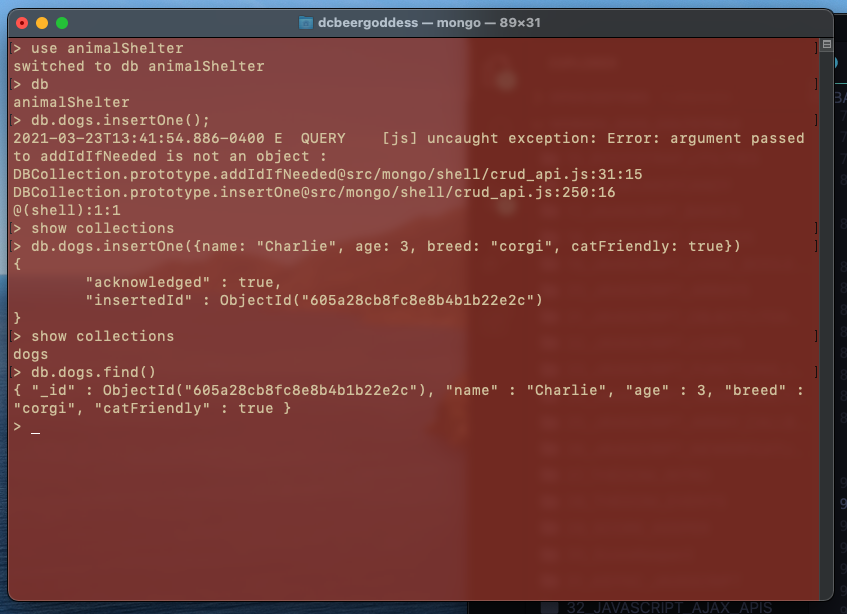
* `db.collection.insertMany()` --> pass in array
* `db.collection.insert()` --> can pass in object or array --> `db.dogs.insert([{name: "Wyatt", breed: "Golden", age: 14, catFriendly: false}, {name: "Tonya", age: 2, breed: "Chihuahua", age: 17, catFriendly: true}])`
- don't have to follow any constraints between objects being inserted - Not Strict, can set if up to be in Mongo if you want
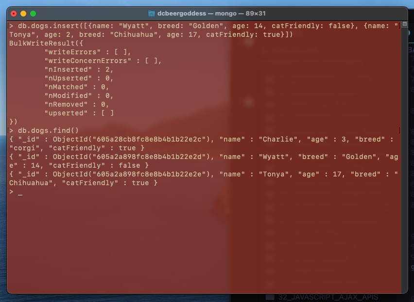 

### Finding With Mongo
- Reading Data back out of a Database
- `db.collection.find()`: find every document in a collection, returns `cursor` to document (reference to results to iterate over)
- `db.collection.findOne()`: returns document itself
- find dogs within a age range, and other things are possible, can pass multiple parameters into find like object
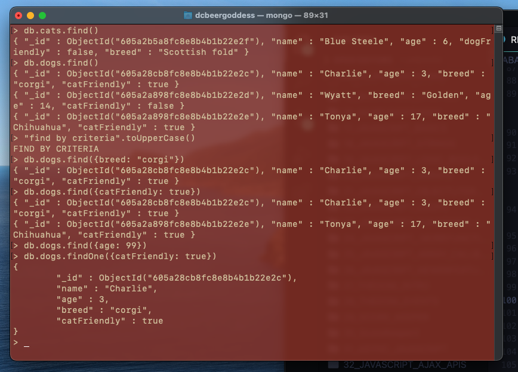

### Updating With Mongo
- Need to deal with two arguments, 1. finding the document, than 2. what you want to do with that document
- `db.collection.updateOne()` - Update first match it finds --> 1. first argument = selector, 2. second argument = special operators in Mongo `$set: {<field1>: <value1>, ...}`
* `db.dogs.updateOne({name: 'Charlie'}, {$set: {age: 4}})`
* `db.dogs.updateOne({name: 'Charlie'}, {$set: {age: 4, breed: 'Lab'}})`
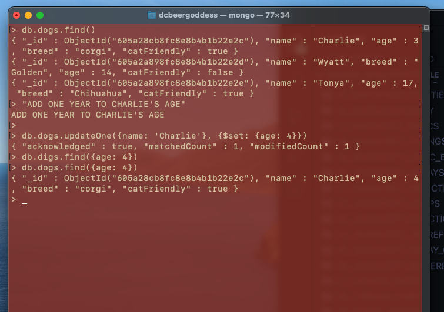
- `db.collection.updateMany()` - Update all matches it finds
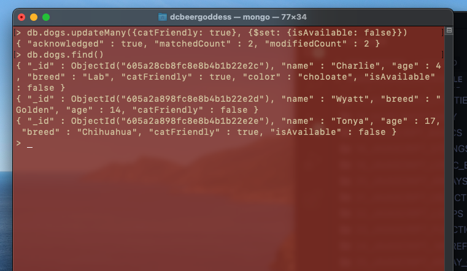
- `$currentDate`: `db.cats.updateOne({age: 6}, {$set: {age: 7}, $currentDate:{lastChanged: true}})` 
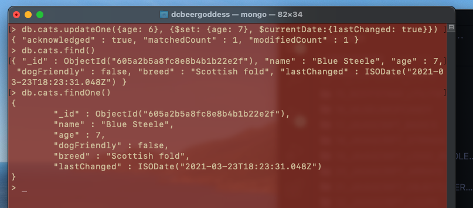
- `db.collection.replaceOne()` : modify entire contents of Document while keeping the dame `_id`

### Deleting With Mongo
- `db.collection.deleteMany()`
* Can pass in more than one parameters if you need
- `db.collection.deleteOne()`
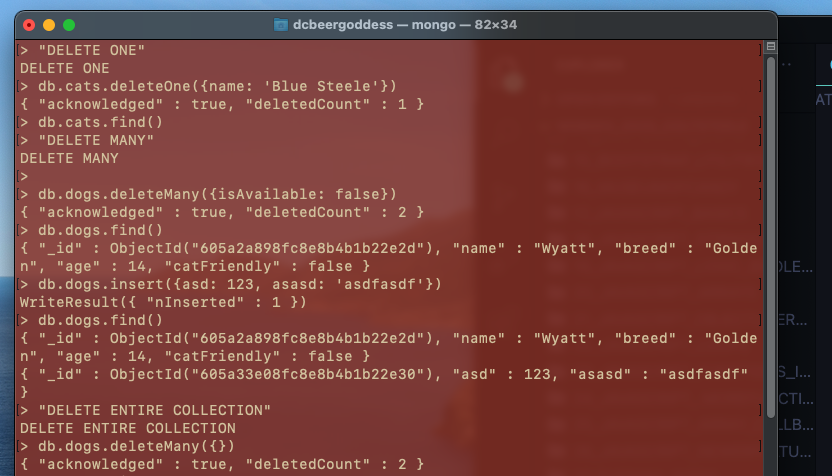
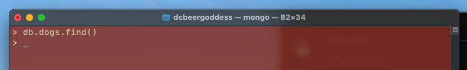

### Additional Mongo Operators
- fancier operators for finding and deleting
- NESTED PROPERTIES
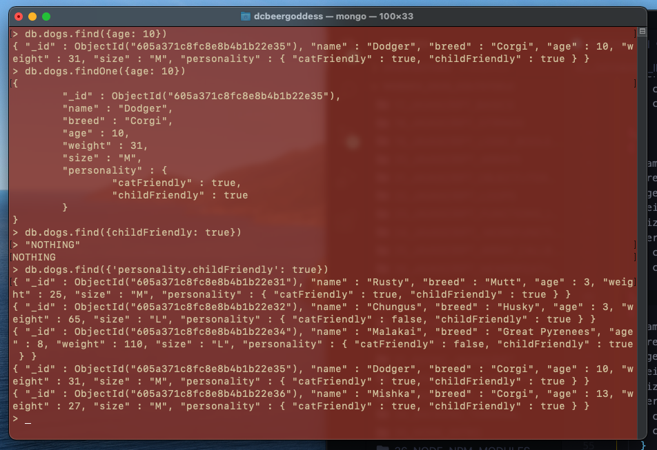
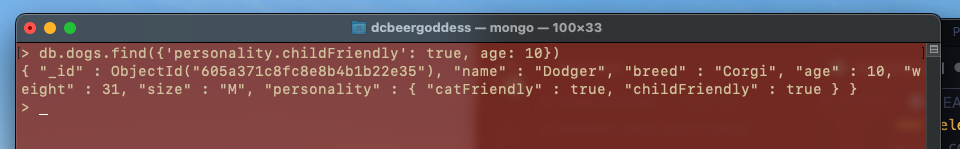
- MORE MONGO OPERATORS
[MONGO OPERATORS REFERENCE](https://docs.mongodb.com/manual/reference/operator/query/)
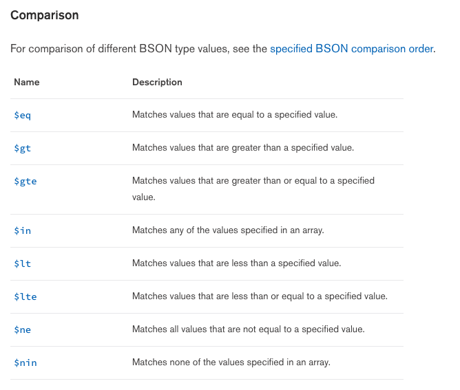
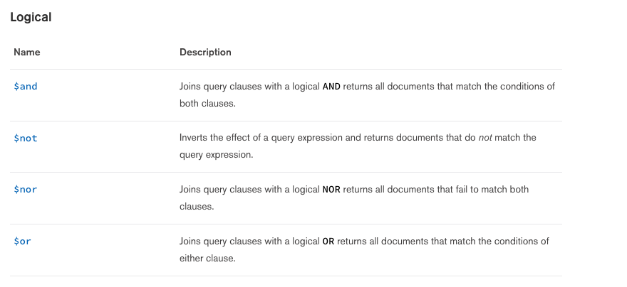
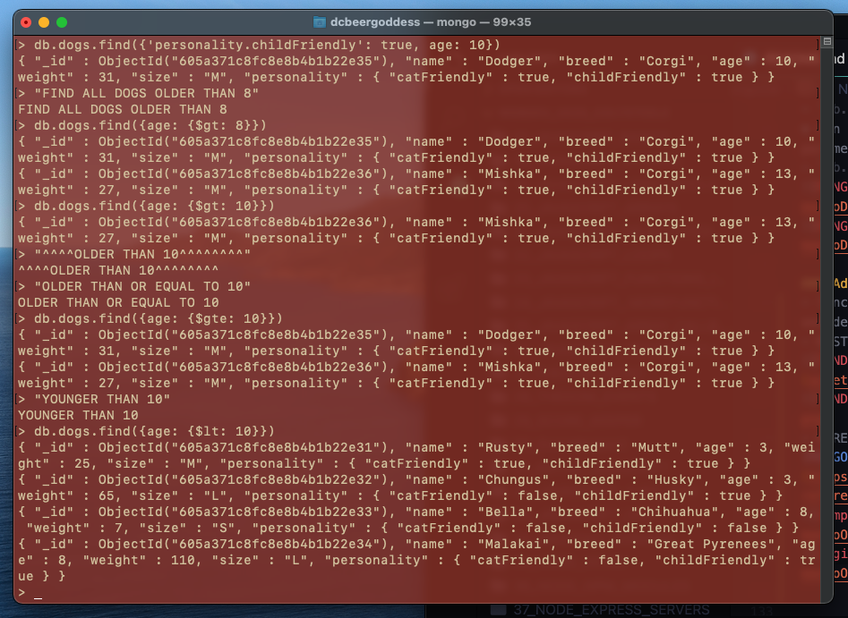

* `$in:`: selects documents where the value of a field equals any value in the specified array
* `db.dogs.find({breed: {$in: ['Mutt', 'Corgi']}})`
* `db.dogs.find({breed: {$in: ['Mutt', 'Corgi']}, age: {$lt: 10}})`
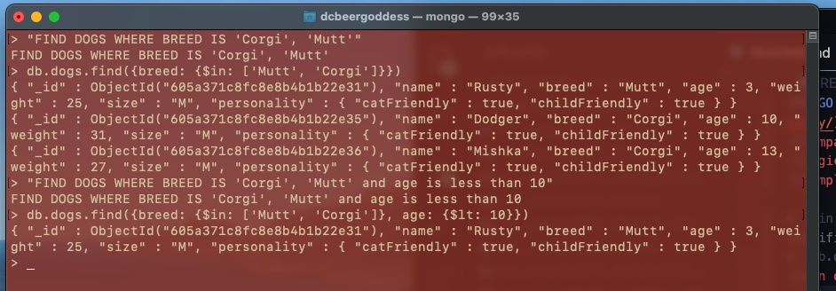
`$ne`: not equal to
`$nin`: not in
- find dogs where personality is cat friendly or age is less than or equal to 2
- `db.dogs.find({$or: [{'personality.catFriendly': true}, {age: {$lte: 2}}]})`
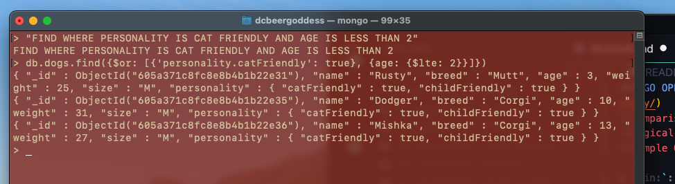
