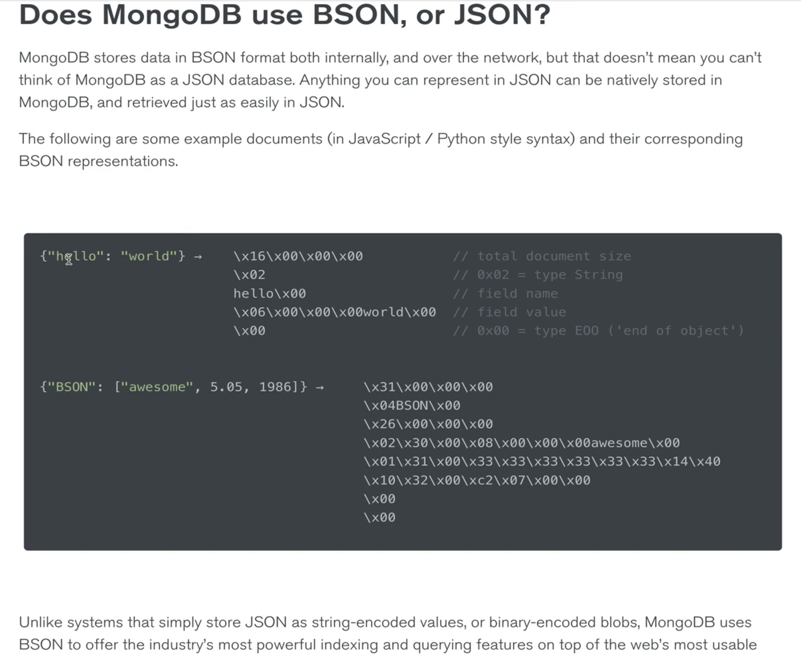

# OUR FIRST DATABASE: MongoDB

## Crucial 

### * Installation
### * The Mongo Shell
### * Mongo Inserts
### * Mongo Finding/Querying
### * Mongo Updates
### * Mongo Deletions

<br>

## Important 

### * Databases Basics
### * SQL vs. NoSQL

<br>

## Notes

<hr>

### Introduction to Databases
[Mongo](https://www.mongodb.com/)
* "the most popular database for modern application" - Commonly used in combination with NODE 
* A **DOCUMENT DATABASE** which we can use to store and retrieve complex data from
- Databases can handle large amounts of data efficiently and store it compactly
- They provide tools for easy insertion, querying and updating of data
- They generally offer security features and control over access to data
- They (generally) scale well

### SQL vs NoSQL Databases
**SQL**
* Structure Query Language databases are relational databases 
* Pre-define a schema of tables before inserting anything
* MySQL, Postgres, Oracle, etc.


**NoSQL**
* Do Not Use SQL
* There are many types, including document, key-value, and graph stores
* MongoDB, Couch DB, Neo4j, Cassandra, Redis
- **Document Oriented Database** | Document Store | computer program designed for storing, retrieving, and managing document-oriented information (semi-structured data) | XML, YAML, JSON, BSON 


### Why We're Learning Mongo
- Mongo is very commonly used with Node and Express (MEAN & MERN stacks)
- I's easy to get started with (though it can be tricky to truly master)
- It plays particularly well with JavaScript
- Its popularity also means there is a strong community of developers using Mongo

### Installing Mongo: MacOS
- Still Using Robo3T --- Had some issues but with the power of google fu I believe it's all good now. 
```
  <!-- OLD WAY -->
sudo killall Mongod
mongod --dbpath ~/mongodata/

```
```
<!-- NEW WAY -->
mongod --config /usr/local/etc/mongod.conf --fork
mongo
```

### The Mongo Shell
- mongo comes with it's own REPL 
- use to create, edit, update DBs
- change permissions
- JS Code

- `show dbs`: show all databases, a database with no data will not show up
- `use animalShelter`: looks for database, creates if not there and now you are in the DB


### What On Earth is BSON?
- `JSON` and `BSON` format to store data for Mongo 
- `JSON` is a text-based format and it can be very slow, not space efficient, does not support all data types
- `BSON` - `Binary JSON` : BSON's binary structure encodes type and length information - allows it to be parsed more quickly


### Inserting With Mongo

### Finding With Mongo

### Updating With Mongo

### Deleting With Mongo

### Additional Mongo Operators


