# Connecting to Mongo With Mongoose

## Crucial 

### * The Role of ORM/ODM's
### * Connecting Mongoose to Mongo
### * Defining A Model
### * Mongoose CRUD
### * Schema Constraints

<br>

## Important 

### * Model Instance & Static Methods
### * Mongoose Middleware

<br>

## Nice to Have

### * Mongoose Virtuals

<br>

## Notes

<hr>

### What is Mongoose
- [Mongo Drivers](https://docs.mongodb.com/drivers/) - Connect to Mongo - Node.js 
[MONGOOSE](https://mongoosejs.com/)
* `ODM`: Object Data/Document Mapper : Map documents coming from a database into usable JavaScript Objects
* mongoDB -----> JS
* Provides ways for us to model out our application data and define a schema
* Offers easy ways to validate data and build complex queries from the comfort of JS


### Connecting Mongo to Mongoose
- REFERENCE DOCS | THESE LINES YOU DO ONCE PER PROJECT
```js
const mongoose = require('mongoose');
mongoose.connect('mongodb://localhost:27017/test', {useNewUrlParser: true, useUnifiedTopology: true});

const Cat = mongoose.model('Cat', { name: String });

const kitty = new Cat({ name: 'Zildjian' });
kitty.save().then(() => console.log('meow'));
```
- Handling Connection Errors
```js
mongoose.connect('mongodb://localhost:27017/movieApp', {useNewUrlParser: true, useUnifiedTopology: true})
.then(() => {
  console.log("CONNECTION OPEN!")
})
.catch(err => {
  console.log("OH NO ERROR!")
  console.log(err)
});
```

### Our First Mongoose Model
- Define Model for Movie --> FIRST CREATE `SCHEMA` --> SCHEMA maps to a MongoDB collection and defines the shape of the documents within that collection
```js
// DEFINING YOUR SCHEMA
  import mongoose from 'mongoose';
  const { Schema } = mongoose;

  const blogSchema = new Schema({
    title:  String, // String is shorthand for {type: String}
    author: String,
    body:   String,
    comments: [{ body: String, date: Date }],
    date: { type: Date, default: Date.now },
    hidden: Boolean,
    meta: {
      votes: Number,
      favs:  Number
    }
  });
```
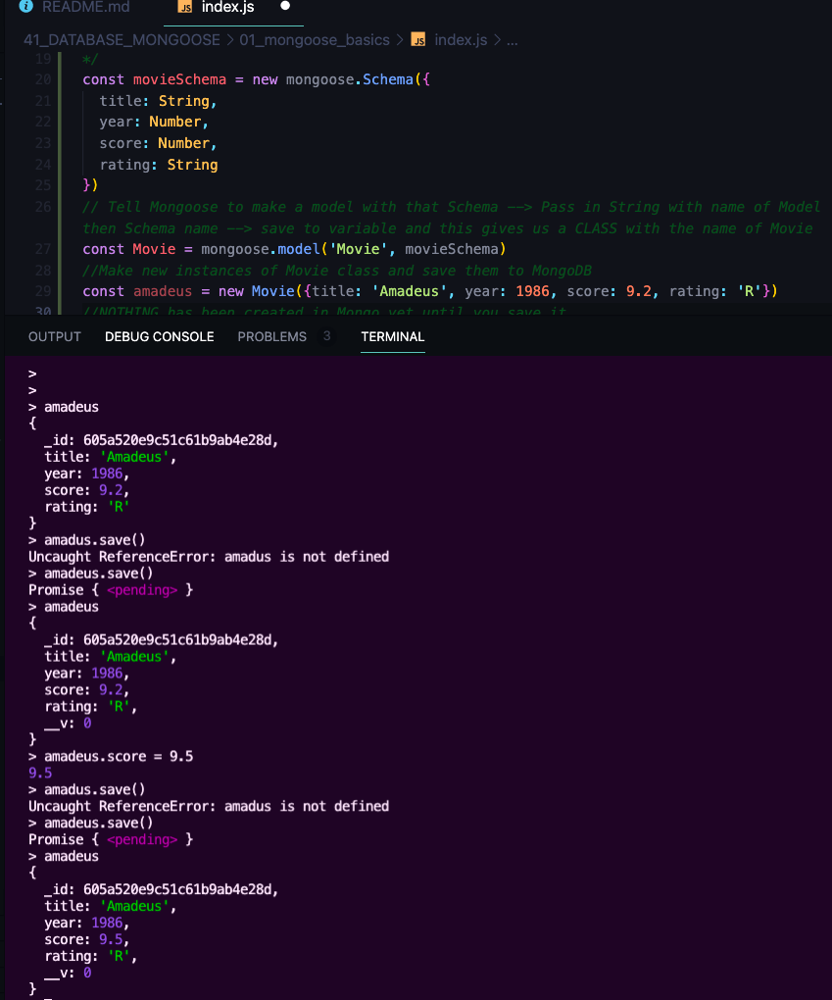

### Insert Many

```js
Movie.insertMany([
    { title: 'Amelie', year: 2001, score: 8.3, rating: 'R' },
    { title: 'Alien', year: 1979, score: 8.1, rating: 'R' },
    { title: 'The Iron Giant', year: 1999, score: 7.5, rating: 'PG' },
    { title: 'Stand By Me', year: 1986, score: 8.6, rating: 'R' },
    { title: 'Moonrise Kingdom', year: 2012, score: 7.3, rating: 'PG-13' }
])
  .then(data => {
    console.log("IT WORKED!");
    console.log(data);
  })
```

### Finding With Mongoose
* `Model.find()` - returns query object --> Treat like promises for error handling - are thenable objects
- `Movie.find({}).then(data => console.log(data))`
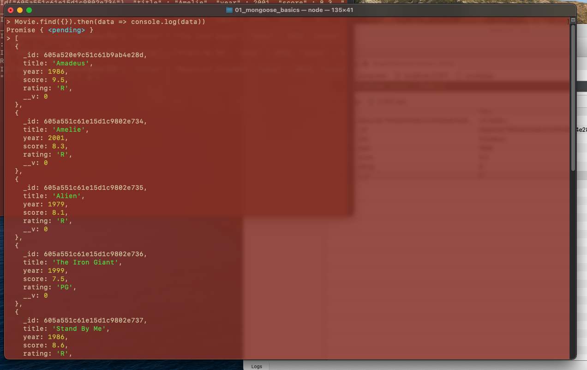
- `Movie.find({rating: 'PG-13'}).then(data => console.log(data))`
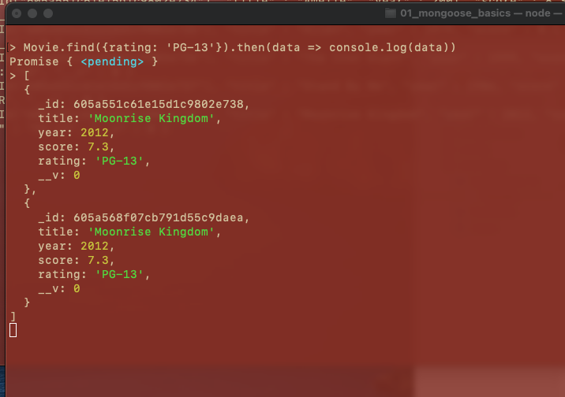
* `Model.findOne()`
- `Movie.findOne({}).then(m => console.log(m))` --> find's first instance
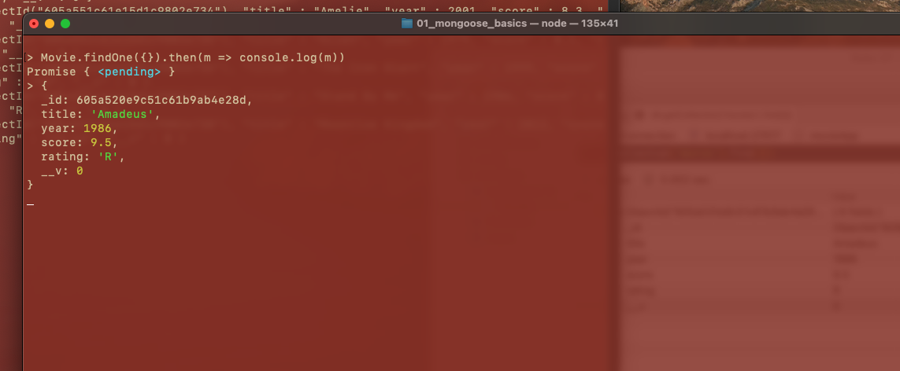
- When writing async functions we can use the `.exec` - turns into promise instead of thenable object
* `Model.findById()`
- `Movie.findById('605a520e9c51c61b9ab4e28d').then(m => console.log(m))`
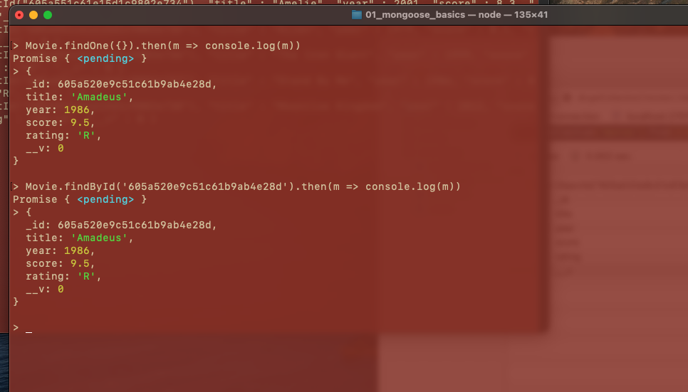

### Updating With Mongoose
- They do not return/resolve with the updated info - will show if it was updated or error but does not show data that was updated
* `Model.update()`
* `Model.updateOne()` : Match first thing that you find
- `Movie.updateOne({title: 'Amadeus'}, {year: 1984}).then(res => console.log(res))`
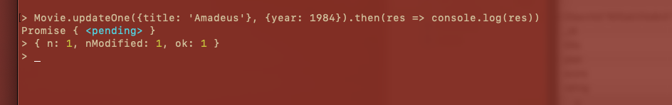
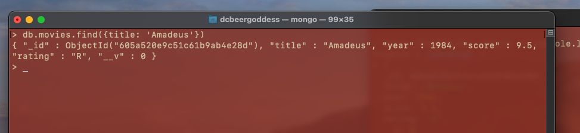
* `Model.updateMany()`
- Find in DB to test
- `db.movies.find({title: {$in: ['Amadeus', 'Stand By Me']}})`
- Update iin Mongoose
- `Movie.updateMany({title: {$in: ['Amadeus', 'Stand By Me']}}, {score: 10}).then(res => console.log(res))`
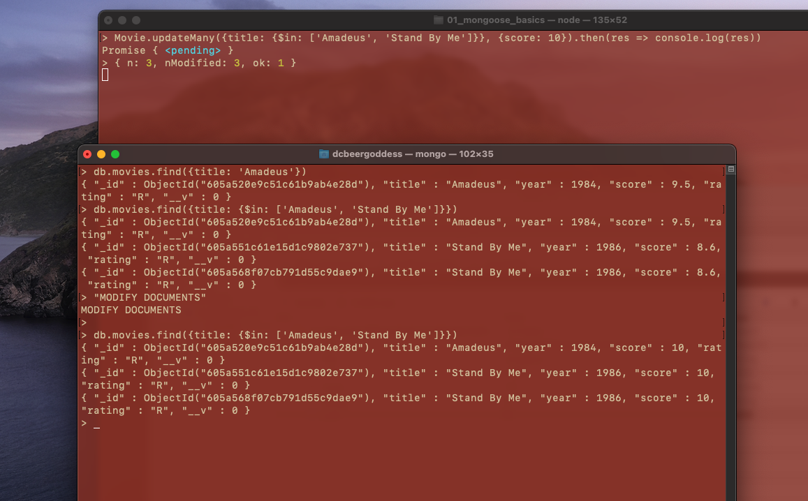
* `Model.findOneAndUpdate()`: find something based upon criteria and it will give us the object after the update is applied
- `Movie.findOneAndUpdate({title: 'The Iron Giant'}, {score: 7.0}).then(m => console.log(m))` --> returned old object without update
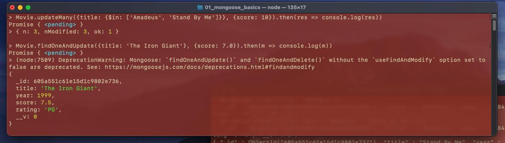
- need to specify option 
- `new: true` option: `Movie.findOneAndUpdate({title: 'The Iron Giant'}, {score: 7.0}, {new: true}).then(m => console.log(m))`
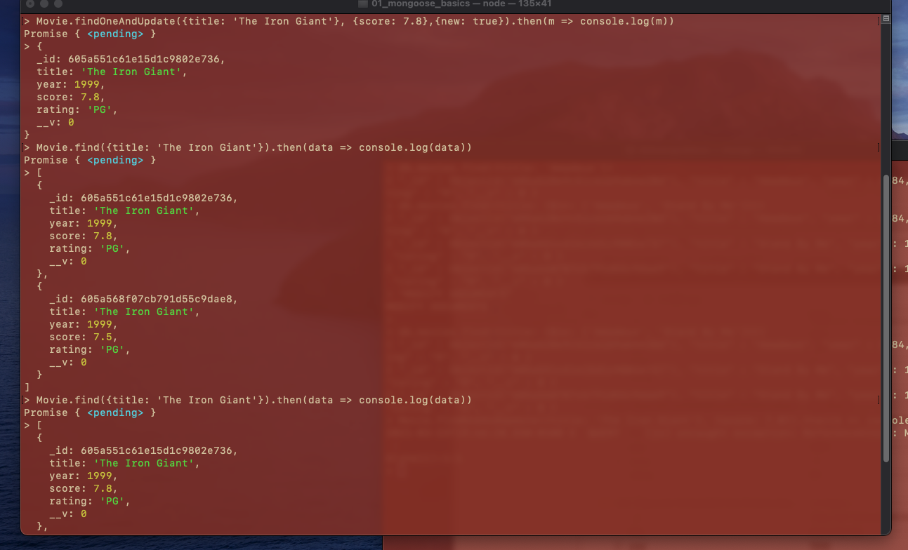

### Deleting With Mongoose
- Removes, but does not give data back to show what was deleted
* `Model.remove()`
- `Movie.remove({title: 'The Iron Giant'}).then(msg => console.log(msg))` | DELETED BOTH INSTANCES | DEPRECATION WARNING
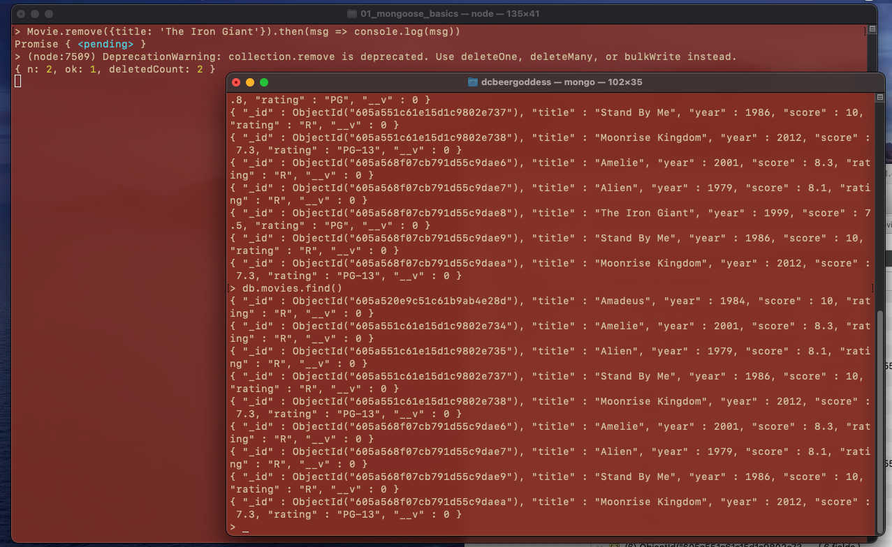

* `Model.deleteMany()` 
- after 1999 
- `Movie.deleteMany({year: {$gte: 1999}}).then(msg => console.log(msg))`
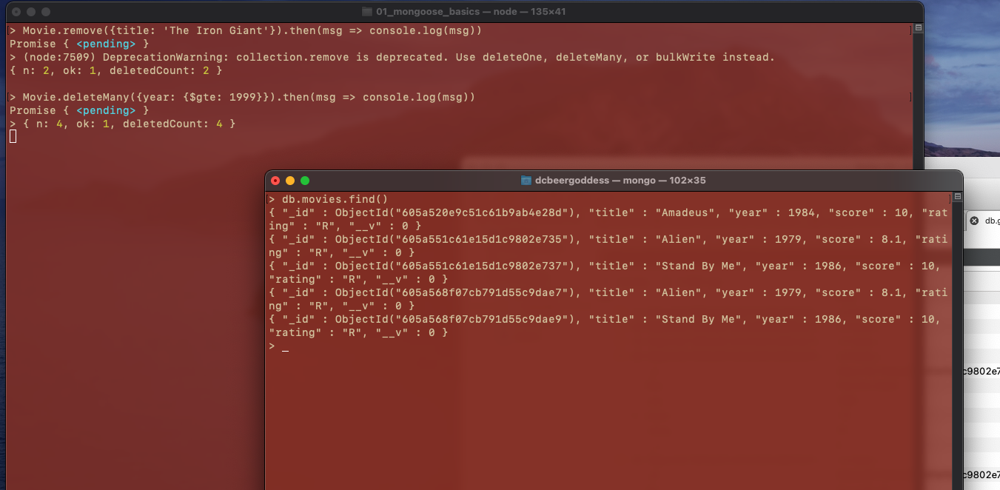
* `Model.findOneAndDelete()` or `Model.findByIdAndDelete` : get back what you are deleting
- `Movie.findOneAndDelete({title: 'Alien'}).then(m => console.log(m))`
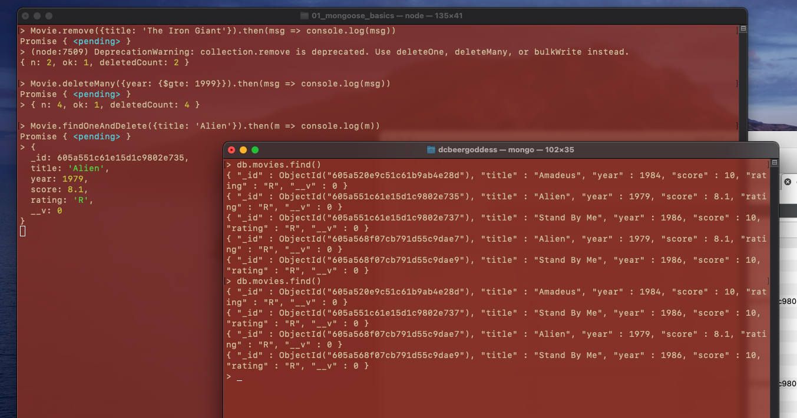

### Mongoose Schema Validations
- More you can do with the Schema
- required values
```js
const productSchema = new mongoose.Schema({
  name: {
    type: String,
    required: true
  },
  price: {
    type: Number
  }
});
```
```js
//CREATE A MODEL WITH SCHEMA
const Product = mongoose.model('Product', productSchema);

//CREATE PRODUCT
const bike =  new Product({name: 'Mountain Bike', price: 999, color: "red"});
bike.save()
  .then(data => {
    console.log("IT WORKED!")
    console.log(data)
  })
  .catch(e => {
    console.log("ON NO! ERROR!")
    console.log(e)
  });
```
### Additional Schema Constraints
- [SchemaType Options](https://mongoosejs.com/docs/schematypes.html#schematype-options)
- Declare certain options - i.e, `default` values
```js
const productSchema = new mongoose.Schema({
  name: {
    type: String,
    required: true
  },
  price: {
    type: Number,
    required: true
  },
  onSale: {
    type: Boolean,
    default: false
  }
})
```
- custom validators 
- Constraints for Strings (lowercase, uppercase, trim, min, max length) - packages that help with this, email, etc.
```js
const productSchema = new mongoose.Schema({
  name: {
    type: String,
    required: true,
    maxlength: 20,
  },
  price: {
    type: Number,
    required: true,
    min: 0
  },
  onSale: {
    type: Boolean,
    default: false
  }
})
```
- SET UP CATEGORIES - Array existing only of strings `categories: [String]`
```js
//CREATE PRODUCT
const bike =  new Product({name: 'Bike Helmet', price: 19.50, categories: ['Cycling', 'Safety', 123]});
bike.save()
  .then(data => {
    console.log("IT WORKED!")
    console.log(data)
  })
  .catch(e => {
    console.log("ON NO! ERROR!")
    console.log(e)
  });
```
- NESTED SUB DOCUMENTS
```js
  onSale: {
    type: Boolean,
    default: false
  },
  categories: {
    type: [String],
    default: ['cycling']
  }, 
  qty: {
    online: {
      type: Number,
      default: 0
    },
    inStore: {
      type: Number,
      default: 0
    }
  }
```
### Validating Mongoose Updates
- Products are being created but right now we can not update them with the validations, ORM, ODM --> when it's being updated you need to tell mongoose that you still want it to apply our validations
- `Product.findOneAndUpdate({name: 'Tire Pump'}, {price: -100}, {new: true, runValidators: true})`


### Mongoose Validation Errors

### Model Instance Methods

### Mongoose Virtuals

### Defining Mongoose Middleware