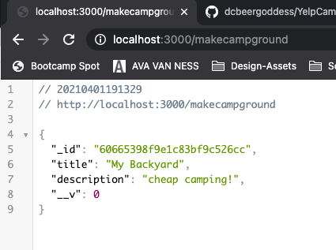

# INTRO TO YELP-CAMP

- [COLT's GITHUB CODE: FIRST SECTION](https://github.com/Colt/YelpCamp/tree/c12b6ca9576b48b579bc304f701ebb71d6f9879a)
- [MY GITHUB REPO: YelpCamp]()

## MY APP
### FIRST STEPS
* Create GitHub Repo
* Clone into Project File
* Create Basic Express App
* Set up VIEWS 

### CREATE MODEL
* Campground Model
* Create Schema
* `const Schema = mongoose.Schema;` = MAKE A SHORTCUT

* Connect to mongoose in `app.js` --> new from farmStand:
<hr>

```js
const express = require('express');
const path = require('path');
const mongoose = require('mongoose');

mongoose.connect('mongodb://localhost:27017/yelp-camp', {
  useNewUrlParser: true,
  useCreateIndex: true, 
  useUnifiedTopology: true
});

const db = mongoose.connection;
db.on('error', console.error.bind(console, 'connection error:'));
db.once('open', () => {
  console.log('Database Connected')
});

const app = express();
PORT = 3000

app.set('views', path.join(__dirname, 'views'));
app.set('view engine', 'ejs');

app.get('/', (req, res) => {
  res.render('home');
});


// END OF FILE
app.get('*', (req, res) => {
  res.send(`I DO NOT KNOW THAT PATH!!!!`)
})
app.listen(PORT, () => {
  console.log(`LISTENING ON http://localhost:${PORT}` )
}); 
```
<hr>

* Create HARD CODED Route to test Mongoose Connection
<hr>

```js
// HARD CODE ROUTE TO TEST Mongoose 
app.get('/makecampground', async (req, res) => {
  const camp = new Campground({ title: 'My Backyard', description: 'cheap camping!' });
  await camp.save();
  res.send(camp);
});
```

<hr>

### SEED DATA
- copied `cities.js` and `seedsHelper.js` into project into `seeds` directory
- created `index.js` in `seeds` directory - self-contained file to connect to mongoose and use my model.
* COPY OVER FROM `app.js`
<hr>

```js
const mongoose = require('mongoose');
const Campground = require('../models/campground')

mongoose.connect('mongodb://localhost:27017/yelp-camp', {
  useNewUrlParser: true,
  useCreateIndex: true, 
  useUnifiedTopology: true
})

const db = mongoose.connection;
db.on('error', console.error.bind(console, 'connection error:'));
db.once('open', () => {
  console.log('Database Connected')
});
```
<hr>

* START BY ERASING EVERYTHING IN DB and TEST:
```js
const seedDB = async () => {
    await Campground.deleteMany({});
    const c = new Campground({title: 'purple field'});
    await c.save();
}

seedDB();
```
* IN TERMINAL
1. `node seeds/index.js`
2. CHECK IN MONGO - `use yelp-camp` --> `db.campgrounds.find()`

* ADD LOGIC FOR SEED DATA - Require cities data in `seeds/index.js`
```js

```
* CREATE 50 RANDOM locations from `seeds/cities.js`
<hr>

```js
//CREATE 50 NEW CAMPGROUNDS
const seedDB = async () => {
    await Campground.deleteMany({});
    //CREATE LOOP FOR DATA - 50 times
    for(let i = 0; i < 50; i++){
        //random number to pick city[from 1000 city array]
        const random1000 = Math.floor(Math.random() * 1000);
        //make new Campground - location: city, state
        const camp = new Campground({
            location: `${cities[random1000].city}, ${cities[random1000].state}`
        });
        await camp.save()
    }
};

seedDB();
```
<hr>

* GIVE DATA NAME --> TITLE --> use places and descriptors from `seeds/seedsHelper.js` and import to `seeds/index.js`:
```js
const {places, descriptors} = require('./seedHelpers')
```
* Want pick random `place` and random `descriptor` and put them together
- PICK A RANDOM ELEMENT FROM ARRAY - `array[Math.floor(Math.random() * array.length)]` --> Add Logic to `seedDB`:
<hr>

```js
//GRAB RANDOM ELEMENT FROM AN ARRAY
const sample = array => array[Math.floor(Math.random() * array.length)];

const seedDB = async () => {
    await Campground.deleteMany({});
    //CREATE LOOP FOR DATA - 50 times - 50 cities
    for(let i = 0; i < 50; i++){
        //random number to pick city[from 1000 city array]
        const random1000 = Math.floor(Math.random() * 1000);
        //make new Campground - location: city, state
        const camp = new Campground({
            location: `${cities[random1000].city}, ${cities[random1000].state}`,
            title: `${sample(descriptors)} ${sample(places)}`
        });
        await camp.save()
    }
};

seedDB().then;
```
<hr>

* Make seed file connection close after file is seeded into DB
```js
//seedDB returns a promise because it is an async function .then--> close connection
seedDB().then(() => {
    mongoose.connection.close();
});
```

### Campground Index
- Create route to populate entire index of campgrounds
```js
//INDEX
app.get('/campgrounds', async (req, res) => {
  const campgrounds = await Campground.find({});
  res.render('campgrounds/index', { campgrounds });
});
```
- Create view to populate index titles to test
```html
  <ul>
    <% for( let campground of campgrounds ) { %>
    <li><%= campground.title %> </li>
    <% } %>
  </ul>
```


### Campground Show

### Campground New & Create

### Campground Edit & Update

### Campground Delete


