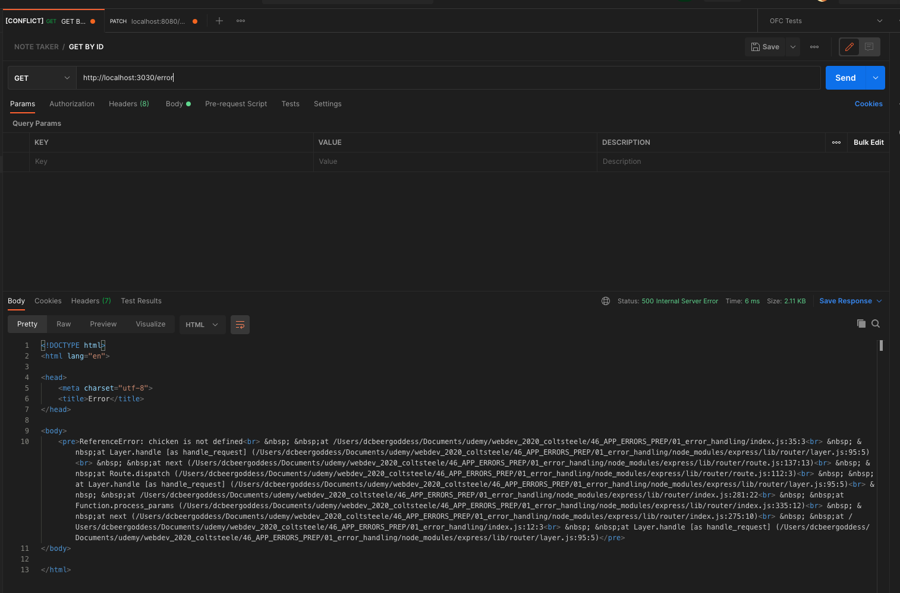
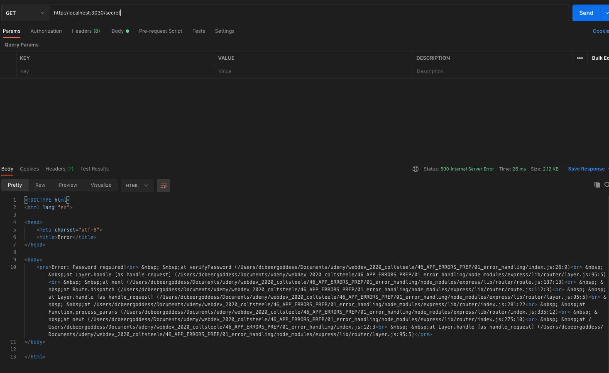

# Handling Errors in Express App

## Crucial 

### * Defining Custom Error Handlers
### * Handling Async Errors
### * Defining Custom Error Class

<br>

## Important 

### * Express' Built-In Handler
### * Working With Mongoose Errors

<br>

## Notes

<hr>

### Express' Built-In Error Handler
- [EXPRESS ERROR HANDLING DOCS](http://expressjs.com/en/guide/error-handling.html)
- REQUEST --> ERRORS --> RESPONSE
- Things will happen that break your code
- try to handle errors in a graceful way in express and have some control over what happens
- RIGHT NOW - default error handling - TEST IN POSTMAN 
```js
app.get('/error', (req, res) => {
  chicken.fly();
});
```
- POSTMAN TEST --> Get back HTML Response from Express:

- Create Wallpaper to Hide and to handle user errors
- Throw your own errors:
```js
const verifyPassword = ((req, res, next) => {
  const { password } = req.query;
  if(password === 'chickennugget'){
    next();
  }
  // res.send('Sorry you need a password')
  throw new Error('Password required!')
})
```
- Test in Postman:


### Defining Custom Error Handlers

### Our Custom Error Class 

### Handling Async Errors

### Defining An Async Utility

### Differentiating Mongoose Errors