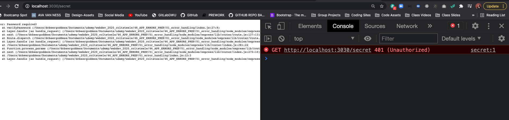

# Handling Errors in Express App

## Crucial 

### * Defining Custom Error Handlers
### * Handling Async Errors
### * Defining Custom Error Class

<br>

## Important 

### * Express' Built-In Handler
### * Working With Mongoose Errors

<br>

## Notes

<hr>

### Express' Built-In Error Handler
- [EXPRESS ERROR HANDLING DOCS](http://expressjs.com/en/guide/error-handling.html)
- REQUEST --> ERRORS --> RESPONSE
- Things will happen that break your code
- try to handle errors in a graceful way in express and have some control over what happens
- RIGHT NOW - default error handling - TEST IN POSTMAN 
```js
app.get('/error', (req, res) => {
  chicken.fly();
});
```
- POSTMAN TEST --> Get back HTML Response from Express:

- Create Wallpaper to Hide and to handle user errors
- Throw your own errors:
```js
const verifyPassword = ((req, res, next) => {
  const { password } = req.query;
  if(password === 'chickennugget'){
    next();
  }
  // res.send('Sorry you need a password')
  throw new Error('Password required!')
})
```
- Test in Postman:


### Defining Custom Error Handlers
- Writing Error handlers --> Express Docs
- Needs to have 4 arguments that will be passed into the error-handling middleware function `(err, req, res, next)`
- Put last in file after `app.use` or `app.get` before `app.listen`
```js
// ERROR HANDLING MIDDLEWARE FUNCTION
app.use((err, req, res, next) => {
  console.log('***************************')
  console.log('**********Error************')
  console.log('***************************')
})
```
- POSTMAN:

- CONSOLE:

<hr>

- ADD IN `res.status(500).send("message")`
```js
// ERROR HANDLING MIDDLEWARE FUNCTION
app.use((err, req, res, next) => {
  console.log('***************************')
  console.log('**********Error************')
  console.log('***************************')
  res.status(500).send("OH BOY, WE GOT AN ERROR!!!!")
})
```
- POSTMAN:

<hr>

- Using `next()`
```js
// ERROR HANDLING MIDDLEWARE FUNCTION
app.use((err, req, res, next) => {
  console.log('***************************')
  console.log('**********Error************')
  console.log('***************************')
  console.log(err)
  next();
})
```
- POSTMAN:

- CONSOLE:

<hr>

- need to pass `err` into `next(err)` --> will call next error handling middleware vs next() --> calls non error middleware next
```js
// ERROR HANDLING MIDDLEWARE FUNCTION
app.use((err, req, res, next) => {
  console.log('***************************')
  console.log('**********Error************')
  console.log('***************************')
  console.log(err);
  next(err); //hit built in error failure
})
```
- POSTMAN:

- CONSOLE:


### Our Custom Error Class
- Express gives you a lot of control --> no one way to handle errors
- [MDN HTTP STATUS CODES](https://developer.mozilla.org/en-US/docs/Web/HTTP/Status)

```js
const verifyPassword = ((req, res, next) => {
  const { password } = req.query;
  if(password === 'chickennugget'){
    next();
  }
  // res.send('Sorry you need a password')
  res.status(401)
  throw new Error('Password required!')
})
```


- Would have to write this a lot so instead throw some generic error 
- Instead: create new file `AppError.js`:
```js
class AppError extends Error {
  constructor(message, status){
    super();
    this.message = message;
    this.status = status;
  }
};

module.exports = AppError;
```
- require in `index.js`: `const AppError = require('./AppError');`:
```js
const verifyPassword = ((req, res, next) => {
  const { password } = req.query;
  if(password === 'chickennugget'){
    next();
  }
  throw new AppError('password required', 401);
});
```
- ON LOCALHOST SAME RESPONSE:


- When an error is written, the following information is added to the response:
* The res.statusCode is set from `err.status` (or `err.statusCode`). If this value is outside the 4xx or 5xx range, it will be set to 500.
* The res.statusMessage is set according to the status code.
* The body will be the HTML of the status code message when in production environment, otherwise will be `err.stack` --> errors have their own stack
* Any headers specified in an `err.headers` object.
- DESTRUCTURE `{ status }` from error stack:
```js
app.use((err, req, res, next) => {
  const { status } = err;
  res.status(status).send('ERRORRRR!!!!')
});
```
- ON LOCALHOST:


- will not work on `/error` because has not status code, it's a reference (syntax) error:

- give deconstructed `{status}` a default value
```js
app.use((err, req, res, next) => {
  const { status = 500 } = err;
  res.status(status).send('ERRORRRR!!!!')
});
```
- ON LOCALHOST:


- Very Simple way to set up Error Class where we can specify a message in a status, throw that from anywhere in our application with different status, different messages, and then have a  single handler that will take them. 
- Also use default values if we don't provide them and then send that status code back with that message
```js
app.use((err, req, res, next) => {
  const { status = 500, message = 'Something Went Wrong' } = err;
  res.status(status).send(message);
});
```
- ON LOCALHOST:


- `403 Forbidden`
- Make Fake admin route
```js
app.get('/admin', (req, res) => {
  throw new AppError('You are not an Admin', 403)
});
```
- ON LOCALHOST:


- Can Respond with stack trace in development mode

### Handling Async Errors

### Defining An Async Utility

### Differentiating Mongoose Errors