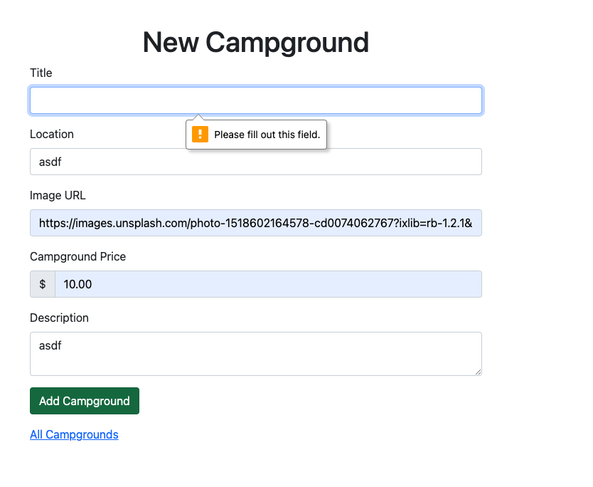
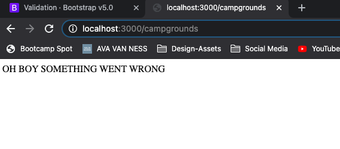
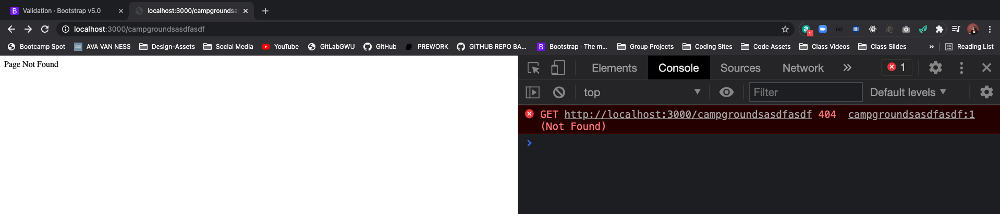
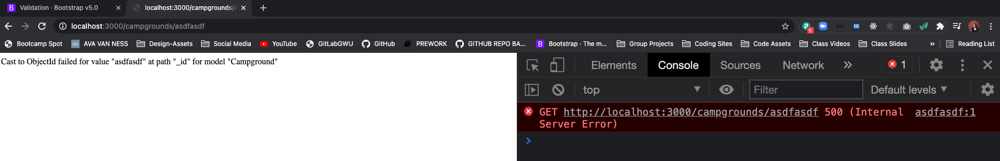
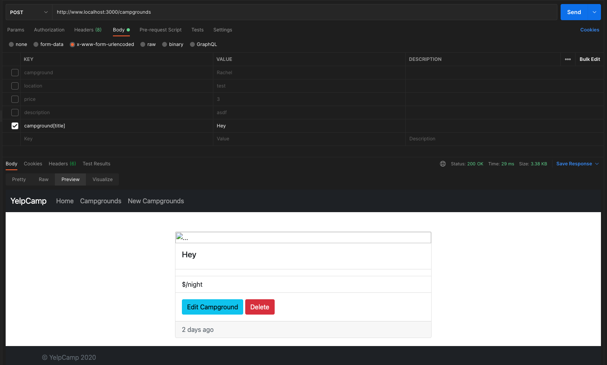
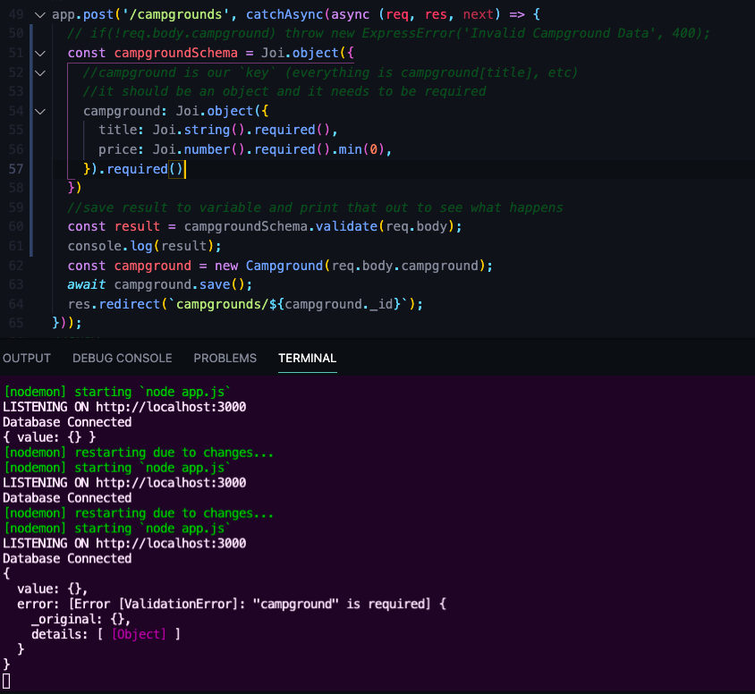
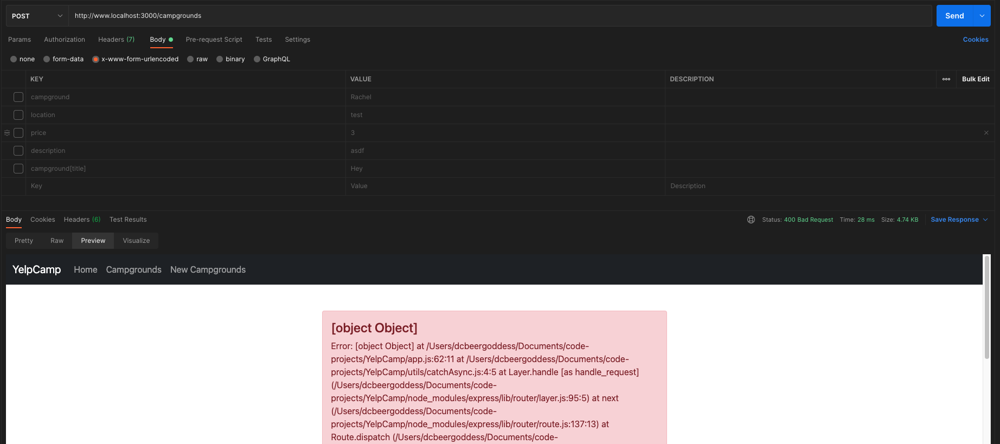
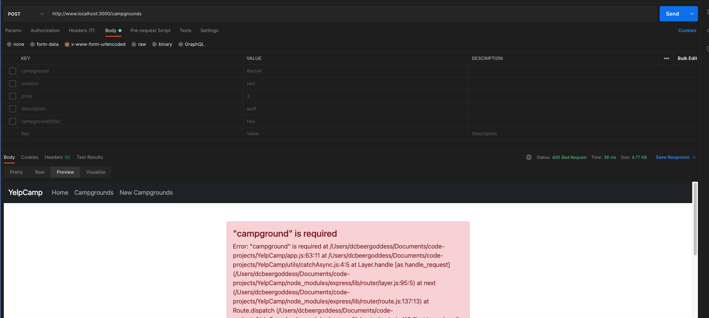

# YelpCamp: Errors & Validating Data
- [YelpCamp Github Code For Section](https://github.com/Colt/YelpCamp/tree/5f3b3ec478c5bb35f2773c2048409a9418c78b60
)
- Validations on Client Side - Forms, etc
- Server Side - validate `req.body` - Make sure they match a pattern before you send to Mongo Database

## Client-Side Form Validations
### Can Use HTML5 Validations and depend on browser to handle validations
- In `new.ejs`:
```html
  <h1 class="text-center">New Campground</h1>
  <!-- col-6 => don't want all the way to left => offset-3 -->
  <div class="col-6 offset-3">
    <form action="/campgrounds" method="POST">
      <div class="mb-3">
        <label class="form-label" for="title">Title</label>
        <input class="form-control" type="text" id="title" name="campground[title]" required>
```
- IN LOCALHOST:

- Not super attractive --> Depends on Browser --> Implementation is not standardized across browsers

### Built In Bootstrap5 Validation
- 
- Use `required` but tell browser not to validate --> `novalidate`
- `<form class="row g-3 needs-validation" novalidate>`
- BOOTSTRAP TAKES OVER INSTEAD
- THEN WE NEED TO ADD SOME JAVASCRIPT IN
```js
// Example starter JavaScript for disabling form submissions if there are invalid fields
(function () {
  'use strict'

  // Fetch all the forms we want to apply custom Bootstrap validation styles to
  var forms = document.querySelectorAll('.needs-validation')

  // Loop over them and prevent submission
  Array.prototype.slice.call(forms)
    .forEach(function (form) {
      form.addEventListener('submit', function (event) {
        if (!form.checkValidity()) {
          event.preventDefault()
          event.stopPropagation()
        }

        form.classList.add('was-validated')
      }, false)
    })
})()
```
- JS Prevents Form from Being Submitted if Validation fails --> will move to separate files but for now in script tag in `new.ejs`
```html
<script>
  // Example starter JavaScript for disabling form submissions if there are invalid fields
(function () {
  'use strict'

  // Fetch all the forms we want to apply custom Bootstrap validation styles to
  const forms = document.querySelectorAll('.validated-form')

  // Loop over them and prevent submission
  // Array.prototype.slice.call(forms)
  //NEW WAY
  Array.from(forms)
    .forEach(function (form) {
      form.addEventListener('submit', function (event) {
        if (!form.checkValidity()) {
          event.preventDefault()
          event.stopPropagation()
        }

        form.classList.add('was-validated')
      }, false)
    })
})()
</script>
```
- IN FORM:
```html
  <form action="/campgrounds" method="POST" novalidate class="validated-form">
      <div class="mb-3">
        <label class="form-label" for="title">Title</label>
        <input class="form-control" type="text" id="title" name="campground[title]" required>
```
- Add `valid feedback`
```html
<form class="row g-3 needs-validation" novalidate>
  <div class="col-md-4">
    <label for="validationCustom01" class="form-label">First name</label>
    <input type="text" class="form-control" id="validationCustom01" value="Mark" required>
    <div class="valid-feedback">
      Looks good!
    </div>
```
- TRANSFER JS CODE TO BOILERPLATE FOR NOW
- Change Edit Form for Bootstrap Validator
- [FIRST NEW FORM](01_new_form1/new.ejs)
- [SECOND NEW FORM](02_bootstrap_validate/new.ejs)
- [EDIT FORM](02_bootstrap_validate/edit.ejs)
- [BOILERPLATE FORM](02_bootstrap_validate/boilerplate.ejs)

## Basic Error Handler
- Error Handling in Express
- For Example we try to pass string to number, it gets stuck
- Set up our Own Error Handler in `app.js` - test with this -->
```js
app.use((err, req, res, next) => {
  res.send('OH BOY SOMETHING WENT WRONG')
});
```
- Test in POST new campground rent with try and catch
```js
//POST ROUTE
app.post('/campgrounds', async (req, res, next) => {
  try {
  const campground = new Campground(req.body.campground);
  await campground.save();
  res.redirect(`campgrounds/${campground._id}`);
  } catch(e) {
    next(e);
  }
});
```
- IN LOCALHOST:

- EVENTUALLY WE WILL WRITE LOGIC BUT NEED TO DEFINE OUR EXPRESS ERROR CLASS

## Defining ExpressError Class
- ExpressError Class --> asyncWrap
1. mkdir `utils` 
2. touch `ExpressError.js`
```js
//CLASS EXTENDS REGULAR BUILT IN ERROR
class ExpressError extends Error {
  constructor(message, statusCode){
    super();
    this.message = message;
    this.statusCode = statusCode;
  }
};

module.exports = ExpressError;
```
- Make file in `utils` to create function to `wrap async functions`
3. touch `catchAsync.js`
```js
//RETURN A FUNC THAT ACCEPTS A FUNC AND EXECUTES THAT FUNCTION BUT CATCHES ERROR AND PASSES IT TO NEXT
module.exports = func => {
  return (req, res, next) => {
    func(req, res, next).catch(next)
  }
};
```
4. in `app.js` --> `const catchAsync = require('./utils/catchAsync')`
5. FOR ASYNC ROUTES:
```js
//POST ROUTE
app.post('/campgrounds', catchAsync(async (req, res, next) => {
  const campground = new Campground(req.body.campground);
  await campground.save();
  res.redirect(`campgrounds/${campground._id}`);
}));
```
- NOW WE GET BACK THE `OH BOY SOMETHING WENT WRONG` in the browser when attempt to add price as string to database and the server does not crash
6. Wrap around all async routes

## More Errors
- ExpressError Class --> set up 404 -->request a URL WE DON'T HAVE SET UP
```js
app.all('*'), (req, res, next) => {
  res.send("404!!!!")
}
```
- use ExpressError class
- require in `app.js` --> `const ExpressError = require('./utils/ExpressError')`
- Use in all routes handler by passing into next and in generic error handler
```js
//BASIC ERROR HANDLERS
app.all('*'), (req, res, next) => {
  next( newExpressError('Page Not Found', 404));
  //this will pass it on the next function `app.use`
};

app.use((err, req, res, next) => {
  const { statusCode = 500, message = 'Something went wrong' } = err;
  res.status(statusCode).send(message);
});
```
- IN LOCALHOST:
* our custom 404 Error:

* sending mongo error as is --> our 500 statusCode:


- Can still make a request through POSTMAN or AJAX and send data that is not right
- IF YOU DON'T INCLUDE THINGS --> PUT IN ROUTE
```js
//POST ROUTE
app.post('/campgrounds', catchAsync(async (req, res, next) => {
  if(!req.body.campground) throw new ExpressError('Invalid Campground Data', 400);
  const campground = new Campground(req.body.campground);
  await campground.save();
  res.redirect(`campgrounds/${campground._id}`);
}));
```

## Defining Error Template
1. touch `views/error.ejs`
- EXAMPLE BOOTSTRAP ALERT FROM DOCS:
```html
<div class="alert alert-success" role="alert">
  <h4 class="alert-heading">Well done!</h4>
  <p>Aww yeah, you successfully read this important alert message. This example text is going to run a bit longer so that you can see how spacing within an alert works with this kind of content.</p>
  <hr>
  <p class="mb-0">Whenever you need to, be sure to use margin utilities to keep things nice and tidy.</p>
</div>
```
2. in `app.use` error middleware --> res.render --> error.ejs --> now shows up for any error
```js
app.use((err, req, res, next) => {
  const { statusCode = 500, message = 'Something went wrong' } = err;
  res.status(statusCode).render(`error`);
});
```
3. Style Error in `error.ejs` --> smaller in bootstrap grid
```html
<% layout('layouts/boilerplate') %> 
<!-- FROM BOOTSTRAP ALERT DOCS -->
<div class="row">
  <div class="col-6 offset-3">
    <div class="alert alert-danger" role="alert">
      <h4 class="alert-heading">Error!</h4>
      <p>Aww yeah, you successfully read this important alert message. This example text is going to run a bit longer so that you can see how spacing within an alert works with this kind of content.</p>
      <hr>
      <p class="mb-0">Whenever you need to, be sure to use margin utilities to keep things nice and tidy.</p>
    </div>
  </div>
</div>

```
4. update to use message we have on error and display error stack for development --> pass entire error to template --> default message is not going to work anymore to update error object
```js
app.use((err, req, res, next) => {
  const { statusCode = 500 } = err;
  if(!err.message) err.message = 'Oh No, Something went Wrong';
  res.status(statusCode).render(`error`, { err });
});
```
```html
<% layout('layouts/boilerplate') %> 
<!-- FROM BOOTSTRAP ALERT DOCS -->
<div class="row">
  <div class="col-6 offset-3">
    <div class="alert alert-danger" role="alert">
      <h4 class="alert-heading"><%= err.message %></h4>
      <!-- FOR DEVELOPMENT PURPOSES -->
        <p><%= err.stack %></p> 
    </div>
  </div>
</div>
```
- WE STILL NEED TO PREVENT PEOPLE (EITHER ILL INTENTIONED OR NOT) FROM POST TO SITE VIA POSTMAN WITH BAD DATA

## JOI Schema Validations
- [JOI DOCS](https://joi.dev/api/?v=17.2.1)
- Validate Data with Update and Post Campgrounds
- You can put in logic individually --> does not scale well with larger models --> USE `JOI` --> DATA VALIDATOR
- Define a schema for data in JavaScript --> our schema will be for req.body --> validate --> can make sure that campground is there as an object with all data validations
1. in terminal `npm i joi` 
2. in `app.js` --> `const Joi = require('joi');`
3. Define Schema --> to start in `post` route --> NOT A MONGOOSE SCHEMA --> Validates Data before attempting to save to mongoose --> campground is our `key`, i.e everything is `campground[title]`, `campground[price]`, etc.
```js
//POST ROUTE
app.post('/campgrounds', catchAsync(async (req, res, next) => {
  // if(!req.body.campground) throw new ExpressError('Invalid Campground Data', 400);
  const campgroundSchema = Joi.object({
    //campground is our `key` (everything is campground[title], etc)
    //it should be an object and it needs to be required
    campground: Joi.object({
      title: Joi.string().required(),
      price: Joi.number().required().min(0),
    }).required()
  })
  //save result to variable and print that out to see what happens
  const result = campgroundSchema.validate(req.body);
  console.log(result);
  const campground = new Campground(req.body.campground);
  await campground.save();
  res.redirect(`campgrounds/${campground._id}`);
}));
```
- IN CONSOLE AFTER TESTING IN POSTMAN:

- Throw Express Error to pass error down to our middleware error handling
```js
//POST ROUTE
app.post('/campgrounds', catchAsync(async (req, res, next) => {
  // if(!req.body.campground) throw new ExpressError('Invalid Campground Data', 400);
  const campgroundSchema = Joi.object({
    //campground is our `key` (everything is campground[title], etc)
    //it should be an object and it needs to be required
    campground: Joi.object({
      title: Joi.string().required(),
      price: Joi.number().required().min(0),
    }).required()
  })
  //save result to variable and print that out to see what happens
  const result = campgroundSchema.validate(req.body);
  if(result.error){
    throw new ExpressError(result.error.details, 400)
  }
  console.log(result);
  const campground = new Campground(req.body.campground);
  await campground.save();
  res.redirect(`campgrounds/${campground._id}`);
}));
```
- `result.error.details` --> right now prints out as array

- destructure to only grab error portion
- map over error.details - join them if there is more than one message in the array
```js
//POST ROUTE
app.post('/campgrounds', catchAsync(async (req, res, next) => {
  // if(!req.body.campground) throw new ExpressError('Invalid Campground Data', 400);
  const campgroundSchema = Joi.object({
    //campground is our `key` (everything is campground[title], etc)
    //it should be an object and it needs to be required
    campground: Joi.object({
      title: Joi.string().required(),
      price: Joi.number().required().min(0),
      image: Joi.string().required(),
      location: Joi.string().required(),
      description: Joi.string().required()
    }).required()
  })
  //save result to variable and print that out to see what happens
  const { error } = campgroundSchema.validate(req.body);
  if(error){
    const msg = error.details.map(el => el.message).join(',')
    throw new ExpressError(msg, 400)
  }
  const campground = new Campground(req.body.campground);
  await campground.save();
  res.redirect(`campgrounds/${campground._id}`);
}));
```


## JOI Validation Middleware