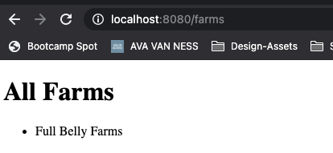
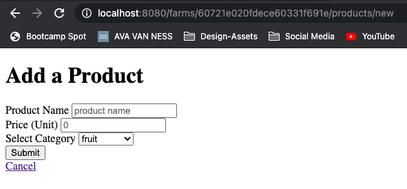
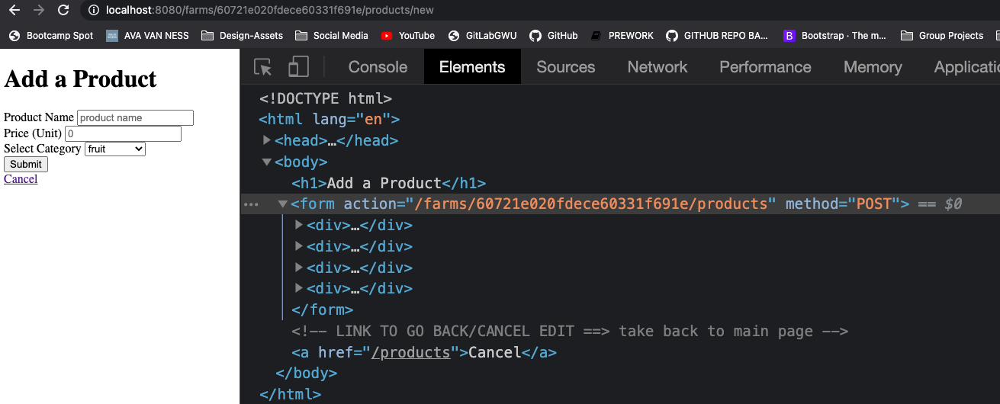
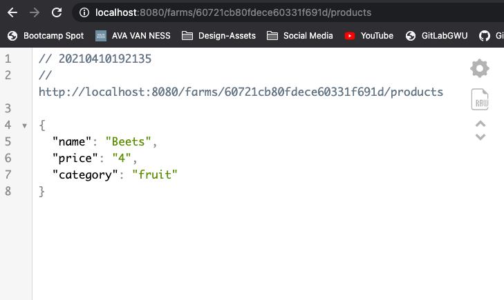
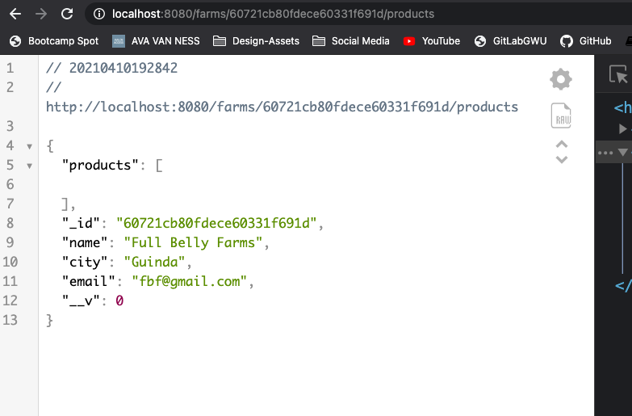
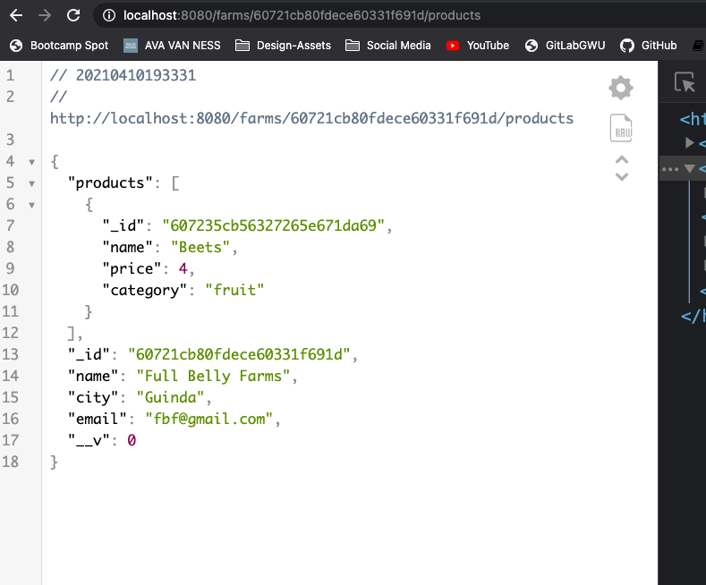
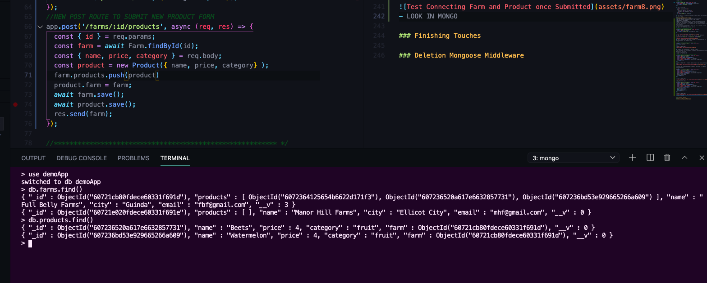
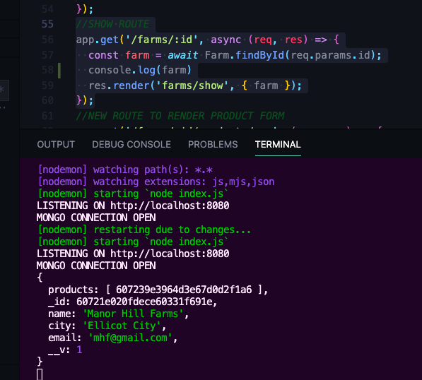
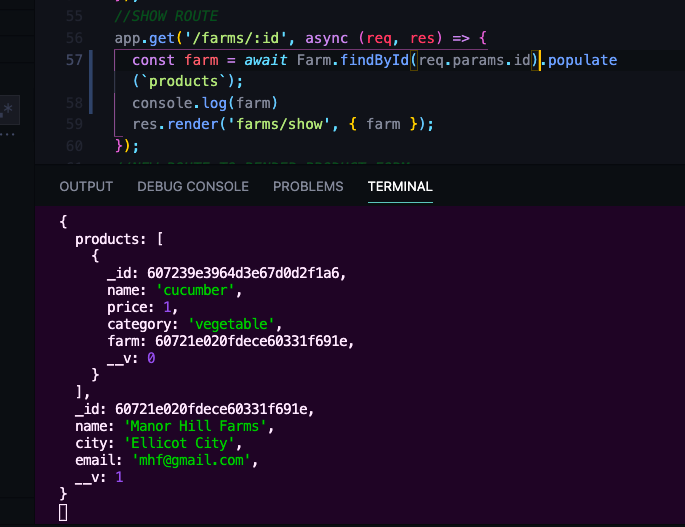
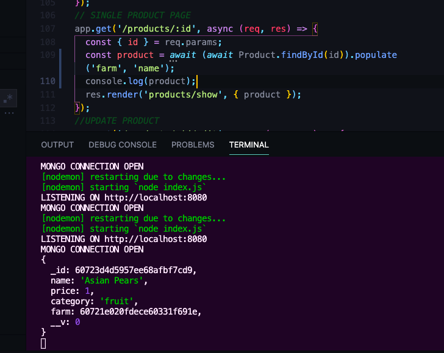

# Mongo Relationships w/ Express

## Crucial 

### * Deleting with Mongo Middleware

<br>

## Important 

### * Defining Our Farm & Product
### * Creating Farms
### * Farms Show Page

<br>

## Notes
- WORK WITH TWO MODELS IN AN EXPRESS APP:
1. Farm
2. Product

<hr>

### Defining Our Farm & Product Models
- Work from Farm Stand App Created in section `42_DATABASE_EXPRESS_MONGOOSE`
- We want each product to be associated with a farm
- Dashboard for someone who runs the farm stand
- Define farm model
- How do we want to connect farm to product --> One to Many --> How to access and plan to use data
- Don't want to embed products in the farm, you want to be able to see all products on a page
- PRIMARY FUNCTION TO VIEW ALL PRODUCTS
- 1. could put products array of ObjectsIds in farm
- 2. or set farm ID on each product
- Would be name to see name of farm on show page for product
- LETS SET UP TWO WAY RELATIONSHIP
- ON PRODUCT MODEL:
```js
const productSchema = new Schema({
  name: {
    type: String,
    required: true
  },
  price: {
    type: Number,
    require: true,
    min: [0, 'NO NEGATIVE PRICES!!!']
  },
  category: {
    type: String,
    lowercase: true,
    enum: ['fruit', 'vegetable', 'dairy']
  },
  farm: {
    type: Schema.Types.ObjectId,
    ref: 'Farm'
  }
});
```
- ON FARM MODEL: 
```js
const farmSchema = new Schema({
  name: {
    type: String,
    required: [true, 'Farm must have a name!']
  },
  city: {
    type: String
  },
  email: {
    type: String,
    required: [true, 'Email required']
  },
  products: [
    {
      type: Schema.Types.ObjectId,
      ref: 'Product'
    }
  ]
});
```

- MAKE SURE TO HAVE THS AT END OF MODELS TO USE IN OTHER PARTS:
```js
const Farm = mongoose.model('Farm', farmSchema);
 
module.exports = Farm;
```
### Creating New Farms
- Render new Form to make farm - get request 
- Soon we will learn to move all the routes so `index.js` file isn't so cluttered using **EXPRESS ROUTER**
- JUST RENDERING FORM DOES NOT NEED TO BE ASYNC
```js
app.get('/farms/new', (req, res) => {
  res.render('farms/new')
});
```
- Create form like product form in `farms` directory under `views`: `new.ejs`
- Create route to post data from form submission for adding a new farm --> `res.send(req.body)` to test data submission first:
```js
app.post('/farms', async (req, res) => {
  res.send(req.body);
});
```
- IN LOCAL HOST:

- Now Instantiate and Save a new farm
- import model
- save farm (no validation or error handling in this app)
- make index route 
```js
//Index Page for Farms
app.get('/farms', async (req, res) => {
  const farms = await Farm.find({});
  res.render('farms/index', { farms });
});
```
- SET UP Quick EJS to test that it's working
```html
  <h1>All Farms</h1>

  <ul>
    <% for( let farm of farms ) { %>
      <li><%= farm.name %></li>
  
    <% } %>
  </ul>
```
- Post Data From Form --> redirect to index
```js
//Post Data from Add Farm Form
app.post('/farms', async (req, res) => {
  const farm = new Farm(req.body) //NO VALIDATION FOR NOW
  await farm.save(); //Typically have form of error handler
  res.redirect('/farms');
});
```
- Create Farm and Test


### Farms Show Page
- Make new product and associate it with a farm
1. set up show page for farms
- SHOW ROUTE
```js
//SHOW ROUTE
app.get('/farms/:id', async (req, res) => {
  const farm = await Farm.findById(req.params.id);
  res.render('farm/show', { farm })
});
```
2. Set Up Show Page
```html
  <h1><%= farm.name %></h1>
  <ul>
    <li>City: <%= farm.city %></li>
    <li>Email: <%= farm.email %></li>
  </ul>
  <a href="/farms">All Farms</a>
```
3. What Pattern to Structure Route and Create Product and Associate it with a Farm

### Creating Products for A Farm
- Create new products associated with a particular farm
- On Show Page for Farm have a link to add product
- Add Product through Farm
- Need to create routes like this `/farms/:farm_id/products/new`
- Then send post request to this path `/farms/:farm_id/products`
- We want that farm id --> we need to know what farm the product is associated with
- with products all you need is id to find all so no need for this `/farms/:farm_id/products/:id"
1. define new route that gives us the form
```js
//NEW ROUTE TO RENDER PRODUCT FORM
app.get('/farms/:id/products/new', (req, res) => {
  const { id } = req.params;
  res.render('products/new', { categories, id });
})
```

2. add `id` into NEW FORM `action` on `new.ejs` for `products` 
```html
<form action="/farms/<%= id %>/products" method="POST">
```

3. Now we need to make that route to `POST` --> test that data is being sent with `res.send(req.body)`
```js
//NEW POST ROUTE TO SUBMIT NEW PRODUCT FORM
app.post('/farms/:id/products', async (req, res) => {
  res.send(req.body)
});
```
- TEST IN LOCAL HOST:


4. mongoose and relationships - make new product 
- we associated farm with product already in model and have array of products on each farm
- look up farm using id
- send farm back to test
```js
//NEW POST ROUTE TO SUBMIT NEW PRODUCT FORM
app.post('/farms/:id/products', async (req, res) => {
  const { id } = req.params;
  const farm = await Farm.findById(id);
  const { name, price, category } = req.body;
  const product = new Product({ name, price, category} );
  res.send(farm);
});
```
- TEST IN LOCAL HOST | Products empty array --> not saving anything yet:


- connect the product and farm --> push to farm array --> add farm found to product
```js
app.post('/farms/:id/products', async (req, res) => {
  const { id } = req.params;
  const farm = await Farm.findById(id);
  const { name, price, category } = req.body;
  const product = new Product({ name, price, category} );
  farm.products.push(product)
  product.farm = farm;
  res.send(farm);
});
```
- TEST IN LOCAL HOST:


- Now WE GET TO SAVE:
```js
app.post('/farms/:id/products', async (req, res) => {
  const { id } = req.params;
  const farm = await Farm.findById(id);
  const { name, price, category } = req.body;
  const product = new Product({ name, price, category} );
  farm.products.push(product)
  product.farm = farm;
  await farm.save();
  await product.save();
  res.send(farm);
});
```
- TEST IN LOCAL HOST:

- LOOK IN MONGO:


### Finishing Touches
- Redirect after new product added 
```js
res.redirect(`/farms/${farm._id}`); //could use just {id} here
```
- Create Link in Farm Show Page
```html
<a href="/farms/<%=farm._id%>/products/new">Add Product</a>
```
- Show all Products on a Single Farm
- Test Data Structure in route first
```js
//SHOW ROUTE
app.get('/farms/:id', async (req, res) => {
  const farm = await Farm.findById(req.params.id);
  console.log(farm)
  res.render('farms/show', { farm });
});
```
- you don't get all the fancy stuff with product just the id:

- Need to update route and populate product to show info
```js
//SHOW ROUTE
app.get('/farms/:id', async (req, res) => {
  const farm = await Farm.findById(req.params.id).populate(`products`);
  console.log(farm)
  res.render('farms/show', { farm });
});
```
- TEST IN CONSOLE:


- Add Product Data into EJS show template --> needs to be farm.products --> object structure from last photo
```html
  <h1><%= farm.name %></h1>
  <ul>
    <li>City: <%= farm.city %></li>
    <li>Email: <%= farm.email %></li>
  </ul>
  <h2>Products</h2>
  <ul>
    <% for( let product of farm.products ) { %>
      <li><%= product.name %> </li>
    <% } %>
  </ul>
```
- Add Farm Name into Add Product Page
- In New Route for Products on a Farm:
```js
//NEW ROUTE TO RENDER PRODUCT FORM
app.get('/farms/:id/products/new', async (req, res) => {
  const { id } = req.params;
  const farm = await Farm.findById(id);
  res.render('products/new', { categories, farm });
});
```
- Then in EJS for new product --> Add Farm Name and Update form `action`:
```html
  <h1><%= farm.name %></h1>
  <h2>Add a Product</h2>
  <form action="/farms/<%=farm._id%>/products" method="POST">
    <div>
      <label for="name">Product Name</label>
      <input type="text" name="name" id="name" placeholder="product name">
    </div>
```
- add link to go back to form on new product form
```html
      </select>
    </div>
    <div>
      <button>Submit</button>
    </div>
  </form>

  <!-- LINK TO GO BACK/CANCEL EDIT ==> take back to main page -->
  <a href="/farms/<%= farm._id %>">Back To Farm</a>
```
- Make link to go to show page for specific project in the show page for the farm
```html
  <h1><%= farm.name %></h1>
  <ul>
    <li>City: <%= farm.city %></li>
    <li>Email: <%= farm.email %></li>
  </ul>
  <h2>Products</h2>
  <ul>
    <% for( let product of farm.products ) { %>
      <li><a href="/products/<%= product._id%>"><%= product.name%></a></li>
    <% } %>
  </ul>
  <a href="/farms/<%=farm._id%>/products/new">Add Product</a>
  <a href="/farms">All Farms</a>
```
- NEED To Think about when do you need the information that you will need in a route when it comes to `id`'s --> need to have unique names if you are going to have multiple ids in one path --> 
`/posts/:postId/comments/:commentId`
- Populate the Farm Field on our Product Show Page
```js
// SINGLE PRODUCT PAGE
app.get('/products/:id', async (req, res) => {
  const { id } = req.params;
  const product = await Product.findById(id).populate('farm', 'name');
  console.log(product);
  res.render('products/show', { product });
});
```
- TEST IN CONSOLE: 

- Make Link to view Farm in Product Show page
```html
  <h1><%= product.name %></h1>
  <ul>
    <li>Price: $<%= product.price %></li>
    <li>Category: <a href="/products?category=<%=product.category%>"><%= product.category %></a></li>
    <li>Farm: <a href="/farms/<%= product.farm._id %> "><%= product.farm.name %></a></li>
  </ul>
```
### Deletion Mongoose Middleware