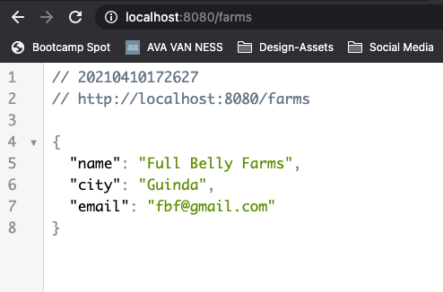

# Mongo Relationships w/ Express

## Crucial 

### * Deleting with Mongo Middleware

<br>

## Important 

### * Defining Our Farm & Product
### * Creating Farms
### * Farms Show Page

<br>

## Notes
- WORK WITH TWO MODELS IN AN EXPRESS APP:
1. Farm
2. Product

<hr>

### Defining Our Farm & Product Models
- Work from Farm Stand App Created in section `42_DATABASE_EXPRESS_MONGOOSE`
- We want each product to be associated with a farm
- Dashboard for someone who runs the farm stand
- Define farm model
- How do we want to connect farm to product --> One to Many --> How to access and plan to use data
- Don't want to embed products in the farm, you want to be able to see all products on a page
- PRIMARY FUNCTION TO VIEW ALL PRODUCTS
- 1. could put products array of ObjectsIds in farm
- 2. or set farm ID on each product
- Would be name to see name of farm on show page for product
- LETS SET UP TWO WAY RELATIONSHIP
- ON PRODUCT MODEL:
```js
const productSchema = new Schema({
  name: {
    type: String,
    required: true
  },
  price: {
    type: Number,
    require: true,
    min: [0, 'NO NEGATIVE PRICES!!!']
  },
  category: {
    type: String,
    lowercase: true,
    enum: ['fruit', 'vegetable', 'dairy']
  },
  farm: {
    type: Schema.Types.ObjectId,
    ref: 'Farm'
  }
});
```
- ON FARM MODEL: 
```js
const farmSchema = new Schema({
  name: {
    type: String,
    required: [true, 'Farm must have a name!']
  },
  city: {
    type: String
  },
  email: {
    type: String,
    required: [true, 'Email required']
  },
  products: [
    {
      type: Schema.Types.ObjectId,
      ref: 'Product'
    }
  ]
});
```

- MAKE SURE TO HAVE THS AT END OF MODELS TO USE IN OTHER PARTS:
```js
const Farm = mongoose.model('Farm', farmSchema);
 
module.exports = Farm;
```
### Creating New Farms
- Render new Form to make farm - get request 
- Soon we will learn to move all the routes so `index.js` file isn't so cluttered using **EXPRESS ROUTER**
- JUST RENDERING FORM DOES NOT NEED TO BE ASYNC
```js
app.get('/farms/new', (req, res) => {
  res.render('farms/new')
});
```
- Create form like product form in `farms` directory under `views`: `new.ejs`
- Create route to post data from form submission for adding a new farm --> `res.send(req.body)` to test data submission first:
```js
app.post('/farms', async (req, res) => {
  res.send(req.body);
});
```
- IN LOCAL HOST:

- Now Instantiate and Save a new farm
- import model
- save farm (no validation or error handling in this app)
- make index route 
```js
//Index Page for Farms
app.get('/farms', async (req, res) => {
  const farms = await Farm.find({});
  res.render('farms/index', { farms });
});
```
- SET UP Quick EJS to test that it's working
```html
  <h1>All Farms</h1>

  <ul>
    <% for( let farm of farms ) { %>
      <li><%= farm.name %></li>
  
    <% } %>
  </ul>
```
- Post Data From Form --> redirect to index
```js
//Post Data from Add Farm Form
app.post('/farms', async (req, res) => {
  const farm = new Farm(req.body) //NO VALIDATION FOR NOW
  await farm.save(); //Typically have form of error handler
  res.redirect('/farms');
});
```
- Create Farm and Test


### Farms Show Page
- Make new product and associate it with a farm
1. set up show page for farms
- SHOW ROUTE
```js
//SHOW ROUTE
app.get('farms/:id', async (req, res) => {
  const farm = await Farm.findById(req.params.id);
  res.render('farm/show', { farm })
});
```
2. Set Up Show Page
```html
  <h1><%= farm.name %></h1>
  <ul>
    <li>City: <%= farm.city %></li>
    <li>Email: <%= farm.email %></li>
  </ul>
  <a href="/farms">All Farms</a>
```
3. What Pattern to Structure Route and Create Product and Associate it with a Farm

### Creating Products for A Farm

### Finishing Touches

### Deletion Mongoose Middleware