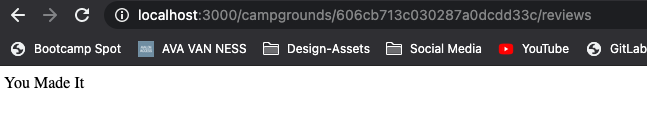
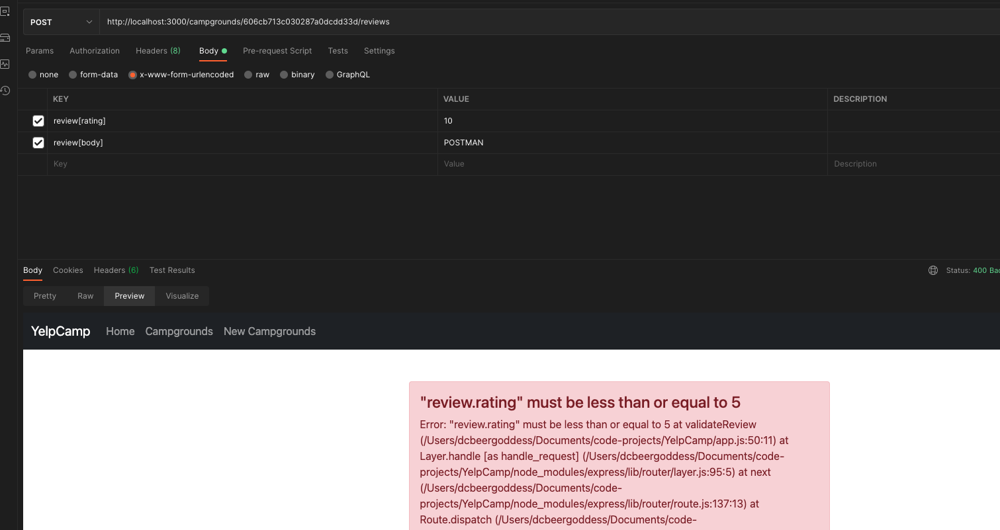
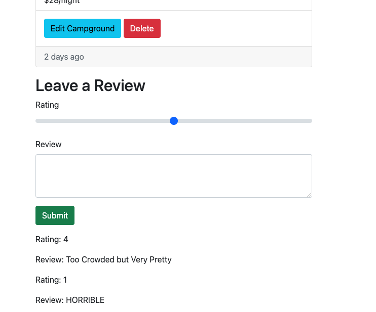

# YelpCamp: Adding The Reviews Model
- [Colt's Github Code for This Section](https://github.com/Colt/YelpCamp/tree/6a78de4041b853f65d681cf77784db637384f432)

## Defining The Review Model
- Review Model - Numeric Rating and Text
1. Create Model: `models/review.js`
```js
//Create Schema
const reviewSchema = new Schema({
  body: String, //TEXT
  rating: Number //probably 1-5
});
```
2. Connect Review w/ Campground --> One to Many Relationship | What Implementation?
* We Will Embed an array of ObjectId's in Each Campground --> potential to have thousands of reviews
3. Update Campground Schema:
```js
  description: String,
  location: String,
  reviews: [
    {
      type: Schema.Types.ObjectId,
      ref: 'Review'
    }
  ]
```

## Adding the Review Form
- Add Form to Make New Review --> Make Review in Context of Individual Campground 
1. Add Form on `views/campground/show.ejs` --> Nothing Fancy yet :) --> inside col on card
* FOR LABEL: `class="form-label"` --> bootstrap
* FOR TEXT-AREA: `class="form-control"` --> bootstrap
* FOR RANGE INPUT: `class="form-range"` --> bootstrap
```html
    <h2>Leave a Review</h2>
    <form action="">
      <div class="mb-3">
        <label class="form-label" for="rating">Rating</label>
        <input class="form-range" type="range" min="1" max="5" name="review[rating] "id="rating">
      </div>
      <div class="mb-3">
        <label class="form-label" for="body">Review</label>
        <textarea class="form-control" name="review[body]" id="body" cols="30" rows="3"></textarea>
      </div>
      <div class="mb-3">
        <button class="btn btn-success">Submit</button>
      </div>
    </form>
```
## Creating Reviews
- Need to Know Campground it is Associated With --> Include Campground ID in the path (NESTED ROUTE) --> `POST /campground/:id/reviews`
- WE DO NOT NEED FULL `RESTful` ROUTES for Reviews --> Just look at all reviews for a single campground --> NEED THAT ID
1. CREATE POST ROUTE && TEST:
```js
//POST REVIEW TO CAMPGROUND ROUTE
app.post('/campgrounds/:id/reviews', catchAsync(async (req, res) => {
  res.send('You Made It');
}));
```
* SET UP FORM TO TEST SUBMIT:
```html
  <h2>Leave a Review</h2>
    <form class="mb-3" action="/campgrounds/<%= campground._id %>/reviews" method="POST">
```
* IN LOCAL HOST:

2. Require Review Model in `app.js` --> `const Review = require('./models/review');`
3. FIND CORRESPONDING CAMPGROUND IN ROUTE:
```js
//POST REVIEW TO CAMPGROUND ROUTE
app.post('/campgrounds/:id/reviews', catchAsync(async (req, res) => {
  const campground = await Campground.findById(req.body);
  const review = new Review(req.body.review);
  campground.reviews.push(review);
  //THERE IS A WAY TO DO NEXT TWO LINES TOGETHER
  await review.save();
  await campground.save();
  res.redirect(`/campgrounds/${campground._id}`)
}));
```
* CHECK IN MONGOOSE TO SEE IF WE WERE SUCCESSFUL:


## Validating Reviews
1. Client-Side Validation
* Can't Submit Empty Review --> w/ bootstrap --> `range` has default already --> require `textarea` --> prevent html validation with `novalidate` and add `validate-form` class from `boilerplate.ejs` in JS validation
```html
    <h2>Leave a Review</h2>
    <form action="/campgrounds/<%= campground._id %>/reviews" method="POST" class="mb-3 validate-form" novalidate>
      <div class="mb-3">
        <label class="form-label" for="rating">Rating</label>
        <input class="form-range" type="range" min="1" max="5" name="review[rating] "id="rating">
      </div>
      <div class="mb-3">
        <label class="form-label" for="body">Review</label>
        <textarea class="form-control" name="review[body]" id="body" cols="30" rows="3" required></textarea>
        <div class="valid-feedback">
          Looks good!
        </div>
      </div>
      <div class="mb-3">
        <button class="btn btn-success">Submit</button>
      </div>
    </form>
```

2. Still Possible to POST Other Ways (i.e. Postman) --> JOI
* in `schemas.js`:
```js
module.exports.reviewSchema = Joi.object({
  review: Joi.object({
    rating: Joi.number().required().min(1).max(5),
    body: Joi.string().required()
  }).required()
});
```
* in `app.js` --> require reviewShema:
```js
const { campgroundSchema, reviewSchema } = require('./schemas.js');
```
* in `app.js` --> define middleware route:
```js
const validateReview = (req, res, next) => {
  const { error } = projectSchema.validate(req.body);
  if(error){
    const msg = error.details.map(el => el.message).join(',')
    throw new ExpressError(msg, 400)
  } else {
    next();
  }
};
```
* in `app.js` --> pass middleware as second argument in post review route
```js
//POST REVIEW TO CAMPGROUND ROUTE
app.post('/campgrounds/:id/reviews', validateReview, catchAsync(async (req, res) => {
```
3. TEST IN POSTMAN:


## Displaying Reviews
- Don't have access to array in campground --> just ObjectId's --> POPULATE!!!!
1. Populate on Campground on SHOW CAMPGROUND ROUTE:
```js
//SHOW
app.get('/campgrounds/:id', catchAsync(async (req, res) => {
  const campground = await Campground.findById(req.params.id).populate('reviews');
  //TEST THAT IT'S WORKING WITH CAMPGROUND
  console.log(campground);
  res.render('campgrounds/show', { campground });
}));
```
* Refresh Show Page and Check in CONSOLE:


2. In `views/campground/show` --> Loop Over Reviews after FORM
```html
      <div class="mb-3">
        <button class="btn btn-success">Submit</button>
      </div>
    </form>
    <% for( let review of campground.reviews ) { %>
      <div class="mb-3">
        <p>Rating: <%= review.rating %> </p>
        <p>Review: <%= review.body %> </p>
      </div>
    <% } %>
```
* TEST IN LOCAL HOST:


## Styling Reviews
- Add Border around each with `card` class in bootstrap
```html
    <% for( let review of campground.reviews ) { %>
      <div class="card mb-3">
        <div class="card-body">
          <h5 class="card-title">Rating: <%= review.rating %> </h5 >
          <p class="card-text">Review: <%= review.body %> </p>
        </div>
      </div>
    <% } %>
```
- ALIGN REVIEWS NEXT TO CAMPGROUND CARD
1. take offset off `col-6 offset-6` in campground card class
2. put all review stuff in new div with `col-6` --> stacks next to campground

## Deleting Reviews
- Right now everyone owns these reviews --> eventually will be attached to person
- Create Delete Route --> test by sending
```js
//DELETE REVIEW
app.delete('/campgrounds/:id/reviews/:reviewId', catchAsync(async (req, res) => {
  res.send("I HIT IT")
}));
```
- Create Form to Delete --> does not need bootstrap validation
```html
    <% for( let review of campground.reviews ) { %>
      <div class="card mb-3">
        <div class="card-body">
          <h5 class="card-title">Rating: <%= review.rating %> </h5 >
          <p class="card-text">Review: <%= review.body %> </p>
          <form action="/campgrounds/<%=campground._id%>/reviews/<%=review._id%>?_method=DELETE" method="POST">
            <button class="btn btn-sm btn-danger">Delete</button>
          </form>
        </div>
      </div>
    <% } %>
```
- Should get back `I hit it` on the page when you hit delete button
- `findByIdAndDelete` --> review
```js
//DELETE REVIEW
app.delete('/campgrounds/:id/reviews/:reviewId', catchAsync(async (req, res) => {
  await Review.findByIdAndDelete(req.params.reviewId);
  res.send("I HIT IT")
}));
```
- We do want to find the Campground and delete one thing in the array of reviews
- `$pull` operator in mongo --> removes from an existing array all instances of a value or values that match a specified condition
```js
//DELETE REVIEW
app.delete('/campgrounds/:id/reviews/:reviewId', catchAsync(async (req, res) => {
  //DESTRUCTURE FROM REQ.PARAMS
  const { id, reviewId } = req.params;
  await Campground.findByIdAndUpdate(id, { $pull: { reviews: reviewId } });
  await Review.findByIdAndDelete(reviewId);
  res.redirect(`/campgrounds/${id}`);
}));
```
## Campground Delete Middleware