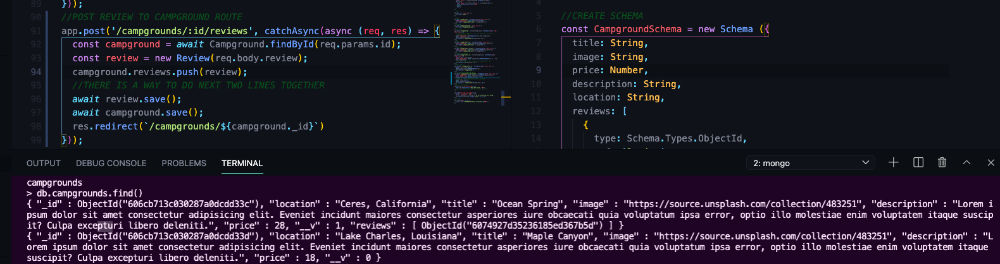

# YelpCamp: Adding The Reviews Model
- [Colt's Github Code for This Section](https://github.com/Colt/YelpCamp/tree/6a78de4041b853f65d681cf77784db637384f432)

## Defining The Review Model
- Review Model - Numeric Rating and Text
1. Create Model: `models/review.js`
```js
//Create Schema
const reviewSchema = new Schema({
  body: String, //TEXT
  rating: Number //probably 1-5
});
```
2. Connect Review w/ Campground --> One to Many Relationship | What Implementation?
* We Will Embed an array of ObjectId's in Each Campground --> potential to have thousands of reviews
3. Update Campground Schema:
```js
  description: String,
  location: String,
  reviews: [
    {
      type: Schema.Types.ObjectId,
      ref: 'Review'
    }
  ]
```

## Adding the Review Form
- Add Form to Make New Review --> Make Review in Context of Individual Campground 
1. Add Form on `views/campground/show.ejs` --> Nothing Fancy yet :) --> inside col on card
* FOR LABEL: `class="form-label"` --> bootstrap
* FOR TEXT-AREA: `class="form-control"` --> bootstrap
* FOR RANGE INPUT: `class="form-range"` --> bootstrap
```html
    <h2>Leave a Review</h2>
    <form action="">
      <div class="mb-3">
        <label class="form-label" for="rating">Rating</label>
        <input class="form-range" type="range" min="1" max="5" name="review[rating] "id="rating">
      </div>
      <div class="mb-3">
        <label class="form-label" for="body">Review</label>
        <textarea class="form-control" name="review[body]" id="body" cols="30" rows="3"></textarea>
      </div>
      <div class="mb-3">
        <button class="btn btn-success">Submit</button>
      </div>
    </form>
```
## Creating Reviews
- Need to Know Campground it is Associated With --> Include Campground ID in the path (NESTED ROUTE) --> `POST /campground/:id/reviews`
- WE DO NOT NEED FULL `RESTful` ROUTES for Reviews --> Just look at all reviews for a single campground --> NEED THAT ID
1. CREATE POST ROUTE && TEST:
```js
//POST REVIEW TO CAMPGROUND ROUTE
app.post('/campgrounds/:id/reviews', catchAsync(async (req, res) => {
  res.send('You Made It');
}));
```
* SET UP FORM TO TEST SUBMIT:
```html
  <h2>Leave a Review</h2>
    <form class="mb-3" action="/campgrounds/<%= campground._id %>/reviews" method="POST">
```
* IN LOCAL HOST:

2. Require Review Model in `app.js` --> `const Review = require('./models/review');`
3. FIND CORRESPONDING CAMPGROUND IN ROUTE:
```js
//POST REVIEW TO CAMPGROUND ROUTE
app.post('/campgrounds/:id/reviews', catchAsync(async (req, res) => {
  const campground = await Campground.findById(req.body);
  const review = new Review(req.body.review);
  campground.reviews.push(review);
  //THERE IS A WAY TO DO NEXT TWO LINES TOGETHER
  await review.save();
  await campground.save();
  res.redirect(`/campgrounds/${campground._id}`)
}));
```
* CHECK IN MONGOOSE TO SEE IF WE WERE SUCCESSFUL:


## Validating Reviews

## Displaying Reviews

## Styling Reviews

## Deleting Reviews

## Campground Delete Middleware