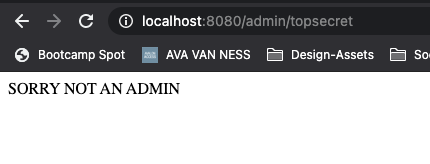
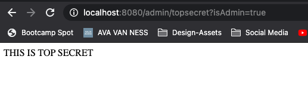
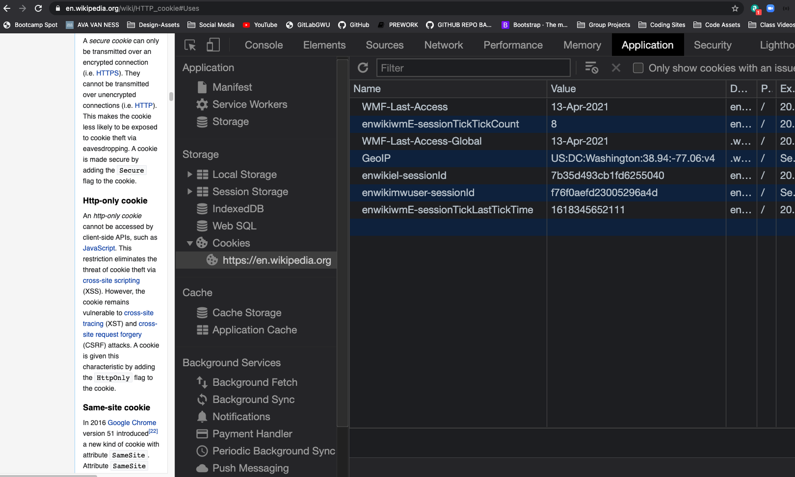
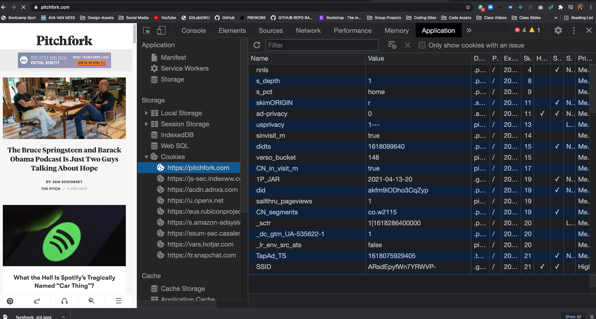

# Express Router & Cookies

## Crucial 

### * Express Router Basics
### * Understanding Cookies
### * Cookie Parser 

<br>

## Important 

### * Signed Cookies

<br>

## Nice to Have

### * HMAC Signing

<br>

## Notes

<hr>

### Express Router Intro
- [EXPRESS ROUTER](https://expressjs.com/en/4x/api.html#express.router)
- slightly different structure to write our routes
- handwrite all our routes in a separate file --> reduce duplication
- `express.Router([options])` --> creates new router object
- A router `object` is an isolated instance of middleware and routes. You can think of it as a “mini-application,” capable only of performing middleware and routing functions. Every Express application has a built-in app router.
* FOR EXAMPLE: Petfinder app has multiple routes for shelter,s multiple routes for dogs
- shelters
1. /shelters
2. POST /shelters
3. /shelters/:id
4. /shelters/:id/edit
- dogs
1. /dogs
2. POST /dogs
3. /dogs/"id
- In express router we can move and group routes together and make it so you don't have to keep writing shelter over and over
* `mkdir routes` - create file for every group of routes
- AT BEGINNING OF FILE:
```js
const express = require('express');
const router = express.Router();
```
- EXAMPLE ROUTES:
```js
router.get('/shelters', (req, res) => {
  res.send("ALL SHELTERS");
});
router.post('/shelters', (req, res) => {
  res.send("CREATING SHELTER")
})
router.get('/shelters/:id', (req, res) => {
  res.send("VIEWING ONE SHELTER");
});
router.get('/shelters/:id/edit', (req, res) => {
  res.send("EDITING ONE SHELTER");
});
```
- export router
```js
module.exports = router;
```
- in `index.js` --> require router
```js
const shelterRoutes = require('./routes/shelters');
```
- need to tell our app being served on localhost to use these routes
* **Version One**
```js
app.use('/', shelterRoutes);
```
- now we can test routes in localhost and postman and see our `res.send` from routes created in `shelters.js`

* **VERSION TWO** DRY CODE
- in `index.js` --> new version --> now you can change the name of route if things change later and you have one central place to change it
```js
app.use('/shelters', shelterRoutes);
```
- in `shelters.js` --> clean up routes
```js
router.get('/', (req, res) => {
  res.send("ALL SHELTERS");
});
router.post('/', (req, res) => {
  res.send("CREATING SHELTER")
})
router.get('/:id', (req, res) => {
  res.send("VIEWING ONE SHELTER");
});
router.get('/:id/edit', (req, res) => {
  res.send("EDITING ONE SHELTER");
});
```
- create new route file for dogs --> follow same pattern as shelters and tell app to use it in `index.js`
- you can find other patterns for route names --> does not need to be the way we've been doing it thus far --> any pattern works

### Express Router & Middleware
- We can add in our own middleware, just like we do the app itself
- set up middleware that will only apply to group of routes in one router
- touch `admin.js` in `routes` directory
- imagine these are doing something useful that we want to protect using our middleware
```js
  router.get('/topsecret', (req, res) => {
    res.send('THIS IS TOP SECRET')
  })
  router.get('/deleteeverything', (req, res) => {
    res.send('OK DELETED IT ALL!!')
  })
```
- test `app.use` ref in index.js
```js
app.use('/admin', adminRoutes);
```
- we haven't gotten to auth yet but so we'll create a middleware with a query to allow something only if a user is logged in --> once logged in they can get to these routes in index.js
```js
app.use((req, res, next) => {
  if (req.query.isAdmin) {
    next();
  }
  res.send("SORRY NOT AN ADMIN")
})
```
- now try hitting route

- add `?isAdmin=true` query string to localhost

- RIGHT NOW IT THE MIDDLEWARE IS EFFECTING ALL ROUTES
- We have seen before we can save to function and pass into route
- Or we move the middleware to the `admin.js` and tell the router to use it
```js
router.use((req, res, next) => {
  if (req.query.isAdmin) {
    next();
  }
  res.send("SORRY NOT AN ADMIN")
})

router.get('/topsecret', (req, res) => {
  res.send('THIS IS TOP SECRET')
})
router.get('/deleteeverything', (req, res) => {
  res.send('OK DELETED IT ALL!!')
})
```
- Now we can go to other routes not using admin

### Introducing Cookies
- HTTP Cookies --> Accept terms of use on websites
- Step One towards Understanding Authentication
* **Cookies** --> formerly 'magic cookies'
- Little bits of information that are stored i na user's browser when browsing a particular website
- Once a cookies is set, a user's browser will send the cookie on every subsequent request to the site
- **COOKIES ALLOW USE TO MAKE HTTP STATEFUL**
- Cookie --> send back key and value pair --> store in browser --> remember user shopping cart, remember if they were on dark or light mode, etc
- [WIKIPEDIA COOKIES USES](https://en.wikipedia.org/wiki/HTTP_cookie#Uses)
- HTTP is Stateless so we need a way to remember 
- TRACKING --> is one of the uses --> why it's controversial --> used to track users' web browsing habits --> NOT what we are trying to do...
- Cookies used as unique identifier 
- IN DEV TOOLS UNDER `APPLICATION` --> UNDER `STORAGE` --> SECTION FOR `COOKIES` --> KEY VALUE PAIRS: `NAME` & `VALUE`:

- `GEOIP`: Shows where you are --> wikipedia
- LESS FRIENDLY COOKIES on site like Pitchfork -- most of the time they don't make sense


### Sending Cookies

### Cookie Parser Middleware
* [COOKE PARSER DOCS](https://www.npmjs.com/package/cookie-parser)

### Signing Cookies

### OPTIONAL: HMAC Signing
* [HMAC Generator-Tester Tool](https://www.freeformatter.com/hmac-generator.html)


