# Express Router & Cookies

## Crucial 

### * Express Router Basics
### * Understanding Cookies
### * Cookie Parser 

<br>

## Important 

### * Signed Cookies

<br>

## Nice to Have

### * HMAC Signing

<br>

## Notes

<hr>

### Express Router Intro
- [EXPRESS ROUTER](https://expressjs.com/en/4x/api.html#express.router)
- slightly different structure to write our routes
- handwrite all our routes in a separate file --> reduce duplication
- `express.Router([options])` --> creates new router object
- A router `object` is an isolated instance of middleware and routes. You can think of it as a “mini-application,” capable only of performing middleware and routing functions. Every Express application has a built-in app router.
* FOR EXAMPLE: Petfinder app has multiple routes for shelter,s multiple routes for dogs
- shelters
1. /shelters
2. POST /shelters
3. /shelters/:id
4. /shelters/:id/edit
- dogs
1. /dogs
2. POST /dogs
3. /dogs/"id
- In express router we can move and group routes together and make it so you don't have to keep writing shelter over and over
* `mkdir routes` - create file for every group of routes
- AT BEGINNING OF FILE:
```js
const express = require('express');
const router = express.Router();
```
- EXAMPLE ROUTES:
```js
router.get('/shelters', (req, res) => {
  res.send("ALL SHELTERS");
});
router.post('/shelters', (req, res) => {
  res.send("CREATING SHELTER")
})
router.get('/shelters/:id', (req, res) => {
  res.send("VIEWING ONE SHELTER");
});
router.get('/shelters/:id/edit', (req, res) => {
  res.send("EDITING ONE SHELTER");
});
```
- export router
```js
module.exports = router;
```
- in `index.js` --> require router
```js
const shelterRoutes = require('./routes/shelters');
```
- need to tell our app being served on localhost to use these routes
* **Version One**
```js
app.use('/', shelterRoutes);
```
- now we can test routes in localhost and postman and see our `res.send` from routes created in `shelters.js`

* **VERSION TWO** DRY CODE
- in `index.js` --> new version --> now you can change the name of route if things change later and you have one central place to change it
```js
app.use('/shelters', shelterRoutes);
```
- in `shelters.js` --> clean up routes
```js
router.get('/', (req, res) => {
  res.send("ALL SHELTERS");
});
router.post('/', (req, res) => {
  res.send("CREATING SHELTER")
})
router.get('/:id', (req, res) => {
  res.send("VIEWING ONE SHELTER");
});
router.get('/:id/edit', (req, res) => {
  res.send("EDITING ONE SHELTER");
});
```
- create new route file for dogs --> follow same pattern as shelters and tell app to use it in `index.js`
- you can find other patterns for route names --> does not need to be the way we've been doing it thus far --> any pattern works

### Express Router & Middleware
- We can add in our own middleware, just like we do the app itself
- set up middleware that will only apply to group of routes in one router
- touch `admin.js` in `routes` directory
- imagine these are doing something useful that we want to protect using our middleware
```js
  router.get('/topsecret', (req, res) => {
    res.send('THIS IS TOP SECRET')
  })
  router.get('/deleteeverything', (req, res) => {
    res.send('OK DELETED IT ALL!!')
  })
```
- test `app.use` ref in index.js
```js
app.use('/admin', adminRoutes);
```
- we haven't gotten to auth yet but so we'll create a middleware with a query to allow something only if a user is logged in --> once logged in they can get to these routes in index.js
```js
app.use((req, res, next) => {
  if (req.query.isAdmin) {
    next();
  }
  res.send("SORRY NOT AN ADMIN")
})
```
- now try hitting route

- add `?isAdmin=true` query string to localhost

- RIGHT NOW IT THE MIDDLEWARE IS EFFECTING ALL ROUTES
- We have seen before we can save to function and pass into route
- Or we move the middleware to the `admin.js` and tell the router to use it
```js
router.use((req, res, next) => {
  if (req.query.isAdmin) {
    next();
  }
  res.send("SORRY NOT AN ADMIN")
})

router.get('/topsecret', (req, res) => {
  res.send('THIS IS TOP SECRET')
})
router.get('/deleteeverything', (req, res) => {
  res.send('OK DELETED IT ALL!!')
})
```
- Now we can go to other routes not using admin

### Introducing Cookies
- HTTP Cookies --> Accept terms of use on websites
- Step One towards Understanding Authentication
* **Cookies** --> formerly 'magic cookies'
- Little bits of information that are stored i na user's browser when browsing a particular website
- Once a cookies is set, a user's browser will send the cookie on every subsequent request to the site
- **COOKIES ALLOW USE TO MAKE HTTP STATEFUL**
- Cookie --> send back key and value pair --> store in browser --> remember user shopping cart, remember if they were on dark or light mode, etc
- [WIKIPEDIA COOKIES USES](https://en.wikipedia.org/wiki/HTTP_cookie#Uses)
- HTTP is Stateless so we need a way to remember 
- TRACKING --> is one of the uses --> why it's controversial --> used to track users' web browsing habits --> NOT what we are trying to do...
- Cookies used as unique identifier 
- IN DEV TOOLS UNDER `APPLICATION` --> UNDER `STORAGE` --> SECTION FOR `COOKIES` --> KEY VALUE PAIRS: `NAME` & `VALUE`:

- `GEOIP`: Shows where you are --> wikipedia
- LESS FRIENDLY COOKIES on site like Pitchfork -- most of the time they don't make sense


### Sending Cookies
- set up `index.js` with express app
- set up a cookies and send a cookie from a different route
- [EXPRESS RES.COOKIES DOCS](https://expressjs.com/en/4x/api.html#res.cookie)
```js
app.get('/greet', (req, res) => {
  res.send("HEY THERE!")
})

app.get('/setname', (req, res) => {
  res.cookie('name', 'stevie chicks')
  res.send('OK Sent you a Cookie')
})
```
- In DEV Console see cookie when hit `/setname` route

- Still Available in other `localhost:8080` routes
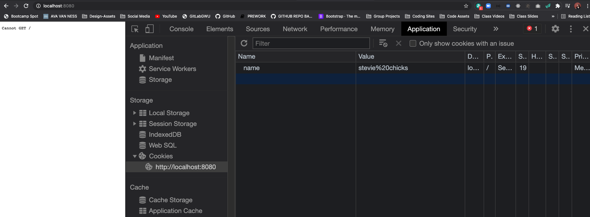
- Change name and test in Postman --> (name is updated) --> and we can see the cookies
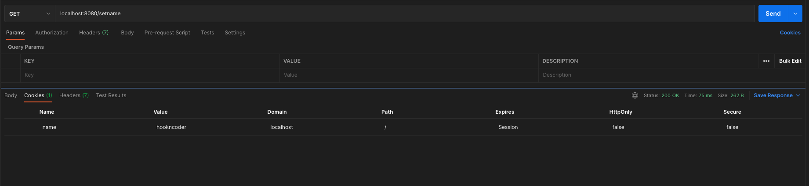
- Other properties we can set on cookies (a lot of these we will take care of with sessions):
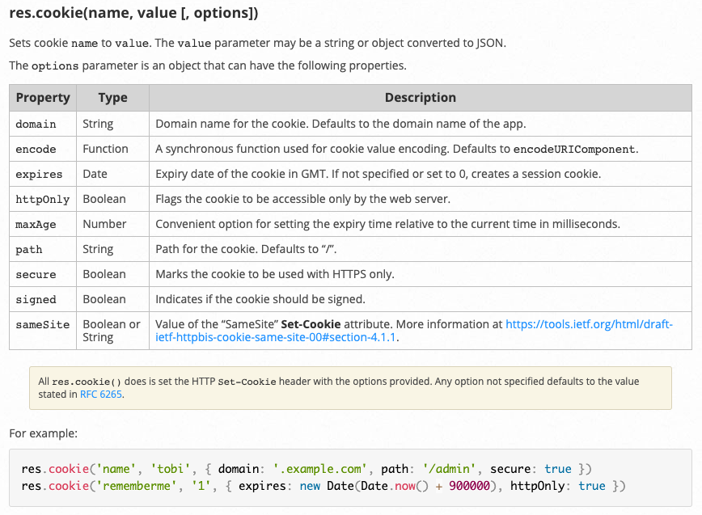
- Send Two Cookies:
```js
app.get('/setname', (req, res) => {
  res.cookie('name', 'hookncoder')
  res.cookie('animal', 'harlequin shrimp')
  res.send('OK Sent you a Cookie')
})
```
- In Dev Console: 
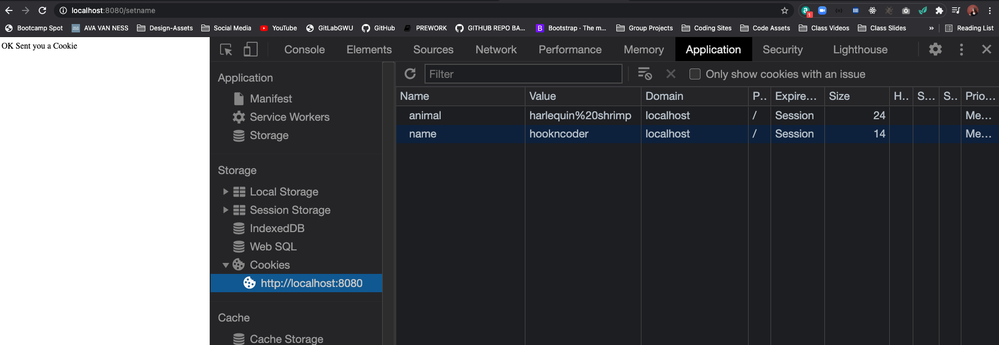
- how do we parse and use the cookies we are sending

### Cookie Parser Middleware
* [COOKE PARSER DOCS](https://www.npmjs.com/package/cookie-parser)
- In `/greet` we want to find the name that is allegedly stored in the browser
- we find it in `req.cookies` --> unfortunately you do not have this functionality out of the box --> need cookie parser npm
* `npm i cookie-parser`:
```js
const cookieParser = require('cookie-parser');
app.use(cookieParser()); //execute it on every request
```
* now on every incoming request we have a property called `req.cookie`:
```js
app.get('/greet', (req, res) => {
  console.log(req.cookies);
  res.send("HEY THERE!")
})
```
- IN Terminal:
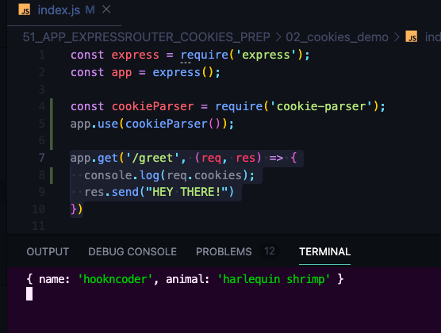
- You Can Manually insert a new cookie in the dev console:
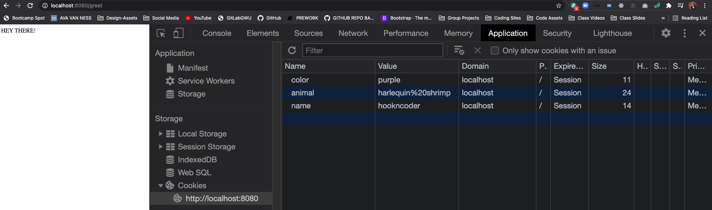
- In Terminal:
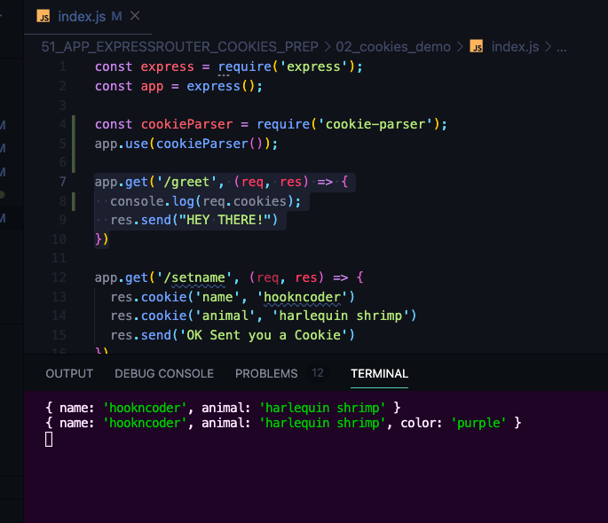

- We can take that name and greet some by their name 
```js
app.get('/greet', (req, res) => {
  // console.log(req.cookies);
  const { name = 'No-name' } = req.cookies;
  res.send(`Hey There, ${name}!`)
})
```
- IN LOCALHOST:
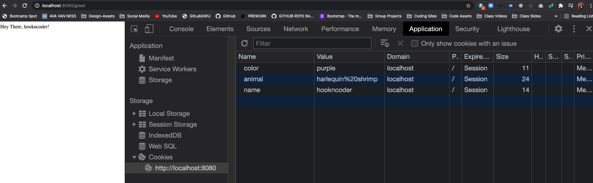
- Not about storing information that's important, it's about adding some state fullness between request

### Signing Cookies
* FROM COOKIE PARSER DOCS
- *"Parse `Cookie header` and populate `req.cookies` with an object keyed by the cookie names. Optionally you may enable signed cookie support by passing a `secret` string, which assigns `req.secret` so it may be used by other middleware."*
- **signing in programming**: digital signature or `cryptographic signature` --> verify it's integrity, verify that something hasn't changed --> like a was seal on a letter
- Take a cookie we send to user --> instead of sending name as `hookncoder` --> send it as signed cookie --> have `cookie-parser` sign it using a secret code that I specify --> send weirder looking version of our cookie to the client --> ON CLIENT SIDE --> that weird looking version, the signed version will be sent back just like any other cookie 
- ON SERVER SIDE --> when we're looking at the cookies that have been sent to us `cookie-parser` will be able us if any of those signed cookies have been tampered with --> if they are the same exact value that was sent --> we would be able to tell if someone screwed with it if they don't match --> ENCRYPTING INFORMATION
1. NEED TO PASS IN A SECRET TO `cookieParser` as string--> can be anything --> will put in environment variable later on `env`
```js
const cookieParser = require('cookie-parser');
app.use(cookieParser('thisismysecret'));
```
2. SEND COOKIE WITH SIGNED EQUAL TO TRUE
```js
//SIGNED COOKIES
app.get('/getsignedcookie', (req, res) => {
  res.cookie('fruit', 'grape', { signed: true })
})
```
- TEST IN LOCALHOST --> you see grape in there --> not about keeping it secret --> just to verify it's integrity
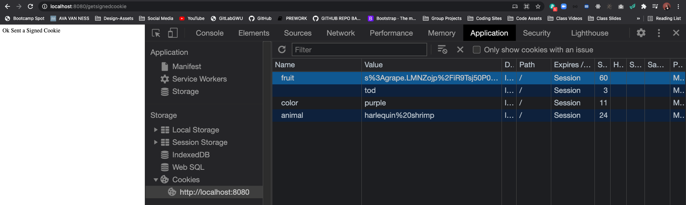
3. TO UN-SIGN AND VERIFY IT WORKED OUT:
```js
//VERIFY SIGNED COOKIE
app.get('/verifyfruit', (req, res) => {
  console.log(req.cookies)
  res.send(req.cookies)
})
```
- FIRST TEST IN TERMINAL/LOCALHOST --> SEE RESPONSE
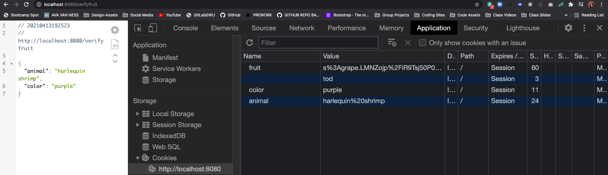
- We do not see fruit in object response
- USE REQ.SIGNEDCOOKIES:
```js
//VERIFY SIGNED COOKIE
app.get('/verifyfruit', (req, res) => {
  console.log(req.cookies)
  console.log(req.signedCookies)
  res.send(req.signedCookies)
})
```
- IN LOCAL HOST:
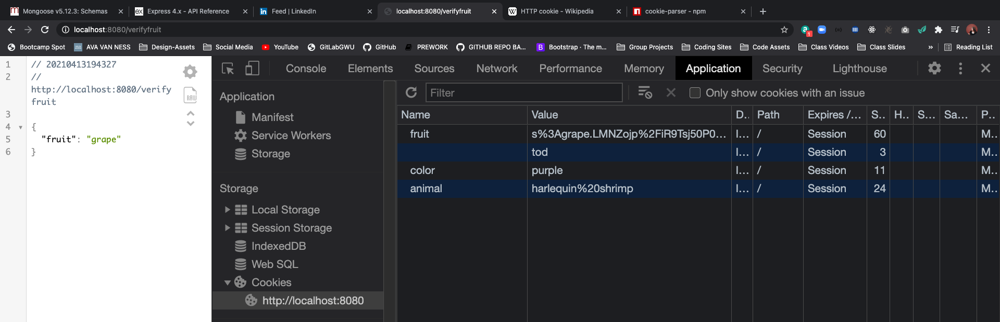
- IN TERMINAL:
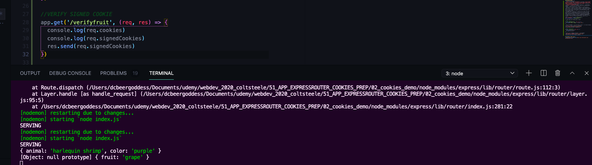

- TRY MANUALLY CHANGING GRAPE IN KEY TO APPLE and VERIFY --> fruit is now set to false:
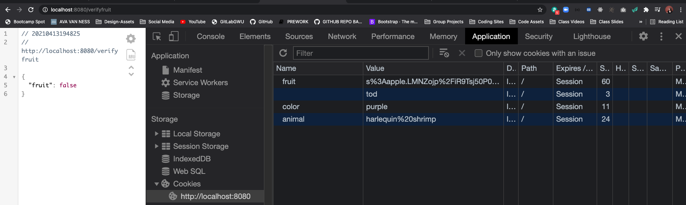
- If you ever change the value passed into cookieparser as a string it would make all past keys given out invalid
```js
app.use(cookieParser('thisismysecret'));
```
- AGAIN WE ARE NOT HIDING DATA!!! --> way to verify it's not been tampered with

### OPTIONAL: HMAC Signing

* [HMAC Generator-Tester Tool](https://www.freeformatter.com/hmac-generator.html)
- From Wikipedia: *In cryptography, an HMAC (sometimes expanded as either keyed-hash message authentication code or hash-based message authentication code) is a specific type of message authentication code (MAC) involving a cryptographic hash function and a secret cryptographic key. As with any MAC, it may be used to simultaneously verify both the data integrity and the authenticity of a message.HMAC can provide message authentication using a shared secret instead of using digital signatures with asymmetric cryptography. It trades off the need for a complex public key infrastructure by delegating the key exchange to the communicating parties, who are responsible for establishing and using a trusted channel to agree on the key prior to communication*

- `cookie-parser` uses another package called `cookie-signature` which has two things --> sign and unsign
- FROM GITHUB:
```js
exports.sign = function(val, secret){
  if ('string' != typeof val) throw new TypeError("Cookie value must be provided as a string.");
  if ('string' != typeof secret) throw new TypeError("Secret string must be provided.");
  return val + '.' + crypto
    .createHmac('sha256', secret) //sha256 --> hashing function
    .update(val)
    .digest('base64')
    .replace(/\=+$/, '');
};

exports.unsign = function(val, secret){
  if ('string' != typeof val) throw new TypeError("Signed cookie string must be provided.");
  if ('string' != typeof secret) throw new TypeError("Secret string must be provided.");
  var str = val.slice(0, val.lastIndexOf('.'))
    , mac = exports.sign(str, secret)
    , macBuffer = Buffer.from(mac)
    , valBuffer = Buffer.alloc(macBuffer.length);

  valBuffer.write(val);
  return crypto.timingSafeEqual(macBuffer, valBuffer) ? str : false;
}
```
- HMAC GENERATOR TEST:
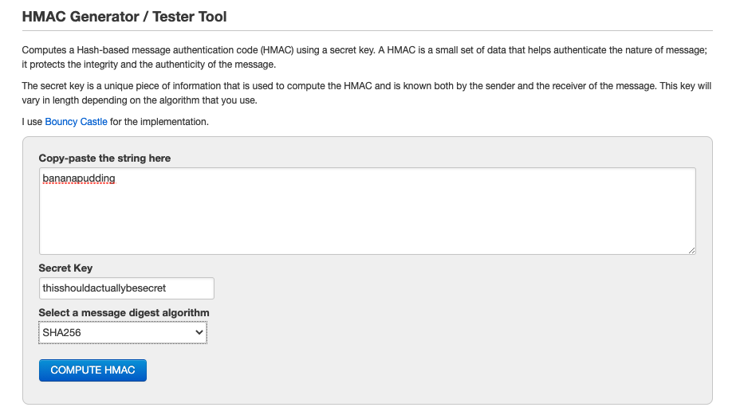
- COMPUTED HMAC:
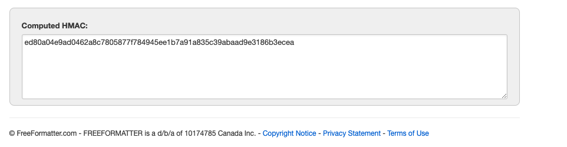
- Can Enter the Same values in a new window and get same result
- We are making sure that the same secret key plus the same val that were used originally are still going to work when we receive that cookie back --> not un-encoding or decrypting it --> simply trying to recreate the same signature


