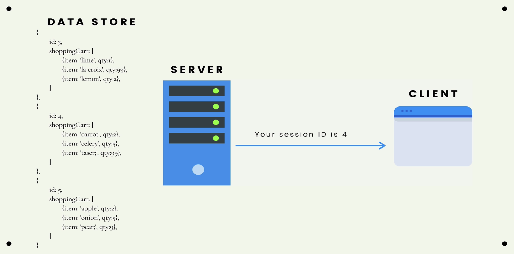
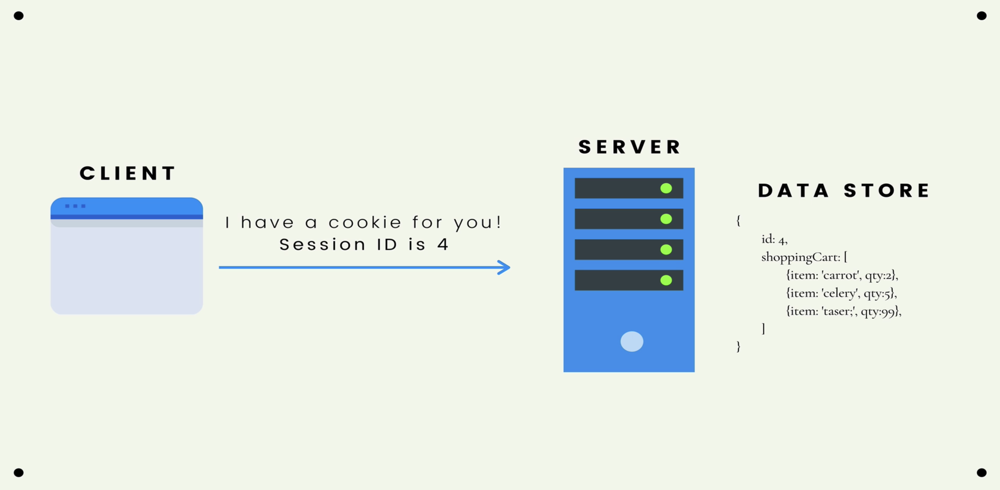
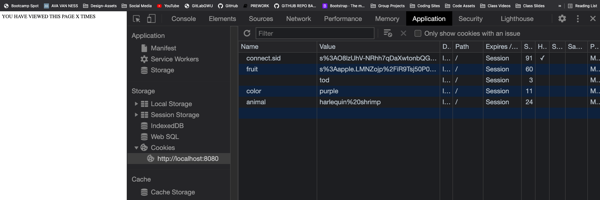
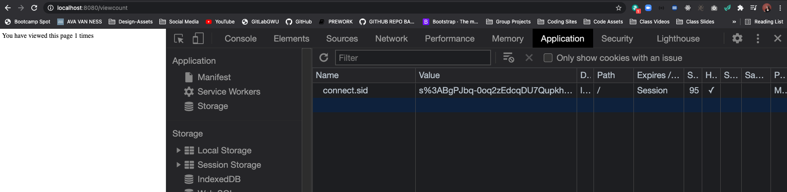

# SECTION

## Crucial 

### * Conceptual Overview of Session 
### * Setting Up Express Session

<br>

## Express Session & Flash

### * Integrating Flash Messages

<br>

## Notes

<hr>

### Introduction to Sessions
- [NPM DOCS FOR EXPRESS-SESSIONS](https://www.npmjs.com/package/express-session)
- It's not very practical (or secure) to store a lot of data client-side using cookies. This is where sessions come in!
- Sessions are a `server-side` data store that we use to make HTTP stateful. Instead of storing data using cookies, we store the data on teh server-side and then send the browser a cookie that can be used to retrieve the data.
- A diagram might be helpful here.
 
- session does not used as database, we send cookie with id to client to retrieve the data store and then client sends it back to the server-side to match us with the same id in the data store --> not same as application database
 

### Express Session
1. `npm i express-session` --> does not need `cookie-parser` to work anymore --> probably still want to install to send cookies in other applications
- there is a lot more to understand about sessions when it comes to production --> this is one example of it's use --> we are just using it to pass in a secret
2. need to REQUIRE and instantiate as MIDDLEWARE: 
```js
const express = require('express');
const app = express();
const session = require('express-session');

app.use(session({ secret: 'thisisnotagoodsecret' }));
```
- at any time on our incoming `request object` we will now have a `session property` available 
3. SESSIONS EXAMPLE:
- set up route and test in localhost
```js
//SESSIONS EXAMPLE
app.get('/viewcount', (req, res) => {
  res.send("YOU HAVE VIEWED THIS PAGE X TIMES")
})
```
- you can see new key: `connect.sid` in cookies --> name of cookie for express-session --> value is signed:

- VALUE is your SESSION ID --> browser automatically sends --> express can now remember you from one request to the next
* EXAMPLE OF USING `req.session`
```js
//SESSIONS EXAMPLE
app.get('/viewcount', (req, res) => {
  if(req.session.count){
    req.session.count += 1
  } else {
    req.session.count = 1
  }
  res.send(`You have viewed this page ${req.session.count} times`)
})
```
- NOW IN LOCALHOST:

- Which part of the session belongs to you and it keeps it stores in `MEMORY` in the DEV CONSOLE --> not what we would do for production
- ways to change that --> will consider when we need to deploy a production app --> `MemoryStore`

### More Express Session

### Intro to Flash
- [GITHUB FOR CONNECT-FLASH](https://github.com/jaredhanson/connect-flash)

### Res.locals & Flash