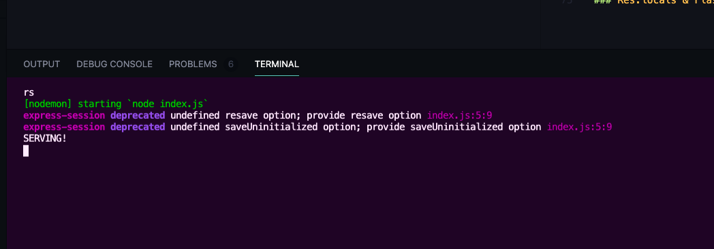
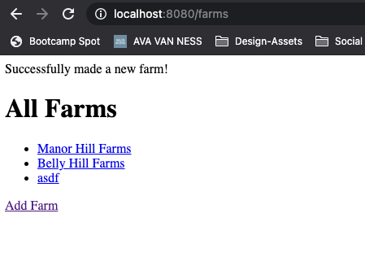

# SECTION

## Crucial 

### * Conceptual Overview of Session 
### * Setting Up Express Session

<br>

## Express Session & Flash

### * Integrating Flash Messages

<br>

## Notes

<hr>

### Introduction to Sessions
- [NPM DOCS FOR EXPRESS-SESSIONS](https://www.npmjs.com/package/express-session)
- It's not very practical (or secure) to store a lot of data client-side using cookies. This is where sessions come in!
- Sessions are a `server-side` data store that we use to make HTTP stateful. Instead of storing data using cookies, we store the data on teh server-side and then send the browser a cookie that can be used to retrieve the data.
- A diagram might be helpful here.
 
- session does not used as database, we send cookie with id to client to retrieve the data store and then client sends it back to the server-side to match us with the same id in the data store --> not same as application database
 

### Express Session
1. `npm i express-session` --> does not need `cookie-parser` to work anymore --> probably still want to install to send cookies in other applications
- there is a lot more to understand about sessions when it comes to production --> this is one example of it's use --> we are just using it to pass in a secret
2. need to REQUIRE and instantiate as MIDDLEWARE: 
```js
const express = require('express');
const app = express();
const session = require('express-session');

app.use(session({ secret: 'thisisnotagoodsecret' }));
```
- at any time on our incoming `request object` we will now have a `session property` available 
3. SESSIONS EXAMPLE:
- set up route and test in localhost
```js
//SESSIONS EXAMPLE
app.get('/viewcount', (req, res) => {
  res.send("YOU HAVE VIEWED THIS PAGE X TIMES")
})
```
- you can see new key: `connect.sid` in cookies --> name of cookie for express-session --> value is signed:

- VALUE is your SESSION ID --> browser automatically sends --> express can now remember you from one request to the next
* EXAMPLE OF USING `req.session`
```js
//SESSIONS EXAMPLE
app.get('/viewcount', (req, res) => {
  if(req.session.count){
    req.session.count += 1
  } else {
    req.session.count = 1
  }
  res.send(`You have viewed this page ${req.session.count} times`)
})
```
- NOW IN LOCALHOST:

- Which part of the session belongs to you and it keeps it stores in `MEMORY` in the DEV CONSOLE --> not what we would do for production
- ways to change that --> will consider when we need to deploy a production app --> `MemoryStore`

### More Express Session
- deprecation warnings in TERMINAL

- `resave` --> we will typically want to `false`
- `saveUninitialized` --> for now we want `false`
```js
const sessionOptions = { 
  secret: 'thisisnotagoodsecret', 
  resave: false, 
  saveUninitialized: false 
};
app.use(session(sessionOptions));
```
- NEW ENDPOINT EXAMPLE:
```js
//NEW ENDPOINT EXAMPLE
/*
- expect you to pass a query string in, and in that query string i want you to pass in your username --> give default value if you do not pass in --> add that to session --> if you go to /register --> you will be registered in our session
*/
app.get('/register', (req, res) => {
  const { username = 'Anyonymous'} = req.query;
  req.session.username = username;
  res.redirect('/greet')
})

app.get('/greet', (req, res) => {
  const { username } = req.session;
  res.send(`Welcome Back, ${username}`)
})
```

### Intro to Flash
- [GITHUB FOR CONNECT-FLASH](https://github.com/jaredhanson/connect-flash)
- FLASH = Place in session to flash a message to the user --> success --> confirmation --> failure
- Using files for farm stand 
1. `npm i connect-flash`
2. IN `index.js`
```js
const session = require('express-session');
const flash = require('connect-flash')

const sessionOptions = { secret: 'thisisnotagoodsecret', resave: false, saveUninitialized: false }
app.use(session(sessionOptions));
app.use(flash());
```
- now all messages have access to `req.flash()`
- pass in 'key', and then you have 'message'
- usually do before you redirect
4. WHEN YOU MAKE A NEW FARM
```js
app.post('/farms', async (req, res) => {
    const farm = new Farm(req.body);
    await farm.save();
    req.flash('success', 'Successfully made a new farm!');
    res.redirect('/farms')
})
```
- Right now it is not going to show up --> in order to access it out --> we just call req.flash when we're rendering something and then passing the key 
5. For Now: ADD TO GET FARMS ROUTE:
```js
app.get('/farms', async (req, res) => {
    const farms = await Farm.find({});
    res.render('farms/index', { farms, messages: req.flash('success') })
})
```
- IN `index.ejs` for farms
```html
    <%= messages %>
    <h1>All Farms</h1>
    <ul>
        <% for(let farm of farms) { %>
        <li><a href="/farms/<%=farm._id%>"><%= farm.name %></a> </li>
        <% }%>
    </ul>
    <a href="/farms/new">Add Farm</a>
```
- MAKE NEW FARM IN LOCALHOST:

- if you refresh the page or navigate away it disappears
- SUM UP --> calling `req.flash` before we redirect, and we can call `req.flash` and retrieve anything under the key we specified that's been stored there --> in this case key = 'success'

### Res.locals & Flash
- IMPROVE HOW WE PASS FLASH MESSAGES INTO ROUTES
1. CREATE MIDDLEWARE TO ADD ONTO RESPONSE OBJECT --> with property `req.locals`
```js
//FLASH MIDDLEWARE
app.use((req, res, next) => {
    res.locals.messages = req.flash('success');
    next();
})
```
- NOW: Every route has access, and we wouldn't use it in index.ejs, we would probably create a partial where we display any messages up top
- Common to use Bootstrap Alert that is dismissible for messages in ejs