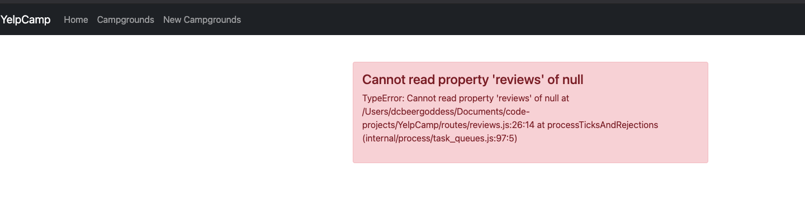
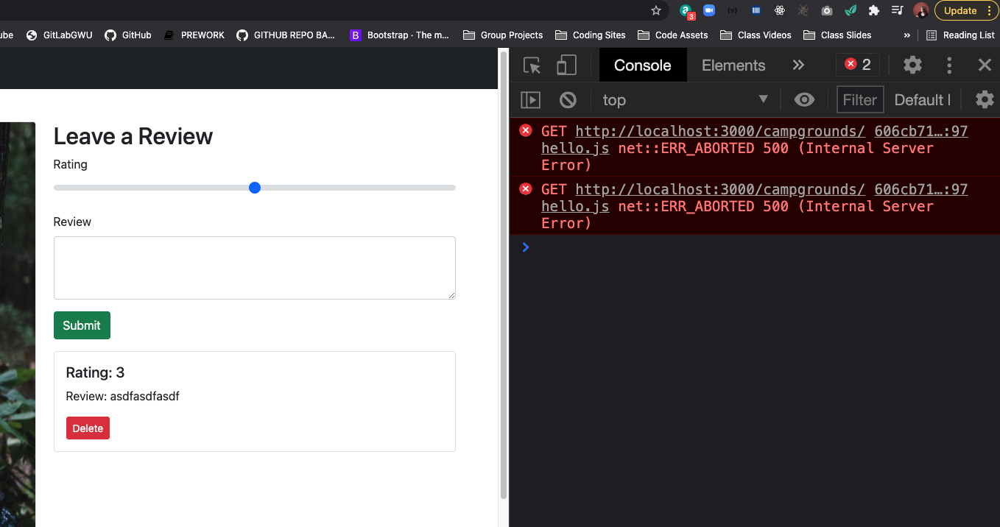
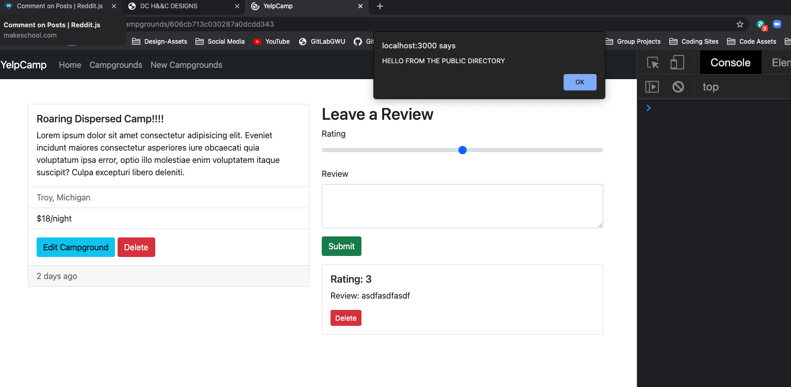
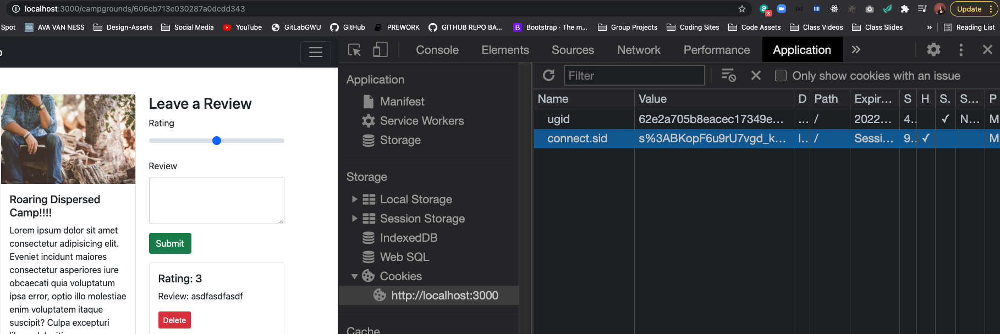
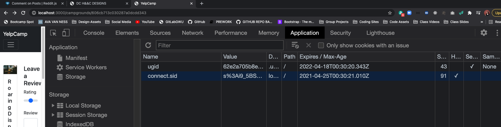
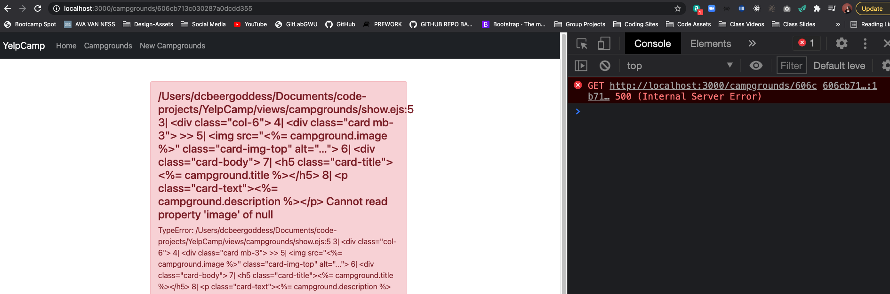
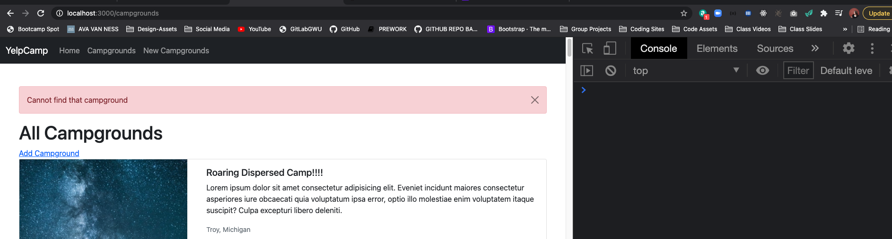

# YelpCamp: Restructuring & Flash
- [GITHUB REPO CODE FOR THIS SECTION](https://github.com/Colt/YelpCamp/tree/36c5c12fc8b21699d7e129d661c80b3e795da801)

## Breaking Out Campground Routes
1. `mkdir routes` in root directory
2. `touch routes/campgrounds.js`
3. add `express` & `router` 
```js
const express = require('express');
const router = express.Router();
```
4. paste in campground routes, change `app` to `router`
5. export module `module.exports = router;`
6. require campground router in `app.js`
```js 
const campgrounds = require('./routes/campgrounds');
```
7. set up middleware -->  w/ route and the path you want to prefix them with
```js
app.use('/campgrounds', campgrounds)
```
8. update routes in router file and require in `catchAsync`, `ExpressError`, `Campground`, Middleware for `validateCampground`, and require `campgroundSchema` for `JOI` --> update paths otherwise --> error
```js
const catchAsync = require('../utils/catchAsync');
const { campgroundSchema } = require('../schemas.js');
const ExpressError = require('../utils/ExpressError');
const Campground = require('../models/campground');

//JOI VALIDATION
const validateCampground = (req, res, next) => {
  const { error } = campgroundSchema.validate(req.body);
  if(error){
    const msg = error.details.map(el => el.message).join(',')
    throw new ExpressError(msg, 400)
  } else {
    next();
  }
};

```

## Breaking Out Review Routes
- We Do Same Thing for a Review Router 
- NOW WE HAVE ERROR WHEN SUBMITTING A NEW REVIEW

```js
  const campground = await Campground.findById(req.params.id);
  const review = new Review(req.body.review);
  campground.reviews.push(review);
```
- cannot get campground --> cannot find by id --> return empty object in `req.params`
- `app.use('/campgrounds/:id/reviews', reviews);` --> need to be able to use the params to get this id
- ROUTERS GET SEPARATE PARAMS --> specify option in router --> `mergeParams: true`
```js
const express = require('express');
const router = express.Router({ mergeParams: true });
```
- Campgrounds is fine because the id we need is all defined in those routes 

## Serving Static Assets
- we need to add in our public directory and serve our static assets so that we could have images, custom stylesheets, and JavaScript
1. `mkdir public` in root directory
2. test with `touch public/hello.js` --> `alert("HELLO FROM THE PUBLIC DIRECTORY")` --> goal is to make sure we can include this in our response
3. in `boilerplate.ejs` --> set up script tag to include that script --> `<script src='/hello.js'></script>` --> public is not being served yet so this is not going to work

4. We need to tell express to server our public directory --> in `app.js`
```js
app.use(express.urlencoded({extended: true}));
app.use(methodOverride('_method'));
app.use(express.static('public'));
```
5. TEST IN LOCALHOST:

6. LETS MOVE BOOTSTRAP SCRIPT TO NEW PUBLIC FILE
7. ADD IN SCRIPT TO BOILERPLATE:
```html
  <!-- PUBLIC ASSETS -->
  <script src='/validateForms.js'></script>
```
8. may want to break up public folder into `scripts` & `stylesheets`
```js
 <script src='/javascripts/validateForms.js'></script>
```
9. Add Path to Middleware
```js
//MONGOOSE MIDDLEWARE
app.use(express.urlencoded({extended: true}));
app.use(methodOverride('_method'));
//PUBLIC MIDDLEWARE
app.use(express.static(path.join(__dirname, 'public')));
```
10. UPDATE NOW SINCE WE KNOW --> FOR MONGOOSE FINDBYANDMODIFY DEPRECIATION WARNING
```js
mongoose.connect('mongodb://localhost:27017/yelp-camp', {
  useNewUrlParser: true,
  useCreateIndex: true, 
  useUnifiedTopology: true,
  useFindAndModify: false
});
```

## Configuring Session
- SET UP EXPRESS SESSION --> TO USE FLASH --> SHORTLY WE WILL ADD AUTHENTICATION
1. `npm i express-session`
2. in app.js `const session = require('express-session')
3. to set up --> have a lot we could configure --> will come back once we deploy and get our app up and running and we have `production` vs `development`, etc.
```js
//SESSION MIDDLEWARE
const sessionConfig = {
  secret: 'thisshouldbeabettersecret!',
  resave: false,
  saveUninitialized: true,
};
app.use(session(sessionConfig));
```
4. See if we get cookie served up for our session id `connect.sid` when we make a request in local host:


5. set up some fancier options for the cookie itself that we send back
```js
const sessionConfig = {
  secret: 'thisshouldbeabettersecret!',
  resave: false,
  saveUninitialized: true,
  cookie: {
    //have cookie expire after week
    //Date.now() --> produces date in milliseconds
    // Date.now() + milliseconds * seconds * minutes * hours * days
    expires: Date.now() + 1000 * 60 * 60 * 24 * 7,
    maxAge: 1000 * 60 * 60 * 24 * 7
  }
};
```
6. Cookie we get back now has an expiration date on it that expires a week from time of request


- We will circle back and do a ton more security but for now we are going to set this while we're setting up our session
- [HttpOnly Info](https://owasp.org/www-community/HttpOnly)
- BASIC SECURITY 
```js
const sessionConfig = {
  secret: 'thisshouldbeabettersecret!',
  resave: false,
  saveUninitialized: true,
  cookie: {
    //BASIC SECURITY
    httpOnly: true, 
    expires: Date.now() + 1000 * 60 * 60 * 24 * 7,
    maxAge: 1000 * 60 * 60 * 24 * 7
  }
};
```

## Setting Up Flash
1. `npm i connect-flash`
2. in `app.js` --> `const flash = require('connect-flash')`
3. in `app.js` after session middleware -->  `app.use(flash())`
4. should be able to flash something by calling `req.flash` and pass in a key and a value
* SIMPLE EXAMPLE --> in make a new campground route in `routes/campgrounds.js`
```js
//POST NEW CAMPGROUND ROUTE
router.post('/', validateCampground, catchAsync(async (req, res, next) => {
  const campground = new Campground(req.body.campground);
  await campground.save();
  req.flash('success', 'Successfully made a new campground!');
  res.redirect(`campgrounds/${campground._id}`);
}));
```
5. Make sure to display messages in ejs template --> set up middleware in `app.js` before any of the route handlers:
```js
app.use(session(sessionConfig));
app.use(flash());

app.use((req, res, next) => {
  //Every Request has access now
  res.locals.success = req.flash('success');
  next();
});

//ROUTER MIDDLEWARE
app.use('/campgrounds', campgrounds);
app.use('/campgrounds/:id/reviews', reviews);
```
6. Now in `boilerplate.ejs` test that message shows up when you make a new campground:
```html
<body class="d-flex flex-column vh-100">
  <%- include('../partials/navbar') %> 
  <main class="container mt-5">
    <%= success %> 
    <%- body %> 
  </main>
  <%- include('../partials/footer') %> 
```
7. set up key for `error`:
```js
app.use((req, res, next) => {
  res.locals.success = req.flash('success');
  res.locals.error = req.flash('error');
  next();
});
```
- Now we can flash messages to handle if you go to a campground page with id that does not exist with error key
- But we will make the messages look a little bit nicer with partials

## Flash Success Partial
- Use Bootstrap Dismissible Alert
```html
<div class="alert alert-warning alert-dismissible fade show" role="alert">
  <strong>Holy guacamole!</strong> You should check in on some of those fields below.
  <button type="button" class="btn-close" data-bs-dismiss="alert" aria-label="Close"></button>
</div>
```
1. create partial --> `touch views/partials/flash.ejs`
```js
<!-- create alert div, role for accessibility -->
<div class="alert alert-success" role="alert">
  <%= success %> 
</div>
```
2. Add logic so we don't see empty div when we pass partial into boilerplate, need to also check that success array is empty --> tried `console.dir(success)` to see we are getting back an empty array so message still shows when we have this logic:
```html
<% if(success) { %> 
<!-- create alert div, role for accessibility -->
<div class="alert alert-success" role="alert">
  <%= console.dir(success) %> 
</div>
<% } %>
```
3. More Logic --> check if length of array is falsy 
```html
<% if(success && success.length) { %> 
<!-- create alert div, role for accessibility -->
<div class="alert alert-success" role="alert">
  <%= success %> 
</div>
<% } %>
```
4. LETS MAKE THE MESSAGE DISMISSIBLE:
```html
<% if (success && success.length) { %>
  <div class="alert alert-success alert-dismissible fade show" role="alert">
    <%= success %> 
    <button type="button" class="btn-close" data-bs-dismiss="alert" aria-label="Close"></button>
  </div>
<% } %>
```
- Add to more routes --> can make more that one msg per key, you would need to loop over array of messages and display them all

## Flash Error Partial
- Repeat Above Process
1. Create bootstrap alert div for error:
```html
<!-- ERROR ALERT MSG -->
<% if (error && error.length) { %>
  <div class="alert alert-danger alert-dismissible fade show" role="alert">
    <%= error %> 
    <button type="button" class="btn-close" data-bs-dismiss="alert" aria-label="Close"></button>
  </div>
<% } %>
```
2. Add to Route --> For Example if someone bookmarks a campground that get deleted and when you try to access it again:

- in SHOW ROUTE for CAMPGROUND --> if there is no campground flash msg and redirect to campgrounds, otherwise show campground page:
```js
//SHOW
router.get('/:id', catchAsync(async (req, res) => {
  const campground = await Campground.findById(req.params.id).populate('reviews');
  if(!campground){
    req.flash('error', 'Cannot find that campground');
    return res.redirect('/campgrounds');
  }
  res.render('campgrounds/show', { campground });
}));
```
- NEW ERROR MSG:
- 

* YOU CAN DO ALERTS DYNAMICALLY --> loop over array of messages and dynamically change bootstrap classes
* `[{'success': 'it worked', 'danger': 'problem!'}]`
