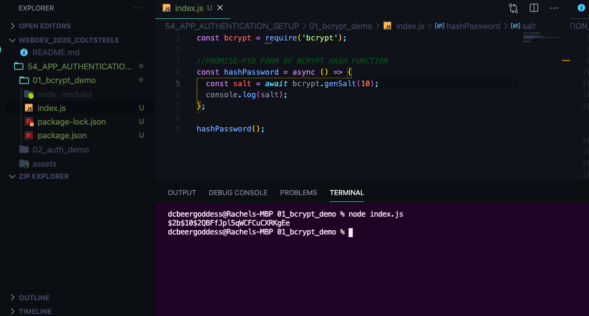
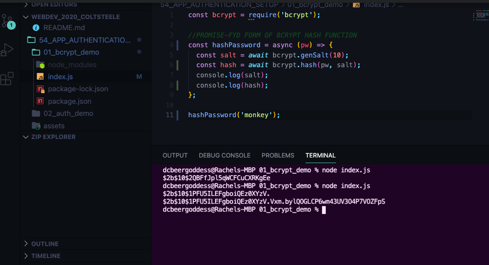
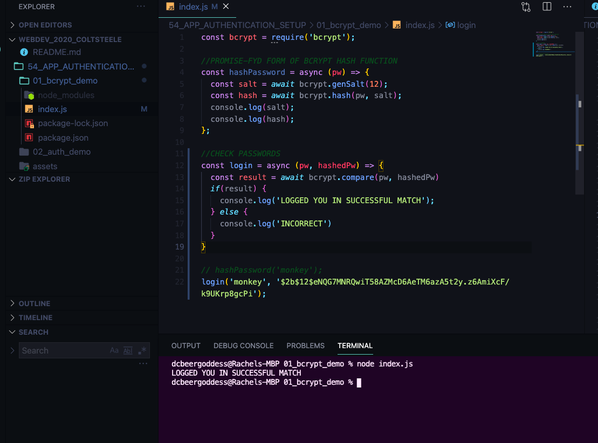
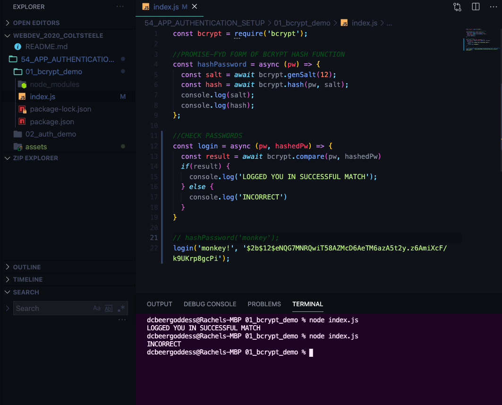
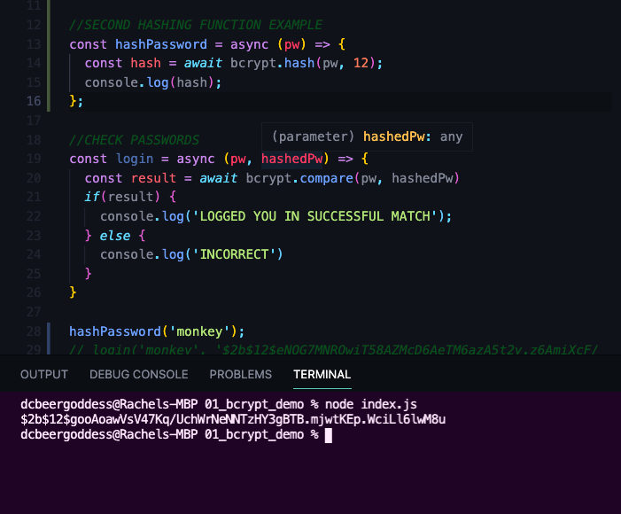
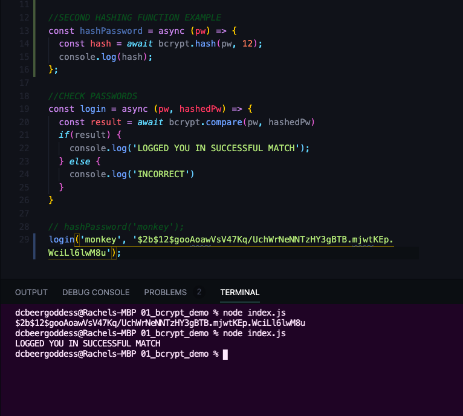
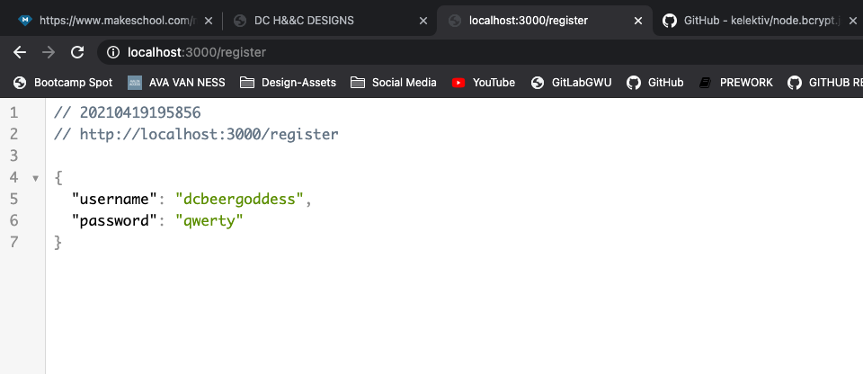
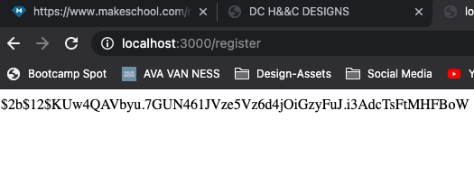
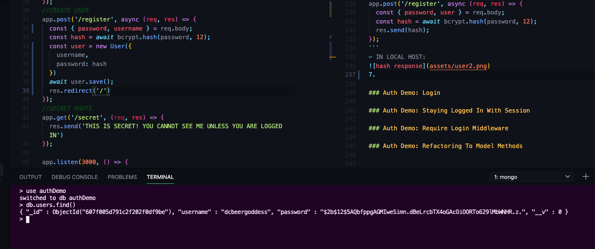

# Authentication From "Scratch"

## Crucial 

### * Authentication vs. Authorization
### * How To (Not) Store Passwords
### * Working With Bcrypt

<br>

## Important 

### * Auth Demo 
### * Understanding Hashing Functions
### * Password Salts

<br>

## Notes

<hr>

### Authentication vs. Authorization
- Overview of How Authentication Works --> Later we will implement `Passport` in YelpCamp to help implement Authentication --> allows you to authenticate using twitter, github, google, etc as well
- **Authentication**:
* The Process of verifying who a particular user is
* We typically authenticate with a username/password combo, but we can also use security questions, facial recognition, etc
- **Authorization**:
* Verifying what a specific user has access to
* Generally, we authorize after a user has been authenticated. "Now that we know who you are, here is what you are allowed to do and NOT allowed to do."

### How to (not) Store Passwords
- Username and Password
- NEVER STORE PASSWORDS IN TEXT IN DATABASE AS IT IS--> DISASTER
- WHAT DO WE DO INSTEAD??
- **HASHING** THE SOLUTION!
* Rather than storing a password in the database, we run the password through a **hashing function** first and then store the result in the database
* **Hashing Functions:** Functions that map input data of some arbitrary size to fixed-size output values

- when user logs in with password we run that password through the same algorithm, the same hashing function that we used to store the hashed password, that gives us an output and then we check if the two outputs are the same 


### Cryptographic Hashing Functions
* [Hash Function Wikipedia](https://en.wikipedia.org/wiki/Hash_function)
- hash table or hash map with 16 different outputs: 
 
* [Cryptographic Hash Functions](https://en.wikipedia.org/wiki/Cryptographic_hash_function)
1. One-way function which is infeasible to invert
2. Small change in input yields same output
3. Deterministic - same input yields same output
4. Unlikely to find 2 outputs with same value
5. Password Hash functions are deliberately SLOW
- EXAMPLE OF HASHING FUNCTION CALLED `SHA-1` --> small changes big difference in output:

- There are cryptographic hash functions that are FAST, used for digital signatures --> cookies --> FAST functions

### Password Salts
- AN EXTRA SAFEGUARD
- Need to remember that people use same password across websites, same passwords are used by different people, only couple of hash algorithms suitable for passwords (we are going to use `bcrypt`)
- [LIST OF MOST COMMON PASSWORDS](https://en.wikipedia.org/wiki/List_of_the_most_common_passwords)
- Possible if someone knew we were using bcrypt, to test common password and match to hash, possible to figure out all other passwords in database --> Reverse lookup table --> pre-compute ahead of time --> NEED SAFEGUARD
- **PASSWORD SALTS:** a random value added to the password before we hash it --> helps ensure unique hashes and mitigate common attacks
- take password and essentially `concatenate` it with some password salt
- QUICK EXAMPLE OF ADDING ON TO CHANGE HASH:
- 
- Usually store salt separately --> generate randomly --> add back on to get correct output 
- BCRYPT: Has functionality to add SALT and we won't need to store it separately

### Intro to Bcyrpt
- [BCYRPT PACKAGE](https://github.com/kelektiv/node.bcrypt.js)
- [BCRYPT WIKIPEDIA](https://en.wikipedia.org/wiki/Bcrypt)
- OUR HASH FUNCTION!
- `b` - [Blowfish (cipher)](https://en.wikipedia.org/wiki/Blowfish_(cipher))
* TWO DIFFERENT PACKAGES:
1. bcrypt - npm - (node.bcrypt.js): Does not work in browser -- server side only `node.js` -- built on top of c++ --> what we will be using
2. bcryptjs - npm: written entirely in JavaScript --> can run on the browser like axios --> we don't need it to run in browser
* Starting new exercise --> without express --> example of Methods we need to use for bcrypt:
1. `npm i bcrypt`
2. `const bcrypt = require('bcrypt');`
- Methods we are going to focus on: `genSalt()` & `hash()`
```js
//FROM GITHUB DOCS
bcrypt.genSalt(saltRounds, function(err, salt) {
    bcrypt.hash(myPlaintextPassword, salt, function(err, hash) {
        // Store hash in your password DB.
    });
});
```
- WE CAN USE PROMISES WITH THIS LIBRARY:
```js
//FROM GITHUB DOCS
async function checkUser(username, password) {
    //... fetch user from a db etc.

    const match = await bcrypt.compare(password, user.passwordHash);

    if(match) {
        //login
    }

    //...
}
```
-  `saltRounds`: number of rounds (difficulty level) for this hash --> AKA the amount of time it takes to compute a hash --> ideal goal is around 250 milliseconds
3. PROMISE-FYD FORM OF BCRYPT HASH FUNCTION:
```js
//PROMISE-FYD FORM OF BCRYPT HASH FUNCTION
const hashPassword = async () => {
  const salt = bcrypt.genSalt(10);
  console.log(salt);
};

hashPassword();
```
- IN TERMINAL:
- 
4. HASHING A PASSWORD:
```js
//PROMISE-FYD FORM OF BCRYPT HASH FUNCTION
const hashPassword = async (pw) => {
  const salt = await bcrypt.genSalt(10);
  const hash = await bcrypt.hash(pw, salt);
  console.log(salt);
  console.log(hash);
};

hashPassword('monkey');
```
- IN TERMINAL:
- 
- salt part of hashed result so we do not need to store it separately
- if change `10` to `17` --> takes considerably longer time to get response back
- `12` is Standard for right now 
-  Once we have a hashed password stored somewhere. How Do We Verify It? --> method called `compare()` 
```js
//FROM GITHUB DOCS
// Load hash from your password DB.
bcrypt.compare(myPlaintextPassword, hash, function(err, result) {
    // result == true
});
bcrypt.compare(someOtherPlaintextPassword, hash, function(err, result) {
    // result == false
});
```
5. CHECK PASSWORD EXAMPLE:
```js
//CHECK PASSWORDS
const login = async (pw, hashedPw) => {
  const result = await bcrypt.compare(pw, hashedPw)
  if(result) {
    console.log('LOGGED YOU IN SUCCESSFUL MATCH');
  } else {
    console.log('INCORRECT')
  }
}
```
- ran `hashPassword('monkey')` first to get passwords we will pretend we stored in a Database --> `$2b$12$eNQG7MNRQwiT58AZMcD6AeTM6azA5t2y.z6AmiXcF/k9UKrp8gcPi`
```js
// hashPassword('monkey');
login('monkey', '$2b$12$eNQG7MNRQwiT58AZMcD6AeTM6azA5t2y.z6AmiXcF/k9UKrp8gcPi');
```
- IN TERMINAL: 
- 
- 
- ANOTHER BCRYPT HASHING FUNCTION:
```js
//SECOND HASHING FUNCTION EXAMPLE --> GENERATES SALT FOR YOU
const hashPassword = async (pw) => {
  const hash = await bcrypt.hash(pw, 12);
  console.log(hash);
};
```
- IN TERMINAL: 
- 
- 

### Auth Demo: Setup
- BUILD SIMPLE EXPRESS APP --> where we can implement soe authentication using `bcrypt`
- Have Routes that you will not be able to view unless you are `logged-in`
1. `npm i express express-session ejs mongoose bcrypt`
2. `touch models/user.js` --> SET UP USER MODEL
3. SET UP EXPRESS APP in `index.js`
4. SET UP FORM FOR REGISTERING - `views/register.ejs`

### Auth Demo: Registering 
- Setup for route to submit data from Register Form
5. connect to mongoose, parse req.body, and test route to submit username and password
```js
const mongoose = require('mongoose')
const User = require('./models/user')

mongoose
  .connect('mongodb://localhost:27017/authDemo', { useNewUrlParser: true, useUnifiedTopology: true })
  .then(() => {
    console.log("MONGO CONNECTION OPEN");
  })
  .catch(err => {
    console.log("OH NO MONGO CONNECTION ERROR!");
    console.log(err);
  });

app.set('view engine', 'ejs');
app.set('views', 'views');

app.use(express.urlencoded({extended: true}));
```
- FORM:
```html
  <h1>SIGN UP!</h1>
  <form action="/register" method="POST">
    <div>
```
- ROUTE TEST FOR req.body
```js
app.post('/register', async (req, res) => {
  res.send(req.body);
})
```
- IN LOCAL HOST:


- Now we want to take that username and password and create a new user
- But not going to just take that password and save it to the model we are creating --> Use `bcrypt`
6. in `app.js` (for now to see all logic in one place) 
* `const bcrypt = require('bcrypt');`
* In Route to Post a User to a Database --> TEST HASH:
```js
//CREATE USER
app.post('/register', async (req, res) => {
  const { password, user } = req.body;
  const hash = await bcrypt.hash(password, 12);
  res.send(hash);
});
```
- IN LOCAL HOST:

7. Set up Logic to save User and hashed password to database
```js
//CREATE USER
app.post('/register', async (req, res) => {
  const { password, username } = req.body;
  const hash = await bcrypt.hash(password, 12);
  const user = new User({
    username,
    password: hash
  })
  await user.save();
  res.redirect('/')
});
```
- RESULT IN MONGO SHELL:


### Auth Demo: Login

### Auth Demo: Staying Logged In With Session

### Auth Demo: Require Login Middleware

### Auth Demo: Refactoring To Model Methods

