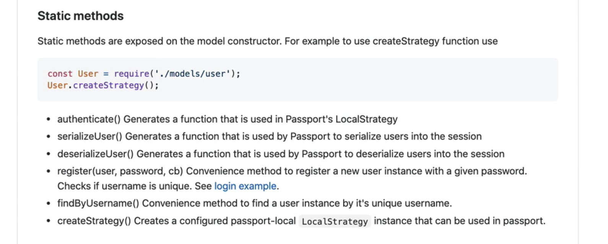
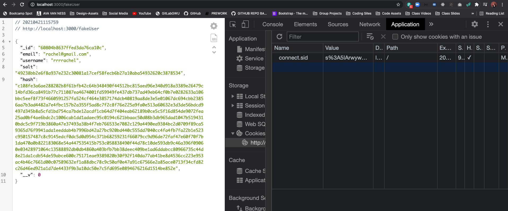
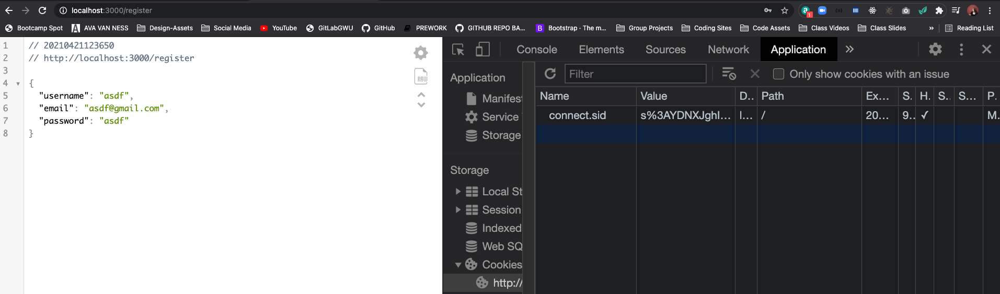
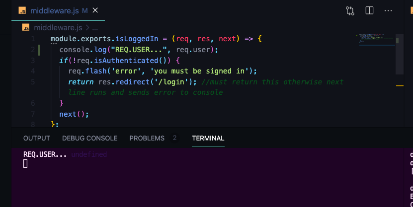
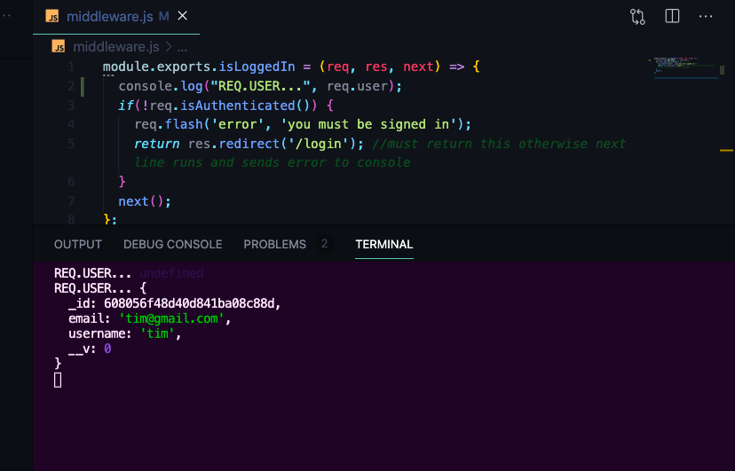
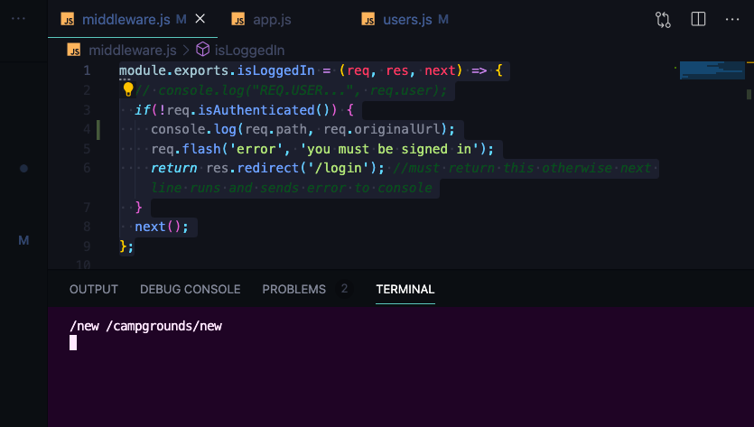
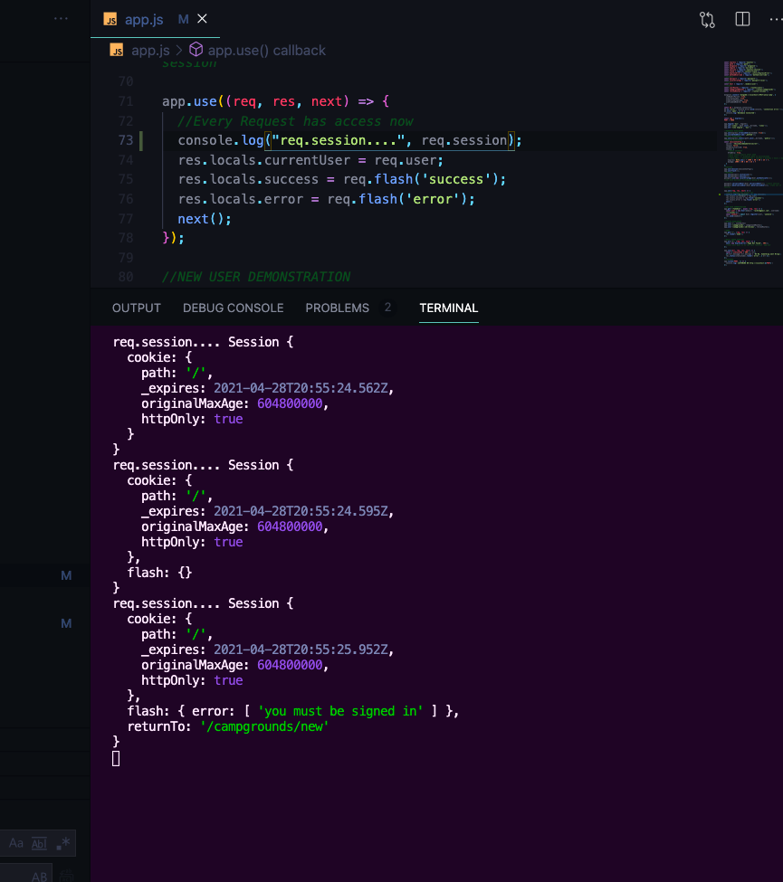
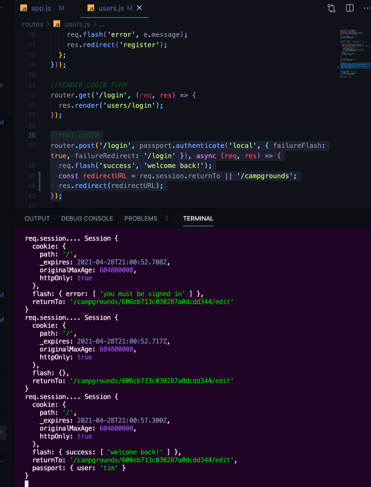
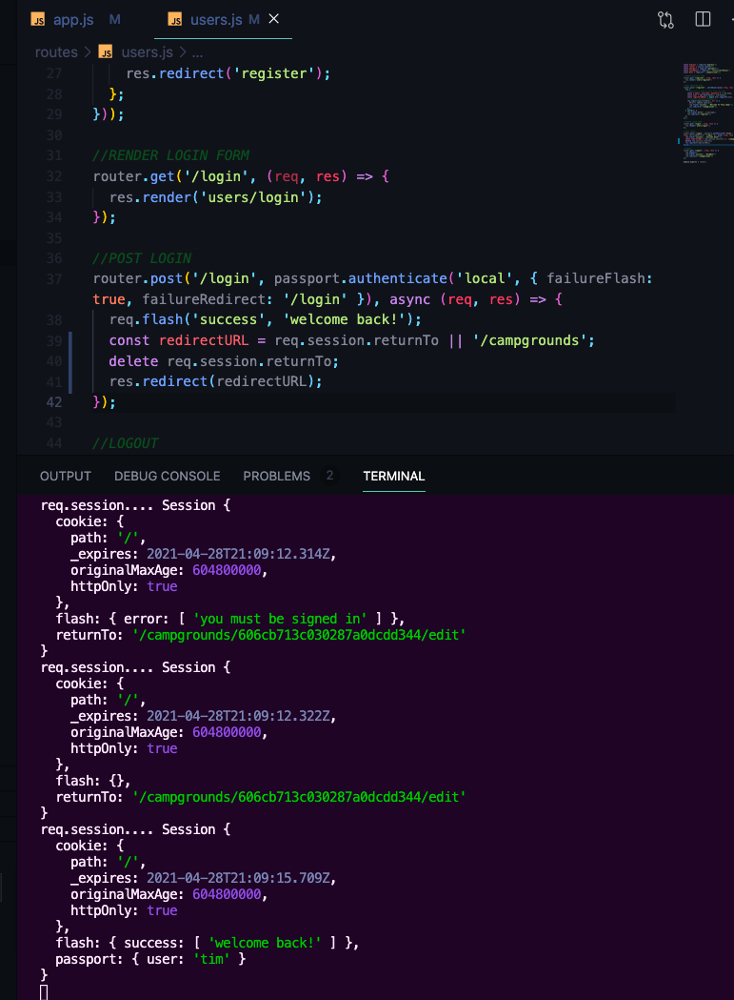

# YelpCamp: Adding Authentication
* [YelpCamp GITHUB CODE For this section](https://github.com/Colt/YelpCamp/tree/291b1146dfd2e0449b90aed6c3b20cdeda8a0485)

## Introduction to Passport
* [Passport Docs](http://www.passportjs.org/)
* [Passport-Local](https://github.com/jaredhanson/passport-local)
* [Passport-Local-Mongoose](https://github.com/saintedlama/passport-local-mongoose)
- Learned Authentication from Scratch to better understand how Passport is working in your APP --> better scalability --> create logins using twitter, google, facebook, etc. with `passport.js`
- It Hides Stuff if you don't understand what it does behind the scenes --> bcrypt --> hashing --> session --> passwords
- we are going to use `passport-local` --> one `strategy`
- INSTALL PASSPORT w/ PASSPORT-LOCAL & PASSPORT-LOCAL-MONGOOSE
1. `npm i passport passport-local passport-local-mongoose` 

## Creating Our User Model
- Create our User Model
- FROM PASSPORT-LOCAL MONGOOSE DOC:
```js
const mongoose = require('mongoose');
const Schema = mongoose.Schema;
const passportLocalMongoose = require('passport-local-mongoose');

const User = new Schema({});

User.plugin(passportLocalMongoose);

module.exports = mongoose.model('User', User);
```
* FOR YelpCamp:
1. `touch models/user.js`
```js
const mongoose = require('mongoose');
const Schema = mongoose.Schema;
const passportLocalMongoose = require('passport-local-mongoose');

//DEFINE USER SCHEMA
const UserSchema = new Schema({
  email: {
    type: String,
    required: true,
    unique: true
  }
});
//THIS WILL ADD onto our schema --> username --> field for password --> make sure usernames are unique --> and give us some additional methods that we can use
UserSchema.plugin(passportLocalMongoose);

module.exports = mongoose.model('User', userSchema);
```

## Configuring Passport
- Our `app.js` is getting a little heavy --> eventually break up a lot of what is in here, but for now...
1. set up passport in `app.js`
* FEW LINES TO REQUIRE IN AT TOP OF FILE
```js
const passport = require('passport');
const LocalStrategy = require('passport-local');
```
* SET UP MIDDLEWARE --> Make sure it is after `app.use` for `session`
```js
app.use(passport.initialize());
app.use(passport.session());
```
* Require in `User` model to `app.js` --> for next line
```js
//PASSPORT
app.use(passport.initialize());
app.use(passport.session());
passport.use(new LocalStrategy(User.authenticate()));
```
- FROM PASSPORT DOCS:
- 
- A few more methods to add in `app.js`
```js
//PASSPORT
app.use(passport.initialize());
app.use(passport.session());
passport.use(new LocalStrategy(User.authenticate())); 
//Can have multiple strategies going at once

passport.serializeUser(User.serializeUser()); //start session
passport.deserializeUser(User.deserializeUser()); //Take out of session
```
* Demonstrate creation of new user with following route --> `register` method in passport --> pass in new user object and a password (will hash password and store it --> need to await it since it will take time)
```js
//NEW USER DEMONSTRATION
app.get('/fakeUser', async (req, res) => {
  const user = new User({email: 'rachel@gmail.com', username: 'rrrrachel'});
  const newUser = await User.register(user, 'jasmine');
  res.send(newUser);
});
```
* HIT ROUTE IN LOCAL HOST:

* Uses Hash Algorithm `Pbkdf2` --> Platform independent

## Register Form
* Set up Simple and Ugly Register Form 
- `/register` --> FORM
- `POST /register` --> CREATE A USER
1. `touch routes/users.js`
```js
const express = require('express');
const router = express.Router();
const passport = require('passport');
const catchAsync = require('../utils/catchAsync')
const User = require('../models/user');

//RENDER FORM
router.get('/register', (req, res) => {
  res.render('users/register')
});

module.exports = router;
```
2. `mkdir views/users`
3. `touch views/users/register.ejs`
```html
<h1>REGISTER!</h1>
```
4. require routes in `app.js` and set up middleware
```js
//routers
const userRoutes = require('./routes/users')
const campgroundRoutes = require('./routes/campgrounds');
const reviewRoutes = require('./routes/reviews');
```
```js
//ROUTER MIDDLEWARE
app.use('/', userRoutes)
app.use('/campgrounds', campgroundRoutes);
app.use('/campgrounds/:id/reviews', reviewRoutes);
```
5. Test to see that `register.ejs` template shows up in local host when you hit the register route
* NEW EJS TEMPLATE FOR REGISTER
```html
<% layout('layouts/boilerplate') %> 
<h1>Register</h1>
<form action="/register" method="POST" class="validate-form" novalidate>
  <div class="mb-3">
    <label class="form-label" for="username">Username</label>
    <input class="form-control" type="text" id="username" name="username" required>
    <div class="valid-feedback">
      Looks Good!
    </div>
  </div>
  <div class="mb-3">
    <label class="form-label" for="email">Email</label>
    <input class="form-control" type="email" id="email" name="email" required>
    <div class="valid-feedback">
      Looks Good!
    </div>
  </div>
  <div class="mb-3">
    <label class="form-label" for="password">Password</label>
    <input class="form-control" type="password" id="password" name="password" required>
    <div class="valid-feedback">
      Looks Good!
    </div>
  </div>
  <button class="btn btn-success">Register</button>
</form>
```
6. Set up post route for register
```js
//POST FORM
router.post('/register', async (req, res) => {
  res.send(req.body); //TEST TO MAKE SURE WE ARE GETTING EVERYTHING WE SENT
})
```
7. TEST IN LOCAL HOST:
* 

## Register Route Logic
- Make a Basic User Model Instance in post route --> use passport method `register(userObject, password)`:
```js
//POST FORM
router.post('/register', async (req, res) => {
  //destructure what we want from req.body
  const { email, username, password } = req.body; 
  const user = new User({email, username});
  const registeredUser = await User.register(user, password);
  console.log(registeredUser);
  req.flash('success', 'Welcome To Yelp Camp!');
  res.redirect('/campgrounds');
});
```
* Try Making new User to test
- 
- Still are things that can go wrong --> mongoose errors for unique username, etc 
8. Set up `catchAsync` in `routes/users.js` to wrap around post user route
```js
const catchAsync = require('../utils/catchAsync')
```
9. Set it up so it doesn't display error on new page for user, rather we want to flash message on same page --> set up another try and catch --> to catch it ourselves and handle in a new way:
```js
//POST FORM
router.post('/register', catchAsync(async (req, res) => {
  try {
    //destructure what we want from req.body
    const { email, username, password } = req.body; 
    const user = new User({email, username});
    const registeredUser = await User.register(user, password);
    // console.log(registeredUser);
    req.flash('success', 'Welcome To Yelp Camp!');
    res.redirect('/campgrounds');
  } catch(e) {
    req.flash('error', e.message);
    res.redirect('register');
  };
}));
```

## Login Routes
1. in `routes/users.js` set up render route
```js
//RENDER LOGIN FORM
router.get('/login', (req, res) => {
  res.render('users/login');
});
```
2. duplicate register template for login form --> no longer need email
3. use passport middleware method on login POST route -- `passport.authenticate`, you can set up multiple post routes to authenticate for google, twitter, etc --> we have some options we can specify in an object
```js
//POST LOGIN
router.post('/login', passport.authenticate('local', { failureFlash: true, failureRedirect: '/login' }), async (req, res) => {
  req.flash('success', 'welcome back!');
  res.redirect('/campgrounds');
})
```

## isLoggedIn Middleware
- Need to check to see if someone is isLoggedIn
- Passport gives us a helper method --> isAuthenticated
- Try in --> make a new campground route:
```js
//NEW FORM
router.get('/new', (req, res) => {
  res.render('campgrounds/new');
});
```
- Test that works in local host
- Now let's move this logic into a middleware we can use over multiple routes
- MOVE MIDDLEWARE TO NEW FILE
- in root directory `touch middleware.js`
```js
module.exports.isLoggedIn = (req, res, next) => {
  if(!req.isAuthenticated()) {
    req.flash('error', 'you must be signed in');
    return res.redirect('/login'); //must return this otherwise next line runs and sends error to console
  }
  next();
};
```
- require into campground routes file
```js
const { campgroundSchema } = require('../schemas.js');
const { isLoggedIn } = require('../middleware');
```
- add to routes you want to protect
```js
//NEW FORM
router.get('/new', isLoggedIn, (req, res) => {
  res.render('campgrounds/new');
});
```
- protect routes that could be found using postman, etc.

## Adding Logout
- Give user the ability to log out --> w/ passport --> method added to req object automatically called login, there's also logout
1. in `routes/users.js`
```js
//LOGOUT
router.get('/logout', (req, res) => {
  req.logout();
  req.flash('success', "GoodBye!")
  res.redirect('/campgrounds');
});
```
- might eventually want to check to make sure user is logged in in order to hit logout route
2. ADD BUTTON TO NAVBAR FOR LOGOUT AND LOGIN --> `views/partials/navbar.ejs`
```html
    <div class="collapse navbar-collapse" id="navbarNavAltMarkup">
      <div class="navbar-nav">
        <a class="nav-link" href="/">Home</a>
        <a class="nav-link" href="/campgrounds">Campgrounds</a>
        <a class="nav-link" href="/campgrounds/new">New Campgrounds</a>
      </div>
      <!-- ml-auto: move to other side of page -->
      <!-- ml-auto class did not work, inline style working -->
      <div class="navbar-nav" style="margin-left: auto;">
        <a class="nav-link" href="/login">Login</a>
        <a class="nav-link" href="/register">Register</a>
        <a class="nav-link" href="/logout">Logout</a>
      </div>
    </div>
```
- Now we will need to add logic to hide proper links depending on status of isLoggedIn

## currentUser Model
- hide and show items based on status of user login
1. in `middleware.js` lets try printing out the user
```js
module.exports.isLoggedIn = (req, res, next) => {
  console.log("REQ.USER...", req.user);
  if(!req.isAuthenticated()) {
    req.flash('error', 'you must be signed in');
    return res.redirect('/login'); //must return this otherwise next line runs and sends error to console
  }
  next();
};
```
- When you try to hit protected route:

- When you log in and hit protected route:

2. In `app.js` under other `res.locals` that our app has access to, add global logic access:
```js
app.use((req, res, next) => {
  //Every Request has access now
  res.locals.currentUser = req.user; 
  res.locals.success = req.flash('success');
  res.locals.error = req.flash('error');
  next();
});
```
3. NOW IN `views/partials/navbar.ejs` --> check to see if currentUser = undefined:
```html
      <div class="navbar-nav" style="margin-left: auto;">
        <% if (!currentUser) { %>
          <a class="nav-link" href="/login">Login</a>
          <a class="nav-link" href="/register">Register</a>
        <% } else {%>
          <a class="nav-link" href="/logout">Logout</a>
        <% } %>
      </div>
```
## Fixing Register Route
- Right now after you register you have to login in --> not logged in automatically at the moment
- When user registers --> we want to log the user in --> helper method for passport --> `login()`
1. Automatically login the registered user after they register:
```js
//POST REGISTER FORM
router.post('/register', catchAsync(async (req, res) => {
  try {
    //destructure what we want from req.body
    const { email, username, password } = req.body; 
    const user = new User({email, username});
    const registeredUser = await User.register(user, password);
    // console.log(registeredUser);
    req.login(registeredUser, err => {
      if(err) return next(err) 
      req.flash('success', 'Welcome To Yelp Camp!');
      res.redirect('/campgrounds');
    });
  } catch(e) {
    req.flash('error', e.message);
    res.redirect('register');
  };
}));
```
- Now When you Register you will be automatically logged in

## ReturnTo Behavior
- [SOLUTION FOR SMALL BUG IN CODE](https://www.youtube.com/watch?v=g7SaXCYCgXU)
- Redirect User back to where they were trying to go
- Keep track of where a user was initialing requesting
1. Store Url they are requesting --> then we can redirect them based on that property
```js
module.exports.isLoggedIn = (req, res, next) => {
  // console.log("REQ.USER...", req.user);
  if(!req.isAuthenticated()) {
    //store the url they are requesting!
    req.flash('error', 'you must be signed in');
    return res.redirect('/login'); //must return this otherwise next line runs and sends error to console
  }
  next();
};
```
- Store on the session for state-fullness
2. Figure out what we need to save:
```js
module.exports.isLoggedIn = (req, res, next) => {
  // console.log("REQ.USER...", req.user);
  if(!req.isAuthenticated()) {
    console.log(req.path, req.originalUrl);
    req.flash('error', 'you must be signed in');
    return res.redirect('/login'); //must return this otherwise next line runs and sends error to console
  }
  next();
};
```
- IN TERMINAL:

- WE WANT TO STORE THE `originalUrl`
3. Set up in `middleware.js`
```js
module.exports.isLoggedIn = (req, res, next) => {
  // console.log("REQ.USER...", req.user);
  if(!req.isAuthenticated()) {
    req.session.returnTo = req.originalUrl
    req.flash('error', 'you must be signed in');
    return res.redirect('/login'); //must return this otherwise next line runs and sends error to console
  }
  next();
};
```
4. in middleware in `app.js` - `console.log(req.session)` to see what's going on:
```js
app.use((req, res, next) => {
  //Every Request has access now
  console.log(req.session);
  res.locals.currentUser = req.user;
  res.locals.success = req.flash('success');
  res.locals.error = req.flash('error');
  next();
});
```
- In Terminal - got to campgrounds --> nothing in session --> try and make new campground and session includes `returnTo: /campgrounds/new`:
- 
5. in `routes/users.js` --> test what we get back in POST Login Route:
```js
//POST LOGIN
router.post('/login', passport.authenticate('local', { failureFlash: true, failureRedirect: '/login' }), async (req, res) => {
  req.flash('success', 'welcome back!');
  const redirectURL = req.session.returnTo || '/campgrounds';
  res.redirect(redirectURL);
});
```
- IN TERMINAL:
- 
- We don't want returnTo to stay in session so after you redirect user: 
```js
//POST LOGIN
router.post('/login', passport.authenticate('local', { failureFlash: true, failureRedirect: '/login' }), async (req, res) => {
  req.flash('success', 'welcome back!');
  const redirectURL = req.session.returnTo || '/campgrounds';
  delete req.session.returnTo;
  res.redirect(redirectURL);
});
```
- IN TERMINAL:
- 

- BUG IN CODE --> try to add new campground --> decide you don't want to login in --> move around on page --> then decide to login --> directed back to new campground page --> not what we want
- move this code `req.session.returnTo = req.originalUrl` in `middleware.js` to `app.js` middleware:
```js
app.use((req, res, next) => {
  //Every Request has access now
  //if you are not coming from these two routes..., if req.originalUrl does not include one of these then..
  if(!['/login', '/'].includes(req.originalUrl)) {
    req.session.returnTo = req.originalUrl 
  }
  console.log("req.session....", req.session);
  res.locals.currentUser = req.user;
  res.locals.success = req.flash('success');
  res.locals.error = req.flash('error');
  next();
});
```
