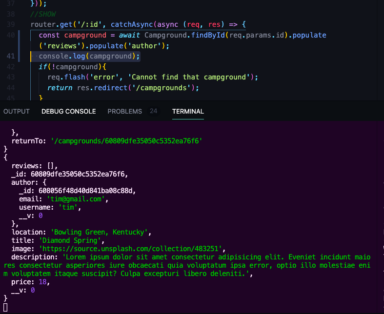
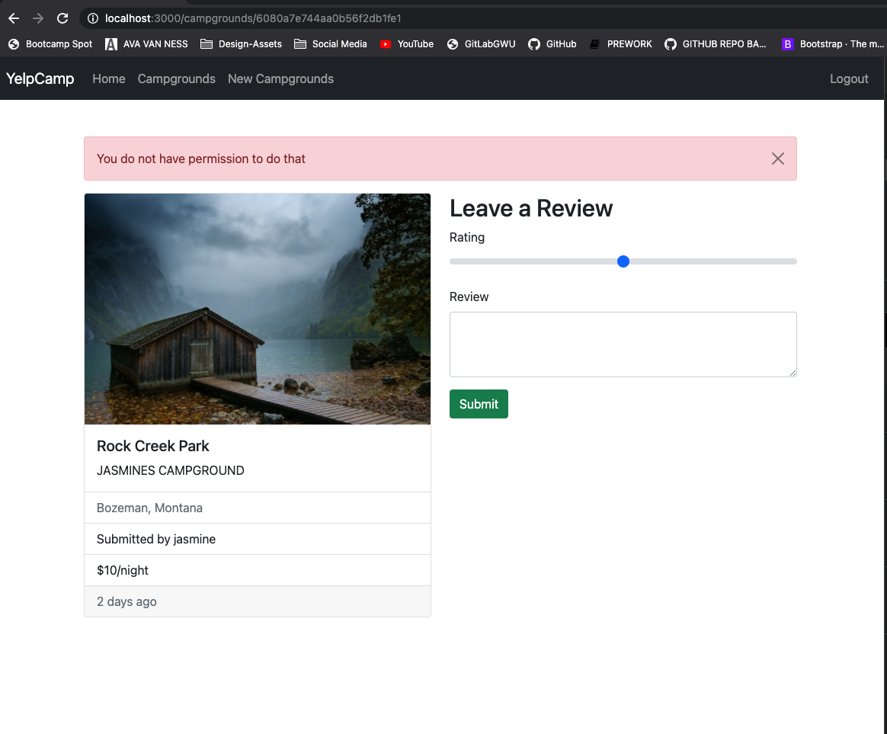
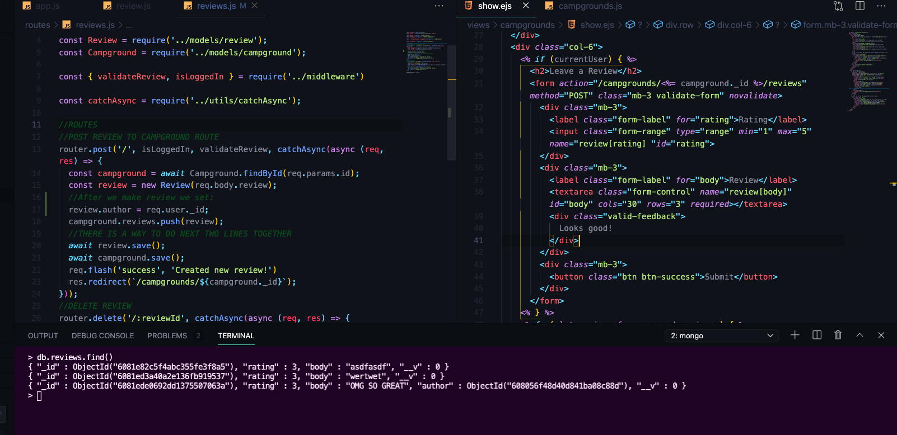
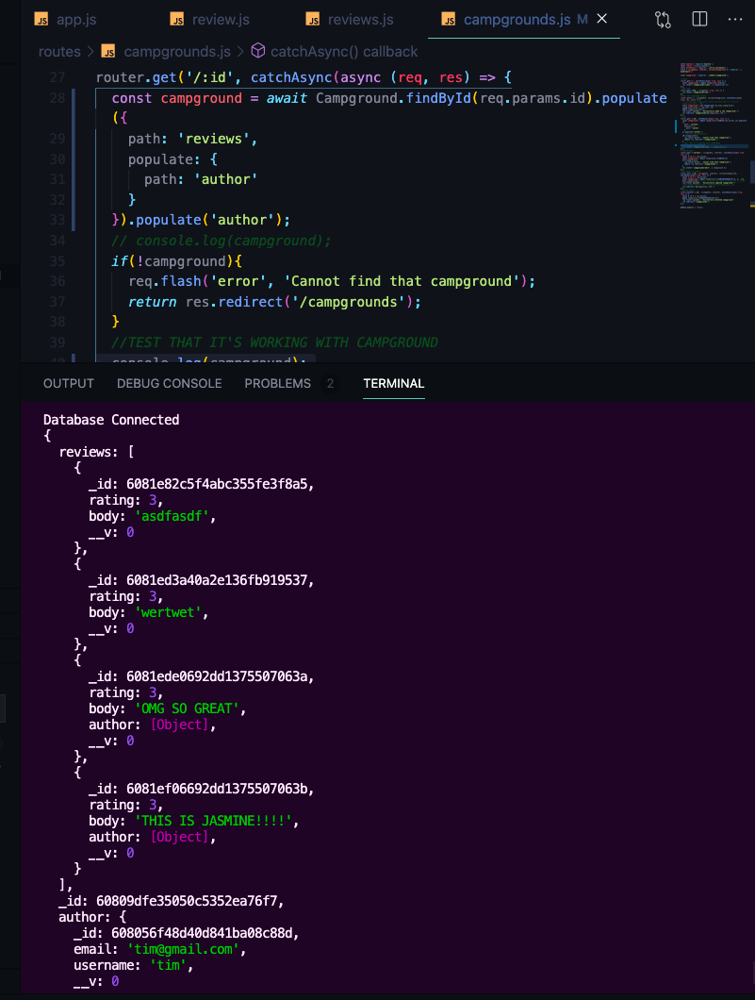
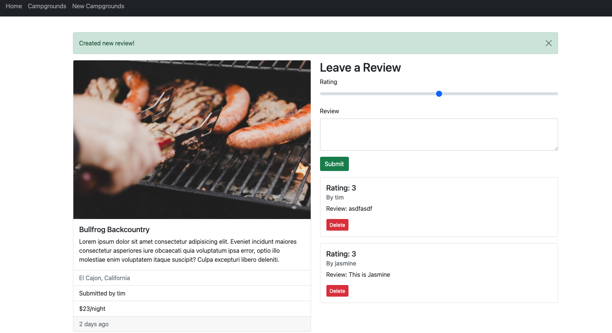

# YelpCamp: Basic Authorizaation
* [GITHUB CODE FOR SECTION](https://github.com/Colt/YelpCamp/tree/40d8f37a93d140b53a59ee847e3bed3aeb94ecc4)

## Adding an Author to Campground
- Connect User Model to Particular Campgrounds and Particular Reviews
- in Campground Model:
```js
//CREATE SCHEMA
const CampgroundSchema = new Schema ({
  title: String,
  image: String,
  price: Number,
  description: String,
  location: String,
  author: {
    type: Schema.Types.ObjectId,
    ref: 'User'
  },
  reviews: [
    {
      type: Schema.Types.ObjectId,
      ref: 'Review'
    }
  ]
});
```
- Grab ID of user from database `608056f48d40d841ba08c88d` and use in `seeds/index.js` to attach author to new seeded DB:
```js
const camp = new Campground({
  author: '608056f48d40d841ba08c88d',
    location: `${cities[random1000].city}, ${cities[random1000].state}`,
    title: `${sample(descriptors)} ${sample(places)}`, 
    image: 'https://source.unsplash.com/collection/483251',
    description: 'Lorem ipsum dolor sit amet consectetur adipisicing elit. Eveniet incidunt maiores consectetur asperiores iure obcaecati quia voluptatum ipsa error, optio illo molestiae enim voluptatem itaque suscipit? Culpa excepturi libero deleniti.',
    price //shorthand do not need price: price 
});
```
- add author to show page for campgrounds:
1. need to populate to get author in campground show route:
```js
router.get('/:id', catchAsync(async (req, res) => {
  const campground = await Campground.findById(req.params.id).populate('reviews').populate('author');
  if(!campground){
      console.log(campground); //TEST OUTPUT
    req.flash('error', 'Cannot find that campground');
    return res.redirect('/campgrounds');
  }
  //TEST THAT IT'S WORKING WITH CAMPGROUND
  // console.log(campground);
  res.render('campgrounds/show', { campground });
}));
```
- IN TERMINAL:
- 
- we know have access to username under the key `author`
2. In Show Campground Template:
```html
     <ul class="list-group list-group-flush">
        <li class="list-group-item text-muted"><%= campground.location %></li>
        <li class="list-group-item">Submitted by <%= campground.author.username %></li>
        <li class="list-group-item">$<%= campground.price %>/night</li>
      </ul>
```
3. Update our Campground Route where we create a campground, associate the campground being created with the currently logged in user because we are verifying that a user is logged in
```js
//POST NEW CAMPGROUND ROUTE
router.post('/', isLoggedIn, validateCampground, catchAsync(async (req, res, next) => {
  // if(!req.body.campground) throw new ExpressError('Invalid Campground Data', 400);
  const campground = new Campground(req.body.campground);
  campground.author = req.user._id;
  await campground.save();
  req.flash('success', 'Successfully made a new campground!');
  res.redirect(`campgrounds/${campground._id}`);
}));
```

## Showing and Hiding Edit/Delete
- Update to only see edit/delete buttons if you are the author
- AUTHORIZATION
- TWO THINGS: 
1. Don't show these buttons unless you are logged in as author of campground: Add logic into show template using `campground.author` and `currentUser._id`
- `campground.author.equals(currentUser._id)` --> will break things if no user is logged in w/ out checking if currentUser exists first
```html
    <% if (currentUser && campground.author.equals(currentUser._id)) { %>
        <div class="card-body">
          <a class="card-link btn btn-info" href="/campgrounds/<%= campground._id %>/edit ">Edit Campground</a>
          <form class="d-inline" action="/campgrounds/<%=campground._id%>?_method=DELETE" method="POST">
            <button class="btn btn-danger">Delete</button>
          </form>
        </div>
      <% } %>
```
- 2. Protect Routes on Backend --> someone could send delete, patch, put request if they are not the owner (Postman, etc.)  

## Campground Permissions
- Right now you can send request via Postman or just add edit into path in localhost -> also able to delete and more via Postman
- Before we update anything does this campground have the same author id as the currently logged in user:
1. Need to break logic in update campground route up --> find campground first --> then check to see if we are allowed to update based on if the id of the current user matches the author id in the model:
```js
//PUT ROUTE TO UPDATE
router.put('/:id', isLoggedIn, validateCampground, catchAsync(async (req, res) => {
  const { id } = req.params;
  const campground = await Campground.findById(id);
  if(!campground.author.equal(req.user._id)) {
    req.flash('error', 'You do not have permission to do that');
    return res.redirect(`/campgrounds/${id}`); //return to make sure it works and none of the other code runs
  }
  const camp = await Campground.findByIdAndUpdate(id, {...req.body.campground}); //this is janky but check to make sure it works
  req.flash('success', 'Successfully updated campground!')
  res.redirect(`${campground._id}`);
}));
```
- try to hit edit route on our own hitting it in the path to update a campground you did not create:
- 
- Sign in as user for campground:
- 
2. Can add it to other routes --> Move logic into it's own middleware `isAuthor`

## Authorization Middleware
- Add Middleware logic for `isAuthor` in campground routes for now
1. Middleware for `isAuthor` in `routes/campgrounds.js`
```js
//MIDDLEWARE --> isAuthor
const isAuthor = async (req, res, next) => {
  const { id } = req.params;
  const campground = await Campground.findById(id);
  if(!campground.author.equals(req.user._id)) {
    req.flash('error', 'You do not have permission to do that');
    return res.redirect(`/campgrounds/${id}`); 
  }
  next();
};
```
2. Add to Edit Form Route, Update Route, and Delete Route for Campgrounds
3. MOVE `routes/campgrounds.js` TO `middleware.js`
```js
//JOI VALIDATION
module.exports.validateCampground = (req, res, next) => {
  const { error } = campgroundSchema.validate(req.body);
  if(error){
    const msg = error.details.map(el => el.message).join(',')
    throw new ExpressError(msg, 400)
  } else {
    next();
  }
};
//MIDDLEWARE --> isAuthor
module.exports.isAuthor = async (req, res, next) => {
  const { id } = req.params;
  const campground = await Campground.findById(id);
  if(!campground.author.equals(req.user._id)) {
    req.flash('error', 'You do not have permission to do that');
    return res.redirect(`/campgrounds/${id}`); 
  }
  next();
};
```

## Reviews Permissions
- Associate a User w/ Reviews --> have to be logged in to see review form, make a review, and connect it to the author
1. in `models/review.js`
```js
//Create Schema
const reviewSchema = new Schema({
  body: String, //TEXT
  rating: Number, //probably 1-5
  author: {
    type: Schema.Types.ObjectId,
    ref: 'User'
  }
});
```
2. in campgrounds show ejs template/campground show page route::
- render form only if there is a current user:
```html
    <% if (currentUser) { %>
      <h2>Leave a Review</h2>
      <form action="/campgrounds/<%= campground._id %>/reviews" method="POST" class="mb-3 validate-form" novalidate>
        <div class="mb-3">
          <label class="form-label" for="rating">Rating</label>
          <input class="form-range" type="range" min="1" max="5" name="review[rating] "id="rating">
        </div>
        <div class="mb-3">
          <label class="form-label" for="body">Review</label>
          <textarea class="form-control" name="review[body]" id="body" cols="30" rows="3" required></textarea>
          <div class="valid-feedback">
            Looks good!
          </div>
        </div>
        <div class="mb-3">
          <button class="btn btn-success">Submit</button>
        </div>
      </form>
    <% } %>
```
- need to also make sure we can't do anything behind the scenes

2. Go to review routes -- import `isLoggedIn` from `middleware.js`:
```js
const { validateReview, isLoggedIn } = require('../middleware')
```
3. Add to routes
4. Associate reviews w/ user
```js
//ROUTES
//POST REVIEW TO CAMPGROUND ROUTE
router.post('/', isLoggedIn, validateReview, catchAsync(async (req, res) => {
  const campground = await Campground.findById(req.params.id);
  const review = new Review(req.body.review);
  //After we make review we set:
  review.author = req.user._id;
  campground.reviews.push(review);
  //THERE IS A WAY TO DO NEXT TWO LINES TOGETHER
  await review.save();
  await campground.save();
  req.flash('success', 'Created new review!')
  res.redirect(`/campgrounds/${campground._id}`);
}));
```
- CHECK IN MONGO SHELL AFTER MAKING A NEW REVIEW
- 

## More Reviews Authorization
* Show User on Review Show Page --> populate reviews on campground models --> in addition for each review we want to populate it's author
- provide object to populate and set path:'reviews'
```js
//SHOW
router.get('/:id', catchAsync(async (req, res) => {
  const campground = await Campground.findById(req.params.id).populate({
    path: 'reviews',
    populate: {
      path: 'author'
    }
  }).populate('author');
  console.log(campground);
  if(!campground){
    req.flash('error', 'Cannot find that campground');
    return res.redirect('/campgrounds');
  }
  res.render('campgrounds/show', { campground });
}));
```
- Refresh Campground Page and look in Console:
- 
- You do need to ask yourself how you are using your data for scalability --> maybe we only need the username and not all the data that comes with author, might just want to store the username on each review --> limit the amount of reviews we can populate --> paginate it, or infinite scroll and get more as you scroll
* FOR EJS TEMPLATE SHOWING REVIEWS: 
- got error when there were reviews in database that did not have a username!!! FYI
```html
    <% for( let review of campground.reviews ) { %>
      <div class="card mb-3">
        <div class="card-body">
          <h5 class="card-title">Rating: <%= review.rating %> </h5>
          <h6 class="card-subtitle mb-2 text-muted">By <%= review.author.username %> </h6>
          <p class="card-text">Review: <%= review.body %> </p>
          <form action="/campgrounds/<%=campground._id%>/reviews/<%=review._id%>?_method=DELETE" method="POST">
            <button class="btn btn-sm btn-danger">Delete</button>
          </form>
        </div>
      </div>
    <% } %>
```
- 
* Protect delete route for users own reviews
```html
  <h6 class="card-subtitle mb-2 text-muted">By <%= review.author.username %> </h6>
  <p class="card-text">Review: <%= review.body %> </p>
  <% if (currentUser && review.author.equals(currentUser._id)) { %>
    <form action="/campgrounds/<%=campground._id%>/reviews/<%=review._id%>?_method=DELETE" method="POST">
      <button class="btn btn-sm btn-danger">Delete</button>
    </form>
  <% } %>
```
* STILL NEED TO PROTECT DELETE ROUTE FROM BAD ACTORS!!! --> or that you own the review
- Create Middleware for `isReviewAuthor`
- `/campgrounds/id/reviews/reviewID`
```js
//MIDDLEWARE --> isReviewAuthor
module.exports.isReviewAuthor = async (req, res, next) => {
  const { id, reviewId } = req.params;
  const review = await Review.findById(reviewId);
  if(!review.author.equals(req.user._id)) {
    req.flash('error', 'You do not have permission to do that');
    return res.redirect(`/campgrounds/${id}`); 
  }
  next();
};
```
- Add middleware to delete route for protection
```js
//DELETE REVIEW
router.delete('/:reviewId', isLoggedIn, isReviewAuthor, catchAsync(async (req, res) => {
  //DESTRUCTURE FROM REQ.PARAMS
  const { id, reviewId } = req.params;
  await Campground.findByIdAndUpdate(id, { $pull: { reviews: reviewId } });
  await Review.findByIdAndDelete(reviewId);
  req.flash('success', 'Successfully deleted review')
  res.redirect(`/campgrounds/${id}`);
}));
```

