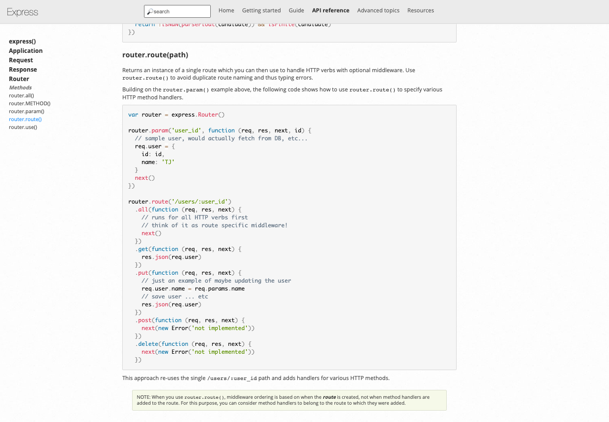
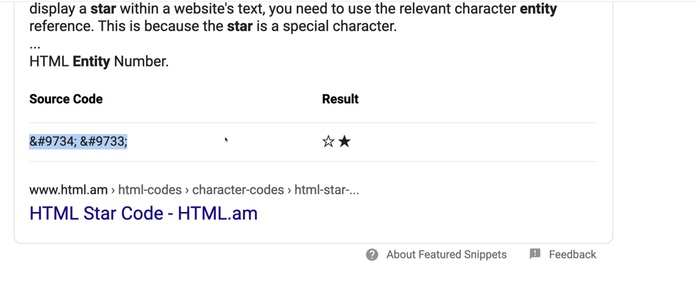
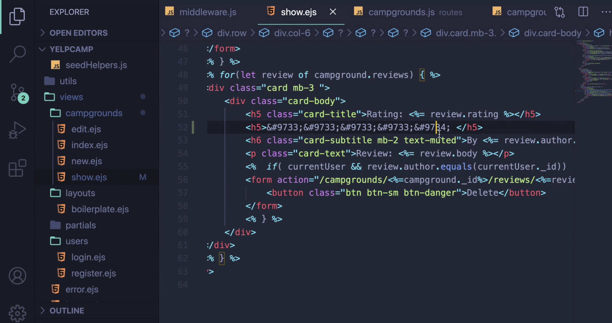

# YelpCamp: Controllers & Star Ratings
* [GITHUB CODE FOR SECTION](https://github.com/Colt/YelpCamp/tree/e8357458ec6df5a9c97d4bef4d5671ed8d1e760a)

## Refactoring To Campgrounds Controller
- Breaking some logic out of our routes --> still have more functionality to add
- Pattern is not unique to Express
- Controllers --> files that export an object where we move some functionality
* MVC --> controllers --> a pattern --> Model View Controller
* `mkdir controllers`
* `touch controllers/campgrounds.js`
- For Get All Campgrounds Route
```js
const Campground = require('../models/campground');

module.exports.index = async (req, res) => {
  const campgrounds = await Campground.find({});
  res.render('campgrounds/index', { campgrounds });
}
```
- in `routes/campgrounds.js`
```js
const campgrounds = require('../controllers/campgrounds')
```
- now we have a controller object with a bunch of methods on it available to us
```js
//INDEX
router.get('/', catchAsync(campgrounds.index));
```

## Adding a Reviews Controller
- Duplicate same process for users and reviews controller
* Example of new file structure and controller logic for Users
- 

## A Fancy Way to Restructure Routes
- Grouping routes together
- [EXPRESS ROUTER DOCS](https://expressjs.com/en/4x/api.html#router)
- 
- EXAMPLE OF RESTRUCTURED CAMPGROUND ROUTES:
```js
const express = require('express');
const router = express.Router();
const campgrounds = require('../controllers/campgrounds');
const catchAsync = require('../utils/catchAsync');
const { isLoggedIn, isAuthor, validateCampground } = require('../middleware');

router.route('/')
  .get(catchAsync(campgrounds.index))
  .post(isLoggedIn, validateCampground, catchAsync(campgrounds.createCampground));

//NEW FORM --> needs to be before /:id
router.get('/new', isLoggedIn, campgrounds.renderNewForm);

router.route('/:id')
  .get(catchAsync(campgrounds.showCampground))
  .put(isLoggedIn, isAuthor, validateCampground, catchAsync(campgrounds.updateCampground))
  .delete(isLoggedIn, isAuthor, catchAsync(campgrounds.deleteCampground));

//UPDATE FORM
router.get('/:id/edit', isLoggedIn, isAuthor, catchAsync(campgrounds.renderEditForm));
```
- a little more restructuring to make our code look cleaner:
```js
router.route('/:id')
  .get(catchAsync(campgrounds.showCampground))
  .put(isLoggedIn, 
    isAuthor, 
    validateCampground, 
    catchAsync(campgrounds.updateCampground))
  .delete(isLoggedIn, 
    isAuthor, 
    catchAsync(campgrounds.deleteCampground));
```

## Displaying Star Ratings
* [Starability CSS](https://github.com/LunarLogic/starability)
- Can do by scratch --> loop over and do manually
* 
- So we could do this... but we are not:
* 
- would have to loop over and figure out how many entity codes to display and also does not help with accessibility when it comes to showing the stars
- USE STARABILITY CSS FILE
* Allow a user to rate using rate selector
* Copy code from github and add stylesheet for basic starts in public folder
- in show campground template test css file:
```html
  <h3>Rated element name</h3>
  <p class="starability-result" data-rating="3">
    Rated: 3 stars
  </p>
```
- Change data-rating to be review.rating
```html
  <h3>Rated element name</h3>
  <p class="starability-result" data-rating="<%= review.rating %>">
    Rated: <%= review.rating %>
  </p>
```

## Star Rating Form
-  Replace slider with some nice starts where we can just click
- Do not need javaScript for this to work
- Need to copy some important `HTML structure code`
- need a `field-set` element w/ class of stability --> we are using basic but have other options
- it makes a bunch of radio buttons --> each one has underling value from 1 to 5
- Also has some accessibility attributes added in
```html

<fieldset class="starability-basic">
  <legend>First rating:</legend>
  <input type="radio" id="no-rate" class="input-no-rate" name="rating" value="0" checked aria-label="No rating." />
  <input type="radio" id="first-rate1" name="rating" value="1" />
  <label for="first-rate1" title="Terrible">1 star</label>
  <input type="radio" id="first-rate2" name="rating" value="2" />
  <label for="first-rate2" title="Not good">2 stars</label>
  <input type="radio" id="first-rate3" name="rating" value="3" />
  <label for="first-rate3" title="Average">3 stars</label>
  <input type="radio" id="first-rate4" name="rating" value="4" />
  <label for="first-rate4" title="Very good">4 stars</label>
  <input type="radio" id="first-rate5" name="rating" value="5" />
  <label for="first-rate5" title="Amazing">5 stars</label>
</fieldset>
```
- HAD ISSUES OF SUBMITTING WHEN SLIDER WAS STILL IN HTML, would submit two ratings as an array

- for 0 slider --> make 0 okay or set it as 1 for default if someones does not select (janky)
- write fancy javascript to make sure that this is considered invalid and the form won't submit unless there's an actual selection made here 
- write some DOM manipulation stuff to check if any of the radio buttons have been selected in there and if not then don't allow the form to be submitted


