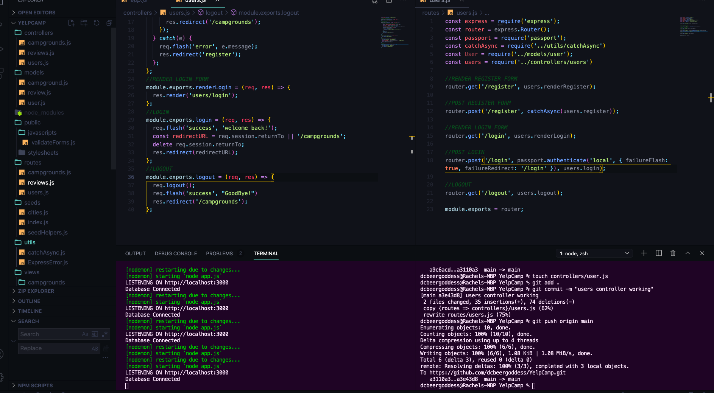

# YelpCamp: Controllers & Star Ratings
* [GITHUB CODE FOR SECTION](https://github.com/Colt/YelpCamp/tree/e8357458ec6df5a9c97d4bef4d5671ed8d1e760a)

## Refactoring To Campgrounds Controller
- Breaking some logic out of our routes --> still have more functionality to add
- Pattern is not unique to Express
- Controllers --> files that export an object where we move some functionality
* MVC --> controllers --> a pattern --> Model View Controller
* `mkdir controllers`
* `touch controllers/campgrounds.js`
- For Get All Campgrounds Route
```js
const Campground = require('../models/campground');

module.exports.index = async (req, res) => {
  const campgrounds = await Campground.find({});
  res.render('campgrounds/index', { campgrounds });
}
```
- in `routes/campgrounds.js`
```js
const campgrounds = require('../controllers/campgrounds')
```
- now we have a controller object with a bunch of methods on it available to us
```js
//INDEX
router.get('/', catchAsync(campgrounds.index));
```

## Adding a Reviews Controller
- Duplicate same process for users and reviews controller
* Example of new file structure and controller logic for Users
- 
## A Fancy Way to Restructure Routes

## Displaying Star Ratings
* [Starability CSS](https://github.com/LunarLogic/starability)

## Star Rating Form


