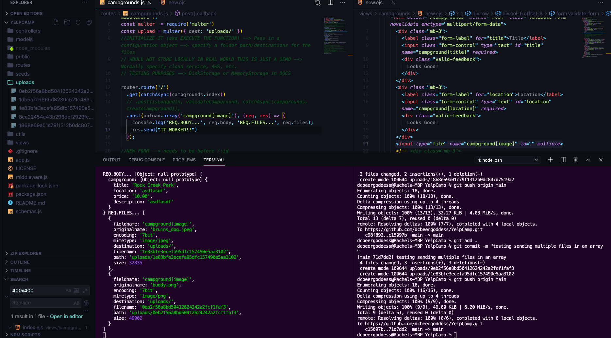

# YelpCamp: Image Upload
* [GITHUB CODE FOR SECTION](https://github.com/Colt/YelpCamp/tree/6570c595edf0480fab6b832abd35d37717a081cd)
- Instead of Using image URL --> garbage
- We will learn how to upload many --> NOT JUST ONE!!
- Upload a file to be associated with a campground
- TWO THINGS: 1 - a regular HTML form is not going to able to send files to our server --> we are going to have to change our form in order to do that && 2. we need to stor the images somewhere and typically we don't store them in Mongo (because they could be very large - BSON-document size limit of - 16 megabytes max) --> there are workarounds:
* [GridFS](https://docs.mongodb.com/manual/core/gridfs/)
- does not support multiple uploads
- We are going to use Cloudinary --> could use AWS --> Free Tier will work for us on Cloudinary

## The Multer Middleware
* [Multer Docs](https://github.com/expressjs/multer)
- We need to change the way we send them html doc right now it is set to `urlencoded`
* ENCTYPE WAY:
- 
- THIS WILL BREAK STUFF
1. Go to new form on campgrounds --> set it to have an `enctype="multipart/form-data"`:
```html
  <h1 class="text-center">New Campground</h1>
  <!-- col-6 => don't want all the way to left => offset-3 -->
  <div class="col-6 offset-3">
    <form action="/campgrounds" method="POST" class="validate-form" novalidate enctype="multipart/form-data">
```
2. Add in input for file instead of image div in new form for campground:
```html
      <div class="mb-3">
        <label class="form-label" for="location">Location</label>
        <input class="form-control" type="text" id="location" name="campground[location]" required>
        <div class="valid-feedback">
          Looks Good!
        </div>
      </div>
      <input type="file" name="campground[image]" id="">
      <!-- <div class="mb-3">
        <label class="form-label" for="image">Image URL</label>
        <input class="form-control" type="text" id="image" name="campground[image]" required>
        <div class="valid-feedback">
          Looks Good!
        </div>
      </div> -->
```
- NOW IN LOCAL HOST --> CAN SELECT FILES:
* 
- Next we go over to route where the form is being submitted --> campground post routes --> `routes/campground.js`
- Lets print out the `req.body` of new form being submitted
```js
router.route('/')
  .get(catchAsync(campgrounds.index))
  // .post(isLoggedIn, validateCampground, catchAsync(campgrounds.createCampground));
  .post((req, res) => {
    res.send(req.body);
  });
```
- Nothing be sent back in req.body:
* 
- In order TO PARSE THE `multipart/form-data`, we actually need to use another middleware
* **Multer** : for express, a middleware for handling `multipart/form-data` which is primarily used for uploading files
1. `npm i multer`
-  Multer adds a `body` object and a `file` or `files` object to the `request` object. The `body` object contains the values of the text fields of the form, the `file` or `files` object contains the files uploaded via the form.
```html
<form action="/profile" method="post" enctype="multipart/form-data">
  <input type="file" name="avatar" />
</form>
```
- EXAMPLE OF HOW TO USE FROM DOCS:
- have access to middleware --> EX: `upload.single('avatar')` or `upload.array('photos')`:
```js
var express = require('express')
var multer  = require('multer')
var upload = multer({ dest: 'uploads/' }

var app = express()

app.post('/profile', upload.single('avatar'), function (req, res, next) {
  // req.file is the `avatar` file
  // req.body will hold the text fields, if there were any
})

app.post('/photos/upload', upload.array('photos', 12), function (req, res, next) {
  // req.files is array of `photos` files
  // req.body will contain the text fields, if there were any
})

var cpUpload = upload.fields([{ name: 'avatar', maxCount: 1 }, { name: 'gallery', maxCount: 8 }])
app.post('/cool-profile', cpUpload, function (req, res, next) {
  // req.files is an object (String -> Array) where fieldname is the key, and the value is array of files
  //
  // e.g.
  //  req.files['avatar'][0] -> File
  //  req.files['gallery'] -> Array
  //
  // req.body will contain the text fields, if there were any
})
```
2. In our `routes/campgrounds.js` file:
```js
const multer  = require('multer')
const upload = multer({ dest: 'uploads/' })
//INITIALIZE IT (aka EXECUTE THE FUNCTION) --> Pass in a configuration object --> specify a folder path/destinations for the files
// WOULD NOT STORE LOCALLY IN REAL WORLD THIS IS JUST A DEMO --> Normally specify cloud service, AWS, etc.
// TESTING PURPOSES --> DiskStorage or MemoryStorage in DOCS

router.route('/')
  .get(catchAsync(campgrounds.index))
  // .post(isLoggedIn, validateCampground, catchAsync(campgrounds.createCampground));
  .post(upload.single('campground[image]'), (req, res) => {
    res.send(req.body, req.file);
  });
```
- TEST in Local Host:
* 
- File created in Repo with encoded file data
3. Lets console.log so we can see it in the terminal
```js
router.route('/')
  .get(catchAsync(campgrounds.index))
  // .post(isLoggedIn, validateCampground, catchAsync(campgrounds.createCampground));
  .post(upload.single('campground[image]'), (req, res) => {
    console.log(req.body, req.file);
        res.send("IT WORKED!!")
  });
```
- RESULT IN TERMINAL:
* 
4. TEST w/ Multiple Files:
```js
router.route('/')
  .get(catchAsync(campgrounds.index))
  // .post(isLoggedIn, validateCampground, catchAsync(campgrounds.createCampground));
  .post(upload.array('campground[image]'), (req, res) => {
    console.log('REQ.BODY...', req.body, 'REQ.FILES...', req.files);
    res.send("IT WORKED!!")
  });
```
- now it expects an array of multiple files
- need to update the input for multiple files:
```html
<input type="file" name="campground[image]" id="" multiple>
```
- Submit a new form with multiple files
* 
- RESULT IN TERMINAL:
* 
- Now we need to use another tool and tell multer to store the files elsewhere and not in the local uploads file in the repo that it created

## Cloudinary Registration
* [CLOUDINARY HOMEPAGE](https://cloudinary.com/)
- Sign up for free account --> does not require credit card to start
- We do not want to embed our Account API Key and API Secret directly into our app

## Environment Variables with dotenv
* [DotEnv](https://github.com/motdotla/dotenv)
- Store Sensitive Data in separate file that we do not share with other people
* 
1. touch `.env` in top level of project
2. In File Define Key Value Pairs:
```
SECRET=thisisabettersecret
DB_HOST=localhost
DB_USER=root
DB_PASS=s1mpl3
```
- This is where we will put our cloudinary info
3. make sure that you have a `.gitignore` file set up in top level of project as well to include 
```
.env
node_modules
```
- to use information in `.env` file we need to use the `dotenv` npm package
4. `npm i dotenv`
5. set up top of `app.js` file:
```js
if(process.env.NODE_ENV !== "production") {
  require('dotenv').config();
};
//SHOULD HAVE ACCESS TO 
console.log(process.env.SECRET)
```
- PRINT OUT IN TERMINAL:
* 
6. NOW ADD IN CLOUDINARY INFORMATION FOR YOU:
```
CLOUDINARY_CLOUD_NAME=asdfasdfasdf
CLOUDINARY_KEY=asdfasdfasdf
CLOUDINARY_SECRET=asdfasdf
```
- DO NOT NEED QUOTES OR SPACES

## Uploading to Cloudinary Basics
- [MULTER STORAGE CLOUDINARY DOCS](https://github.com/affanshahid/multer-storage-cloudinary/blob/master/README.md)
1. `npm i cloudinary multer-storage-cloudinary`
2. `mkdir cloudinary`
3. `touch cloudinary/index.js`
4. Copy imports from docs
```js
const cloudinary = require('cloudinary').v2;
const { CloudinaryStorage } = require('multer-storage-cloudinary');
```
- next we need to pass in `cloudinary` to `CloudinaryStorage`
5. set up config:
```js
cloudinary.config({
  cloud_name: process.env.CLOUDINARY_CLOUD_NAME,
  api_key: process.env.CLOUDINARY_KEY,
  api_secret: process.env.CLOUDINARY_SECRET
})
```
6. instantiate an instance of cloudinary storage with is imported above in file:
```js
//EXAMPLE FROM DOCS
const storage = new CloudinaryStorage({
  cloudinary: cloudinary,
  params: {
    folder: 'some-folder-name',
    format: async (req, file) => 'png', // supports promises as well
    public_id: (req, file) => 'computed-filename-using-request',
  },
});
```
- IN OUR CLOUDINARY INDEX.JS FILE:
```js
//OUR INITIAL SET UP IN YELPCAMP
//AND EXPORT CODE
const storage = new CloudinaryStorage({
  //pass in cloudinary object you just configured
  cloudinary,
  folder: 'YelpCamp', //specify folder to store in
  allowedFormats: ['jpeg', 'png', 'jpg']
});

module.exports = {
  cloudinary,
  storage
};
```
7. update imports in `routes/campgrounds.js` to store in new location:
```js
const express = require('express');
const router = express.Router();
const campgrounds = require('../controllers/campgrounds');
const catchAsync = require('../utils/catchAsync');
const { isLoggedIn, isAuthor, validateCampground } = require('../middleware');
const multer  = require('multer');
const { storage } = require('../cloudinary');
const upload = multer({ storage });
```
8. Let's see what happens now to `req.body` and `req.files`:
* [TERMINAL RESULT](assets/dotenv3.png)
- We Can now access picture using url from cloudinary: [buddy christ link](https://res.cloudinary.com/dc03tm19jx/image/upload/v1619469782/gm62faopwbvmas03vmzb.png)
* 
- images now being uploaded!!! --> now we need to store them in mongo and place a limit on number of uploads per camp and probably per user....

## Storing Uploaded Image Links in Mongo
- FIRST OF ALL --> MISTAKE IN CONFIGURING FOLDER IN CloudinaryStorage (need to put rest in `params`):
```js
const storage = new CloudinaryStorage({
  //pass in cloudinary object you just configured
  cloudinary,
  params: {
    folder: 'YelpCamp', //specify folder to store in
    allowedFormats: ['jpeg', 'png', 'jpg']
  }
});
```
- Try submitting form again and it has now created **YelpCamp** Folder with assets
* 
```js
  {
    fieldname: 'campground[image]',
    originalname: 'daffodil.jpg',
    encoding: '7bit',
    mimetype: 'image/jpeg',
    path: 'https://res.cloudinary.com/dc03tm19jx/image/upload/v1619470734/YelpCamp/pdzd1vfxjkk9hmkdwvee.jpg',
    size: 2593314,
    filename: 'YelpCamp/pdzd1vfxjkk9hmkdwvee'
  }
```
- we will want to store the `path` and the `filename` --> easier to delete with filename
- NOW FOR MONGO
1. Update Campground Model and make image an array:
```js
const CampgroundSchema = new Schema ({
  title: String,
  images: [
    {
      url: String,
      filename: String
    }
  ],
  price: Number,
  description: String,
  location: String,
  author: {
    type: Schema.Types.ObjectId,
    ref: 'User'
  },
  reviews: [
    {
      type: Schema.Types.ObjectId,
      ref: 'Review'
    }
  ]
});
```
2. use as middleware in campground routes on post new:
```js
router.route('/')
  .get(catchAsync(campgrounds.index))
  .post(isLoggedIn, validateCampground, upload.array('campground[image]'), catchAsync(campgrounds.createCampground));
```
3. Now go to Campground Controller:
```js

```
- PROBLEMS!!!
* [now when we submit](assets/upload1.png)
- issue with uploading images after validating campground, will shuffle around middleware for now but need to come up with a better way to incorporate both:
```js
router.route('/')
  .get(catchAsync(campgrounds.index))
  .post(isLoggedIn, upload.array('campground[image]'), validateCampground, catchAsync(campgrounds.createCampground));
```
- update JOI validation in `schemas.js` to not include image validation for now:
```js
module.exports.campgroundSchema = Joi.object({
  //campground is our `key` (everything is campground[title], etc)
  //it should be an object and it needs to be required
  campground: Joi.object({
    title: Joi.string().required(),
    price: Joi.number().required().min(0),
    // image: Joi.string().required(),
    location: Joi.string().required(),
    description: Joi.string().required()
  }).required()
});
```
- Try to Make new Campground:
- RESPONSE IN LOCAL HOST:
* 
- IN TERMINAL:
* 
```js
{
  reviews: [],
  _id: 60872e42083fb18e4f7e4294,
  title: 'asdf',
  location: 'Washington, DC',
  price: 10,
  description: 'asdfasdfasdf',
  images: [
    {
      _id: 60872e42083fb18e4f7e4295,
      url: 'https://res.cloudinary.com/dc03tm19jx/image/upload/v1619471941/YelpCamp/j7zckraicmsmi9rzwk8g.png',
      filename: 'YelpCamp/j7zckraicmsmi9rzwk8g'
    }
  ],
  author: 608056f48d40d841ba08c88d,
  __v: 0
}
```
- CAN USE DATA WE ARE GETTING BACK IN CAMPGROUNDS SHOW PAGE:
```html
      <% for(let img of campground.images) { %>
        " class="card-img-top" alt="...">
      <% } %>
```
- NOW PICTURE WE UPLOADED FOR CAMPGROUND SHOWS --> only one we uploaded
* 
- NOW MAKE CAMPGROUND WITH MULTIPLE IMAGES
* 

## Displaying Images In A Carousel
- USE BOOTSTRAP CAROUSEL --> DISPLAY ALL IMAGES
- TRY LOOPING BUT RUN INTO ISSUE OF EVERY IMAGE BEING ACTIVE:
```js
    <div id="campgroundCarousel" class="carousel slide" data-bs-ride="carousel">
      <div class="carousel-inner">
        <% for(let img of campground.images) { %>
          <div class="carousel-item active">
            " class="d-block w-100" alt="">
          </div>
        <% } %>
      </div>
      <button class="carousel-control-prev" type="button" data-bs-target="#campgroundCarousel" data-bs-slide="prev">
        <span class="carousel-control-prev-icon" aria-hidden="true"></span>
        <span class="visually-hidden">Previous</span>
      </button>
      <button class="carousel-control-next" type="button" data-bs-target="#campgroundCarousel" data-bs-slide="next">
        <span class="carousel-control-next-icon" aria-hidden="true"></span>
        <span class="visually-hidden">Next</span>
      </button>
    </div>
```
- INSTEAD USE A FOREACH:
```html
      <div class="carousel-inner">
        <% campground.images.forEach((img, i) => { %>
        <!-- when index is 0, add class 'active' otherwise add nothing -->
          <div class="carousel-item <%= i === 0 ? 'active' : '' %>">
            " class="d-block w-100" alt="">
          </div>
        <% }) %>
      </div>
```
- Need to ADD LOGIC to not display carousel buttons if only one image:
```js
      <% if (campground.images.length > 1) { %>
        <button class="carousel-control-prev" type="button" data-bs-target="#campgroundCarousel" data-bs-slide="prev">
          <span class="carousel-control-prev-icon" aria-hidden="true"></span>
          <span class="visually-hidden">Previous</span>
        </button>
        <button class="carousel-control-next" type="button" data-bs-target="#campgroundCarousel" data-bs-slide="next">
          <span class="carousel-control-next-icon" aria-hidden="true"></span>
          <span class="visually-hidden">Next</span>
        </button>
      <% } %>
```

## Fixing Our Seeds
- give campgrounds valid images
- WILL USE IMAGE URLS FROM THIS OUTPUT:
```js
{
  reviews: [],
  _id: 60873efa07eece92f3709b15,
  title: 'SEED ME',
  location: 'asasdf',
  price: 18,
  description: 'asdfasdfasdf',
  images: [
    {
      _id: 60873efa07eece92f3709b16,
      url: 'https://res.cloudinary.com/dc03tm19jx/image/upload/v1619476218/YelpCamp/umcsznh3trem2nwuze7k.jpg',
      filename: 'YelpCamp/umcsznh3trem2nwuze7k'
    },
    {
      _id: 60873efa07eece92f3709b17,
      url: 'https://res.cloudinary.com/dc03tm19jx/image/upload/v1619476221/YelpCamp/gehzdoz6zi9yrdwehslg.jpg',
      filename: 'YelpCamp/gehzdoz6zi9yrdwehslg'
    }
  ],
  author: 608056f48d40d841ba08c88d,
  __v: 0
}
```
- in `seeds/index.js`:
```js
const camp = new Campground({
  author: '608056f48d40d841ba08c88d',
    location: `${cities[random1000].city}, ${cities[random1000].state}`,
    title: `${sample(descriptors)} ${sample(places)}`, 
    description: 'Lorem ipsum dolor sit amet consectetur adipisicing elit. Eveniet incidunt maiores consectetur asperiores iure obcaecati quia voluptatum ipsa error, optio illo molestiae enim voluptatem itaque suscipit? Culpa excepturi libero deleniti.',
    price, //shorthand do not need price: price 
    images: [
      {
        url: 'https://res.cloudinary.com/dc03tm19jx/image/upload/v1619476218/YelpCamp/umcsznh3trem2nwuze7k.jpg',
        filename: 'YelpCamp/umcsznh3trem2nwuze7k'
      },
      {
        url: 'https://res.cloudinary.com/dc03tm19jx/image/upload/v1619476221/YelpCamp/gehzdoz6zi9yrdwehslg.jpg',
        filename: 'YelpCamp/gehzdoz6zi9yrdwehslg'
      }
    ],
});
```
- need to update `index.ejs` for campgrounds to display first image in array --> `src="<%=campground.images[0].url%>"`
```html
   <% for( let campground of campgrounds ) { %>
      <div class="card mb-3">
        <div class="row">
          <div class="col-md-4">
            " alt="campground image">
          </div>
          <div class="col-md-8">
            <div class="card-body">
              <h5 class="card-title"><%= campground.title %></h5>
```

## Adding Upload to Edit Page
- Usually you would want to put images in their own route so we could edit them alone and not have to edit entire form again
- For now, use existing edit form
1. in `campgrounds/edit.ejs` --> add to form `enctype="multipart/form-data` --> set input for file
```html
<form action="/campgrounds/<%=campground._id%>?_method=PUT" method="POST" class="validate-form" novalidate enctype="multipart/form-data">
```
```html
      <div class="mb-3">
        <label class="form-label" for="image">Add Images</label>
        <input type="file" name="campground[image]" id="campground[image]" multiple>
        </div>
      </div>
```
2. then go to routes for campgrounds -->  on put route --> once you are logged in and verified as author --> `upload.array('campground[image]')`
```js
router.route('/:id')
  .get(catchAsync(campgrounds.showCampground))
  .put(isLoggedIn, 
    isAuthor,
    upload.array('campground[image]'), 
    validateCampground, 
    catchAsync(campgrounds.updateCampground))
  .delete(isLoggedIn, 
    isAuthor, 
    catchAsync(campgrounds.deleteCampground));
```
4. in campground controller:
```js
//PUT ROUTE TO UPDATE
module.exports.updateCampground = async (req, res) => {
  const { id } = req.params;
  const campground = await Campground.findByIdAndUpdate(id, {...req.body.campground});
  const imgs = req.files.map(f => ({ url: f.path, filename: f.filename }));
  //spread array into push --> take data from array and pass into push
  campground.images.push(...imgs);
  await campground.save();
  req.flash('success', 'Successfully updated campground!')
  //HAD ISSUES WHEN IT WAS `campgrounds/${campground._id}`
  res.redirect(`${campground._id}`);
};
```
- TEST by making new campgrounds, working to push new images to the array and not replace entire array
- Is possible to have less code in updateCampground by finding campground first then update, or add img update into parameter of 

## Customizing File Input
- EDITING BUTTON TO LOOK BETTER IS NOT AS EASY AS YOU MIGHT THINK:
* 
- Bootstrap comes with some functionality helpers to do this
* 
- OLD BOOTSTRAP DOCUMENTATION --> think I found the right one...
* 
- I WILL USE THIS ONE of THESE:
```js
<div class="mb-3">
  <label for="formFileMultiple" class="form-label">Add Images</label>
  <input class="form-control" type="file" id="formFileMultiple" multiple>
</div>
```
```js
<div class="input-group mb-3">
  <input type="file" class="form-control" id="inputGroupFile02">
  <label class="input-group-text" for="inputGroupFile02">Upload</label>
</div>
```
- Will try second one on Campground New Form page:
```html
  <div class="input-group mb-3">
    <input type="file" class="form-control" id="campground[image]" name="campground[image]" multiple>
    <label class="input-group-text" for="campground[image]">Upload</label>
  </div>
```
- WORKING WITHOUT NEEDING `bs-custom-file-input` package. Bootstrap 5 fixed this issues --> going to roll with what I had for now

## A Word Of Warning!

## Deleting Images Form

## Deleting Images Backend

## Adding A Thumbnail Virtual Property
* [Cloudinary Image Transformations](https://cloudinary.com/documentation/image_transformations)