# YelpCamp: Adding Maps
* [GITHUB CODE FOR SECTION](https://github.com/Colt/YelpCamp/tree/3bc4b3c3b3e284ae9eca7d7248a2a8cc51238c87)

## Registering for MapBox
* [MapBox](https://www.mapbox.com/)
- sign up and have access to a default public token --> can make new tokens if you want
- include token in `.env` --> `MAPBOX_TOKEN=asdfasdfasdfasdf`

## Geocoding Our Locations
* [MapBox JS SDK Docs](https://github.com/mapbox/mapbox-sdk-js)
* [MapBox JS SDK Services Docs](https://github.com/mapbox/mapbox-sdk-js/blob/main/docs/services.md)
- when form is submitted to create new campground, take location text, and attempt to get latitude and longitude coordinates
- we are going to use mapbox GeoCoding api, there are standalone APIs that are just for geocoding -- we will be using the mapbox client to do it --> we can make manual request ourself --> Forward and Reverse Geocoding --> matching location to coordinates --> just using an endpoint
- We will use the NPM MapBox Helper --> `mapbox-sdk-js`
1. `npm i @mapbox/mapbox-sdk`
- Comes with a lot!!! --> we are after the Geocoding Service --> [Forward Geocoding](https://github.com/mapbox/mapbox-sdk-js/blob/main/docs/services.md#forwardgeocode)
```js
geocodingClient.forwardGeocode({
  query: 'Paris, France',
  limit: 2
})
  .send()
  .then(response => {
    const match = response.body;
  });
```
- we will limit it to 1, but you can give the user a couple options in apps if you wanted to --> more for reverse geocoding
2. Go into Campground Controller Where you create a new campground --> our end goal is to console.log lat and long
- require in mapbox package && pass in `token` && then we want to add that token when we instantiate `mbxGeocoding`
```js
const mbxGeocoding = require('@mapbox/mapbox-sdk/services/geocoding');
const mapBoxToken = process.env.MAPBOX_TOKEN;
const geocoder = mbxGeocoding({ accessToken: mapBoxToken });
```
- in create controller to test:
```js
//CREATE NEW CAMPGROUND
module.exports.createCampground = async (req, res, next) => {
  const geoData = geocoder.forwardGeocode({
    query: 'Yosemite, CA',
    limit: 1
  }).send()
  console.log(geoData.body.features)
  res.send("OK!!!!")
  // const campground = new Campground(req.body.campground);
  // //map over req.files array and set url to be path and filename to be the filename
  // campground.images = req.files.map(f => ({ url: f.path, filename: f.filename }));
  // campground.author = req.user._id;
  // await campground.save();
  // //TEST RESULT FOR NEW IMAGE ARRAY UPLOAD
  // console.log(campground);
  // req.flash('success', 'Successfully made a new campground!');
  // res.redirect(`campgrounds/${campground._id}`);
};
```
- LOOK IN TERMINAL:
* 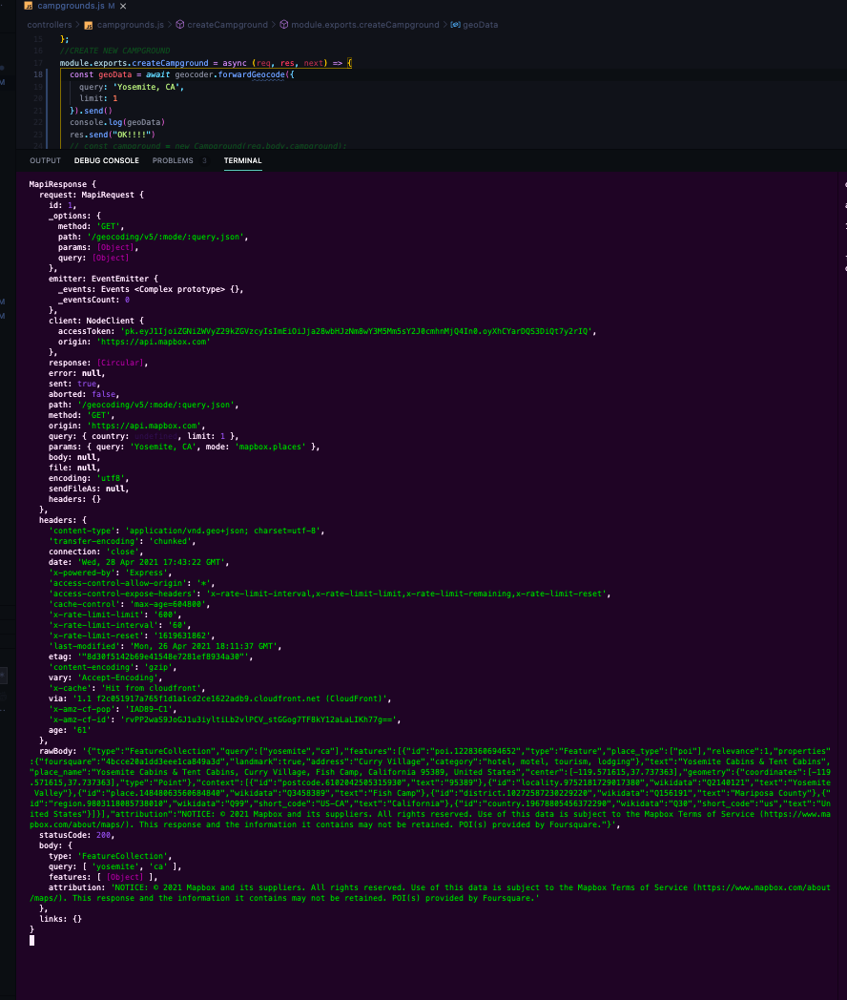
- What we want to focus on is the `geoData.body.features` OBJECT
```js
  body: {
    type: 'FeatureCollection',
    query: [ 'yosemite', 'ca' ],
    features: [ [Object] ],
    attribution: 'NOTICE: © 2021 Mapbox and its suppliers. All rights reserved. Use of this data is subject to the Mapbox Terms of Service (https://www.mapbox.com/about/maps/). This response and the information it contains may not be retained. POI(s) provided by Foursquare.'
  },
  links: {}
}
```
- CONSOLE.LOG OF `geoData.body.features`:
* 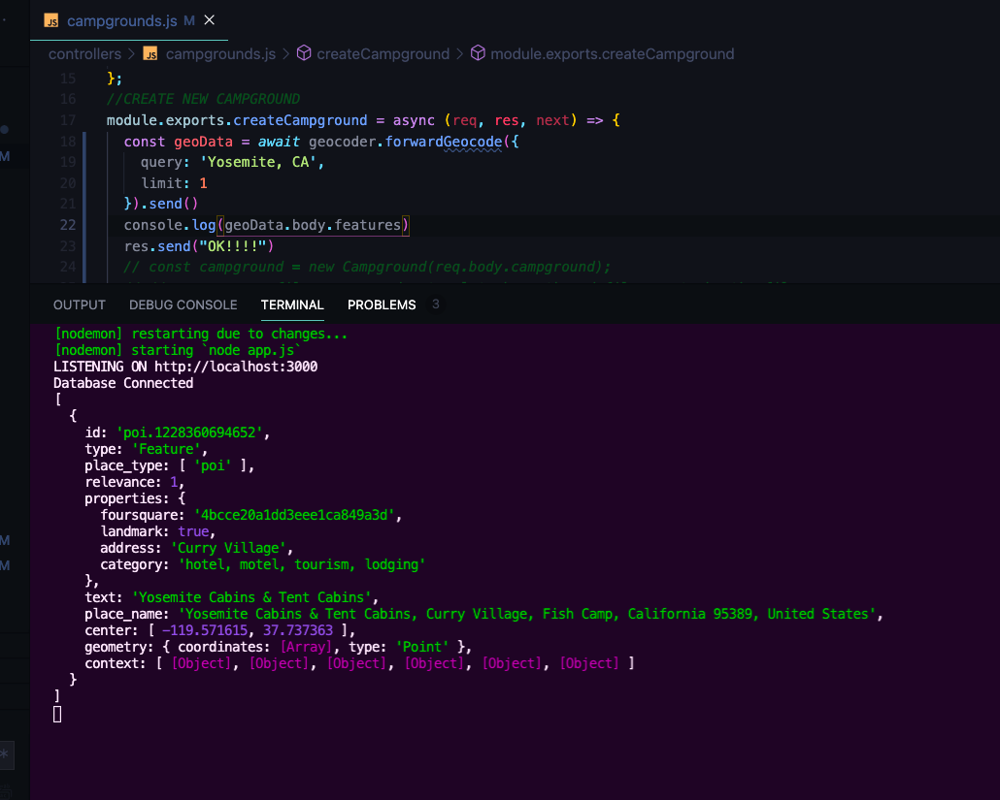
- We want to look under `geometry.coordinates`:
- RES.SEND OF `geoData.body.features[0].geometry.coordinates`
* ![geoData.body.features[0].geometry.coordinates res.send](assets/geo3.png)
- WE ARE GETTING BACK `[longitude, latitude]`
- TRY COORDINATES IN GOOGLE MAPS:
* 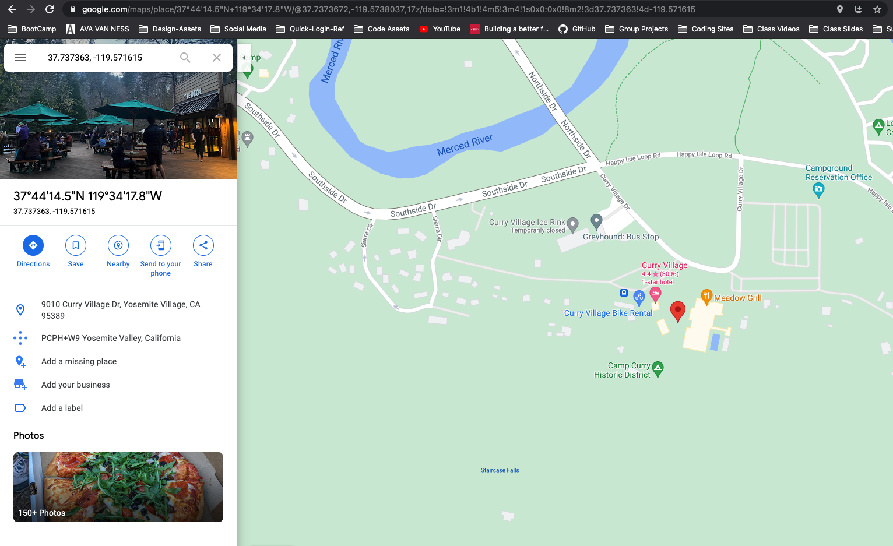
- WORKS WHEN WE HARD CODE!!
- Test with entering location text:
```js
//CREATE NEW CAMPGROUND
module.exports.createCampground = async (req, res, next) => {
  const geoData = await geocoder.forwardGeocode({
    query: req.body.campground.location,
    limit: 1
  }).send()
  res.send(geoData.body.features[0].geometry.coordinates);
};
```
- Test with `Big Sky, Montana`:
* 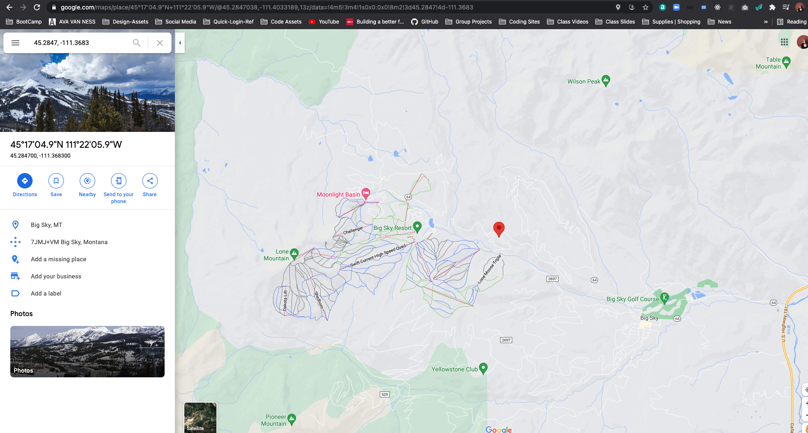

## Working With GeoJSON
- Want to store coordinates in our database 
- Right now what we are getting back from geoData is GeoJSON
```js
//CREATE NEW CAMPGROUND
module.exports.createCampground = async (req, res, next) => {
  const geoData = await geocoder.forwardGeocode({
    query: req.body.campground.location,
    limit: 1
  }).send()
  res.send(geoData.body.features[0].geometry);
};
```
- Response we are getting back is GeoJSON --> follows format where there is a type field (always going to be Point in mapbox) - coordinates is an array
```js
// http://localhost:3000/campgrounds
{
  "type": "Point",
  "coordinates": [
    -111.3683,
    45.2847
  ]
}
```
- We are going to store the whole thing in our Campground Model
- We can do a ton with [Mongoose and Geospatial Queries](https://docs.mongodb.com/manual/geospatial-queries/) 
* Below is an example of a Mongoose schema where `location` is a point. --> we will use `geometry` since we already have location
```js
const citySchema = new mongoose.Schema({
  name: String,
  location: {
    type: {
      type: String, // Don't do `{ location: { type: String } }`
      enum: ['Point'], // 'location.type' must be 'Point'
      required: true
    },
    coordinates: {
      type: [Number],
      required: true
    }
  }
});
```
- need to follow geoJSON pattern in order to use it later
- IN OUR CAMPGROUND MODEL:
```js
const CampgroundSchema = new Schema ({
  title: String,
  images: [ImageSchema],
  geometry: {
    type: {
      type: String, 
      enum: ['Point'], 
      required: true
    },
    coordinates: {
      type: [Number],
      required: true
    }
  },
```
- IN CAMPGROUND CONTROLLER:
```js
//CREATE NEW CAMPGROUND
module.exports.createCampground = async (req, res, next) => {
  const geoData = await geocoder.forwardGeocode({
    query: req.body.campground.location,
    limit: 1
  }).send()
  const campground = new Campground(req.body.campground);
  campground.geometry = (geoData.body.features[0].geometry);
  campground.images = req.files.map(f => ({ url: f.path, filename: f.filename }));
  campground.author = req.user._id;
  await campground.save();
  //TEST RESULT FOR NEW IMAGE ARRAY UPLOAD
  console.log(campground);
  req.flash('success', 'Successfully made a new campground!');
  res.redirect(`campgrounds/${campground._id}`);
};
```
- Let's Make a New Campground!!
- Campground Print Out:
* 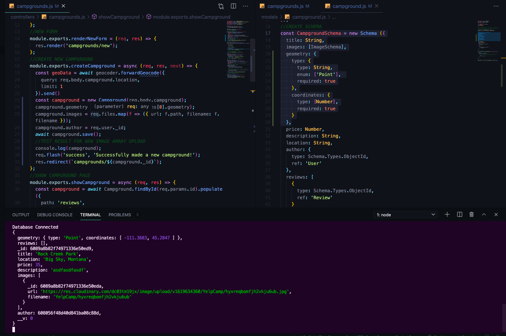

## Displaying A Map
* [MapBox GL Docs](https://docs.mapbox.com/mapbox-gl-js/api/)
- Now we will render a map that will have a pin with the location we geo coded
- To Start Lets try to get a Map to render for any location
- Interactive Maps using MapBox
1. copy over CDNs to Boilerplate (might not want to have it included on every page, maybe just make a layout for the show page)
```html
<script src='https://api.mapbox.com/mapbox-gl-js/v2.2.0/mapbox-gl.js'></script>
<link href='https://api.mapbox.com/mapbox-gl-js/v2.2.0/mapbox-gl.css' rel='stylesheet' />
```
2. ACCORDING TO DOCS:
- Include the following code in the <body> of your HTML file.
```html
<div id='map' style='width: 400px; height: 300px;'></div>
<script>
mapboxgl.accessToken = 'pk.eyJ1IjoiZGNiZWVyZ29kZGVzcyIsImEiOiJja28wbHJzNm8wY3M5Mm5sY2J0cmhnMjQ4In0.oyXhCYarDQS3DiQt7y2rIQ';
var map = new mapboxgl.Map({
container: 'map', // container ID
style: 'mapbox://styles/mapbox/streets-v11', // style URL
center: [-74.5, 40], // starting position [lng, lat]
zoom: 9 // starting zoom
});
</script>
```
- USE IT IN CAMPGROUND SHOW PAGE: PUT `div` w/ `id='map` ABOVE CAROUSEL 
- For Now put SCRIPT in Show page at end --> will put in separate file later
```html
<script>
  mapboxgl.accessToken = '<%-process.env.MAPBOX_TOKEN%>';
  const map = new mapboxgl.Map({
    container: 'map', // container ID
    style: 'mapbox://styles/mapbox/streets-v11', // style URL
    center: [-74.5, 40], // starting position [lng, lat]
    zoom: 4 // starting zoom
  });
  </script>
```
3. Now move script to separate file: `touch public/javascripts/showPageMap.js`
4. Require in show page - in script tag at end 
```html
<script src="/javascripts/showPageMap.js"></script>
```
5. now we need to grant access to `showPageMap.js` to use MAPBOX_TOKEN (ejs syntax will not work anymore)
- make a new script before the script requiring in showPageMap
```html
<script>
  const mapToken = '<%-process.env.MAPBOX_TOKEN%>';
</script>
```
- now we have access to the variable in our script file
```js
mapboxgl.accessToken = mapToken;
const map = new mapboxgl.Map({
  container: 'map', // container ID
  style: 'mapbox://styles/mapbox/streets-v11', // style URL
  center: [-74.5, 40], // starting position [lng, lat]
  zoom: 4 // starting zoom
});
```

## Centering the Map On A Campground
- Add a marker to the Map
- [EXAMPLE OF Default MARKER in Mapbox GL DOCS](https://docs.mapbox.com/mapbox-gl-js/example/add-a-marker/)
- create a `new mapboxglMarker` and set Latitude and Longitude and then add to map --> order of LngLat --> follows traditional x y coordinates on a [Cartesian plane](https://www.varsitytutors.com/hotmath/hotmath_help/topics/cartesian-plane#:~:text=A%20Cartesian%20plane%20(named%20after,an%20ordered%20pair%20of%20numbers.)) 
- in script file
```js
mapboxgl.accessToken = mapToken;
const map = new mapboxgl.Map({
  container: 'map', // container ID
  style: 'mapbox://styles/mapbox/streets-v11', // style URL
  center: [-74.5, 40], // starting position [lng, lat]
  zoom: 8 // starting zoom
});
//ADD PIN TO MAP
new mapboxgl.Marker()
  .setLngLat([-74.5, 40])
  .addTo(map);
```
- Hardcoded lat and long showing up with generic styled pin:
* 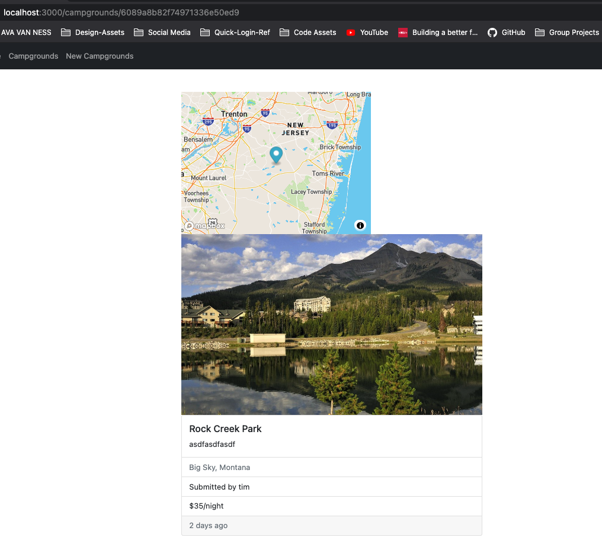
- We can change what marker looks like --> EXAMPLE FROM DOCS:
```js
// Create a default Marker, colored black, rotated 45 degrees.
var marker2 = new mapboxgl.Marker({ color: 'black', rotation: 45 })
.setLngLat([12.65147, 55.608166])
.addTo(map);
```
- can also create your own icon, etc.
- to get location to connect to map to center on campground
- pass through campground variable in script tag in show.ejs where our mapToken is that we will have immediate access to on the client side
```html
<script>
  const mapToken = '<%-process.env.MAPBOX_TOKEN%>';
  const campground = <%-campground%>;
</script>
```
- NOW WE GET AN ERROR --> NOT IN PROPER JAVASCRIPT --> info not in quotes
* 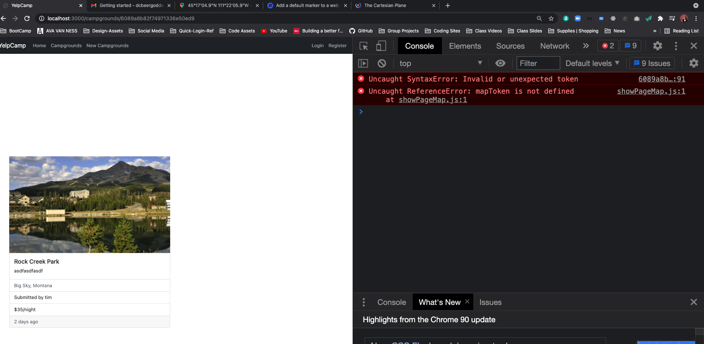
* 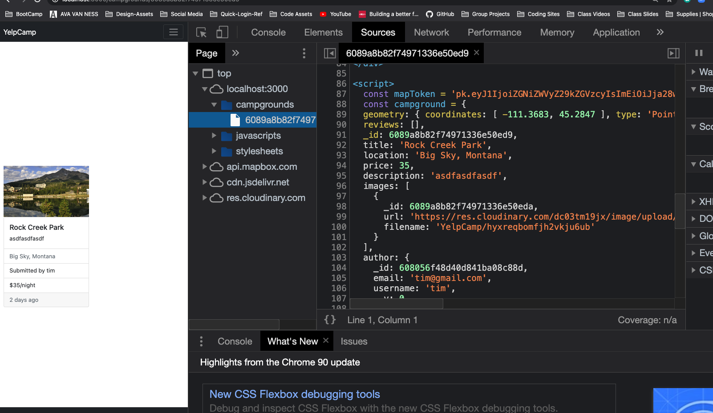
- we can use `JSON.stringify()`
```html
<script>
  const mapToken = '<%-process.env.MAPBOX_TOKEN%>';
  const campground = <%-JSON.stringify(campground)%>;
</script>
```
- NOW WE GET BACK JSON
* 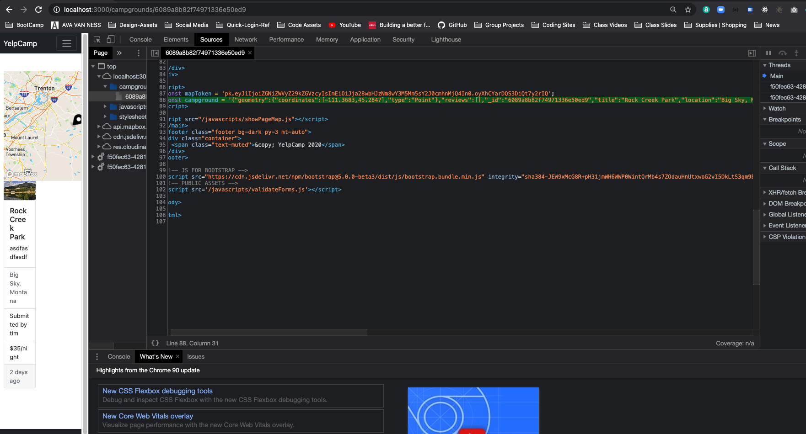
- Now we can access `campground.geometry.coordinates` in script file:
```js
mapboxgl.accessToken = mapToken;
const map = new mapboxgl.Map({
  container: 'map', // container ID
  style: 'mapbox://styles/mapbox/streets-v11', // style URL
  center: campground.geometry.coordinates, // starting position [lng, lat]
  zoom: 10 // starting zoom
});
//ADD PIN TO MAP
new mapboxgl.Marker({ color: 'black', rotation: 45 })
  .setLngLat(campground.geometry.coordinates)
  .addTo(map);
```
- New Result in LOCALHOST:
* 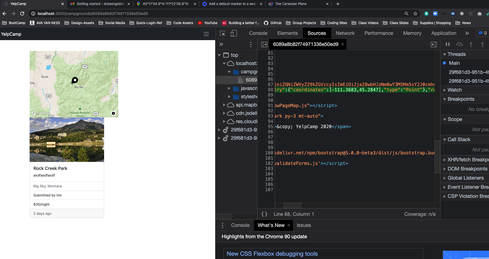
- probably need to put some error handling in for coordinates that can't be found, etc.
- change styles of map, marker, etc.

## Fixing Our Seeds Bug
- We have a problem on our INDEX page if we add a campground without an image
* [NEW ERROR FROM CREATING CAMPGROUNDS WITHOUT IMAGES](assets/error1.png)
- Add in a default on `campground/index.ejs`
```html
<% for( let campground of campgrounds ) { %>
  <div class="card mb-3">
    <div class="row">
      <div class="col-md-4">
        <!-- if anything in images array we will display first image -->
        <% if (campground.images.length) { %>
          " alt="campground image">
        <% } else { %>
          <!-- show default -->
          
          <% } %> 
      </div>
```
- Right now we can submit the form without an image --> you can edit a form and delete all images --> 
- Have Error now in old seeded locations because there is no geoData 
* 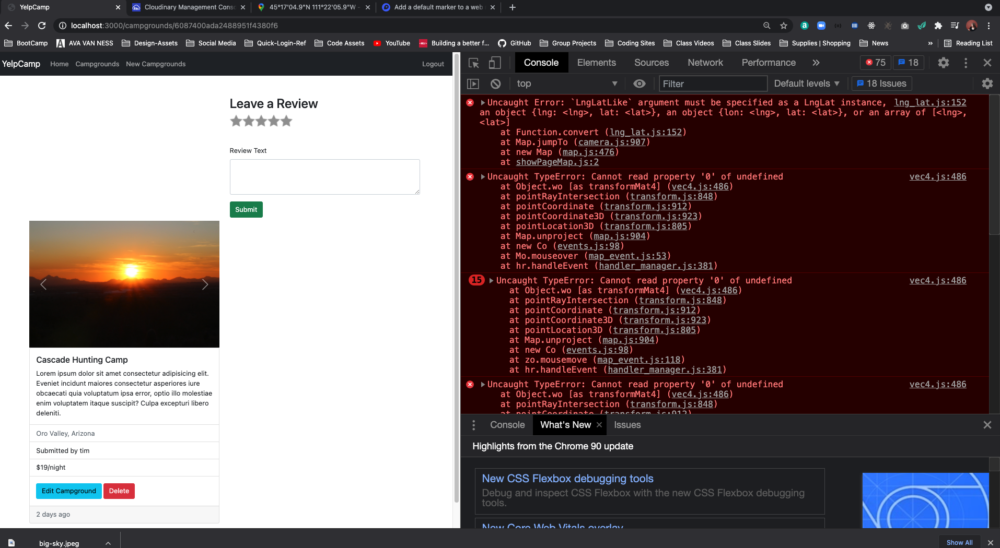
- when we try to submit changes
* 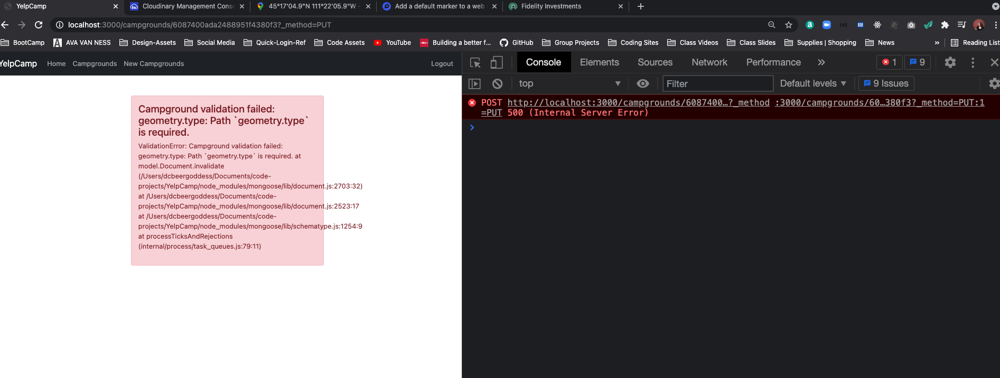
- Grab geometry data from another campground `"geometry" : { "type" : "Point", "coordinates" : [ -111.3683, 45.2847 ] }`
- HARD CODE IN SEEDS FILE and RE SEED
```js
        const camp = new Campground({
          //YOUR USER ID
          author: '608056f48d40d841ba08c88d',
            location: `${cities[random1000].city}, ${cities[random1000].state}`,
            title: `${sample(descriptors)} ${sample(places)}`, 
            description: 'Lorem ipsum dolor sit amet consectetur adipisicing elit. Eveniet incidunt maiores consectetur asperiores iure obcaecati quia voluptatum ipsa error, optio illo molestiae enim voluptatem itaque suscipit? Culpa excepturi libero deleniti.',
            price, //shorthand do not need price: price 
            geometry : { 
              type: "Point", 
              coordinates: [ -111.3683, 45.2847 ] 
            },
```

## Customizing Map Popup
* [FROM MAPBOX GL DOCS](https://docs.mapbox.com/mapbox-gl-js/api/markers/#popup)
- ADD POPUP to MARKER
- in scripts for `showPageMap`
```js
//ADD PIN TO MAP
new mapboxgl.Marker({ color: 'black', rotation: 45 })
  .setLngLat(campground.geometry.coordinates)
  .setPopup(
    new mapboxgl.Popup({offset: 25})
    .setHTML(
      `<h3>${campground.title}</h3><p>${campground.location}</p>`
    )
  )
  .addTo(map);
```
- CHECK IN LOCALHOST:
* [Popup for Pin in Map](assets/pin6.png)
* [DOCS on Changing MAPS STYLE](https://docs.mapbox.com/mapbox-gl-js/example/setstyle/)
- try different version of map `light-v10`
```js
mapboxgl.accessToken = mapToken;
const map = new mapboxgl.Map({
  container: 'map', // container ID
  style: 'mapbox://styles/mapbox/light-v10', // style URL
  center: campground.geometry.coordinates, // starting position [lng, lat]
  zoom: 10 // starting zoom
});
```
