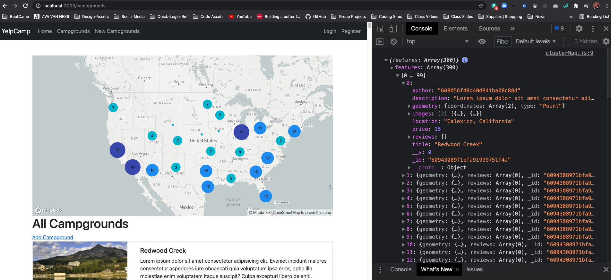
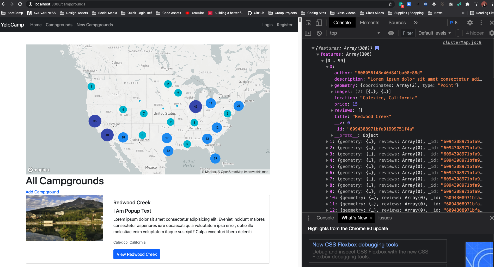
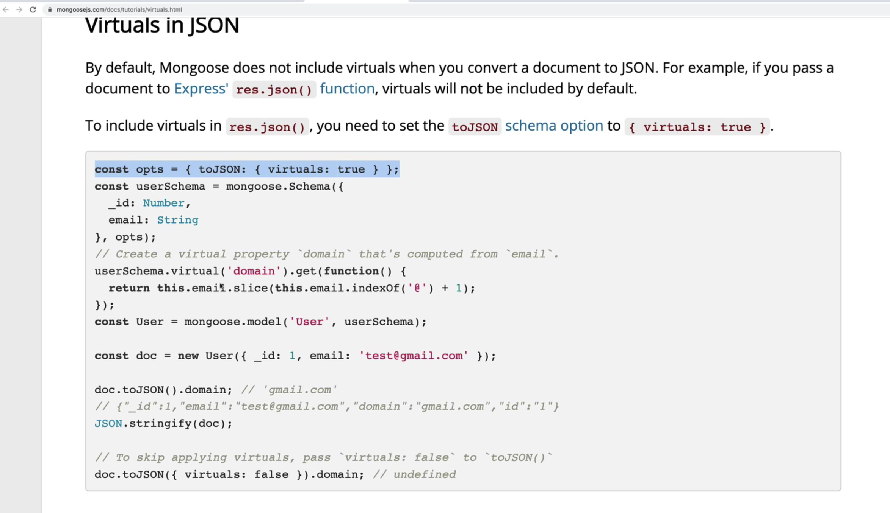
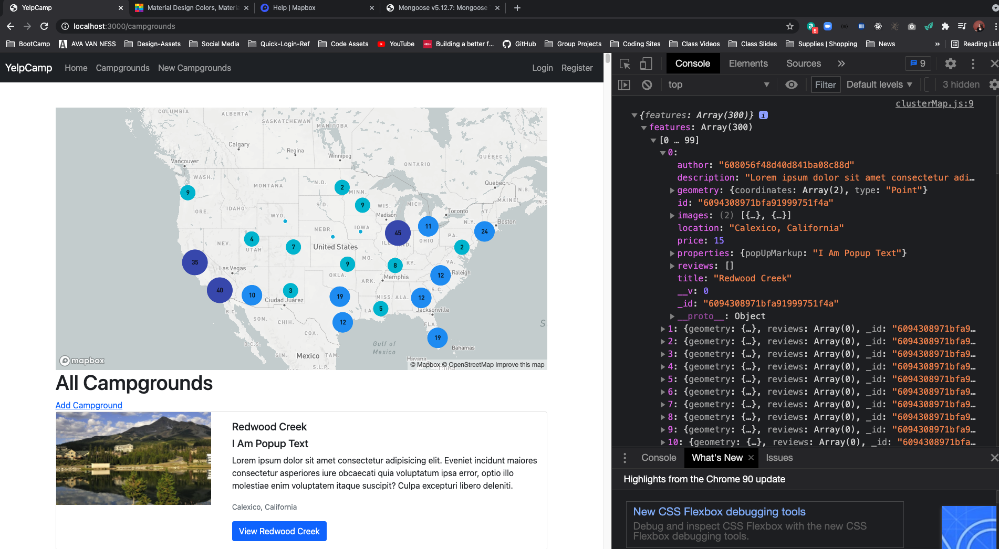
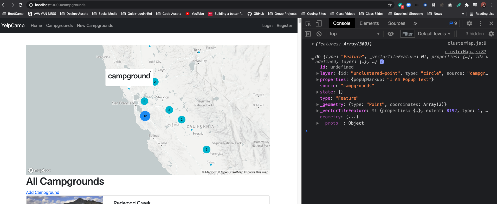
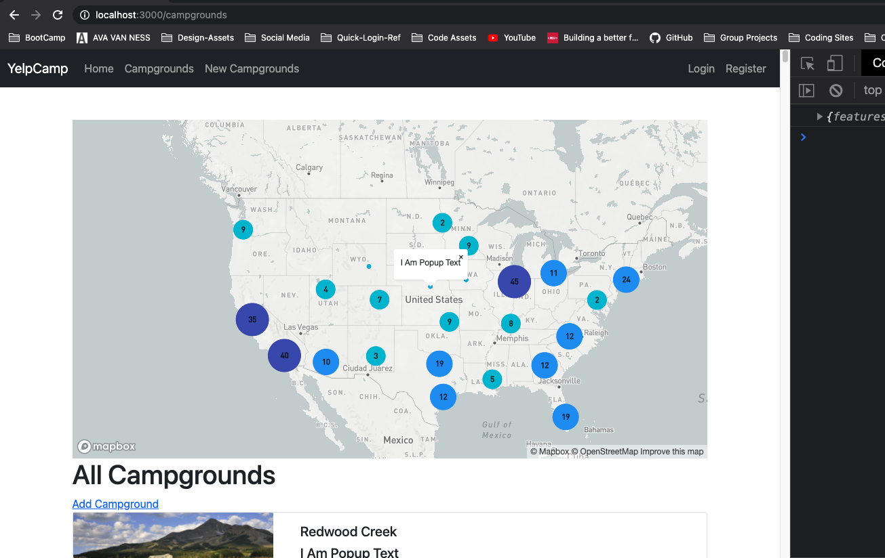

# Intro To Our Cluster Map
* [COLT'S GITHUB CODE FOR THIS SECTION](https://github.com/Colt/YelpCamp/tree/def9ebf5577f064da85c6cc8b9c8aaa0004ae8b1)

## Adding Earthquake Cluster Map
* [MAPBOX CLUSTER EXAMPLE](https://docs.mapbox.com/mapbox-gl-js/example/cluster/)
- Has all the code we need to recreate one
- you can even play around in jsfiddle or codepen to make alterations before coping over
- Let's just copy the map --> for earthquake information:
- Place this div in `index.ejs` for campgrounds above `h1`:
```html
<div id="map"></div>
```
- style inline for now --> will move to separate stylesheet later
```html
<div id="map" style="width: 100%; height: 500px"></div>
```
- create new file in public under `javascripts` --> `touch public/javascripts/clusterMap.js`
- Copy all the js in the script tags from MAPBOX example
- include script tag at bottom of `index.ejs` for campgrounds
```js
    <script src="/javascripts/clusterMap.js"></script>
```
- now we have a map showing up!!
* 
- copy over same script tap from show page with mapbox token in index page so you don't have to hard code it in the js script and have one centralized place to have it in case we change it and then we don't have to go back to the multiple times we are using it 
```html
<script>
  const mapToken = '<%-process.env.MAPBOX_TOKEN%>';
</script>
```
- know we need to get our data in there which is not too hard but we hard coding the location for the coordinates to be the same in all the seeded campgrounds when we reseeded in the last section so they will be in one massive cluster --> need to reseed data again

## Reseeding Our Database (again)
- need to spread them out across the US
- Use the location --> and in our cities file under `seeds` we are already given the latitude and longitude --> we do not want to use geoData and send unnecessary requests to mapbox API
- just like we did for location
```js
const camp = new Campground({
      //YOUR USER ID
      author: '608056f48d40d841ba08c88d',
        location: `${cities[random1000].city}, ${cities[random1000].state}`,
        title: `${sample(descriptors)} ${sample(places)}`, 
        description: 'Lorem ipsum dolor sit amet consectetur adipisicing elit. Eveniet incidunt maiores consectetur asperiores iure obcaecati quia voluptatum ipsa error, optio illo molestiae enim voluptatem itaque suscipit? Culpa excepturi libero deleniti.',
        price, //shorthand do not need price: price 
        geometry : { 
          type: "Point", 
          coordinates: [
            cities[random1000].longitude,
            cities[random1000].latitude
          ] 
        },
```
- now reseed the database

## Basic Clustering Campgrounds
- Let's Plug our new data into the Cluster Map
- First lets console.log a few of the items in the script to test the events in the JS for Cluster Maps
* 
- LETS ADD OUR CAMPGROUND DATA
* When map loads --> add a new source and set cluster option to true
- [CHECK OUT THE EARTHQUAKE DATA](https://docs.mapbox.com/mapbox-gl-js/assets/earthquakes.geojson)
- 
```js
{
"type": "FeatureCollection",
"crs": { "type": "name", "properties": { "name": "urn:ogc:def:crs:OGC:1.3:CRS84" } },
//KEY OF FEATURES
"features": [
{ "type": "Feature", "properties": { "id": "ak16994521", "mag": 2.3, "time": 1507425650893, "felt": null, "tsunami": 0 }, "geometry": { "type": "Point", "coordinates": [ -151.5129, 63.1016, 0.0 ] } },
{ "type": "Feature", "properties": { "id": "ak16994519", "mag": 1.7, "time": 1507425289659, "felt": null, "tsunami": 0 }, "geometry": { "type": "Point", "coordinates": [ -150.4048, 63.1224, 105.5 ] } },
```
- need to pass our data through so we are using our own data rather than some document online
- we will put it in a variable like we did in the show page with the `JSON` data from `campground` --> here we want `campgrounds`
```js
    <script>
      const mapToken = '<%-process.env.MAPBOX_TOKEN%>';
      const campgrounds = <%-JSON.stringify(campgrounds)%>;
    </script>
```
- pass in `campgrounds` as data
- WE GET AN ERROR MESSAGE
```js
Error {message: "Cannot read property 'length' of undefined"}
message: "Cannot read property 'length' of undefined"
__proto__: Object
```
- EVERYTHING IN Earthquake --> located under a key of `Features` --> It's just an array --> but MapBox is actually expecting an object with the key of features set to an array of all our data
- we just need to make our data conform to that pattern
- when you stringify the campgrounds just make an object in there
```js
  <script>
    const mapToken = '<%-process.env.MAPBOX_TOKEN%>';
    const campgrounds = { features: <%-JSON.stringify(campgrounds)%> };
  </script>
```
## Tweaking Clustering Code
- right now all sources are pointing towards `earthquakes` but we can have multiple sources
* change all earthquake refs under `source` to campgrounds
- have multiple layers for circle on map that we can tweak and play around with
- Here we are interpolating a number for the amount of campgrounds in that cluster number, If you put `Num:` in from of text in text-field that is in brackets it would show up as text in the circle before calculated number of all campgrounds in that cluster:
```js
  map.addLayer({
    id: 'cluster-count',
    type: 'symbol',
    source: 'campgrounds',
    filter: ['has', 'point_count'],
    layout: {
      'text-field': '{point_count_abbreviated}', //We are interpolating a number that matchbox counts. 
      'text-font': ['DIN Offc Pro Medium', 'Arial Unicode MS Bold'],
      'text-size': 12,
    },
  });
```
## Changing Cluster Size and Color
- Make it go across the screen
- Increase Size of Campground Database to add some more
* In seeds file change 50 to 300 in for loop --> know our index page is overrun with campgrounds which we will change later to infinite scroll or add in pagination
* Changing colors and size of dots for clusters and campgrounds
- [Material UI Colors](https://www.materialui.co/colors)

## Adding Custom Popups
- Have Pop up show info about campground and maybe link to go to it's show page
- There is a function running on click for an un-clustered point --> you have a popup being called where we are setting our own HTML
- We are going to want to be able to take campground data and plug it into the popup
* Check out what is under `e.features[0]`:
```js
  map.on('click', 'unclustered-point', function (e) {
    console.log(e.features[0])
    const coordinates = e.features[0].geometry.coordinates.slice();
    const mag = e.features[0].properties.mag;
    let tsunami;

    if (e.features[0].properties.tsunami === 1) {
      tsunami = 'yes';
    } else {
      tsunami = 'no';
    }
```
- RESULT IN TERMINAL --> Our `properties` are empty right now --> you see they have the mag and tsunami property in their code for earthquakes:
* ![Console.log of e.properties[0]](assets/popup1.png)
- This Bring us back to GeoJson and how our data needs to be formatted for MapBox:
```js
{
  "id": "{feature_id}",
  "type": "Feature",
  "geometry": {
    "type": "Point",
    "coordinates": [0, 0]
  },
  "properties": {
    "name": "null island"
  }
}
```
- MapBox is automatically looking for something stored under properties but right now our campground data has geometry but not properties in their object
- When we `console.log(campgrounds)` in `clusterMap.js` file after we define the variable `map` is is what we see in it's object:
* 
- We don't need to store everything in there --> just some sore of premade link or something we can pass into where we are setting the setHTML
- Make `VIRTUAL PROPERTY` in Mongoose and have it automatically send back our data with properties added to it
- Do not need to change entire schema or document
* Go To Campground Model --> same concept as when we made the virtual property
```js
  reviews: [
    {
      type: Schema.Types.ObjectId,
      ref: 'Review'
    }
  ]
  /* THIS IS WHAT WE ARE TRYING TO INSERT
  properties: {
    popUpMarkup: "<h3>...</h3>"
  }
  */
});


//FOR MAPBOX POPUP --> NESTED
CampgroundSchema.virtual('properties.popUpMarkup').get(function() {
  return "I Am Popup Text";
});
```
- TEST BY ADDING TO CAMPGROUND INDEX
```html
<div class="card-body">
      <h5 class="card-title"><%= campground.title %></h5>
      <h5 class="card-title"><%= campground.properties.popUpMarkup %></h5>
      <p class="card-text"><%= campground.description %></p>
      <p class="card-text">
```
* 
- properties still not showing up in console.log --> My default, Mongoose does not include virtuals when you convert a document to JSON
- To include virtuals in `res.json()`, you need to set the `toJSON` schema option to `{ virtuals: true }`:
* 
* IN OUR CAMPGROUND MODEL:
```js
//INCLUDE VIRTUALS
const opts = { toJSON: { virtuals: true } };

//CREATE SCHEMA
const CampgroundSchema = new Schema ({
    title: String,
  images: [ImageSchema],
  geometry: {
    type: {
      type: String, 
      enum: ['Point'], 
      required: true
    },
    coordinates: {
      type: [Number],
      required: true
    }
  },
  price: Number,
  description: String,
  location: String,
  author: {
    type: Schema.Types.ObjectId,
    ref: 'User'
  },
  reviews: [
    {
      type: Schema.Types.ObjectId,
      ref: 'Review'
    }
  ]
}, opts);
```
- AND IT WORKS!!!
* 
- Now we can access it in our MapBox PopUp Code!!!!
* In `clusterMap.js` we are still console.log the features, let's see what we have access to now:
* 
- We can now save it to a variable and use it:
```js
  map.on('click', 'unclustered-point', function (e) {
    const text = e.features[0].properties.popUpMarkup;
    const coordinates = e.features[0].geometry.coordinates.slice();
    // Ensure that if the map is zoomed out such that
    // multiple copies of the feature are visible, the
    // popup appears over the copy being pointed to.
    while (Math.abs(e.lngLat.lng - coordinates[0]) > 180) {
      coordinates[0] += e.lngLat.lng > coordinates[0] ? 360 : -360;
    }

    new mapboxgl.Popup()
      .setLngLat(coordinates)
      .setHTML(text)
      .addTo(map);
  });
```
* 
* NOW IN CAMPGROUND MODEL:
```js
//FOR MAPBOX POPUP --> NESTED
CampgroundSchema.virtual('properties.popUpMarkup').get(function() {
  return `<a href="/campgrounds/${this._id}">${this.title}</a>`;
});
```
- Now campground name shows up as link to it's show page!
* Let's tweak it a little and truncate description to be a substring
```js
//FOR MAPBOX POPUP --> NESTED
CampgroundSchema.virtual('properties.popUpMarkup').get(function() {
  return `
  <strong><a href="/campgrounds/${this._id}">${this.title}</a></strong>
  <p>${this.description.substring(0, 20)}...</p>`;
});
```

