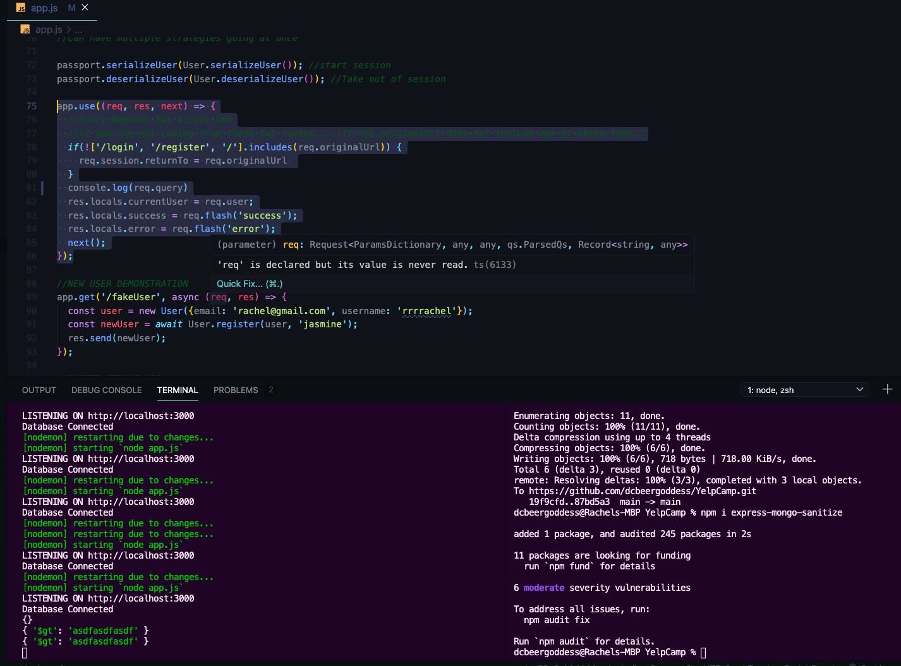
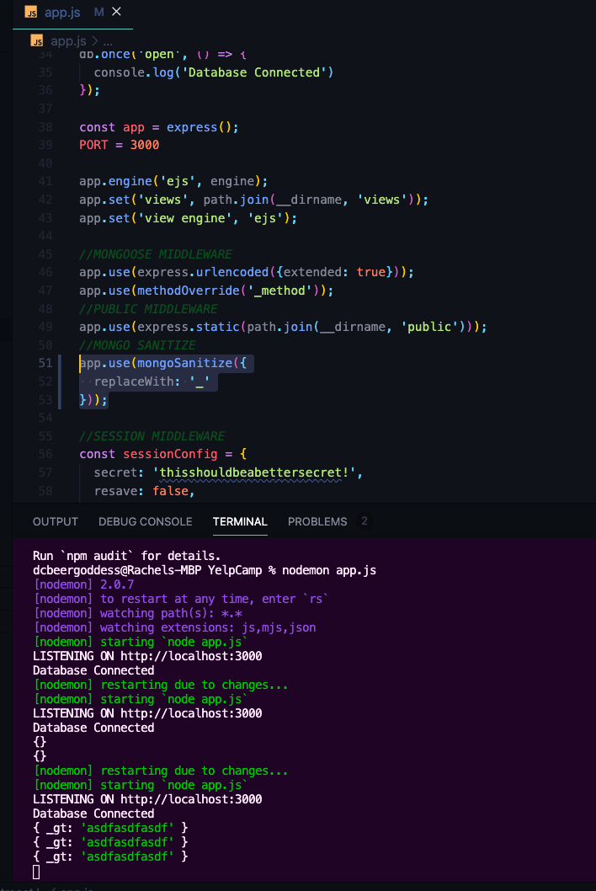
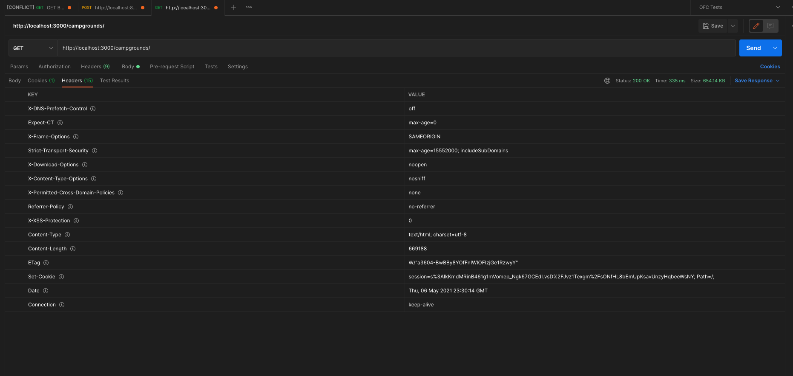
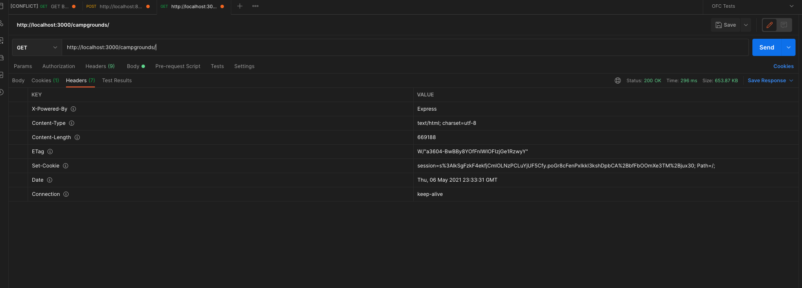
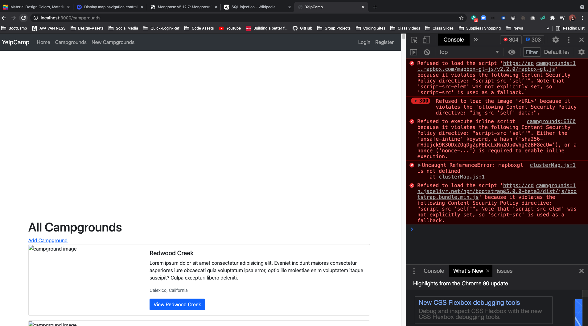
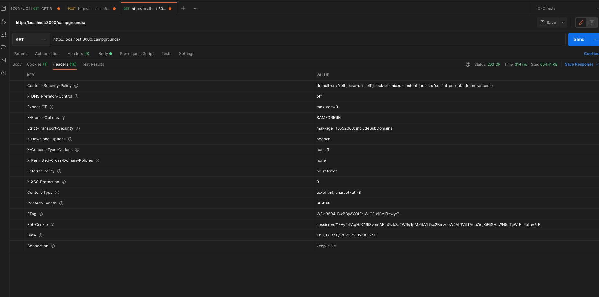

# YELPCAMP: Common Security Issues
* [COLT'S GITHUB CODE FOR THIS SECTION](https://github.com/Colt/YelpCamp/tree/a05fccdf44cd4e5796150347594565471ab3ee60)

## Mongo Injection
* [Express Mongo Sanitize Package](https://www.npmjs.com/package/express-mongo-sanitize)
- Usually have whole team working on this at a company, we are just going to focus on some of the main issues you run into
- [SQL Injection ATTACK](https://en.wikipedia.org/wiki/SQL_injection)
* Writing a query that user information and use search field to populate query
* user adds in new quote to close query and then they can add in their own query, they could remove and entire table (in mongo collection)
- IN MONGO COULD DO SOMETHING LIKE THIS in USERNAME FIELD
* `{"$gt": ""}` --> Mongo Operator --> enter in the field, find username is greater that nothing --> so find all usernames
- Nested objects allows for people to manipulate original query we are trying to make --> don't let username use dollar signs and periods. 
* USE Sanitize Package!!!
1. `npm i express-mongo-sanitize`
2. ADD CONSOLE.LOG in `app.js` TO SEE `req.query`
```js
app.use((req, res, next) => {
  //Every Request has access now
  //if you are not coming from these two routes..., if req.originalUrl does not include one of these then..
  if(!['/login', '/register', '/'].includes(req.originalUrl)) {
    req.session.returnTo = req.originalUrl 
  }
  console.log(req.query)
  res.locals.currentUser = req.user;
  res.locals.success = req.flash('success');
  res.locals.error = req.flash('error');
  next();
});
```
- IN TERMINAL:
* 
- We want to prohibit this query
- include package and use it
```js
//mongo sanitize
const mongoSanitize = require('express-mongo-sanitize');
```
```js
app.use(mongoSanitize({
  replaceWith: '_'
}));
```
- IN TERMINAL
* 

## Cross Site Scripting (XSS)
* [XSS GAME](https://xss-game.appspot.com/)
- An Attacker will inject their own client side scripts that will run in the browser on someone elses application that does something bad
- Play Hacker in Game --> Simple Intro to XSS
- a lot of people have cookies available under documents and can inject script to grab information and send it to a bad server
 
## Sanitizing HTML w/ JOI
* [Sanitize HTML Package](https://www.npmjs.com/package/sanitize-html)
- Using EJS so we can escape the fact if a user enters html into a field when editing a campground but it will show up in the PIN right now
- Sanitize your inputs --> especially to not let them enter script tags
- JOI does not come with it's own validation for escaping html (can use `express-validator` instead of JOI)
* JOI allows us to create extensions 
```js
const extension = (joi) => ({
    type: 'string',
    base: joi.string(),
    messages: {
        'string.escapeHTML': '{{#label}} must not include HTML!'
    },
    rules: {
        escapeHTML: {
            validate(value, helpers) {
                const clean = sanitizeHtml(value, {
                    allowedTags: [],
                    allowedAttributes: {},
                });
                if (clean !== value) return helpers.error('string.escapeHTML', { value })
                return clean;
            }
        }
    }
});
```
- `npm i sanitize-html`
```js
const BaseJoi = require('joi');
const sanitizeHtml = require('sanitize-html');

const extension = (joi) => ({
  type: 'string',
  base: joi.string(),
  messages: {
      'string.escapeHTML': '{{#label}} must not include HTML!'
  },
  rules: {
      escapeHTML: {
          validate(value, helpers) {
              const clean = sanitizeHtml(value, {
                  allowedTags: [],
                  allowedAttributes: {},
              });
              if (clean !== value) return helpers.error('string.escapeHTML', { value })
              return clean;
          }
      }
  }
});

const Joi = BaseJoi.extend(extension);
```
- TRY TO ENTER SCRIPT TAG IN REVIEW FIELD:
* 
- GET ERROR BACK
* 

## Minor Changes to Session/Cookies
- We set up the `httpOnly` on the session config --> cookies only accessible through HTTP and not JavaScript --> folks cannot see our session cookie if they are trying to hack and grab cookies
- Add in `secure: true` --> will break things for now... comment out for now --> when we login it is not keeping us logged in but we will want it when we deploy --> give cookie different name so not default `connect.sid`
```js
//SESSION MIDDLEWARE
const sessionConfig = {
  name: 'session',
  secret: 'thisshouldbeabettersecret!',
  resave: false,
  saveUninitialized: true,
  cookie: {
    httpOnly: true, 
    secure: true,
    expires: Date.now() + 1000 * 60 * 60 * 24 * 7,
    maxAge: 1000 * 60 * 60 * 24 * 7
  }
};
```

## Hiding Errors
- We don't want folks to see our stack trace errors that users can see right now
- in our `error.ejs`
```html
<% layout('layouts/boilerplate') %> 
<!-- FROM BOOTSTRAP ALERT DOCS -->
<div class="row">
  <div class="col-6 offset-3">
    <div class="alert alert-danger" role="alert">
      <h4 class="alert-heading"><%= err.message %></h4>
      <!-- FOR DEVELOPMENT PURPOSES -->
      <% if (process.env.NODE_ENV !=== "production") { %>
        <p><%= err.stack %></p> 
      <% } %>   
    </div>
  </div>
</div>
```

## Using Helmet
* [Helment Docs](https://helmetjs.github.io/)
- Tell App to Use and we have access to tons of security stuff
1. `npm i helmet`
2. `const helmet = require('helmet')`
3. Use Middleware --> this gives us access that all comes with it:
```js
//SESSION
app.use(session(sessionConfig));
app.use(flash());
app.use(helmet());
```
- ONE PROBLEM --> content security policy is not going to be happy with some of our application -- we can tell it to disable it for now
```js
app.use(helmet({contentSecurityPolicy: false}));
```
- POSTMAN GET REQUEST HEADERS WITH HELMET:
* 
- POSTMAN GET REQUEST HEADERS WITHOUT HELMET:
* 

## Content Security Policy Fun
- What Happens when we don't have it disabled right now:
* 
- You Can See Default policy in headers in Postman that we can only use local files:
* 
- We can define our own policies --> You can download files instead of using CDNs but for now we can use this
```js
const scriptSrcUrls = [
    "https://stackpath.bootstrapcdn.com/",
    "https://api.tiles.mapbox.com/",
    "https://api.mapbox.com/",
    "https://kit.fontawesome.com/",
    "https://cdnjs.cloudflare.com/",
    "https://cdn.jsdelivr.net",
];
const styleSrcUrls = [
    "https://kit-free.fontawesome.com/",
    "https://stackpath.bootstrapcdn.com/",
    "https://api.mapbox.com/",
    "https://api.tiles.mapbox.com/",
    "https://fonts.googleapis.com/",
    "https://use.fontawesome.com/",
];
const connectSrcUrls = [
    "https://api.mapbox.com/",
    "https://a.tiles.mapbox.com/",
    "https://b.tiles.mapbox.com/",
    "https://events.mapbox.com/",
];
const fontSrcUrls = [];
app.use(
    helmet.contentSecurityPolicy({
        directives: {
            defaultSrc: [],
            connectSrc: ["'self'", ...connectSrcUrls],
            scriptSrc: ["'unsafe-inline'", "'self'", ...scriptSrcUrls],
            styleSrc: ["'self'", "'unsafe-inline'", ...styleSrcUrls],
            workerSrc: ["'self'", "blob:"],
            objectSrc: [],
            imgSrc: [
                "'self'",
                "blob:",
                "data:",
                "https://res.cloudinary.com/douqbebwk/", //SHOULD MATCH YOUR CLOUDINARY ACCOUNT! 
                "https://images.unsplash.com/",
            ],
            fontSrc: ["'self'", ...fontSrcUrls],
        },
    })
);
```