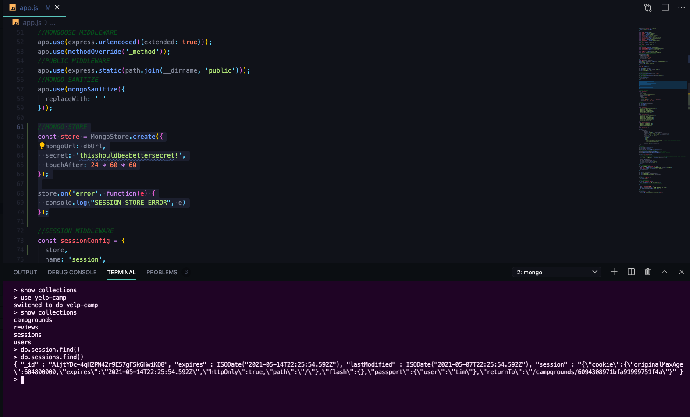

# YelpCamp: Deploying
* [COLT'S GITHUB CODE FOR THIS SECTION](https://github.com/Colt/YelpCamp/tree/3ef5c4ca6aae9243b28167db3c3fb0665c3ea46a)

## Setting Up Mongo Atlas
* [Mongo Cloud](https://www.mongodb.com/cloud)
- Set Up Production Database 
1. Build your first cluster
2. Create your first database user
- Set up user with password who can access database
- will need password you generate for application
- Find under Database Access
3. Whitelist your IP address
- Find under Network Access
4. Load Sample Data (Optional)
5. Connect to your cluster
- after whitelisting IP address you can connect to your cluster
- will give us an URL we will need
- grab url and insert your password and save in `.env` file under `DB_URL=....`
- now we can access `PROCESS.ENV.DB_URL`
- IN `app.js`
```js
const dbUrl = process.env.DB_URL
// 'mongodb://localhost:27017/yelp-camp'
mongoose.connect(dbUrl, {
  useNewUrlParser: true,
  useCreateIndex: true, 
  useUnifiedTopology: true,
  useFindAndModify: false
});
```
- Open localhost --> no longer campgrounds
* 
- create a new user and then look in collections in Mongo Atlas
* 
- but you do not want to be using this database in development mode, when we deploy we will use it so stick with local database for now

## Using Mongo For Our Session Store
* [Connect-Mongo Package](https://www.npmjs.com/package/connect-mongo)
- configure our application to store the session information using Mongo
- If you do not specify a store it uses memory store and manages things in it's memory which can be very problematic because it doesn't scale well and just can't hold that much information
- Use Mongo with the help of **CONNECT-MONGO**
1. `npm i connect-mongo`
2. require it and then immediately execute it --> FROM DOCS:
```js
const MongoStore = require('connect-mongo');
```
4. For our application just need to require MongoStore and then before we set up the sessionConfig:
```js
//MONGO STORE
const store = MongoStore.create({
  mongoUrl: dbUrl,
  secret: 'thisshouldbeabettersecret!',
  touchAfter: 24 * 60 * 60
});

store.on('error', function(e) {
  console.log("SESSION STORE ERROR", e)
});
```
- touchAfter --> Lazy session update --> don't update every time the user refreshes a page unless major data changes
- Now look in collections for yelp-camp in Mongo Shell and we have new collection for sessions
* 

## Heroku Setup
* [Heroku](https://www.heroku.com/)
1. Set Up Account for Heroku --> free tier --> does take page a while to load if it has not been visited in awhile
2. Download Heroku CLI --> Will need to download git if you don't have it
3. Login to Heroku with our Command Line Client 
- `heroku login` --> opens up browser and then login in and close page
- now logged in to heroku

## Pushing to Heroku
- `heroku create` in top level of application
- gives you heroku link and git link with a generated name
```
dcbeergoddess@Rachels-MBP YelpCamp % heroku create
 ›   Warning: heroku update available from 7.46.2 to 7.53.0.
Creating app... done, ⬢ rocky-lowlands-82950
https://rocky-lowlands-82950.herokuapp.com/ | https://git.heroku.com/rocky-lowlands-82950.git
```
- now change a few things in the code
```js
const dbUrl = process.env.DB_URL || 'mongodb://localhost:27017/yelp-camp';
mongoose.connect(dbUrl, {
  useNewUrlParser: true,
  useCreateIndex: true, 
  useUnifiedTopology: true,
  useFindAndModify: false
});
```
- Change Secret
```js
const secret = process.env.SECRET || 'thisshouldbeabettersecret!';
```
- secret will be an environment variable we will set up in heroku
- if you don't have a .gitignore file, set it up!!!
- `git remote -v`
- git push and then `git push heroku main`
- no errors in deploying but application will still not run
* [Heroku Website Application Error](assets/heroku1.png)

## Fixing Heroku Errors
- run `heroku logs --tail` in terminal
* [Errors in heroku](assets/heroku2.png)
- We need to tell heroku how to start our app with a script
- in package.Json there is a scripts section and we can add our own
- `npm start` will now use `node app.js`
```json
  "name": "yelpcamp",
  "version": "1.0.0",
  "description": "Creating Full CRUD app for Users to load Campgrounds and Review Campgrounds posted.",
  "main": "app.js",
  "scripts": {
    "test": "echo \"Error: no test specified\" && exit 1",
    "start": "node app.js"
  },
  "repository": {
    "type": "git",
    "url": "git+https://github.com/dcbeergoddess/YelpCamp.git"
  },
```
- We now want to change the PORT we are serving on for Heroku
```js
//LISTENER
const port = process.env.PORT || 3000;
app.listen(port, () => {
  console.log(`LISTENING ON http://localhost:${port}`)
}); 
```
- Push back up to heroku
- will not work yet but let's see what the error is now again
- cannot access tokens because our environment variables are not set up
* [New Error in Heroku](assets/heroku3.png)

## Configuring Heroku ENV Variables

