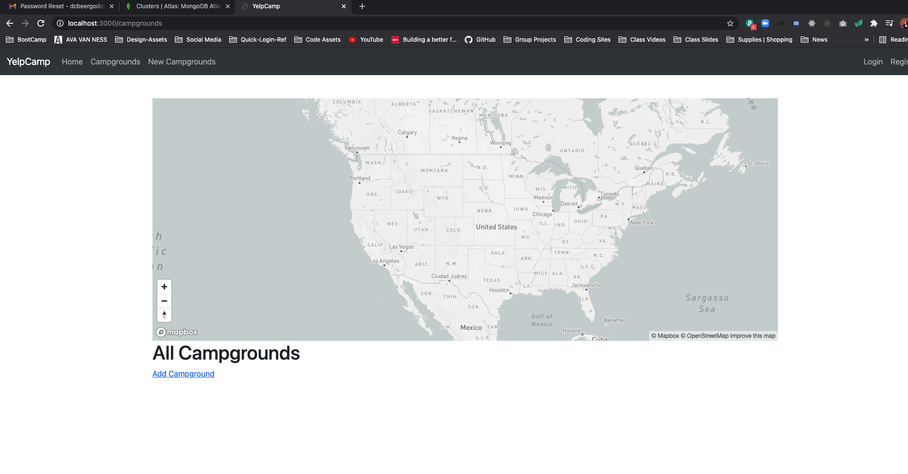
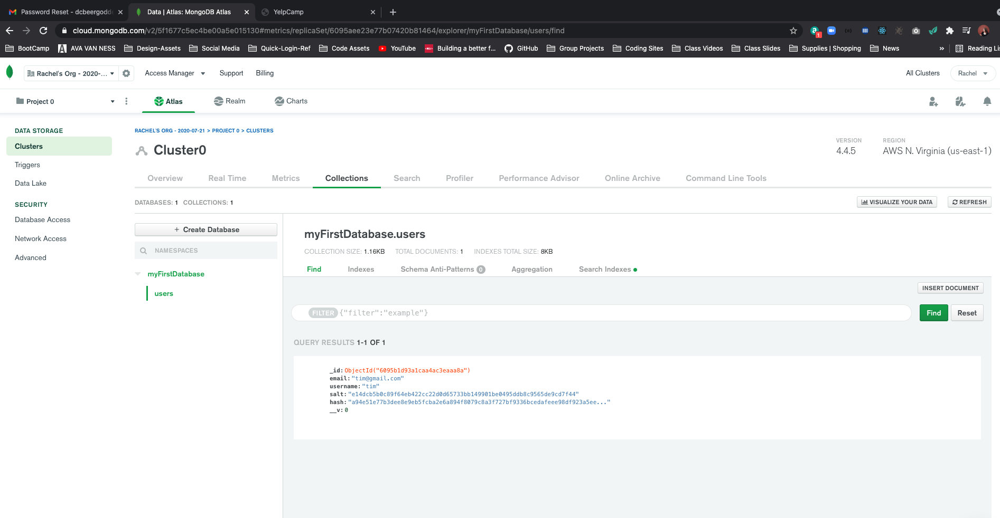

# YelpCamp: Deploying
* [COLT'S GITHUB CODE FOR THIS SECTION](https://github.com/Colt/YelpCamp/tree/3ef5c4ca6aae9243b28167db3c3fb0665c3ea46a)

## Setting Up Mongo Atlas
* [Mongo Cloud](https://www.mongodb.com/cloud)
- Set Up Production Database 
1. Build your first cluster
2. Create your first database user
- Set up user with password who can access database
- will need password you generate for application
- Find under Database Access
3. Whitelist your IP address
- Find under Network Access
4. Load Sample Data (Optional)
5. Connect to your cluster
- after whitelisting IP address you can connect to your cluster
- will give us an URL we will need
- grab url and insert your password and save in `.env` file under `DB_URL=....`
- now we can access `PROCESS.ENV.DB_URL`
- IN `app.js`
```js
const dbUrl = process.env.DB_URL
// 'mongodb://localhost:27017/yelp-camp'
mongoose.connect(dbUrl, {
  useNewUrlParser: true,
  useCreateIndex: true, 
  useUnifiedTopology: true,
  useFindAndModify: false
});
```

## Using Mongo For Our Session Store
* [Connect-Mongo Package](https://www.npmjs.com/package/connect-mongo)

- Open localhost --> no longer campgrounds
* 
- create a new user and then look in collections in Mongo Atlas
* 
- but you do not want to be using this database in development mode, when we deploy we will use it so stick with local database for now

## Heroku Setup
* [Heroku](https://www.heroku.com/)

## Pushing to Heroku

## Fixing Heroku Errors

## Configuring Heroku ENV Variables

